# Redis 四种缓存模式

## 1. 缓存模式是什么

**缓存模式是规定业务服务、Redis 与 MySQL 在数据读写时由谁负责、按什么顺序访问，以及同步还是异步更新的一套协作策略，用于在性能、数据一致性和工程复杂度之间做取舍。**


## 2. 四种缓存模式的直观印象

四种缓存模式的核心区别，是业务服务、缓存组件、Redis、MySQL 和 Worker 在数据读写过程中如何分工，以及数据库写入是同步完成还是异步完成。

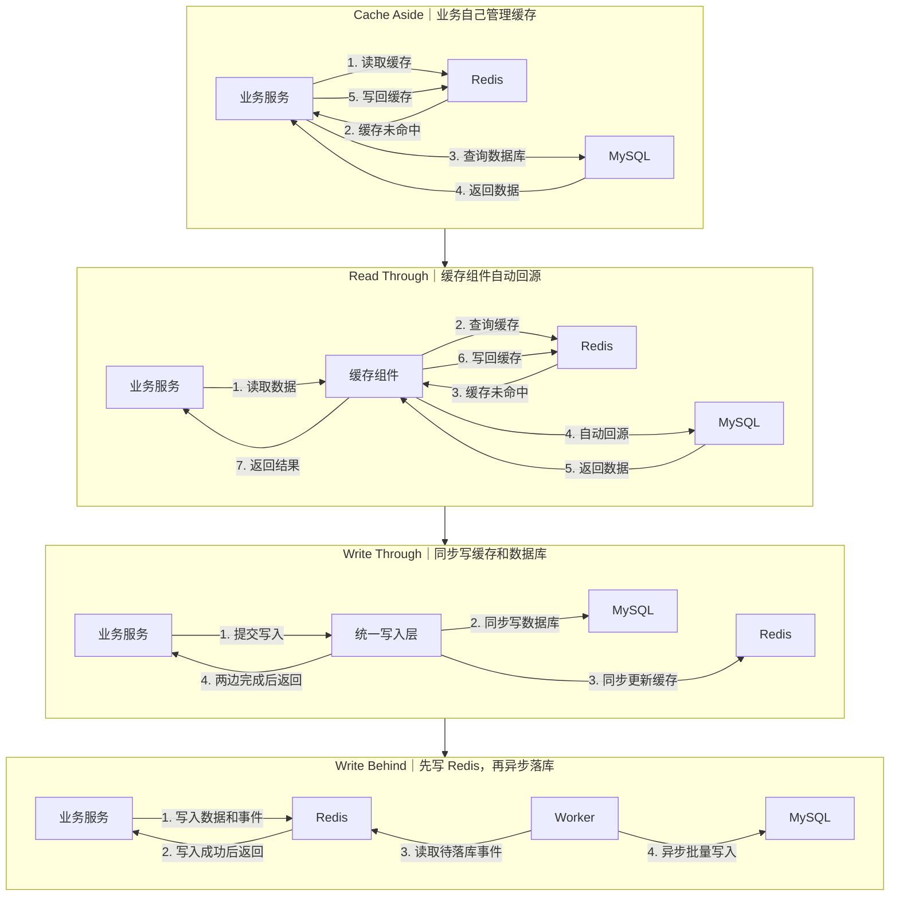
```mermaid
flowchart TB

    subgraph A["Cache Aside｜业务自己管理缓存"]
        direction LR

        A1[业务服务]
        A2[Redis]
        A3[MySQL]

        A1 ~~~ A2
        A2 ~~~ A3

        A1 -->|1. 读取缓存| A2
        A2 -->|2. 缓存未命中| A1
        A1 -->|3. 查询数据库| A3
        A3 -->|4. 返回数据| A1
        A1 -->|5. 写回缓存| A2
    end

    subgraph B["Read Through｜缓存组件自动回源"]
        direction LR

        B1[业务服务]
        B2[缓存组件]
        B3[Redis]
        B4[MySQL]

        B1 ~~~ B2
        B2 ~~~ B3
        B3 ~~~ B4

        B1 -->|1. 读取数据| B2
        B2 -->|2. 查询缓存| B3
        B3 -->|3. 缓存未命中| B2
        B2 -->|4. 自动回源| B4
        B4 -->|5. 返回数据| B2
        B2 -->|6. 写回缓存| B3
        B2 -->|7. 返回结果| B1
    end

    subgraph C["Write Through｜同步写缓存和数据库"]
        direction LR

        C1[业务服务]
        C2[统一写入层]
        C3[MySQL]
        C4[Redis]

        C1 ~~~ C2
        C2 ~~~ C3
        C3 ~~~ C4

        C1 -->|1. 提交写入| C2
        C2 -->|2. 同步写数据库| C3
        C2 -->|3. 同步更新缓存| C4
        C2 -->|4. 两边完成后返回| C1
    end

    subgraph D["Write Behind｜先写 Redis，再异步落库"]
        direction LR

        D1[业务服务]
        D2[Redis]
        D3[Worker]
        D4[MySQL]

        D1 ~~~ D2
        D2 ~~~ D3
        D3 ~~~ D4

        D1 -->|1. 写入数据和事件| D2
        D2 -->|2. 写入成功后返回| D1
        D3 -->|3. 读取待落库事件| D2
        D3 -->|4. 异步批量写入| D4
    end

    A --> B
    B --> C
    C --> D
```


> **Cache Aside 和 Read Through 主要解决“数据怎么读”，Write Through 和 Write Behind 主要解决“数据怎么写”。**


## 3. 四种模式如何运行

### 3.1 Cache Aside（旁路缓存）

#### 3.1.1 一句话定义

> **Cache Aside 是由业务服务主动管理缓存的模式：读取时先查 Redis，未命中再查询 MySQL 并写回缓存；更新时先提交 MySQL，再删除对应缓存。**

Cache Aside 不是 Redis 提供的一条命令，而是业务服务组织 Redis 与 MySQL 访问顺序的一种缓存架构模式。

---

#### 3.1.2 参与对象

| 参与对象      | 主要职责                        |
| --------- | --------------------------- |
| 用户请求      | 发起课程详情查询                    |
| 后台管理员     | 发起课程信息修改                    |
| 业务服务      | 主动读取缓存、回源 MySQL、写回缓存和触发缓存失效 |
| Redis     | 保存课程详情缓存、版本栅栏和缓存重建短锁        |
| MySQL     | 保存课程详情真实数据、数据版本和 Outbox 事件  |
| 补偿 Worker | 重试尚未成功执行的缓存失效事件             |

其中：

* **MySQL 是课程详情的唯一事实源。**
* **Redis 保存的是可以删除并从 MySQL 重建的缓存副本。**
* **业务服务负责协调 Redis 与 MySQL。**
* **补偿 Worker 只在启用可靠缓存失效时参与，不属于基础读取流程。**

---

#### 3.1.3 业务案例

在线学习系统提供课程详情接口：

```text
GET /courses/:course_id
```

课程详情通常包含：

* 课程标题
* 课程封面
* 讲师信息
* 课程分类与标签
* 章节数量
* 课程展示状态

该场景具有以下特点：

1. 热门课程会被大量重复访问。
2. 课程详情通常读多写少。
3. 每次从 MySQL 查询时，可能需要执行多表查询和数据聚合。
4. 标题、封面等展示信息可以接受短暂最终一致。
5. 冷门课程没有必要提前写入缓存。

因此，可以在第一次访问时查询 MySQL 并生成 Redis 缓存，后续请求直接读取 Redis。

---

#### 3.1.4 数据职责与使用边界

##### 数据职责

```text
MySQL：
保存课程详情真实数据和 data_version，是唯一事实源。

Redis data Key：
保存课程详情 JSON 缓存，可以被删除并重新构建。

Redis version Key：
保存课程当前已知的数据版本，阻止旧请求重新写入低版本缓存。

Redis lock Key：
限制同一课程被多个请求同时重建。
```

当 Redis 与 MySQL 不一致时：

> **最终以 MySQL 为准，Redis 中的数据应被删除或重新构建。**

##### 适合放入课程详情缓存的字段

* 课程标题
* 课程封面
* 讲师介绍
* 课程标签
* 章节数量
* 展示状态

##### 不应默认混入同一缓存的字段

* 实时价格
* 剩余名额
* 购买资格
* 支付状态
* 考试结果
* 证书发放依据

这些字段对一致性要求更高，应直接查询 MySQL，或者使用独立 Key 和更严格的更新策略。

---

#### 3.1.5 Redis 设计

##### 3.1.5.1 Key 设计

同一门课程使用三个 Redis Key：

```text
课程数据：
course:detail:v1:{10001}:data

版本栅栏：
course:detail:v1:{10001}:version

缓存重建锁：
course:detail:v1:{10001}:lock
```

其中 `{10001}` 是 Redis Cluster Hash Tag，使同一课程的多个 Key 可以分配到相同 Hash Slot，便于通过 Lua 或 Redis Function 原子操作多个 Key。

| Key       | 数据类型   | 保存内容            | 过期策略             |
| --------- | ------ | --------------- | ---------------- |
| `data`    | String | 课程详情 JSON       | 短 TTL + 随机抖动     |
| `version` | String | 当前数据版本号         | 不随 data Key 一起删除 |
| `lock`    | String | 当前锁持有者的唯一 token | 很短的 TTL          |

---

##### 3.1.5.2 课程缓存 Value

```json
{
  "course_id": 10001,
  "title": "Redis 工程实践",
  "teacher_name": "张老师",
  "chapter_count": 24,
  "status": "published",
  "data_version": 19,
  "updated_at": "2026-07-18T10:00:00Z"
}
```

其中：

* `data_version` 来自 MySQL。
* 每次修改课程数据时，MySQL 中的 `data_version` 单调递增。
* Redis 中的 `data_version` 用于缓存写回时进行版本判断。

---

##### 3.1.5.3 TTL 设计

示例参数：

```text
基础 TTL：10 分钟
随机抖动：0～120 秒
```

实际 TTL 需要根据以下因素确定：

* 课程更新频率
* 业务允许旧数据存在的时间
* Redis 内存容量
* MySQL 回源能力
* 缓存重建耗时的 P95、P99

> 以上数值只是演示值，不是固定标准。

随机抖动用于减少大量缓存同时过期，但不能解决单个热点 Key 的缓存击穿问题。

---

##### 3.1.5.4 版本栅栏设计

只在课程缓存 Value 中保存 `data_version` 不够，因为删除 `data` Key 后，版本判断依据也会消失。

因此，需要独立版本栅栏：

```text
course:detail:v1:{10001}:version = 19
```

版本栅栏必须满足：

1. 不随课程数据缓存一起删除。
2. 只能单调递增，不能从 20 退回到 19。
3. 普通读请求只能读取版本栅栏，不能主动提高它。
4. 成功提交的 MySQL 更新事件负责推进版本栅栏。

##### 读请求条件写入

读请求从 MySQL 查询到课程数据后，通过 Lua 或 Redis Function 原子执行：

```text
读取 version Key

如果 MySQL 数据版本 >= version Key：
    写入 data Key
    设置 TTL
    返回 WRITTEN

否则：
    拒绝写入
    返回 STALE
```

##### 写请求缓存失效

写请求或 Outbox Worker 通过另一个原子操作执行：

```text
读取当前 version Key

如果事件版本 > 当前版本：
    更新 version Key
    删除 data Key
    返回 APPLIED

否则：
    不更新版本
    不删除 data Key
    返回 IGNORED
```

只允许更高版本推进版本栅栏，可以避免：

* 重复 Outbox 事件反复删除新缓存。
* 低版本事件覆盖高版本。
* 乱序事件误删已经重建的最新缓存。

版本栅栏原则上不设置和课程缓存相同的短 TTL。

可以选择：

* 不设置 TTL；
* 或设置远长于最长请求时间、重试时间和 Outbox 延迟的 TTL；
* 课程永久删除时再执行明确清理。

---

##### 3.1.5.5 缓存重建短锁

锁 Key：

```text
course:detail:v1:{10001}:lock
```

获取方式：

```text
SET course:detail:v1:{10001}:lock {token} NX PX 3000
```

其中：

* `token` 是每次获取锁生成的唯一值。
* `NX` 保证同一时刻只有一个请求成功获得锁。
* `PX` 防止服务崩溃后形成永久锁。

示例锁时长 3 秒并不是固定标准，实际时长需要覆盖正常缓存重建耗时，并结合重建过程的 P99 确定。

##### 完整重建流程

```text
第一次读取缓存未命中
→ 尝试获取短锁
→ 获得锁后再次读取缓存
→ 仍未命中才查询 MySQL
→ 根据版本栅栏条件写入缓存
→ 在 finally 中安全释放锁
```

获得锁后必须再次读取缓存。

原因是其他请求可能已经完成缓存重建，如果不进行二次检查，会再次执行没有必要的 MySQL 查询。

##### 安全释放

释放锁时必须原子执行：

```text
读取 lock Key

只有 lock Key 的值等于当前 token：
    删除 lock Key
```

不能直接执行普通 `DEL`，否则旧请求可能误删后来请求获得的新锁。

##### 未获得锁的请求

```text
短暂等待
→ 重新读取 data Key
→ 仍不存在则继续有限次数等待
→ 超时后限流、受控回源或快速失败
```

等待必须设置上限，不能无限阻塞。

> **缓存重建短锁只用于减少重复回源、保护 MySQL，不承担支付、库存、资格判断等业务强一致职责。**

---

##### 3.1.5.6 Outbox 可靠缓存失效

基础 Cache Aside 可以采用：

```text
提交 MySQL
→ 删除 Redis
→ 删除失败后记录告警
→ TTL 最终兜底
```

如果课程缓存失效事件不能轻易丢失，可以引入 Outbox。

MySQL 事务内同时执行：

```text
更新课程数据
递增 data_version
写入 Outbox 事件
提交事务
```

Outbox 事件至少包含：

```text
event_id
event_type
course_id
data_version
status
retry_count
next_retry_at
created_at
processed_at
```

其中最关键的是：

```text
event_id
course_id
data_version
```

事务提交后：

```text
业务服务尝试处理 Outbox 事件
→ 原子推进版本栅栏并删除 data Key
→ Redis 成功后标记 Outbox 完成
→ Redis 失败则由 Worker 重试
```

不能采用以下流程：

```text
先提交业务数据
→ Redis 删除失败
→ 再临时写入 Outbox
```

否则业务服务可能在写入 Outbox 前崩溃，造成业务数据已更新，但缓存失效事件永久丢失。

##### 幂等与乱序处理

Outbox 事件可能：

* 重复执行；
* 延迟执行；
* 乱序到达；
* Redis 成功后，MySQL 标记完成失败。

因此，Redis 失效脚本必须使用 `data_version` 判断：

```text
只有事件版本高于当前版本栅栏：
    才推进版本
    才删除缓存
```

如果事件版本等于或低于当前栅栏：

```text
直接返回 IGNORED
```

这样即使重复处理同一个事件，也不会错误删除已经重建的新缓存。

---

#### 3.1.6 正常路径

##### 3.1.6.1 缓存命中

Redis 中已经存在课程详情，业务服务直接返回缓存数据。

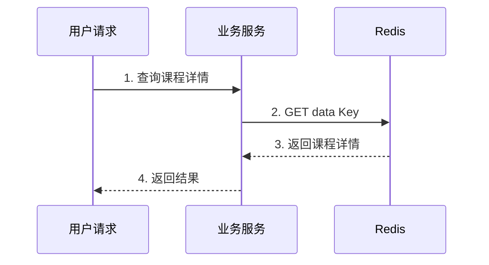
```mermaid
sequenceDiagram
    participant Client as 用户请求
    participant Service as 业务服务
    participant Redis as Redis

    Client->>Service: 1. 查询课程详情
    Service->>Redis: 2. GET data Key
    Redis-->>Service: 3. 返回课程详情
    Service-->>Client: 4. 返回结果
```

**最终结果：**

* 请求成功。
* 不查询 MySQL。
* Redis 承接本次热点读取。
* MySQL 仍然是最终事实源。

---

##### 3.1.6.2 缓存未命中并成功重建

缓存未命中后，业务服务获得重建锁，锁内二次检查仍未命中，再查询 MySQL 并条件写入缓存。

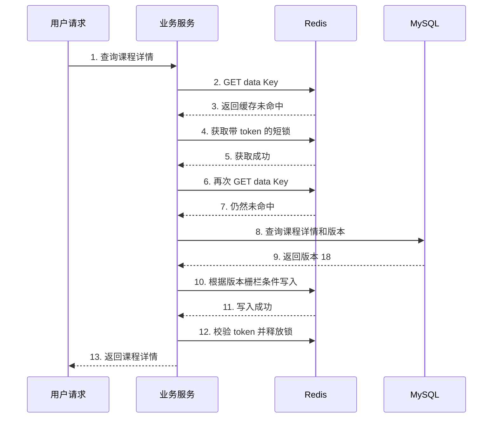
```mermaid
sequenceDiagram
    participant Client as 用户请求
    participant Service as 业务服务
    participant Redis as Redis
    participant MySQL as MySQL

    Client->>Service: 1. 查询课程详情
    Service->>Redis: 2. GET data Key
    Redis-->>Service: 3. 返回缓存未命中

    Service->>Redis: 4. 获取带 token 的短锁
    Redis-->>Service: 5. 获取成功

    Service->>Redis: 6. 再次 GET data Key
    Redis-->>Service: 7. 仍然未命中

    Service->>MySQL: 8. 查询课程详情和版本
    MySQL-->>Service: 9. 返回版本 18

    Service->>Redis: 10. 根据版本栅栏条件写入
    Redis-->>Service: 11. 写入成功

    Service->>Redis: 12. 校验 token 并释放锁
    Service-->>Client: 13. 返回课程详情
```

**最终结果：**

* 本次请求成功。
* 数据来自 MySQL。
* Redis 保存版本 18 的课程缓存。
* 短锁被安全释放。
* 后续请求可以直接命中 Redis。

---

##### 3.1.6.3 更新课程并成功失效缓存

本案例采用可靠失效方案：业务数据和 Outbox 事件在同一个 MySQL 事务中提交。

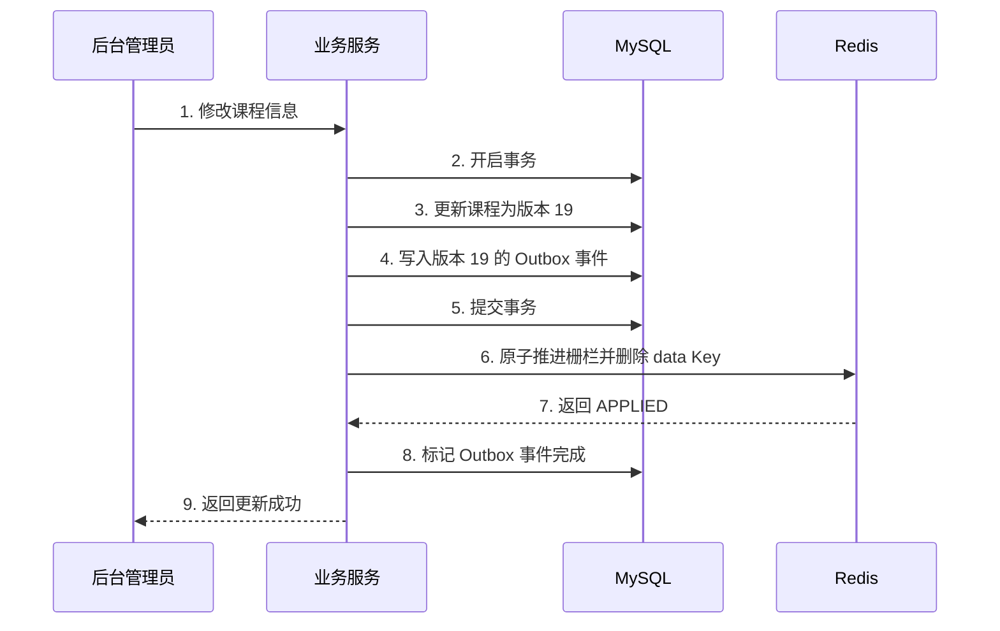
```mermaid
sequenceDiagram
    participant Admin as 后台管理员
    participant Service as 业务服务
    participant MySQL as MySQL
    participant Redis as Redis

    Admin->>Service: 1. 修改课程信息
    Service->>MySQL: 2. 开启事务
    Service->>MySQL: 3. 更新课程为版本 19
    Service->>MySQL: 4. 写入版本 19 的 Outbox 事件
    Service->>MySQL: 5. 提交事务

    Service->>Redis: 6. 原子推进栅栏并删除 data Key
    Redis-->>Service: 7. 返回 APPLIED

    Service->>MySQL: 8. 标记 Outbox 事件完成
    Service-->>Admin: 9. 返回更新成功
```

**最终结果：**

* MySQL 保存版本 19。
* Redis 版本栅栏推进到 19。
* Redis 课程数据缓存被删除。
* Outbox 事件处理完成。
* 下一次读取会重新构建版本 19 的缓存。

---

#### 3.1.7 核心异常路径

##### 3.1.7.1 热点课程并发缓存未命中

请求 1 和请求 2 同时查询同一门热门课程，并且都发现缓存未命中。

请求 1 成功获得重建短锁，负责查询 MySQL 和重建缓存；请求 2 获取锁失败后短暂等待，再重新读取已经完成重建的缓存。

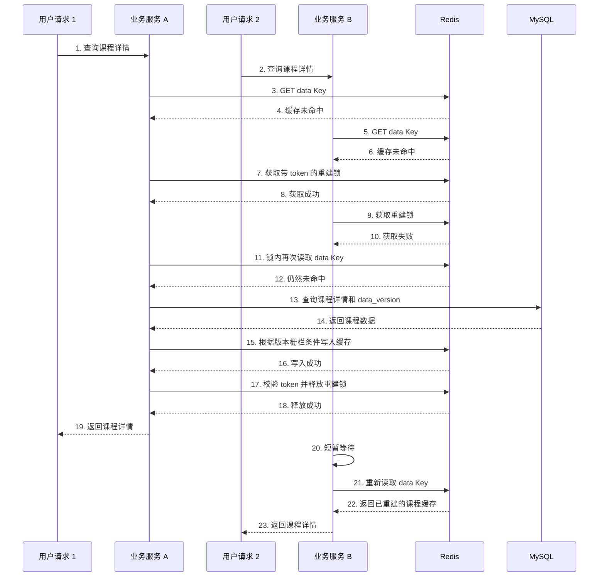
```mermaid
sequenceDiagram
    participant Client1 as 用户请求 1
    participant Service1 as 业务服务 A
    participant Client2 as 用户请求 2
    participant Service2 as 业务服务 B
    participant Redis as Redis
    participant MySQL as MySQL

    Client1->>Service1: 1. 查询课程详情
    Client2->>Service2: 2. 查询课程详情

    Service1->>Redis: 3. GET data Key
    Redis-->>Service1: 4. 缓存未命中

    Service2->>Redis: 5. GET data Key
    Redis-->>Service2: 6. 缓存未命中

    Service1->>Redis: 7. 获取带 token 的重建锁
    Redis-->>Service1: 8. 获取成功

    Service2->>Redis: 9. 获取重建锁
    Redis-->>Service2: 10. 获取失败

    Service1->>Redis: 11. 锁内再次读取 data Key
    Redis-->>Service1: 12. 仍然未命中

    Service1->>MySQL: 13. 查询课程详情和 data_version
    MySQL-->>Service1: 14. 返回课程数据

    Service1->>Redis: 15. 根据版本栅栏条件写入缓存
    Redis-->>Service1: 16. 写入成功

    Service1->>Redis: 17. 校验 token 并释放重建锁
    Redis-->>Service1: 18. 释放成功

    Service1-->>Client1: 19. 返回课程详情

    Service2->>Service2: 20. 短暂等待
    Service2->>Redis: 21. 重新读取 data Key
    Redis-->>Service2: 22. 返回已重建的课程缓存
    Service2-->>Client2: 23. 返回课程详情
```

**最终状态：**

* 请求 1 成功获得重建锁，查询 MySQL 并完成缓存重建。
* 请求 1 安全释放重建锁，并向用户返回课程详情。
* 请求 2 没有查询 MySQL，而是在短暂等待后重新读取 Redis。
* 请求 2 命中请求 1 已经重建的缓存，并向用户返回课程详情。
* 两个请求最终都成功。
* MySQL 只被查询一次。
* Redis 最终保存符合版本栅栏要求的课程缓存。
* 重建锁最终被安全释放。

---

##### 3.1.7.2 MySQL 已更新，但 Redis 失效失败

课程数据和 Outbox 事件已经提交，但第一次 Redis 失效操作失败。

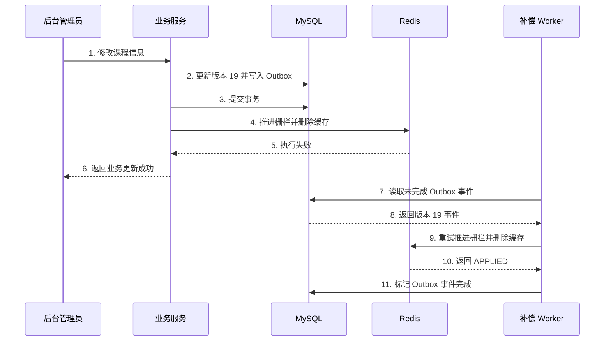
```mermaid
sequenceDiagram
    participant Admin as 后台管理员
    participant Service as 业务服务
    participant MySQL as MySQL
    participant Redis as Redis
    participant Worker as 补偿 Worker

    Admin->>Service: 1. 修改课程信息
    Service->>MySQL: 2. 更新版本 19 并写入 Outbox
    Service->>MySQL: 3. 提交事务

    Service->>Redis: 4. 推进栅栏并删除缓存
    Redis-->>Service: 5. 执行失败

    Service-->>Admin: 6. 返回业务更新成功

    Worker->>MySQL: 7. 读取未完成 Outbox 事件
    MySQL-->>Worker: 8. 返回版本 19 事件

    Worker->>Redis: 9. 重试推进栅栏并删除缓存
    Redis-->>Worker: 10. 返回 APPLIED

    Worker->>MySQL: 11. 标记 Outbox 事件完成
```

**最终状态：**

* 本次业务更新成功，因为 MySQL 已经提交。
* MySQL 保存版本 19。
* Redis 在补偿完成前可能短暂保存旧数据。
* Worker 最终推进版本栅栏并删除旧缓存。
* MySQL 是最终事实源。
* 重复执行同一事件必须安全。

当前示例采用：

> **事实写入优先：MySQL 提交成功后业务更新视为成功，Redis 失败进入补偿流程。**

---

##### 3.1.7.3 并发读写导致旧数据重新写回

读请求在缓存未命中后获得重建锁，并从 MySQL 查询到课程版本 18。

在读请求尚未写回缓存时，写请求把课程更新为版本 19，并成功推进 Redis 版本栅栏、删除旧缓存。

此时，读请求尝试写回版本 18，会因为版本低于栅栏版本 19而被拒绝。读请求需要重新查询 MySQL，获得版本 19 后重新写入缓存。

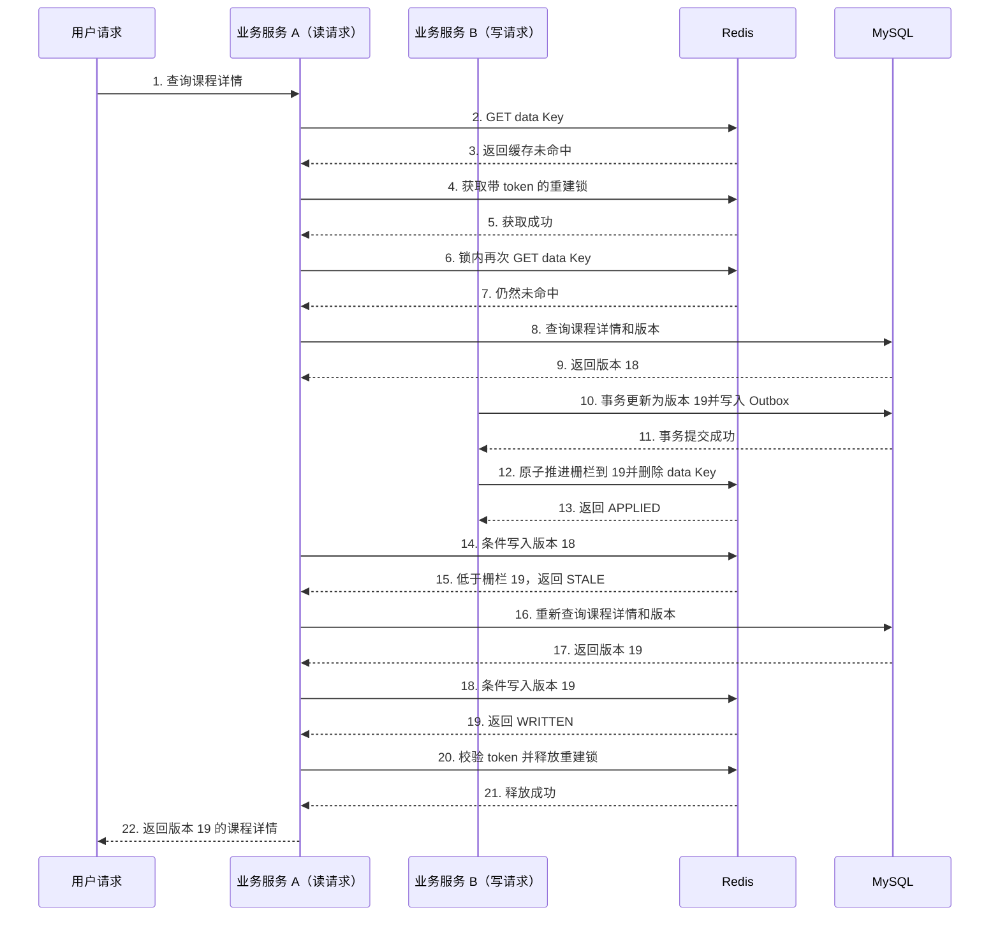
```mermaid
sequenceDiagram
    participant Client as 用户请求
    participant ReadService as 业务服务 A（读请求）
    participant WriteService as 业务服务 B（写请求）
    participant Redis as Redis
    participant MySQL as MySQL

    Client->>ReadService: 1. 查询课程详情

    ReadService->>Redis: 2. GET data Key
    Redis-->>ReadService: 3. 返回缓存未命中

    ReadService->>Redis: 4. 获取带 token 的重建锁
    Redis-->>ReadService: 5. 获取成功

    ReadService->>Redis: 6. 锁内再次 GET data Key
    Redis-->>ReadService: 7. 仍然未命中

    ReadService->>MySQL: 8. 查询课程详情和版本
    MySQL-->>ReadService: 9. 返回版本 18

    WriteService->>MySQL: 10. 事务更新为版本 19并写入 Outbox
    MySQL-->>WriteService: 11. 事务提交成功

    WriteService->>Redis: 12. 原子推进栅栏到 19并删除 data Key
    Redis-->>WriteService: 13. 返回 APPLIED

    ReadService->>Redis: 14. 条件写入版本 18
    Redis-->>ReadService: 15. 低于栅栏 19，返回 STALE

    ReadService->>MySQL: 16. 重新查询课程详情和版本
    MySQL-->>ReadService: 17. 返回版本 19

    ReadService->>Redis: 18. 条件写入版本 19
    Redis-->>ReadService: 19. 返回 WRITTEN

    ReadService->>Redis: 20. 校验 token 并释放重建锁
    Redis-->>ReadService: 21. 释放成功

    ReadService-->>Client: 22. 返回版本 19 的课程详情
```

**最终状态：**

* MySQL 保存课程版本 19。
* Redis 版本栅栏保存版本 19。
* 版本 18 的缓存写入被拒绝。
* 读请求重新查询并获得版本 19。
* Redis 最终保存版本 19 的课程缓存。
* 重建锁经过 token 校验后安全释放。
* 用户最终获得版本 19 的课程详情。
* 整个请求成功闭环。

**关键前提：**

写请求推进版本栅栏和删除 `data Key` 必须在 Redis 中原子完成：

```text
如果事件版本 > 当前版本栅栏：
    更新版本栅栏
    删除 data Key
    返回 APPLIED
否则：
    不修改版本栅栏
    不删除 data Key
    返回 IGNORED
```

读请求条件写入也必须原子完成：

```text
如果待写入数据版本 >= 版本栅栏：
    写入 data Key 并设置 TTL
    返回 WRITTEN
否则：
    拒绝写入
    返回 STALE
```

---

##### 3.1.7.4 Redis 不可用时受控回源

Redis 发生超时或故障后，业务服务不能让所有请求无限制进入 MySQL。

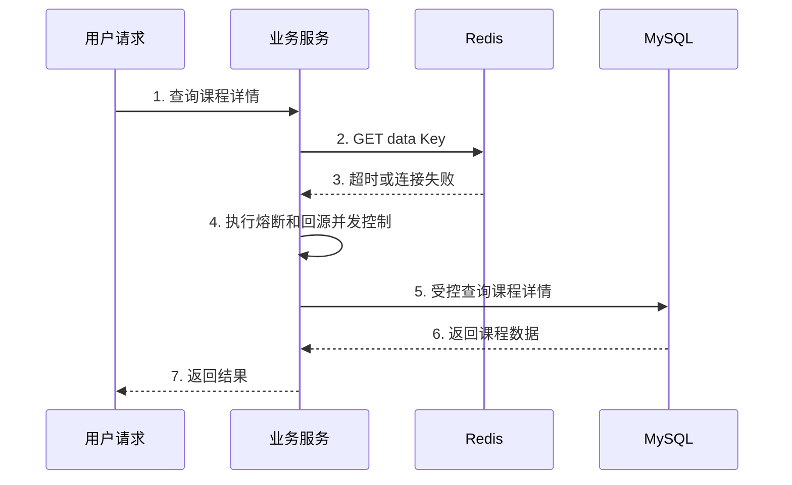
```mermaid
sequenceDiagram
    participant Client as 用户请求
    participant Service as 业务服务
    participant Redis as Redis
    participant MySQL as MySQL

    Client->>Service: 1. 查询课程详情
    Service->>Redis: 2. GET data Key
    Redis-->>Service: 3. 超时或连接失败

    Service->>Service: 4. 执行熔断和回源并发控制
    Service->>MySQL: 5. 受控查询课程详情
    MySQL-->>Service: 6. 返回课程数据
    Service-->>Client: 7. 返回结果
```

**最终状态：**

* MySQL 可用时，本次请求成功。
* Redis 不可用期间不执行缓存写回。
* MySQL 回源受到并发上限保护。
* 超过系统承载能力的请求可以限流或快速失败。
* Redis 恢复后逐步恢复正常缓存流量。

不能只写：

> Redis 不可用时直接查询 MySQL。

否则缓存故障可能直接演变成数据库雪崩。

---

#### 3.1.8 通用异常处理

以下异常属于通用服务故障，不再分别绘制时序图：

| 异常                       | 请求结果          | 数据状态                    | 处理原则             |
| ------------------------ | ------------- | ----------------------- | ---------------- |
| 缓存未命中后 MySQL 查询失败        | 返回系统错误        | Redis 无缓存，MySQL 未返回可靠结果 | 不能缓存成课程不存在       |
| MySQL 查询成功但 Redis 条件写入失败 | 通常仍可返回查询结果    | MySQL 正确，Redis 可能无缓存    | 区分版本拒绝和 Redis 故障 |
| 查询结果被版本栅栏拒绝              | 重新查询或重新读取缓存   | 当前查询结果已经过期              | 不能继续缓存旧结果        |
| Redis 普通写入失败             | 通常返回 MySQL 结果 | Redis 无缓存               | 记录指标，避免无限重试      |
| 课程确实不存在                  | 返回不存在         | MySQL 无对应记录             | 可以短时间缓存明确空值      |
| MySQL 更新失败               | 返回失败          | MySQL 未提交               | 不推进版本栅栏，不删除缓存    |
| 获取重建锁失败并等待超时             | 限流、快速失败或受控回源  | 缓存仍未恢复                  | 不允许无限等待          |

只有 MySQL 明确返回“课程不存在”时，才允许写入空值缓存。

MySQL 超时、连接失败和 SQL 执行错误不能被缓存成“课程不存在”。

---

#### 3.1.9 解决的问题、主要代价与使用前提

> **解决的问题：**Cache Aside 让 Redis 承接热门课程的重复读取，减少 MySQL 查询、聚合和数据组装压力。

> **主要代价：**业务服务需要主动管理缓存读取、回源、写回和失效，并处理缓存击穿、删除失败、版本竞争和短暂不一致。

> **使用前提：**数据读多写少、缓存可以从 MySQL 重建，并且业务能够接受短暂最终一致。

---

#### 3.1.10 最终记忆点

1. Cache Aside 由业务服务主动管理 Redis 与 MySQL。
2. 读取时先查 Redis，未命中再查 MySQL。
3. 更新时先提交 MySQL，再让缓存失效。
4. MySQL 是事实源，Redis 是可以重建的缓存副本。
5. 热点缓存未命中时，需要限制并发回源。
6. 获得重建锁后必须再次检查缓存。
7. 短锁需要唯一 token、TTL 和安全释放。
8. 版本栅栏必须独立于课程数据缓存。
9. 版本栅栏只能单调递增。
10. 读请求只能比较版本，不能主动推进版本栅栏。
11. Outbox 必须与业务数据在同一个 MySQL 事务中提交。
12. Outbox 重试必须能处理重复事件和乱序事件。
13. TTL 只能兜底，不能代替主动失效和可靠补偿。
14. 强一致字段不能直接混入普通课程详情缓存。

> **Cache Aside 的核心不是“使用了 Redis”，而是业务服务主动控制缓存读取、数据库回源、缓存写回和更新后失效的完整过程。**


### 3.2 Read Through（读穿透）

#### 3.2.1 一句话定义

> **Read Through 是把“读取 Redis、缓存未命中后查询 MySQL、再写回 Redis”的过程统一封装在缓存组件中；在默认缓存读取路径中，业务服务只调用缓存组件，不直接处理缓存未命中和数据库回源。**

Read Through 与 Cache Aside 的底层读取顺序基本相同：

```text
读取 Redis
→ 缓存未命中
→ 查询 MySQL
→ 写回 Redis
→ 返回结果
```

两者最本质的区别是：

```text
Cache Aside：
业务服务负责缓存读取、MySQL 回源和缓存写回。

Read Through：
统一缓存组件负责缓存读取、MySQL 回源和缓存写回。
```

Read Through 不是 Redis 的一条命令。Redis Open Source 8.8.0 的普通 `GET` 未命中后，不会自动连接 MySQL；Read Through 语义需要由缓存框架、客户端包装层或自研缓存组件实现。

---

#### 3.2.2 参与对象

| 参与对象   | 主要职责                                   |
| ------ | -------------------------------------- |
| 业务服务   | 执行参数校验、权限判断和业务规则，通过缓存组件读取课程详情          |
| 课程缓存组件 | 统一处理 Redis 查询、缓存未命中、MySQL 回源、缓存写回和异常分类 |
| Redis  | 保存课程详情缓存副本和短期空值                        |
| MySQL  | 保存课程详情真实、长期数据，是唯一事实源                   |

##### Loader 是什么

课程缓存组件内部通常会注入一个 Loader：

```ts
const courseDetailCache = new ReadThroughCache({
  load: async (courseId: number) => {
    return courseRepository.findDetail(courseId);
  },
});
```

Loader 只是缓存组件内部用于查询 MySQL 的函数或接口，通常不是一个独立服务或独立进程。

因此，本节时序图不再把 CourseLoader 画成单独的外部参与对象，而是在缓存组件访问 MySQL 时标注：

```text
调用 Loader 查询课程详情
```

这样既保留代码职责边界，也避免让听众误以为系统中存在一个独立的 Loader 服务。

---

#### 3.2.3 业务案例

在线学习系统中的多个模块都需要读取课程详情：

* 课程首页
* 搜索结果页
* 学习页面
* 订单确认页
* 后台预览页

课程详情主要包含：

* 课程标题
* 课程封面
* 讲师信息
* 课程标签
* 章节数量
* 课程展示状态

如果每个业务模块分别实现缓存逻辑，容易出现：

| 问题      | 具体表现                             |
| ------- | -------------------------------- |
| Key 不统一 | 不同模块使用不同课程缓存 Key                 |
| TTL 不统一 | 有的缓存几分钟，有的长期不过期                  |
| 回源逻辑重复  | 每个业务接口重复处理 Redis miss 和 MySQL 查询 |
| 空值处理不统一 | 无效课程 ID 被反复查询 MySQL              |
| 击穿治理不统一 | 有的接口合并请求，有的直接并发回源                |
| 错误语义不统一 | 有的把数据库异常误认为课程不存在                 |
| 监控分散    | 无法统一统计命中率、回源量和加载耗时               |

因此，可以统一提供：

```ts
const course = await courseDetailCache.get(courseId);
```

业务服务只表达：

> 读取课程详情。

数据来自 Redis 还是 MySQL，由课程缓存组件内部决定。

Read Through 的主要价值不是改变 Redis 的性能，而是统一缓存读取规则、错误语义、并发治理和监控。

---

#### 3.2.4 数据职责与组件边界

##### 3.2.4.1 数据职责

```text
MySQL：
保存课程详情真实数据，是唯一事实源。

Redis：
保存可以从 MySQL 重新加载的课程详情缓存副本。

课程缓存组件：
负责 Redis 查询、缓存未命中、MySQL 回源、缓存写回和缓存治理。

业务服务：
负责权限、参数和业务规则。
```

当 Redis 与 MySQL 数据不一致时：

> **最终以 MySQL 为准，Redis 缓存可以删除并重新加载。**

---

##### 3.2.4.2 课程缓存组件应该负责

* 生成 Redis Key；
* 查询 Redis；
* 反序列化缓存数据；
* 识别缓存命中和未命中；
* 调用内部 Loader 查询 MySQL；
* 写回 Redis；
* 设置 TTL；
* 缓存明确的空值；
* 合并同一 Key 的并发加载；
* 控制回源并发；
* 区分不存在和系统故障；
* 记录命中率、回源次数和加载耗时。

---

##### 3.2.4.3 内部 Loader 应该负责

* 查询 MySQL；
* 执行必要的数据聚合；
* 返回标准课程详情对象；
* 明确区分以下结果：

```text
FOUND：
MySQL 成功返回课程详情。

NOT_FOUND：
MySQL 明确确认课程不存在。

ERROR：
MySQL 超时、连接失败或 SQL 执行错误。
```

Loader 不能把 MySQL 查询异常转换成 `NOT_FOUND`。

---

##### 3.2.4.4 业务服务应该负责

* 参数校验；
* 权限判断；
* 购买资格判断；
* 业务错误转换；
* 决定当前场景是否允许使用缓存；
* 对强一致场景明确绕过缓存。

Read Through 描述的是**默认缓存读取路径**，不代表业务服务在任何情况下都禁止直接读取 MySQL。

例如：

```text
普通课程展示：
通过课程缓存组件读取。

必须获取最新数据的管理后台校验：
明确绕过缓存，直接查询 MySQL。
```

---

##### 3.2.4.5 缓存组件不应该负责

| 不合理职责        | 原因                     |
| ------------ | ---------------------- |
| 判断用户能否购买课程   | 属于业务规则                 |
| 扣减课程库存       | 属于强一致交易                |
| 控制复杂业务事务     | 缓存组件不应成为事务编排层          |
| 根据当前用户拼装公共缓存 | 可能导致越权共享               |
| 自动缓存所有查询     | 可能形成低命中率、大 Key 和敏感数据泄漏 |
| 吞掉数据库错误      | 会把系统故障伪装成数据不存在         |

缓存组件只负责通用缓存机制，不能演变成承载全部业务逻辑的“超级 Service”。

---

#### 3.2.5 Read Through 设计

##### 3.2.5.1 缓存组件接口

分享版采用简单接口：

```ts
interface CourseDetailCache {
  get(courseId: number): Promise<CourseDetail | null>;
}
```

接口语义必须明确：

```text
返回 CourseDetail：
课程存在，并成功获得课程详情。

返回 null：
MySQL 明确确认课程不存在，
或者命中了明确的空值缓存。

抛出异常：
Redis 和 MySQL 都无法完成读取，
或者 MySQL 查询超时、连接失败、SQL 错误。
```

因此：

> **`null` 只能表示课程明确不存在，不能表示系统发生故障。**

Redis 错误、MySQL 错误和反序列化错误必须以明确异常返回，不能被缓存组件吞掉后转换成 `null`。

---

##### 3.2.5.2 Redis Key 与 Value

```text
Redis 数据类型：
String

课程详情 Key：
course:detail:v1:{course_id}

Value：
课程详情 JSON 快照
```

Value 示例：

```json
{
  "course_id": 10001,
  "title": "Redis 工程实践",
  "teacher_name": "张老师",
  "chapter_count": 24,
  "status": "published",
  "updated_at": "2026-07-18T10:00:00Z"
}
```

其中 `v1` 表示缓存结构版本，用于缓存 JSON 结构升级。

本节不重复展开业务数据版本和版本栅栏。

如果需要防止并发读写导致旧数据重新写回 Redis，可以复用 3.1 Cache Aside 中的：

* 独立版本栅栏；
* 原子条件写入；
* Outbox 缓存失效。

这些属于读写一致性增强方案，不是 Read Through 本身的核心区别。

---

##### 3.2.5.3 TTL

示例参数：

```text
课程详情 TTL：
10 分钟 + 0～120 秒随机抖动

空值 TTL：
30 秒
```

这些数值只是示例，实际需要根据以下因素确定：

* 课程更新频率；
* 允许旧数据存在的时间；
* Redis 内存容量；
* MySQL 回源能力；
* 缓存组件整体 P95、P99；
* Loader 查询 P95、P99；
* 无效课程 ID 的访问量。

> **标记：主观推断**

---

##### 3.2.5.4 空值缓存

课程明确不存在时，可以保存一个短期特殊值：

```json
{
  "__cache_state": "NOT_FOUND"
}
```

缓存组件读取到该值后，直接向业务服务返回 `null`。

只有 Loader 明确返回 `NOT_FOUND` 时，才能写入空值缓存。

以下情况不能缓存为空值：

* MySQL 查询超时；
* MySQL 连接失败；
* SQL 执行错误；
* Loader 内部异常；
* 缓存反序列化失败。

否则系统故障会被错误地解释成课程不存在。

---

##### 3.2.5.5 并发加载控制

单实例内，可以使用 singleflight 合并同一课程的并发 Loader 调用：

```text
多个请求同时查询同一课程
→ 每个请求先查询 Redis
→ Redis 都未命中
→ 第一个请求创建加载任务
→ 后续请求等待已有加载任务
→ 只有一个 Loader 查询 MySQL
→ 所有请求共享加载结果
```

多实例部署时，进程内 singleflight 无法阻止其他实例同时查询 MySQL。

对于特别热门的课程，可以按需要增加 Redis 重建短锁。

短锁完整流程必须包含：

```text
缓存未命中
→ 获取带 token 和 TTL 的短锁
→ 获得锁后再次查询缓存
→ 仍未命中才执行 Loader
→ 写入缓存
→ 校验 token 后安全释放锁
```

未获得锁的请求只能有限等待，不能无限阻塞。

> **重建短锁只用于减少重复回源、保护 MySQL，不负责业务强一致。**

---

##### 3.2.5.6 写路径边界

Read Through 只定义读取方式，不自动定义课程更新策略，也不自动等于 Write Through。

本案例写路径仍采用：

```text
更新 MySQL
→ MySQL 事务提交成功
→ 使课程详情缓存失效
→ 下一次读取由缓存组件重新加载
```

如果缓存失效可靠性要求较高，可以复用 3.1 的 Outbox 和补偿机制。

这些是写路径设计，不是 Read Through 组件天然提供的能力。

---

##### 3.2.5.7 强一致与个性化数据隔离

适合公共课程缓存的字段：

* 课程标题；
* 课程封面；
* 讲师介绍；
* 课程标签；
* 章节数量；
* 展示状态。

不应默认混入公共课程缓存的字段：

* 实时价格；
* 剩余名额；
* 用户购买资格；
* 用户学习权限；
* 订单支付状态；
* 考试结果。

用户个性化数据必须使用独立缓存模型和完整的用户隔离维度，或者直接查询 MySQL。

---

#### 3.2.6 正常路径

##### 3.2.6.1 Redis 命中

业务服务调用课程缓存组件，组件从 Redis 获得课程详情并直接返回。

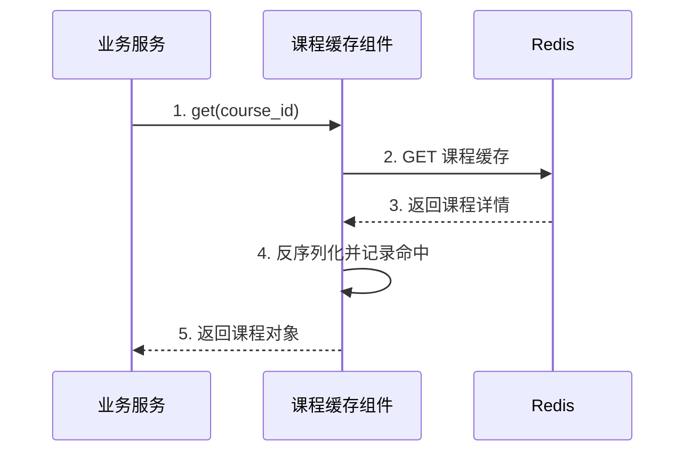
```mermaid
sequenceDiagram
    participant Service as 业务服务
    participant Cache as 课程缓存组件
    participant Redis as Redis

    Service->>Cache: 1. get(course_id)
    Cache->>Redis: 2. GET 课程缓存
    Redis-->>Cache: 3. 返回课程详情
    Cache->>Cache: 4. 反序列化并记录命中
    Cache-->>Service: 5. 返回课程对象
```

**最终状态：**

* 业务服务成功获得课程详情；
* MySQL 不被访问；
* Loader 不执行；
* 缓存组件记录一次缓存命中。

---

##### 3.2.6.2 Redis 未命中并成功回源

Redis 未命中后，课程缓存组件内部调用 Loader 查询 MySQL，并把结果写回 Redis。

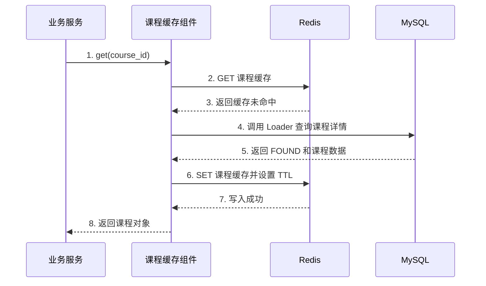
```mermaid
sequenceDiagram
    participant Service as 业务服务
    participant Cache as 课程缓存组件
    participant Redis as Redis
    participant MySQL as MySQL

    Service->>Cache: 1. get(course_id)
    Cache->>Redis: 2. GET 课程缓存
    Redis-->>Cache: 3. 返回缓存未命中

    Cache->>MySQL: 4. 调用 Loader 查询课程详情
    MySQL-->>Cache: 5. 返回 FOUND 和课程数据

    Cache->>Redis: 6. SET 课程缓存并设置 TTL
    Redis-->>Cache: 7. 写入成功
    Cache-->>Service: 8. 返回课程对象
```

**最终状态：**

* 业务服务成功获得课程详情；
* MySQL 被查询一次；
* Redis 保存课程详情缓存；
* 业务服务没有直接处理 Redis miss；
* 后续请求可以直接命中 Redis。

---

##### 3.2.6.3 课程明确不存在

Redis 未命中后，Loader 查询 MySQL并明确确认课程不存在，缓存组件写入短期空值。

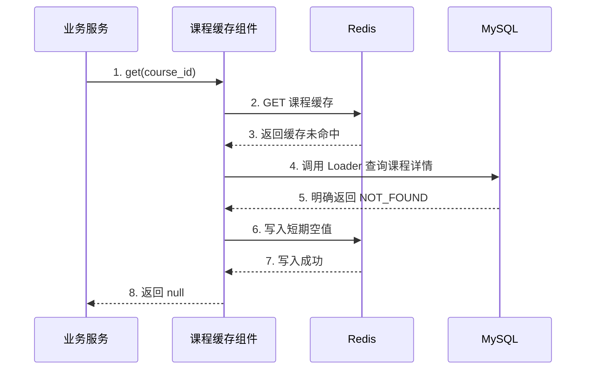
```mermaid
sequenceDiagram
    participant Service as 业务服务
    participant Cache as 课程缓存组件
    participant Redis as Redis
    participant MySQL as MySQL

    Service->>Cache: 1. get(course_id)
    Cache->>Redis: 2. GET 课程缓存
    Redis-->>Cache: 3. 返回缓存未命中

    Cache->>MySQL: 4. 调用 Loader 查询课程详情
    MySQL-->>Cache: 5. 明确返回 NOT_FOUND

    Cache->>Redis: 6. 写入短期空值
    Redis-->>Cache: 7. 写入成功
    Cache-->>Service: 8. 返回 null
```

**最终状态：**

* 业务服务收到课程不存在结果；
* Redis 保存短期空值；
* 相同无效课程 ID 不会立即再次查询 MySQL；
* 空值过期后仍可以重新确认课程状态。

---

#### 3.2.7 核心异常路径

##### 3.2.7.1 同一实例并发缓存未命中

两个请求分别查询 Redis，并且都发生缓存未命中。

第一个请求创建 singleflight 加载任务，第二个请求等待同一个加载任务，因此只有一次 MySQL 查询。

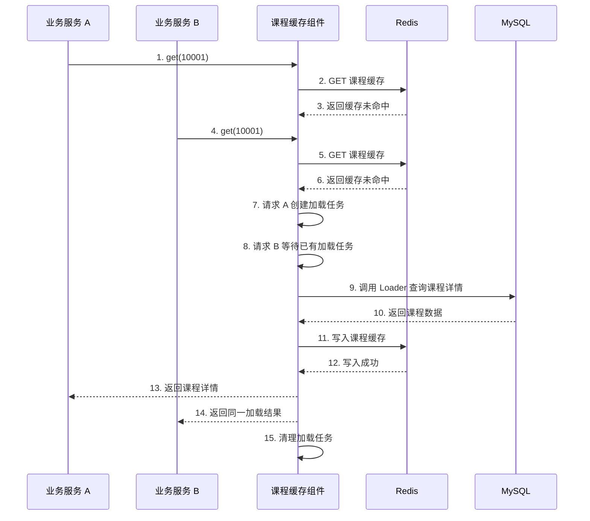
```mermaid
sequenceDiagram
    participant ServiceA as 业务服务 A
    participant ServiceB as 业务服务 B
    participant Cache as 课程缓存组件
    participant Redis as Redis
    participant MySQL as MySQL

    ServiceA->>Cache: 1. get(10001)
    Cache->>Redis: 2. GET 课程缓存
    Redis-->>Cache: 3. 返回缓存未命中

    ServiceB->>Cache: 4. get(10001)
    Cache->>Redis: 5. GET 课程缓存
    Redis-->>Cache: 6. 返回缓存未命中

    Cache->>Cache: 7. 请求 A 创建加载任务
    Cache->>Cache: 8. 请求 B 等待已有加载任务

    Cache->>MySQL: 9. 调用 Loader 查询课程详情
    MySQL-->>Cache: 10. 返回课程数据

    Cache->>Redis: 11. 写入课程缓存
    Redis-->>Cache: 12. 写入成功

    Cache-->>ServiceA: 13. 返回课程详情
    Cache-->>ServiceB: 14. 返回同一加载结果
    Cache->>Cache: 15. 清理加载任务
```

**最终状态：**

* 两个业务请求都成功；
* 两个请求都经历了 Redis miss；
* 只有一次 Loader 调用；
* MySQL 只被查询一次；
* Redis 最终保存课程缓存；
* singleflight 加载任务最终被清理。

**边界说明：**

singleflight 只能合并同一服务实例内的请求。

多实例热点场景仍可能发生并发回源，可以按需要增加 Redis 短锁。

---

##### 3.2.7.2 Loader 查询失败

Redis 未命中后，Loader 查询 MySQL 超时或执行失败。

缓存组件不能把该错误转换成 `null`，也不能写入空值缓存。

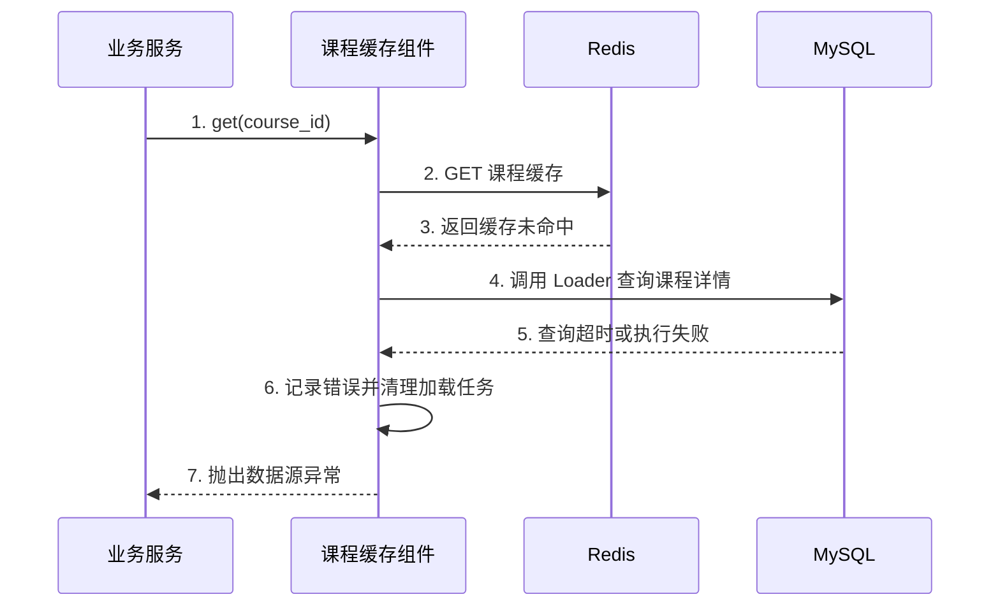
```mermaid
sequenceDiagram
    participant Service as 业务服务
    participant Cache as 课程缓存组件
    participant Redis as Redis
    participant MySQL as MySQL

    Service->>Cache: 1. get(course_id)
    Cache->>Redis: 2. GET 课程缓存
    Redis-->>Cache: 3. 返回缓存未命中

    Cache->>MySQL: 4. 调用 Loader 查询课程详情
    MySQL-->>Cache: 5. 查询超时或执行失败

    Cache->>Cache: 6. 记录错误并清理加载任务
    Cache-->>Service: 7. 抛出数据源异常
```

**最终状态：**

* 本次请求失败；
* MySQL 没有返回可靠结果；
* Redis 不写入课程缓存；
* Redis 不写入空值缓存；
* singleflight 加载状态必须被清理；
* 等待同一加载任务的请求收到相同错误；
* 后续请求仍可以重新尝试加载。

---

##### 3.2.7.3 MySQL 查询成功，但 Redis 写回失败

Loader 已经成功从 MySQL 获得课程详情，但写入 Redis 失败。

本案例采用“事实读取优先”策略：MySQL 已返回可靠数据，因此本次请求仍然返回课程详情。

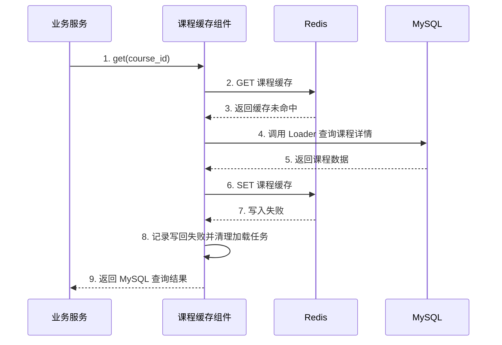
```mermaid
sequenceDiagram
    participant Service as 业务服务
    participant Cache as 课程缓存组件
    participant Redis as Redis
    participant MySQL as MySQL

    Service->>Cache: 1. get(course_id)
    Cache->>Redis: 2. GET 课程缓存
    Redis-->>Cache: 3. 返回缓存未命中

    Cache->>MySQL: 4. 调用 Loader 查询课程详情
    MySQL-->>Cache: 5. 返回课程数据

    Cache->>Redis: 6. SET 课程缓存
    Redis-->>Cache: 7. 写入失败

    Cache->>Cache: 8. 记录写回失败并清理加载任务
    Cache-->>Service: 9. 返回 MySQL 查询结果
```

**最终状态：**

* 本次请求成功；
* MySQL 返回的数据可靠；
* Redis 中仍然没有有效课程缓存；
* 后续请求可能再次触发 Loader；
* 缓存组件记录一次写回失败；
* 当前请求不能无限重试 Redis；
* singleflight 加载任务必须正常清理。

是否允许 Redis 写回失败后仍然返回 MySQL 结果，属于具体业务策略。

> **标记：主观推断**

---

#### 3.2.8 通用异常与工程边界

以下异常不再分别绘制时序图：

| 异常                 | 请求结果           | 处理原则               |
| ------------------ | -------------- | ------------------ |
| Redis 读取失败         | MySQL 可用时可受控回源 | 设置短超时、熔断和回源并发上限    |
| Redis 和 MySQL 同时失败 | 请求失败           | 抛出系统异常，不能返回 `null` |
| Redis 缓存反序列化失败     | 删除无效缓存后重新加载    | 记录缓存格式错误           |
| 空值写入失败             | 仍可返回 `null`    | 后续请求可能再次查询 MySQL   |
| singleflight 等待超时  | 限流、失败或受控回源     | 不允许无限等待            |
| 缓存组件自动重试过多         | 延迟和流量被放大       | 限制重试次数并使用退避        |
| 强一致读取              | 明确绕过缓存         | 由业务服务选择直接查询 MySQL  |
| Key 缺少用户隔离维度       | 存在越权风险         | 公共数据和用户数据必须分离      |

Redis 故障时不能让全部请求无限制回源 MySQL，否则缓存故障可能演变为数据库雪崩。

---

#### 3.2.9 Read Through 特有风险

##### 1. 隐藏真实延迟

业务代码看起来只有：

```ts
await courseDetailCache.get(courseId);
```

但一次调用内部可能执行：

```text
Redis GET
→ singleflight 等待
→ MySQL 多表查询
→ 数据聚合
→ JSON 序列化
→ Redis SET
```

因此，缓存组件必须记录：

* Redis 命中耗时；
* Loader 执行耗时；
* singleflight 等待耗时；
* 缓存写回耗时；
* 整体 `get()` P95、P99；
* MySQL 回源次数和失败原因。

---

##### 2. 通用组件容易过度设计

如果系统只有一两个简单缓存场景，使用公共函数可能已经足够。

只有在以下条件下，统一 Read Through 组件才更有价值：

* 多个模块重复使用同类缓存；
* Key、TTL、空值和并发策略具有较高共性；
* 需要统一监控和异常分类；
* 需要统一管理 Loader。

缓存组件必须支持按缓存模型配置策略，不能把所有数据强制套进同一套 TTL、空值和降级规则。

---

##### 3. 组件可能演变成超级 Service

缓存组件一旦开始处理：

* 权限判断；
* 用户身份；
* 库存；
* 交易；
* 复杂业务事务；

就会模糊缓存层与业务层的边界。

Read Through 组件应只统一缓存机制，不承载具体业务决策。

---

#### 3.2.10 解决的问题、主要代价与使用前提

> **解决的问题：**Read Through 把 Redis 查询、缓存未命中、MySQL 回源、缓存写回、空值和并发治理统一收口到缓存组件，避免缓存代码散落在多个业务模块。

> **主要代价：**缓存组件建设成本更高，一次简单的 `get()` 可能隐藏 Redis、等待和慢 SQL；抽象不合理时还可能形成难以维护的超级组件。

> **使用前提：**系统中存在多个重复读取同类数据的业务模块，缓存规则具有较高共性，并且团队能够定义清晰的 Loader 协议、异常语义、超时、并发控制和监控机制。

---

#### 3.2.11 最终记忆点

1. Read Through 是缓存访问层模式，不是 Redis 命令。
2. 默认缓存读取路径中，业务服务只调用缓存组件。
3. Redis 未命中后，由缓存组件内部 Loader 查询 MySQL。
4. Loader 通常只是组件内部函数，不是独立服务。
5. MySQL 是事实源，Redis 是可以重新加载的缓存副本。
6. `null` 只能表示课程明确不存在。
7. MySQL 超时和系统异常必须抛错，不能转换成 `null`。
8. 只有明确的 `NOT_FOUND` 才能缓存短期空值。
9. singleflight 合并的是同一实例内的 Loader 调用。
10. 多实例热点场景按需要增加 Redis 短锁。
11. Redis 写回失败时，可以根据业务策略返回已查询的 MySQL 结果。
12. `get()` 可能隐藏 MySQL 回源和真实延迟，必须监控。
13. Read Through 只定义读取路径，不自动等于 Write Through。
14. 强一致场景可以明确绕过缓存。
15. 缓存组件只负责通用缓存机制，不能承载全部业务逻辑。

> **Read Through 的核心不是改变 Redis 的读取顺序，而是把缓存未命中、MySQL 回源和缓存写回的责任，从业务代码统一转移到缓存组件。**


### 3.3 Write Through（写穿透）

#### 3.3.1 一句话定义

> **Write Through 是由统一写入层同步协调缓存与后端数据库的写入模式：业务服务只调用一个写入口，统一写入层负责把数据同步传递到数据库和缓存。**

Write Through 主要描述**写路径**，重点回答：

1. 谁负责协调数据库和缓存；
2. 数据库写入是否需要同步完成；
3. 一边成功、另一边失败时如何处理。

Write Through 不是 Redis Open Source 8.8.0 的一条命令。Redis 只提供 `SET`、`DEL`、`MULTI/EXEC` 等底层能力；MySQL 写入、双写顺序、异常返回和补偿机制，需要由缓存框架或统一写入层实现。

---

##### 严格 Write Through

严格意义上的 Write Through 通常表现为：

```text
业务服务
→ 写入缓存访问层
→ 缓存访问层同步调用后端数据库
→ 后端数据库写入完成
→ 缓存写操作完成
```

业务服务只看到缓存或统一数据访问层，不直接分别操作 Redis 和 MySQL。

---

##### 本节采用的工程实现

本节主要讲解：

> **MySQL 作为事实源时，由统一写入层先提交 MySQL，再同步更新 Redis；Redis 同步失败时，由 Outbox 和 Worker 进行补偿。**

完整主线是：

```text
统一写入层
→ MySQL 事务提交业务数据、幂等记录和 Outbox
→ 查询 MySQL 最新标准快照
→ 同步条件写入 Redis
→ 成功则完成 Outbox
→ 失败则业务仍然成功，内部进入补偿
```

这是一种 **Write Through 式的应用层同步双写方案**。

它不是 Redis 与 MySQL 的跨存储原子事务，也不是只有两个存储全部成功才算业务成功的严格模式。

---

#### 3.3.2 参与对象

| 参与对象      | 主要职责                            |
| --------- | ------------------------------- |
| 后台管理员     | 发起课程基础信息修改                      |
| 业务服务      | 执行参数校验、权限判断和业务规则                |
| 统一写入层     | 统一处理 MySQL 写入、幂等、版本、Redis 同步和补偿 |
| MySQL     | 保存课程基础信息，是唯一事实源                 |
| Redis     | 保存同步维护的课程详情读取快照                 |
| Outbox 表  | 保存尚未完成的缓存同步事件                   |
| 补偿 Worker | 根据 MySQL 最新数据修复 Redis           |

业务服务只调用统一入口：

```ts
const result = await courseWriteStore.update({
  courseId,
  input,
  requestId,
  expectedVersion,
});
```

业务接口不再分别编写：

```ts
await courseRepository.update(...);
await redis.set(...);
```

否则不同接口容易产生不同的：

* 双写顺序；
* Redis Key；
* TTL；
* Value 格式；
* 版本规则；
* 失败返回；
* 补偿策略。

---

#### 3.3.3 业务案例

后台管理员修改课程基础信息：

```text
PUT /admin/courses/:course_id
```

修改内容包括：

* 课程标题；
* 课程封面；
* 课程简介；
* 讲师信息；
* 课程标签；
* 课程展示状态。

这些数据最终保存在 MySQL，同时又会被前台高频读取。

如果采用 Cache Aside：

```text
更新 MySQL
→ 删除 Redis
→ 下一次读取再从 MySQL 重建缓存
```

如果采用本节的 Write Through 式同步双写：

```text
更新 MySQL
→ 同步生成最新课程快照
→ 写入 Redis
→ 后续读取可以直接使用最新缓存
```

该方案主要解决：

| 业务问题                | Write Through 式统一写入的作用 |
| ------------------- | ---------------------- |
| 写接口容易遗漏缓存处理         | 所有课程写入统一经过写入层          |
| Key、TTL 和 Value 不统一 | 由统一写入层集中管理             |
| 更新后第一次读取仍需回源        | 写入时同步准备最新缓存            |
| 并发写入导致缓存倒退          | 使用数据版本进行条件写入           |
| 双写部分成功难处理           | 统一定义业务返回和补偿            |
| 客户端超时后重复提交          | 使用 `request_id` 保证幂等   |

Write Through 的主要价值不是简单地“多写一次 Redis”，而是把双写规则和异常治理统一收口。

---

#### 3.3.4 数据职责与模式边界

##### 3.3.4.1 数据职责

```text
MySQL：
保存课程基础信息，是唯一事实源。

Redis：
保存根据 MySQL 标准快照生成的课程读取缓存。

统一写入层：
负责写入编排、幂等、版本判断和同步状态管理。

Outbox：
可靠记录尚未完成的缓存同步事件。

补偿 Worker：
从 MySQL 查询最新状态并修复 Redis。
```

当 Redis 与 MySQL 不一致时：

> **最终以 MySQL 为准，Redis 应根据 MySQL 最新数据重新同步。**

---

##### 3.3.4.2 Write Through 只描述写路径

Write Through 主要定义：

```text
课程修改时，MySQL 和 Redis 如何协作。
```

它不会自动定义读取端如何处理：

* Redis 命中；
* Redis 未命中；
* Redis 被淘汰；
* Redis 故障。

读取端仍然可以组合使用：

```text
Write Through + Read Through
Write Through + Cache Aside
Write Through + 自定义缓存读取组件
```

因此，Write Through 与 Read Through 不是必须绑定的两个阶段。

---

##### 3.3.4.3 Redis 与 MySQL 不能通过普通本地事务原子提交

Redis `MULTI/EXEC` 只能控制 Redis 内部命令：

```text
Redis MULTI/EXEC：
不能包含 MySQL UPDATE。
```

MySQL 事务只能控制 MySQL 内部 SQL：

```text
MySQL COMMIT：
不能自动提交 Redis SET。
```

因此：

> **普通 Redis 与 MySQL 同步双写不能天然实现跨存储原子提交。**

Outbox 能够保证：

```text
MySQL 业务数据
+
缓存同步事件
```

在同一个 MySQL 事务中提交，但不能让 Redis 与 MySQL 在同一时刻原子成功。

---

##### 3.3.4.4 当前业务成功标准

本节采用“事实写入优先”：

```text
MySQL 未提交：
课程更新失败。

MySQL 已提交：
课程业务更新成功。

Redis 同步失败：
内部进入补偿，不把课程更新描述为未执行。
```

因此，Redis 同步状态属于系统内部状态，不作为后台管理员判断课程是否修改成功的主要依据。

---

#### 3.3.5 Write Through 设计

##### 3.3.5.1 统一写入接口

```ts
type CourseWriteResult =
  | {
      status: "success";
      dataVersion: number;
    }
  | {
      status: "conflict";
      currentVersion: number;
    };

interface CourseWriteStore {
  update(command: {
    courseId: number;
    input: CourseUpdateInput;
    requestId: string;
    expectedVersion: number;
  }): Promise<CourseWriteResult>;
}
```

接口语义：

```text
success：
MySQL 已经提交课程修改。

conflict：
expectedVersion 已过期，
本次 MySQL 更新没有提交。

抛出异常：
参数错误、权限错误或 MySQL 事务失败。
```

Redis 同步失败不直接返回：

```text
cache_pending
```

而是在内部记录：

```text
Outbox.status
Redis 同步失败指标
补偿积压
告警日志
```

如果确实需要向管理后台提供诊断信息，可以增加非核心字段：

```ts
{
  status: "success",
  dataVersion: 19,
  cacheSynced: false
}
```

但业务成功状态仍然是 `success`。

> **标记：主观推断**

---

##### 3.3.5.2 requestId 幂等设计

客户端超时后，无法确定服务端是否已经提交 MySQL，因此重试必须携带相同的 `requestId`。

例如：

```text
course-update-10001-abc123
```

MySQL 中需要保存幂等记录，至少包含：

```text
request_id
request_hash
course_id
business_status
data_version
created_at
```

其中：

```text
request_hash：
用于判断相同 request_id 是否携带了相同请求参数。
```

处理规则：

```text
相同 request_id + 相同请求参数：
返回第一次业务处理结果，
不重复更新课程。

相同 request_id + 不同请求参数：
拒绝请求，返回幂等键冲突。
```

幂等记录必须和课程更新在同一个 MySQL 事务中提交。

否则可能出现：

```text
课程已经更新
→ 幂等记录没有保存
→ 客户端重试
→ 课程被再次更新
```

---

##### 3.3.5.3 乐观锁

管理员提交修改时携带：

```text
expectedVersion = 18
```

MySQL 更新示意：

```sql
UPDATE course
SET
    title = ?,
    cover_url = ?,
    data_version = data_version + 1
WHERE
    course_id = ?
    AND data_version = ?;
```

如果影响行数为零，表示当前课程已经被其他请求修改。

统一写入层返回：

```text
conflict
```

并且：

* 不创建有效缓存同步事件；
* 不更新 Redis；
* 管理员需要重新读取最新课程后再修改。

---

##### 3.3.5.4 Redis Key 与 Value

```text
课程数据 Key：
course:detail:v1:{10001}:data

课程版本 Key：
course:detail:v1:{10001}:version
```

课程缓存 Value 示例：

```json
{
  "course_id": 10001,
  "title": "Redis 工程实践",
  "cover_url": "https://example.com/redis.png",
  "teacher_id": 201,
  "status": "published",
  "data_version": 19,
  "updated_at": "2026-07-18T10:00:00Z"
}
```

其中：

```text
v1：
缓存 JSON 结构版本。

data_version：
MySQL 业务数据版本。
```

二者不能混淆。

---

##### 3.3.5.5 Redis Cluster 与版本 Key 生命周期

`data Key` 和 `version Key` 使用相同的 `{course_id}`：

```text
course:detail:v1:{10001}:data
course:detail:v1:{10001}:version
```

花括号中的内容是 Redis Cluster Hash Tag，用于让两个 Key 位于同一个 Hash Slot。

这样才能在 Redis Cluster 下通过 Lua 或 Redis Function 原子执行：

```text
读取 version Key
→ 比较版本
→ 写入 data Key
→ 更新 version Key
```

版本 Key 不能使用比 data Key 更短的 TTL。

推荐：

```text
data Key：
设置业务缓存 TTL。

version Key：
不设置短 TTL，
或者设置明显长于 data Key 和补偿周期的 TTL。
```

课程永久删除时，需要明确清理：

```text
data Key
+
version Key
```

不能随意单独删除版本 Key，否则旧同步请求可能失去版本判断依据。

---

##### 3.3.5.6 TTL

示例参数：

```text
课程缓存 TTL：
30 分钟 + 0～300 秒随机抖动
```

这些只是示例，实际需要根据以下因素确定：

* 课程修改频率；
* 允许旧值存在的时间；
* Redis 内存容量；
* 前台读取量；
* 冷门课程比例；
* 补偿最长恢复时间；
* 缓存重建成本。

Write Through 会在课程修改时主动写入缓存，即使该课程后续没有被访问，也会占用 Redis 内存。

因此，TTL 需要同时考虑冷数据成本。

> **标记：主观推断**

---

##### 3.3.5.7 推荐写入顺序

本节采用：

```text
1. 开启 MySQL 事务。
2. 检查 request_id 是否已经处理。
3. 校验 expectedVersion。
4. 更新课程数据并递增 data_version。
5. 同事务写入幂等记录。
6. 同事务写入 Outbox 事件。
7. 提交 MySQL 事务。
8. 从 MySQL 查询最新标准课程快照。
9. 同步条件写入 Redis。
10. Redis 达到目标版本后，标记 Outbox 完成。
11. Redis 失败则保留 Outbox，等待 Worker 补偿。
```

不推荐先写 Redis：

```text
Redis 已写入新课程
→ MySQL 更新失败
→ Redis 出现数据库中不存在的数据
```

MySQL 作为事实源时：

```text
MySQL 成功
→ Redis 失败
```

更容易通过重新查询 MySQL 修复。

---

##### 3.3.5.8 标准缓存快照来源

Redis 中的课程快照不能简单使用管理员请求参数直接拼装。

原因是最终课程数据可能还包含：

* MySQL 默认值；
* 数据库计算字段；
* 讲师标准信息；
* 标签关系；
* 分类信息；
* 实际提交后的 `data_version`；
* 实际提交时间。

因此，MySQL 提交成功后，统一写入层应：

```text
重新查询 MySQL 最新课程标准快照
→ 获得完整数据和 data_version
→ 条件写入 Redis
```

补偿 Worker 也使用相同的标准快照构建逻辑。

这样正常同步与补偿同步不会生成两套不同的 Redis JSON。

---

##### 3.3.5.9 Outbox 事件

MySQL 事务内同时提交：

```text
课程业务数据
+
幂等记录
+
缓存同步 Outbox 事件
```

Outbox 至少包含：

```text
event_id
request_id
course_id
target_version
status
retry_count
next_retry_at
created_at
processed_at
```

不能采用：

```text
先提交课程数据
→ Redis 同步失败
→ 再临时创建 Outbox
```

否则服务可能在创建 Outbox 前崩溃，造成：

```text
MySQL 已更新
Redis 未同步
没有补偿任务
```

---

##### 3.3.5.10 Redis 版本条件写入

Redis 条件写入需要原子执行：

```text
读取当前 version Key

如果候选版本 > 当前版本：
    更新 version Key
    写入 data Key
    设置 data Key TTL
    返回 APPLIED

如果候选版本 = 当前版本：
    幂等写入或刷新相同版本 data Key
    返回 IDEMPOTENT

如果候选版本 < 当前版本：
    不写入
    返回 STALE
```

版本比较和数据写入必须通过：

* Lua；
* Redis Function；
* 或其他能够保证原子比较与写入的方式。

不能只把 `data_version` 放进 JSON，然后使用普通 `SET`。

---

##### 3.3.5.11 Redis 同步结果的处理

| Redis 结果     | 含义              | Outbox 处理 |
| ------------ | --------------- | --------- |
| `APPLIED`    | 成功推进到候选版本       | 标记完成      |
| `IDEMPOTENT` | 相同版本已经同步或被安全重写  | 标记完成      |
| `STALE`      | Redis 已存在更高版本   | 标记为已跳过或完成 |
| `ERROR`      | Redis 故障或结果无法确认 | 保留未完成并重试  |

`APPLIED`、`IDEMPOTENT` 和 `STALE` 都是当前 Outbox 事件的终态。

只有真正的 Redis 故障才需要继续重试。

---

##### 3.3.5.12 补偿 Worker

Worker 处理未完成事件时：

```text
读取待处理 Outbox
→ 根据 course_id 查询 MySQL 当前最新课程快照
→ 获取当前 data_version
→ 条件写入 Redis
→ 根据 Redis 结果更新 Outbox 状态
```

Worker 不直接使用原始请求快照。

因为事件延迟执行时，MySQL 可能已经产生更高版本。

示例：

```text
Outbox 目标版本：19
MySQL 当前版本：20
```

Worker 应同步版本 20，而不是重新写入版本 19。

Worker 必须满足：

* 重复执行安全；
* 低版本不能覆盖高版本；
* Redis 成功但 Outbox 状态更新失败后可以再次执行；
* 旧事件被高版本覆盖后不会无限重试。

---

##### 3.3.5.13 强一致字段隔离

适合放入普通课程缓存的字段：

* 标题；
* 封面；
* 简介；
* 讲师展示信息；
* 标签；
* 展示状态。

不能默认混入同一缓存的字段：

* 实时价格；
* 库存；
* 剩余名额；
* 用户购买资格；
* 支付状态；
* 考试结果。

Write Through 同步更新 Redis，不等于 Redis 可以承担交易强一致判断。

---

#### 3.3.6 正常路径

##### 3.3.6.1 MySQL 与 Redis 同步成功

统一写入层提交 MySQL 后，重新读取标准课程快照，并同步写入 Redis。

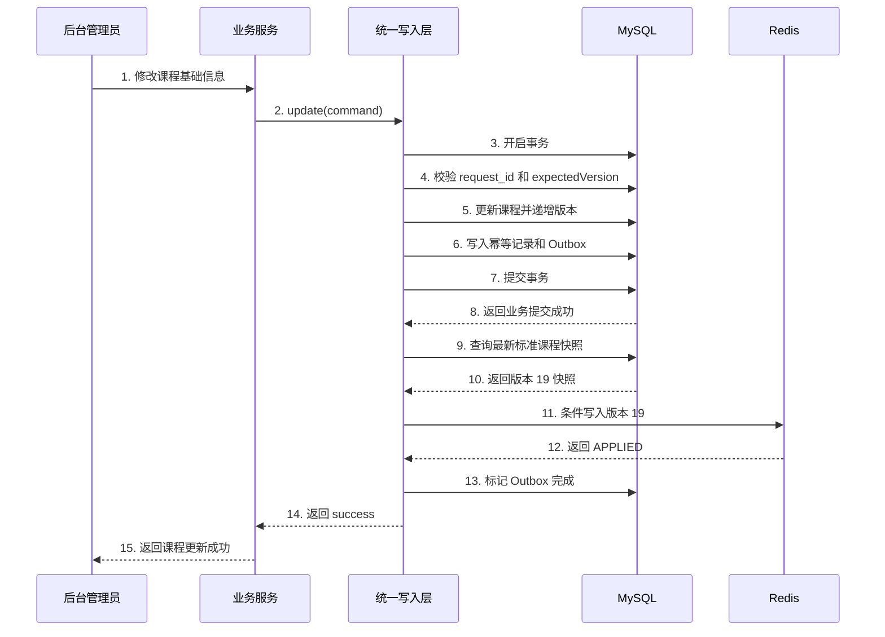
```mermaid
sequenceDiagram
    participant Admin as 后台管理员
    participant Service as 业务服务
    participant Store as 统一写入层
    participant MySQL as MySQL
    participant Redis as Redis

    Admin->>Service: 1. 修改课程基础信息
    Service->>Store: 2. update(command)

    Store->>MySQL: 3. 开启事务
    Store->>MySQL: 4. 校验 request_id 和 expectedVersion
    Store->>MySQL: 5. 更新课程并递增版本
    Store->>MySQL: 6. 写入幂等记录和 Outbox
    Store->>MySQL: 7. 提交事务
    MySQL-->>Store: 8. 返回业务提交成功

    Store->>MySQL: 9. 查询最新标准课程快照
    MySQL-->>Store: 10. 返回版本 19 快照

    Store->>Redis: 11. 条件写入版本 19
    Redis-->>Store: 12. 返回 APPLIED

    Store->>MySQL: 13. 标记 Outbox 完成
    Store-->>Service: 14. 返回 success
    Service-->>Admin: 15. 返回课程更新成功
```

**最终状态：**

* 本次业务请求成功；
* MySQL 保存版本 19；
* Redis 保存版本 19；
* 幂等记录已经保存；
* Outbox 已经完成；
* 管理员收到课程更新成功。

Redis 同步成功后，后续读取在缓存未过期、未淘汰且 Redis 可用时可以命中新版本。

具体缓存未命中行为仍由读取模式决定。

---

##### 3.3.6.2 相同 requestId 安全重试

客户端第一次调用超时后，使用相同 `requestId` 重试。

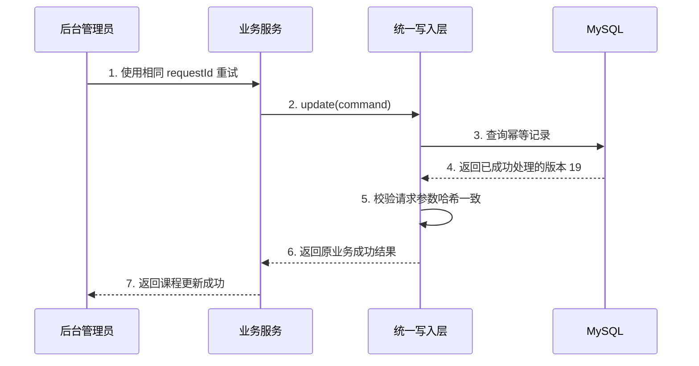
```mermaid
sequenceDiagram
    participant Admin as 后台管理员
    participant Service as 业务服务
    participant Store as 统一写入层
    participant MySQL as MySQL

    Admin->>Service: 1. 使用相同 requestId 重试
    Service->>Store: 2. update(command)

    Store->>MySQL: 3. 查询幂等记录
    MySQL-->>Store: 4. 返回已成功处理的版本 19

    Store->>Store: 5. 校验请求参数哈希一致
    Store-->>Service: 6. 返回原业务成功结果
    Service-->>Admin: 7. 返回课程更新成功
```

**最终状态：**

* 不重复更新课程；
* 不重复递增 `data_version`；
* 不重复创建新的业务结果；
* 客户端获得第一次请求的处理结果；
* 未完成的缓存同步仍由原 Outbox 负责。

---

#### 3.3.7 核心异常路径

##### 3.3.7.1 MySQL 更新失败

MySQL 是事实源，MySQL 事务失败后不能继续同步 Redis。

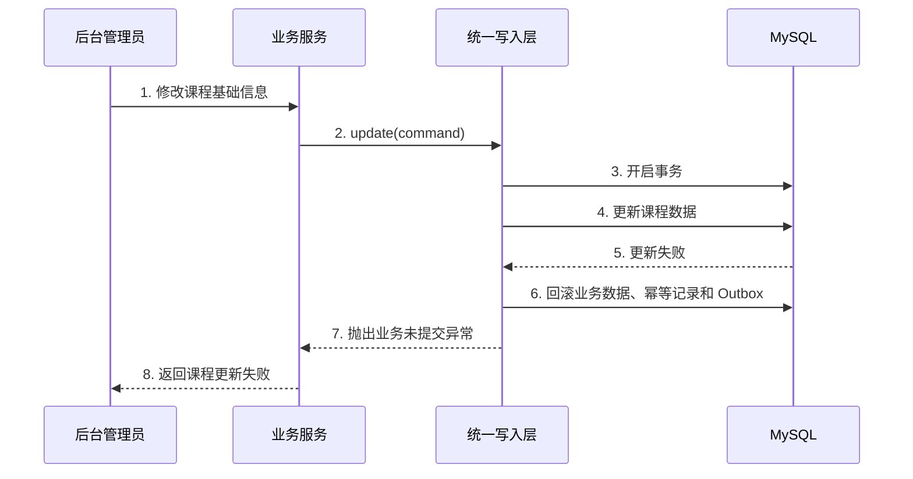
```mermaid
sequenceDiagram
    participant Admin as 后台管理员
    participant Service as 业务服务
    participant Store as 统一写入层
    participant MySQL as MySQL

    Admin->>Service: 1. 修改课程基础信息
    Service->>Store: 2. update(command)

    Store->>MySQL: 3. 开启事务
    Store->>MySQL: 4. 更新课程数据
    MySQL-->>Store: 5. 更新失败

    Store->>MySQL: 6. 回滚业务数据、幂等记录和 Outbox
    Store-->>Service: 7. 抛出业务未提交异常
    Service-->>Admin: 8. 返回课程更新失败
```

**最终状态：**

* 本次请求失败；
* MySQL 没有提交新课程数据；
* 幂等成功记录没有提交；
* Outbox 没有提交；
* Redis 不执行更新；
* 原有课程状态保持不变。

---

##### 3.3.7.2 同版本并发修改发生冲突

两个管理员都基于版本 18 修改同一门课程。

请求 A 先提交版本 19，请求 B 的乐观锁更新失败。

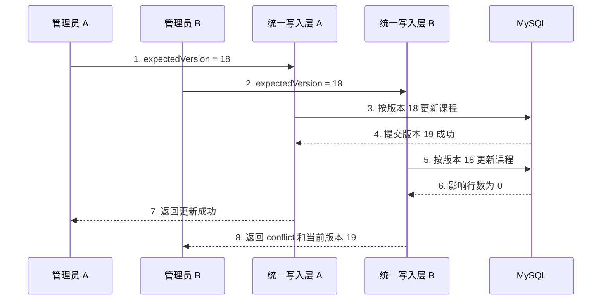
```mermaid
sequenceDiagram
    participant AdminA as 管理员 A
    participant AdminB as 管理员 B
    participant StoreA as 统一写入层 A
    participant StoreB as 统一写入层 B
    participant MySQL as MySQL

    AdminA->>StoreA: 1. expectedVersion = 18
    AdminB->>StoreB: 2. expectedVersion = 18

    StoreA->>MySQL: 3. 按版本 18 更新课程
    MySQL-->>StoreA: 4. 提交版本 19 成功

    StoreB->>MySQL: 5. 按版本 18 更新课程
    MySQL-->>StoreB: 6. 影响行数为 0

    StoreA-->>AdminA: 7. 返回更新成功
    StoreB-->>AdminB: 8. 返回 conflict 和当前版本 19
```

**最终状态：**

* 请求 A 成功；
* 请求 B 没有修改 MySQL；
* 请求 B 不创建有效缓存同步事件；
* 请求 B 不更新 Redis；
* 管理员 B 需要重新读取版本 19 后再决定是否修改。

这是 MySQL 业务并发冲突，不是 Redis 写入乱序。

---

##### 3.3.7.3 MySQL 已提交，但 Redis 同步失败

MySQL 已经提交业务修改，但 Redis 同步失败或结果无法确认。

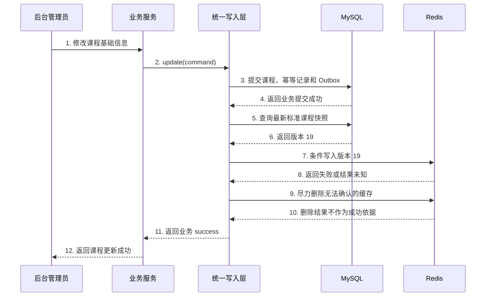
```mermaid
sequenceDiagram
    participant Admin as 后台管理员
    participant Service as 业务服务
    participant Store as 统一写入层
    participant MySQL as MySQL
    participant Redis as Redis

    Admin->>Service: 1. 修改课程基础信息
    Service->>Store: 2. update(command)

    Store->>MySQL: 3. 提交课程、幂等记录和 Outbox
    MySQL-->>Store: 4. 返回业务提交成功

    Store->>MySQL: 5. 查询最新标准课程快照
    MySQL-->>Store: 6. 返回版本 19

    Store->>Redis: 7. 条件写入版本 19
    Redis-->>Store: 8. 返回失败或结果未知

    Store->>Redis: 9. 尽力删除无法确认的缓存
    Redis-->>Store: 10. 删除结果不作为成功依据

    Store-->>Service: 11. 返回业务 success
    Service-->>Admin: 12. 返回课程更新成功
```

**最终状态：**

* 本次课程业务更新成功；
* MySQL 保存版本 19；
* Redis 可能是版本 19、旧版本或无缓存，当前无法确认；
* Outbox 保持未完成；
* 后续由补偿 Worker 修复；
* 管理员不能使用新的 `requestId` 盲目重复提交；
* 最终以 MySQL 为准。

第 9 步只是一次尽力清理，不能依赖 `DEL` 成功保证一致性。

---

##### 3.3.7.4 Worker 完成缓存补偿

Worker 从 MySQL 查询当前最新快照，并成功修复 Redis。

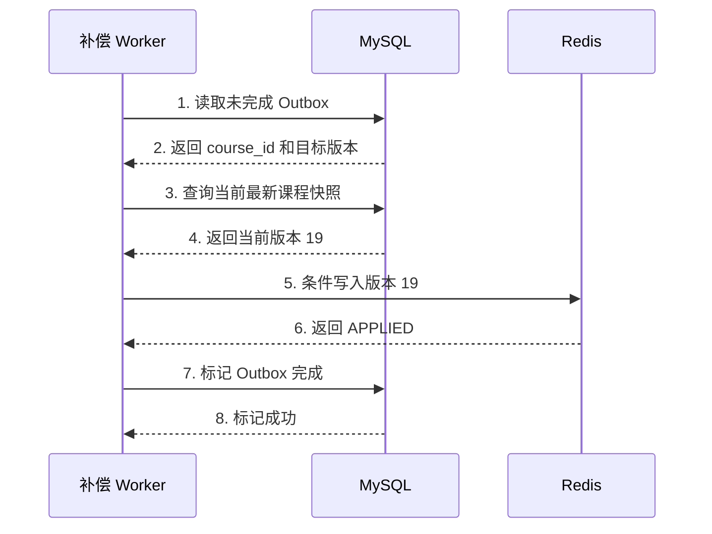
```mermaid
sequenceDiagram
    participant Worker as 补偿 Worker
    participant MySQL as MySQL
    participant Redis as Redis

    Worker->>MySQL: 1. 读取未完成 Outbox
    MySQL-->>Worker: 2. 返回 course_id 和目标版本

    Worker->>MySQL: 3. 查询当前最新课程快照
    MySQL-->>Worker: 4. 返回当前版本 19

    Worker->>Redis: 5. 条件写入版本 19
    Redis-->>Worker: 6. 返回 APPLIED

    Worker->>MySQL: 7. 标记 Outbox 完成
    MySQL-->>Worker: 8. 标记成功
```

**最终状态：**

* MySQL 保存版本 19；
* Redis 保存版本 19；
* Outbox 事件完成；
* 系统恢复一致；
* 相同事件重复执行仍然安全。

如果 Redis 返回：

```text
IDEMPOTENT：
说明相同版本已经同步，标记事件完成。

STALE：
说明 Redis 已经有更高版本，标记事件已跳过或完成。

ERROR：
保留未完成状态，退避后重试。
```

---

##### 3.3.7.5 Redis 同步请求乱序到达

请求 A 已合法提交版本 19。

随后请求 B 基于版本 19 合法提交版本 20，但请求 B 的 Redis 同步先完成。

请求 A 的版本 19 最后才到达 Redis。

```mermaid
sequenceDiagram
    participant StoreA as 统一写入层 A
    participant StoreB as 统一写入层 B
    participant Redis as Redis

    StoreB->>Redis: 1. 条件写入版本 20
    Redis-->>StoreB: 2. 返回 APPLIED

    StoreB->>StoreB: 3. 结束版本 20 同步任务

    StoreA->>Redis: 4. 延迟写入版本 19
    Redis-->>StoreA: 5. 当前版本为 20，返回 STALE

    StoreA->>StoreA: 6. 将版本 19 事件标记为已被高版本覆盖
```

**最终状态：**

* MySQL 当前版本至少为 20；
* Redis 保持版本 20；
* 版本 19 不能覆盖版本 20；
* 版本 19 的同步事件不再重试；
* Redis 缓存不会因为网络到达顺序而倒退。

这是 Redis 同步到达乱序，与前面的 MySQL 乐观锁冲突是两个不同问题。

---

#### 3.3.8 通用异常处理

| 异常                     | 业务结果      | 数据状态                | 处理原则                   |
| ---------------------- | --------- | ------------------- | ---------------------- |
| 相同 `requestId`、不同参数    | 请求失败      | 不修改 MySQL           | 返回幂等键冲突                |
| 客户端请求超时                | 状态暂时未知    | MySQL 可能已经提交        | 使用相同 `requestId` 查询或重试 |
| 标准快照查询失败               | 业务成功      | MySQL 已提交，Redis 未同步 | 保留 Outbox，由 Worker 重试  |
| Redis 返回超时             | 业务成功      | Redis 状态未知          | 不假设失败或成功，进入补偿          |
| Worker 得到 `IDEMPOTENT` | 不影响业务     | Redis 已是目标版本        | 完成 Outbox              |
| Worker 得到 `STALE`      | 不影响业务     | Redis 已是更高版本        | 跳过旧事件并结束               |
| Worker 持续失败            | 业务已经成功    | Redis 可能长期落后        | 退避重试、积压告警和人工处理         |
| Redis 缓存被淘汰            | 不影响写入事实   | Redis 无缓存           | 由读取模式重新加载              |
| version Key 异常丢失       | 存在旧版本覆盖风险 | 版本判断依据缺失            | 告警并从 MySQL 重建版本和数据     |

---

#### 3.3.9 Write Through 特有风险

##### 1. 同步写入增加延迟

一次写入可能需要等待：

```text
MySQL 事务
→ 标准快照查询
→ Redis 条件写入
→ Outbox 状态更新
```

因此需要监控：

* MySQL 事务 P95、P99；
* 标准快照查询 P95、P99；
* Redis 同步 P95、P99；
* 写接口整体 P95、P99；
* Redis 同步失败率；
* Outbox 最老事件年龄。

---

##### 2. 跨存储无法天然原子提交

同步双写仍然可能出现：

```text
MySQL 成功
+
Redis 失败
```

Outbox 解决的是可靠补偿，不是跨系统同时提交。

---

##### 3. 会主动缓存冷数据

Write Through 在课程修改时写入缓存。

即使课程后续没有访问，也可能占用 Redis 内存。

因此需要结合：

* TTL；
* 冷数据比例；
* Redis 淘汰策略；
* 实际读取价值。

---

##### 4. 统一写入层容易过度复杂

统一写入层如果同时承担：

* 课程业务规则；
* 用户权限；
* 库存交易；
* 支付；
* 消息编排；
* 缓存同步；

就会演变成难以维护的超级组件。

统一写入层应主要负责写入编排和一致性治理，具体业务规则仍由业务服务负责。

---

#### 3.3.10 与 Cache Aside 的选型边界

如果课程写接口较少、课程修改频率低：

```text
更新 MySQL
→ 删除 Redis
```

通常更简单。

当存在以下情况时，Write Through 式统一同步双写才更有价值：

* 多个服务都在修改同类课程数据；
* 写接口较多，容易遗漏缓存处理；
* 更新后希望立即准备好最新缓存；
* 已经具备版本控制和接口幂等；
* 已经具备 Outbox、Worker 和监控能力；
* 能接受同步写入增加的延迟；
* 能接受主动写入冷缓存的成本。

> **Write Through 不是 Cache Aside 的高级替代品，而是在统一双写治理价值足够大时才值得使用。**

---

#### 3.3.11 解决的问题、主要代价与使用前提

> **解决的问题：**通过统一写入层集中处理 MySQL 和 Redis 的同步更新，减少缓存更新遗漏，并让成功同步后的缓存立即可用。

> **主要代价：**写入延迟增加，而且 Redis 与 MySQL 不能天然原子提交，必须额外处理接口幂等、版本乱序、Outbox 和补偿任务。

> **使用前提：**系统确实存在统一双写治理需求，并且已经具备 MySQL 版本控制、`requestId` 幂等、标准快照、Redis 条件写入、Outbox、Worker 和监控告警能力。

---

#### 3.3.12 最终记忆点

1. Write Through 是写入架构模式，不是 Redis 命令。
2. 严格 Write Through 与应用层同步双写需要明确区分。
3. 本节采用 MySQL 事实源下的 Write Through 式同步双写。
4. MySQL 提交成功后，课程业务修改已经成立。
5. Redis 同步失败属于内部待补偿状态，不应直接伪装成业务未执行。
6. Redis `MULTI/EXEC` 不能包含 MySQL SQL。
7. MySQL 与 Redis 不能通过普通本地事务原子双写。
8. `requestId` 幂等记录必须与课程更新同事务提交。
9. `expectedVersion` 用于处理同版本并发修改。
10. Redis 版本条件写入用于处理同步请求乱序。
11. 业务并发冲突与 Redis 到达乱序是两个不同问题。
12. 缓存快照应从 MySQL 最新标准数据生成。
13. 正常同步与 Worker 补偿必须使用同一套快照规则。
14. `data Key` 与 `version Key` 在 Redis Cluster 下需要位于同一个 Slot。
15. version Key 不能比 data Key 更早失去版本判断能力。
16. `APPLIED`、`IDEMPOTENT` 和 `STALE` 都可以结束当前 Outbox 事件。
17. Redis 写失败后，不能依赖再执行一次 `DEL` 就解决一致性。
18. Worker 必须从 MySQL 查询当前最新版本进行修复。
19. Write Through 会增加写延迟，也可能缓存大量冷数据。
20. 简单课程场景中，Cache Aside 通常仍然更实用。

> **Write Through 的核心不是“同时写两次”，而是通过统一写入层明确管理事实写入、缓存同步、业务返回、幂等、版本和补偿。**


### 3.4 Write Behind（异步回写）

#### 3.4.1 一句话定义

> **Write Behind 是先把实时状态和待落库事件写入 Redis，前台请求不等待 MySQL；后台 Worker 再异步、批量地将数据写入 MySQL，并在数据库事务提交成功后确认事件。**

Write Behind 也称 Write Back，主要描述写路径：

```text
播放器上报进度
→ Redis 接收实时状态和待落库事件
→ 接口返回 accepted
→ Worker 异步读取事件
→ 批量写入 MySQL
→ MySQL 提交成功
→ XACK 确认事件
```

它与 Write Through 的核心区别是：

```text
Write Through：
写请求通常等待数据库和缓存同步处理完成。

Write Behind：
写请求先由 Redis 接收，
MySQL 在请求返回后异步处理。
```

Write Behind 不是 Redis Open Source 8.8.0 的一条独立命令。普通系统需要通过 Redis 状态数据、Stream、消费组、Worker、幂等写入和故障恢复机制共同实现。

---

#### 3.4.2 参与对象

| 参与对象      | 主要职责                     |
| --------- | ------------------------ |
| 播放器       | 周期性上报用户当前播放位置            |
| 业务服务      | 校验请求，将实时状态和待落库事件写入 Redis |
| Redis     | 保存实时进度、待落库事件和消费状态        |
| 回写 Worker | 消费事件、合并可覆盖状态、幂等写入 MySQL  |
| MySQL     | 保存已经完成持久化的长期学习进度         |

其中：

```text
Redis：
实时最新状态
+
尚未写入 MySQL 的临时状态
+
待落库事件
```

```text
MySQL：
已经完成持久化的长期结果
```

Write Behind 中，Redis 不再只是可以随时删除的普通缓存。

Redis 一旦保存尚未落库的数据，就同时承担了：

* 实时状态存储；
* 写入缓冲区；
* 待处理事件队列。

因此，它对持久化、容量、复制和故障恢复的要求明显高于普通课程详情缓存。

---

#### 3.4.3 业务案例

用户观看课程视频时，播放器可能每隔几秒上报一次进度：

```text
00:05
00:10
00:15
00:20
……
29:55
30:00
```

如果每次上报都直接更新 MySQL，会产生：

* 大量小事务；
* 同一进度行被频繁更新；
* MySQL 连接池和事务压力增加；
* MySQL 延迟直接影响播放器上报接口；
* 突发流量难以平滑处理。

而播放位置属于**可覆盖状态**：

```text
版本 101：10 秒
版本 102：15 秒
版本 103：20 秒
```

如果版本 103 已经成功持久化，版本 101、102 通常不再需要分别更新 MySQL。

Worker 可以合并为：

```text
版本 103：20 秒
```

Write Behind 主要解决：

| 业务问题         | Write Behind 的作用 |
| ------------ | ---------------- |
| 高频小写入        | 前台先写入 Redis      |
| MySQL 更新次数过多 | 合并同一用户的连续进度      |
| 写接口受数据库延迟影响  | 前台不等待 MySQL      |
| 瞬时写入峰值       | Redis 吸收短期流量     |
| 单条事务成本高      | Worker 使用小批量事务   |
| 重复和乱序        | 使用请求 ID 和版本号控制   |

其收益主要来自：

> **减少实际落到 MySQL 的更新次数，而不只是把相同数量的写入延后执行。**

---

#### 3.4.4 数据职责、成功语义与边界

##### 3.4.4.1 数据职责

```text
Redis 实时状态：
保存系统最新接受的播放位置。

Redis Stream：
保存尚待 Worker 处理的进度事件。

MySQL：
保存已经完成持久化的长期进度。

Worker：
负责将待落库状态最终写入 MySQL。
```

异步落库期间，可能出现：

```text
Redis：版本 128
MySQL：版本 125
```

这是 Write Behind 的正常状态，不一定代表系统异常。

因此，更准确的描述是：

> **Redis 是实时状态来源，MySQL 是长期可靠的持久化结果。**

对于不同用途：

```text
实时恢复播放位置：
优先读取 Redis。

历史查询、离线统计和长期审计：
使用 MySQL。
```

---

##### 3.4.4.2 前台 `accepted` 代表什么

本案例中，播放器收到：

```json
{
  "status": "accepted",
  "progress_version": 128
}
```

代表：

```text
实时状态写入流程已经完成
+
待落库事件已经被 Redis 接受
```

不代表：

```text
MySQL 已经提交版本 128
```

因此不能简单返回：

```text
saved
persisted
committed
```

否则调用方容易误以为数据已经完成长期持久化。

---

##### 3.4.4.3 本案例的可靠性标准

对于普通视频播放位置，本节采用：

```text
Redis 写入脚本成功
→ 返回 accepted
```

部署层建议：

* 开启 AOF；
* 使用 `everysec` 等适合业务 RPO 的策略；
* 配置副本；
* 监控 AOF、复制和容量状态；
* 允许极端故障下少量进度回退；
* 播放器支持周期性重复上报。

本案例默认不要求每次上报调用 `WAITAOF`，因为播放位置允许极少量回退，优先保证低延迟。

如果是更重要的状态，例如：

* 章节正式完成；
* 考试提交；
* 证书发放依据；

应选择：

```text
提高 Redis 持久化确认级别
```

或者直接：

```text
同步写入 MySQL
```

AOF 和异步复制都只能降低数据丢失概率，不能天然保证 Redis 零丢失。

---

##### 3.4.4.4 适用范围

适合使用 Write Behind：

* 普通视频播放位置；
* 可重复上报的学习进度；
* 页面浏览计数；
* 可以接受短暂延迟落库的状态；
* 支持版本控制和幂等重放的数据。

不适合直接使用 Write Behind：

* 账户余额；
* 库存扣减；
* 订单支付；
* 考试最终成绩；
* 证书发放依据；
* 用户购买资格。

这些数据不能只因为追求低延迟，就把可靠性依赖于尚未落库的 Redis 状态。

---

#### 3.4.5 Redis 与落库设计

##### 3.4.5.1 Redis Key 分区

为支持 Redis Cluster 和并行消费，可以按照用户 ID 进行固定分区。

示例：

```text
partition = hash(user_id) % 64
```

用户 `10001` 位于分区 `p17`：

```text
实时进度：
learning:progress:{p17}:state:10001:20001

独立版本：
learning:progress:{p17}:version:10001:20001

前台去重：
learning:progress:{p17}:dedupe:{report_id}

待落库事件：
learning:progress:{p17}:events
```

其中 `{p17}` 是 Redis Cluster Hash Tag。

状态 Key、版本 Key、去重 Key 和 Stream 位于同一个 Hash Slot，才能通过 Lua 或 Redis Function 在一个执行单元中操作相关 Key。

---

##### 3.4.5.2 实时进度状态

实时状态示例：

```json
{
  "user_id": 10001,
  "course_id": 20001,
  "chapter_id": 301,
  "position_ms": 186000,
  "progress_version": 128,
  "last_report_id": "7d2dbf7e-1234",
  "updated_at": "2026-07-18T15:10:00Z"
}
```

关键字段：

```text
progress_version：
服务端接受进度更新的先后顺序。

last_report_id：
标记最近一次播放器上报。

updated_at：
用于审计和问题排查。
```

不能只使用：

```text
MAX(position_ms)
```

判断最新进度。

因为用户可能主动从 20 分钟拖回 10 分钟重新观看。

所以：

```text
最新进度
≠
播放位置最大值
```

必须通过服务端版本判断新旧。

---

##### 3.4.5.3 progress_version 独立保存

`progress_version` 不能只存在于实时状态 Value 中。

如果实时状态设置 TTL 后过期：

```text
Redis 当前状态不存在
→ 新请求从版本 1 开始
→ MySQL 已保存版本 128
→ 新进度被 MySQL 永久判断为旧数据
```

因此，需要独立版本 Key：

```text
learning:progress:{p17}:version:10001:20001
```

版本 Key 的规则：

* 不设置短 TTL；
* 不跟随实时状态一起过期；
* 与状态和 Stream 位于同一个 Slot；
* 使用原子 `INCR` 或等价方式生成；
* 版本只要求单调递增，不要求连续。

如果 Redis 灾难恢复后版本 Key 丢失，系统不能直接从 1 重新开始。

恢复流程应为：

```text
暂停该分区新进度写入
→ 查询 MySQL 当前最大 progress_version
→ 恢复版本 Key
→ 重建必要实时状态
→ 再恢复写入
```

---

##### 3.4.5.4 Stream 事件

每次被业务服务接受的进度更新，都需要产生待落库事件：

```text
event_id
report_id
user_id
course_id
chapter_id
position_ms
progress_version
occurred_at
```

字段职责：

```text
event_id：
Redis Stream 中的事件标识。

report_id：
播放器上报请求标识，用于重试去重。

progress_version：
用于判断新旧顺序。

occurred_at：
用于审计，不单独作为版本依据。
```

---

##### 3.4.5.5 Redis 原子执行的真实边界

状态、版本、事件和去重判断应在同一个 Lua 脚本或 Redis Function 中执行，避免其他客户端命令插入中间流程。

但必须明确：

> **Redis 脚本原子执行不等于发生错误后自动回滚。**

Redis 事务和脚本主要保证：

```text
执行过程中没有其他客户端命令穿插
```

不能保证：

```text
前面已经执行的命令在后续报错时自动撤销
```

因此脚本必须先完成：

* 参数校验；
* Key 类型校验；
* 请求内容校验；
* 去重检查；
* 容量和健康状态检查。

推荐执行顺序：

```text
1. 检查 report_id 是否已经处理。
2. 校验所有参数和 Key 类型。
3. 递增独立 progress_version。
4. XADD 待落库事件。
5. 更新实时进度状态。
6. 保存 report_id 去重结果。
7. 全部正常结束后返回 accepted。
```

这里优先让 Stream 事件成为待落库依据。

如果事件已经写入，但实时状态更新发生异常：

```text
Worker 仍可以根据事件写入 MySQL
```

实时状态可以通过后续上报、事件或 MySQL 持久化结果修复。

如果 Redis 返回结果未知，播放器使用相同 `report_id` 重试；极端部分执行可能产生重复事件，因此 Worker 和 MySQL 仍必须保证幂等。

Redis 事务、状态与事件写入的基础机制参见原学习文档。

---

##### 3.4.5.6 report_id 去重

播放器上报需要携带唯一 `report_id`。

处理规则：

```text
相同 report_id + 相同请求内容：
返回第一次成功结果，
不重复产生有效业务结果。

相同 report_id + 不同请求内容：
拒绝请求。
```

去重记录保存：

```text
report_id
request_hash
progress_version
result
```

示例去重 TTL：

```text
10 分钟
```

该数值只是示例，实际需要覆盖：

* 客户端请求超时；
* 网络重试；
* 应用层重试；
* 短时间断网恢复。

需要注意：

> `report_id` 去重用于减少前台重复事件，但不能替代 Worker 和 MySQL 的幂等处理。

---

##### 3.4.5.7 实时状态 TTL

实时状态不能设置成普通缓存那样的短 TTL。

如果：

```text
状态已经过期
+
对应事件尚未落库
```

用户重新进入时只能读到 MySQL 中的旧进度。

可采用：

```text
方案一：
实时状态不设置短 TTL。

方案二：
状态 TTL 明显长于最大积压和故障恢复窗口，
并在每次更新时刷新 TTL。
```

示例：

```text
状态 TTL：7 天
```

这是示例值，实际需要根据以下因素确定：

* 用户再次进入课程的周期；
* MySQL 最大不可用时间；
* Stream 最大积压时间；
* Redis 容量；
* 是否具备状态重建能力。

独立版本 Key 不能跟随该状态 TTL 一起过期。

---

##### 3.4.5.8 哪些事件可以批量合并

本案例只合并**可覆盖状态**：

```text
当前章节
当前播放位置
最近更新时间
```

例如：

```text
版本 101：10 秒
版本 102：15 秒
版本 103：20 秒
```

可以只把版本 103 写入 MySQL。

但以下事件不能因为有更高版本就直接忽略：

* 章节首次完成；
* 奖励发放；
* 学习时长累计明细；
* 考试提交；
* 计费事件；
* 审计日志。

这些属于独立业务事件，应：

* 使用独立事件类型；
* 单独写入 Stream；
* 或逐条持久化。

不能与“当前播放位置”使用同一套覆盖合并规则。

---

##### 3.4.5.9 Worker 有界消费

Worker 只在 MySQL 健康且熔断器允许时读取新消息。

正常流程：

```text
检查 MySQL 和消费熔断状态
→ XREADGROUP 读取有限批次
→ 消息进入 Pending
→ 合并可覆盖状态
→ 幂等写入 MySQL
→ 提交成功后 XACK
```

必须限制：

* 单次批量大小；
* 每个 Worker 的在途批次数；
* 最大 Pending 数量；
* MySQL 事务并发；
* 重试频率。

MySQL 连续失败时：

```text
暂停读取新的 Stream 消息
→ 当前在途批次退避重试
→ 新事件继续留在 Stream
→ 消费组 lag 增长
```

关键原则：

> **MySQL 故障时，优先让 Stream lag 增长，不能无限把新消息读入 Pending。**

---

##### 3.4.5.10 MySQL 幂等与乱序控制

MySQL 进度表至少保存：

```text
user_id
course_id
chapter_id
position_ms
progress_version
last_report_id
updated_at
```

唯一键可以是：

```text
(user_id, course_id)
```

更新原则：

```text
新事件版本 > MySQL 当前版本：
允许更新。

新事件版本 = MySQL 当前版本：
视为重复，业务结果不变。

新事件版本 < MySQL 当前版本：
视为旧事件，不允许覆盖。
```

这样可以处理：

* 前台重复上报；
* Worker 重复消费；
* Worker 崩溃后的重新处理；
* 多 Worker 处理顺序不同；
* MySQL 提交成功但 ACK 失败；
* 旧 Pending 消息延迟接管。

至少一次投递意味着消息可能重复，因此消费者必须具备幂等能力。

---

##### 3.4.5.11 ACK 规则

Worker 使用 `XREADGROUP` 获取事件后，消息进入 Pending。

正确顺序：

```text
读取事件
→ 合并可覆盖状态
→ 幂等写入 MySQL
→ MySQL 事务提交成功
→ XACK
```

不能采用：

```text
先 XACK
→ 再写 MySQL
```

否则 MySQL 失败后，消息已经被确认，无法正常重新处理。

`XACK` 只会：

```text
从当前消费组的 Pending Entries List 中移除引用
```

不会自动删除 Stream 消息正文。

---

##### 3.4.5.12 Stream 清理闭环

本案例先限定只有一个数据库回写消费组：

```text
learning-progress-db-writers
```

清理流程：

```text
MySQL 提交成功
→ XACK 本批事件
→ 检查 XACK 返回数量
→ 记录异常 ACK 情况
→ 后台清理已经安全确认的消息
→ 保留必要审计和故障恢复窗口
```

如果 `XACK` 返回数量少于预期：

* 可能消息已经被其他 Worker ACK；
* 可能消息不属于当前 Pending；
* 可能存在接管或状态异常。

不能直接把整个 MySQL 事务重新执行为失败，而应记录并检查消费组状态。

在 Redis 8.8 中，可以使用支持已确认语义的 Stream 清理策略，只清理已经被消费组安全确认的消息。

如果未来存在多个消费组：

> 只有所有相关消费组都完成确认后，才能安全删除消息正文。

Stream 不能无限增长，也不能忽略积压状态只保留固定数量消息。

---

##### 3.4.5.13 Redis 持久化与容量

承载待落库数据的 Redis 不应完全使用普通缓存配置。

需要重点考虑：

* AOF 状态；
* 副本复制；
* Redis Cluster 故障切换；
* Stream 内存占用；
* Pending 数量；
* 消费组 lag；
* 最大容量；
* 淘汰策略。

建议：

```text
待落库 Redis
与
普通可淘汰缓存

进行实例隔离或明确的容量隔离。
```

达到容量阈值时：

```text
限流或拒绝新进度写入
```

通常比：

```text
静默淘汰尚未落库的数据
```

更容易发现和恢复。

> **标记：主观推断**

---

#### 3.4.6 正常路径

##### 3.4.6.1 前台接受学习进度

播放器上报进度后，业务服务通过 Redis 脚本完成去重、版本生成、事件追加和实时状态更新。

```mermaid
sequenceDiagram
    participant Client as 播放器
    participant Service as 业务服务
    participant Redis as Redis

    Client->>Service: 1. 上报进度和 report_id
    Service->>Service: 2. 校验用户、课程和请求参数

    Service->>Redis: 3. 执行进度写入脚本
    Redis->>Redis: 4. 检查去重和 Key 类型
    Redis->>Redis: 5. 生成 progress_version
    Redis->>Redis: 6. XADD 待落库事件
    Redis->>Redis: 7. 更新实时状态和去重结果
    Redis-->>Service: 8. 返回版本 128

    Service-->>Client: 9. 返回 accepted 和版本 128
```

**最终状态：**

* 本次请求被系统接受；
* Redis Stream 保存版本 128 的待落库事件；
* Redis 实时状态更新为版本 128；
* 去重结果已经保存；
* MySQL 此时可能仍是旧版本；
* 播放器知道请求已被接受，但不代表 MySQL 已提交。

---

##### 3.4.6.2 Worker 批量落库并 ACK

Worker 读取有限批次事件，只合并可覆盖的播放位置状态；MySQL 提交成功后再确认消息。

```mermaid
sequenceDiagram
    participant Worker as 回写 Worker
    participant Redis as Redis Stream
    participant MySQL as MySQL

    Worker->>Worker: 1. 检查 MySQL 熔断状态
    Worker->>Redis: 2. XREADGROUP 读取有限批次
    Redis-->>Worker: 3. 返回事件并进入 Pending

    Worker->>Worker: 4. 合并可覆盖状态的最高版本
    Worker->>MySQL: 5. 开启事务并幂等批量写入
    MySQL-->>Worker: 6. 事务提交成功

    Worker->>Redis: 7. XACK 已持久化事件
    Redis-->>Worker: 8. 返回 ACK 数量

    Worker->>Worker: 9. 记录批次成功和异常 ACK
```

**最终状态：**

* MySQL 保存本批每个用户课程的最高有效版本；
* 低版本不会覆盖高版本；
* 已成功持久化的事件从 Pending 中移除；
* Stream 正文等待后台安全清理；
* Redis 与 MySQL最终达到一致；
* 不可合并的独立业务事件不会在该流程中被跳过。

---

#### 3.4.7 核心异常路径

##### 3.4.7.1 Redis 写入失败或结果未知

Redis 明确失败时，业务服务返回失败；Redis 超时时，服务端不能确定脚本是否已经完成。

```mermaid
sequenceDiagram
    participant Client as 播放器
    participant Service as 业务服务
    participant Redis as Redis

    Client->>Service: 1. 上报进度和 report_id
    Service->>Redis: 2. 执行进度写入脚本
    Redis-->>Service: 3. 返回失败或请求超时

    Service->>Service: 4. 记录失败或结果未知
    Service-->>Client: 5. 返回失败或状态未知
    Client->>Service: 6. 使用相同 report_id 重试
```

**最终状态：**

* MySQL 没有因为本次前台请求立即更新；
* Redis 可能完全未写入，也可能已经部分或全部完成；
* 播放器必须使用相同 `report_id` 重试；
* 去重机制尽量返回第一次结果；
* 即使出现重复事件，MySQL 幂等也不能产生重复业务结果；
* 业务服务不能在 Redis 故障期间无限重试。

---

##### 3.4.7.2 MySQL 写入失败

Worker 已读取有限批次消息，但 MySQL 事务失败。

```mermaid
sequenceDiagram
    participant Worker as 回写 Worker
    participant Redis as Redis Stream
    participant MySQL as MySQL

    Worker->>Redis: 1. XREADGROUP 读取有限批次
    Redis-->>Worker: 2. 事件进入 Pending

    Worker->>MySQL: 3. 幂等批量写入进度
    MySQL-->>Worker: 4. 事务失败并回滚

    Worker->>Worker: 5. 不执行 XACK
    Worker->>Worker: 6. 增加失败计数并退避
    Worker->>Worker: 7. 达到阈值后打开 MySQL 熔断器
```

**最终状态：**

* MySQL 没有提交本批更新；
* Worker 不执行 ACK；
* 当前批次保留在 Pending；
* 达到连续失败阈值后暂停读取新消息；
* 后续新事件继续留在 Stream，不继续扩大 Pending；
* Redis 仍保存用户实时进度；
* MySQL 恢复后再逐步恢复消费。

---

##### 3.4.7.3 MySQL 已提交但 ACK 前 Worker 崩溃

Worker 已经提交 MySQL，但在 ACK 前崩溃，其他 Worker 接管并重复处理。

```mermaid
sequenceDiagram
    participant WorkerA as Worker A
    participant WorkerB as Worker B
    participant Redis as Redis Stream
    participant MySQL as MySQL

    WorkerA->>Redis: 1. XREADGROUP 读取事件
    Redis-->>WorkerA: 2. 事件进入 Pending

    WorkerA->>MySQL: 3. 幂等写入版本 128
    MySQL-->>WorkerA: 4. 事务提交成功

    WorkerA--xWorkerA: 5. ACK 前进程崩溃

    WorkerB->>Redis: 6. XAUTOCLAIM 接管超时事件
    Redis-->>WorkerB: 7. 返回事件

    WorkerB->>MySQL: 8. 再次写入版本 128
    MySQL-->>WorkerB: 9. 判断为重复版本

    WorkerB->>Redis: 10. XACK 事件
    Redis-->>WorkerB: 11. ACK 成功
```

**最终状态：**

* MySQL 只保留一次有效版本 128；
* 重复消费不会覆盖或重复产生业务结果；
* 事件最终从 Pending 中移除；
* 接管阈值必须大于正常处理流程的 P99；
* MySQL 幂等是该故障恢复能够成立的前提。

---

##### 3.4.7.4 MySQL 长时间不可用导致积压

MySQL 连续失败后，Worker 打开熔断器并暂停读取新消息。

```mermaid
sequenceDiagram
    participant Worker as 回写 Worker
    participant Redis as Redis Stream
    participant MySQL as MySQL
    participant Control as 流量控制

    Worker->>MySQL: 1. 当前在途批次写入
    MySQL-->>Worker: 2. 数据库持续不可用

    Worker->>Worker: 3. 打开 MySQL 熔断器
    Worker->>Worker: 4. 暂停读取新的 Stream 消息

    Worker->>Redis: 5. 查询 lag、Pending 和内存
    Redis-->>Worker: 6. 返回积压状态

    Worker->>Control: 7. 上报积压和容量风险
    Control->>Control: 8. 告警、扩容或限制新写入
```

**最终状态：**

* MySQL 仍然没有最新进度；
* 当前在途事件保持未确认；
* 新消息继续留在 Stream，而不是全部进入 Pending；
* 消费组 lag 持续增长；
* 系统执行指数退避；
* 容量接近阈值时限制或拒绝新上报；
* 不能静默淘汰尚未落库的事件。

---

##### 3.4.7.5 Redis 故障导致未落库数据丢失

播放器已经收到 `accepted`，但事件尚未写入 MySQL；Redis 在数据完成可靠持久化前发生不可恢复故障。

```mermaid
sequenceDiagram
    participant Client as 播放器
    participant Service as 业务服务
    participant Redis as Redis
    participant Worker as 回写 Worker
    participant MySQL as MySQL

    Client->>Service: 1. 上报学习进度
    Service->>Redis: 2. 写入状态和待落库事件
    Redis-->>Service: 3. 返回写入成功
    Service-->>Client: 4. 返回 accepted

    Redis--xRedis: 5. 持久化或复制完成前发生故障

    Worker->>Redis: 6. 尝试读取待落库事件
    Redis-->>Worker: 7. 最新事件已经不存在

    Worker->>MySQL: 8. 查询持久化进度
    MySQL-->>Worker: 9. 只返回旧版本
```

**最终状态：**

* 播放器曾经收到 `accepted`；
* Redis 中的最新状态和事件已经丢失；
* MySQL 只保存较旧版本；
* 服务端已经没有完整补偿依据；
* 无法仅依靠 MySQL自动恢复最近进度；
* 只能依靠播放器本地进度重新上报、其他副本或备份降低影响；
* AOF、复制和 `WAITAOF` 只能缩小风险窗口，不能保证绝对零丢失。

这是 Write Behind 最重要的选型代价之一。

---

#### 3.4.8 其他异常与处理原则

| 异常                  | 处理结果           | 处理原则                |
| ------------------- | -------------- | ------------------- |
| 相同 `report_id` 重复上报 | 返回第一次结果        | 不重复产生有效业务结果         |
| 相同 `report_id`、不同内容 | 请求失败           | 返回幂等键冲突             |
| 旧版本事件晚到 MySQL       | 不更新数据          | 视为已处理，可继续 ACK       |
| Redis 实时状态未命中       | 返回 MySQL 持久化版本 | 明确该版本可能较旧           |
| `XACK` 数量少于预期       | MySQL 结果不回滚    | 检查 PEL、接管和重复 ACK 情况 |
| Stream 过早裁剪         | 事件可能永久丢失       | 只清理已安全确认并超过恢复窗口的消息  |
| Redis 版本 Key 丢失     | 暂停该分区写入        | 从 MySQL 恢复版本后再开放    |
| Worker 处理不可合并事件     | 逐条处理           | 不能因更高版本存在而直接跳过      |
| Redis 容量逼近上限        | 限流或拒绝写入        | 不静默淘汰待落库数据          |

---

#### 3.4.9 读取边界

Write Behind 异步落库期间，Redis 通常比 MySQL 更新。

因此：

```text
Redis 命中：
返回最新实时进度。

Redis 未命中：
回退读取 MySQL 已持久化进度。

MySQL 返回结果：
可能比用户最近一次上报更旧。
```

读取路径不在本节继续展开时序图。

本节只强调：

> **Redis 是实时状态来源，MySQL 是持久化结果；读取端必须理解两者可能存在版本差异。**

---

#### 3.4.10 Write Behind 特有风险

##### 1. `accepted` 不等于长期持久化

```text
Redis accepted
≠
MySQL committed
```

播放器和业务服务必须理解这一语义。

---

##### 2. Redis 不再是普通缓存

Redis 保存的是：

```text
实时状态
+
尚未落库的数据
```

这些数据丢失后，MySQL 可能无法完整恢复。

---

##### 3. 至少一次消费会产生重复

典型窗口：

```text
MySQL 已提交
→ XACK 尚未执行
→ Worker 崩溃
```

因此 MySQL 必须幂等。

---

##### 4. 异步系统必须处理积压

MySQL 故障时，需要监控：

* Stream 长度；
* 消费组 lag；
* Pending 数量；
* 最老 Pending 年龄；
* 最老未落库事件时间；
* Redis 内存；
* Worker 吞吐；
* MySQL 恢复能力。

---

##### 5. 批量合并只适用于覆盖型状态

播放位置可以合并。

奖励、考试、计费和审计事件不能随意合并。

---

##### 6. 版本基础设施不能随缓存一起丢失

版本 Key 一旦重置，新的合法进度可能被 MySQL 永久判断为旧数据。

因此版本恢复是 Redis 灾难恢复流程的一部分。

---

#### 3.4.11 与其他方案的选型边界

如果学习进度写入量不高，优先考虑：

```text
降低客户端上报频率
+
直接批量或节流写入 MySQL
```

这通常比建设完整 Write Behind 更简单可靠。

适合使用 Write Behind 的条件：

```text
写入频率确实很高
+
MySQL 小事务已经成为实际瓶颈
+
业务允许几秒到几十秒延迟落库
+
数据支持幂等和版本控制
+
少量进度丢失可以通过重报恢复
+
系统有可靠 Worker、监控和容量治理
+
团队能够明确接受的数据丢失窗口
```

已有 Kafka、RabbitMQ 等成熟消息基础设施时，应客观比较：

* 可靠性；
* 容量；
* 消费能力；
* 运维成本；
* 团队经验。

不能默认 Redis Stream 一定是唯一选择。

> **Write Behind 不是普通写入的默认方案，只有低延迟和削峰收益明显大于可靠性与运维成本时才值得使用。**

---

#### 3.4.12 解决的问题、主要代价与使用前提

> **解决的问题：**Write Behind 让前台进度上报不等待 MySQL，并通过合并覆盖型状态和批量事务减少数据库写入压力。

> **主要代价：**MySQL 会暂时落后，系统必须处理重复、乱序、积压、Pending、版本恢复、Stream 清理和未落库数据丢失。

> **使用前提：**数据允许延迟持久化、支持幂等重放、能够定义可接受的 RPO，并且系统具备 Redis 持久化、可靠 Worker、消费熔断、容量监控和限流能力。

---

#### 3.4.13 最终记忆点

1. Write Behind 是先写 Redis，后异步写 MySQL。
2. 前台返回 `accepted`，不代表 MySQL 已提交。
3. Redis 保存实时状态，也保存尚未持久化的数据。
4. MySQL 保存长期可靠的持久化结果。
5. Redis 脚本原子执行不等于错误后自动回滚。
6. 脚本必须先完成参数和 Key 类型校验。
7. Stream 事件是 Worker 落库的重要依据。
8. `progress_version` 必须独立保存，不能跟随状态 TTL 一起过期。
9. Redis 灾难恢复后必须先恢复版本再开放写入。
10. 相同 `report_id` 重试必须幂等。
11. 版本号应由服务端生成，不直接信任客户端。
12. 播放位置不能用最大值判断最新状态。
13. Worker 只能合并可覆盖型状态。
14. 奖励、考试、计费和审计事件不能随意合并。
15. MySQL 提交成功后才能执行 `XACK`。
16. `XACK` 不会删除 Stream 消息正文。
17. Stream 正文需要由后台清理任务安全删除。
18. MySQL 故障时应暂停读取新消息，避免无限扩大 Pending。
19. MySQL 写入必须处理重复和乱序。
20. Worker 崩溃后，其他 Worker 可以接管长期未确认事件。
21. AOF 和异步复制只能降低丢失风险，不能保证零丢失。
22. Redis 容量不足时，应明确限流或失败，不能静默淘汰待落库数据。
23. 普通播放位置可以接受有限 RPO，关键结果不应直接使用纯 Write Behind。
24. 写入规模不高时，直接写 MySQL通常更简单可靠。

> **Write Behind 的核心不是“稍后再写数据库”，而是让 Redis 承接实时状态和待落库事件，再通过有界消费、幂等提交、提交后 ACK 和安全清理完成最终持久化。**


## 4. 四种模式各自解决什么问题

* **Cache Aside：**降低热点数据的重复查询压力。
* **Read Through：**解决缓存逻辑分散和重复实现。
* **Write Through：**解决写入后缓存不能立即更新的问题。
* **Write Behind：**解决高频写入导致的接口延迟和数据库压力。

## 5. 横向对比

从五个维度比较：

* 谁管理缓存。
* 谁负责回源 MySQL。
* 写请求是否等待数据库。
* Redis 和 MySQL 谁保存最新数据。
* 一致性风险与工程复杂度。

## 6. 场景选型

* 课程详情等读多写少数据：**Cache Aside**。
* 多个模块需要统一缓存治理：**Read Through**。
* 写入后要求缓存立即可用：**Write Through**。
* 学习进度等高频、可延迟落库数据：**Write Behind**。

## 7. 最终结论

**四种模式没有高低之分，应根据数据特点，在性能、一致性和工程复杂度之间选择满足当前需求的最简单方案。**
