# Redis 四种缓存模式

## 1. 缓存模式是什么

**缓存模式是规定业务服务、Redis 与 MySQL 在数据读写时由谁负责、按什么顺序访问，以及同步还是异步更新的一套协作策略，用于在性能、数据一致性和工程复杂度之间做取舍。**


## 2. 四种缓存模式概览

四种模式分为两组：

* **读取模式：** Cache Aside、Read Through。
* **写入模式：** Write Through、Write Behind。

四种模式彼此并列，也可以组合使用。这里按模式主要解决的路径分组；Cache Aside 虽归入读取模式，也包含更新后的缓存失效策略。

### 2.1 两种读取模式

#### Cache Aside：业务服务负责回源

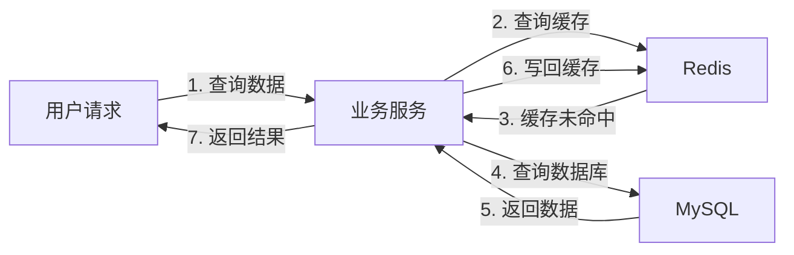
```mermaid
flowchart LR
    Client[用户请求]
    Service[业务服务]
    Redis[Redis]
    MySQL[MySQL]

    Client -->|1. 查询数据| Service
    Service -->|2. 查询缓存| Redis
    Redis -->|3. 缓存未命中| Service
    Service -->|4. 查询数据库| MySQL
    MySQL -->|5. 返回数据| Service
    Service -->|6. 写回缓存| Redis
    Service -->|7. 返回结果| Client
```

#### Read Through：缓存组件负责回源

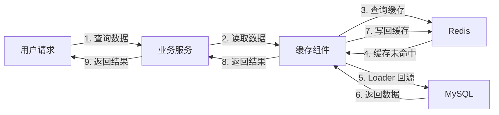
```mermaid
flowchart LR
    Client[用户请求]
    Service[业务服务]
    Cache[缓存组件]
    Redis[Redis]
    MySQL[MySQL]

    Client -->|1. 查询数据| Service
    Service -->|2. 读取数据| Cache
    Cache -->|3. 查询缓存| Redis
    Redis -->|4. 缓存未命中| Cache
    Cache -->|5. Loader 回源| MySQL
    MySQL -->|6. 返回数据| Cache
    Cache -->|7. 写回缓存| Redis
    Cache -->|8. 返回结果| Service
    Service -->|9. 返回结果| Client
```

### 2.2 两种写入模式

#### Write Through 式同步双写：前台等待 MySQL

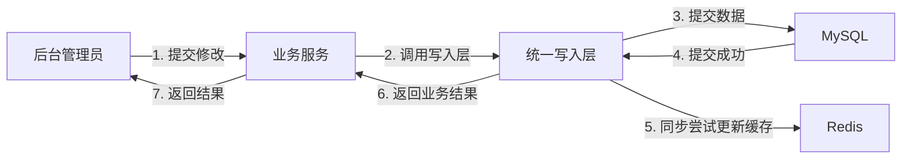
```mermaid
flowchart LR
    Client[后台管理员]
    Service[业务服务]
    Store[统一写入层]
    MySQL[MySQL]
    Redis[Redis]

    Client -->|1. 提交修改| Service
    Service -->|2. 调用写入层| Store
    Store -->|3. 提交数据| MySQL
    MySQL -->|4. 提交成功| Store
    Store -->|5. 同步尝试更新缓存| Redis
    Store -->|6. 返回业务结果| Service
    Service -->|7. 返回结果| Client
```

#### Write Behind：前台不等待 MySQL

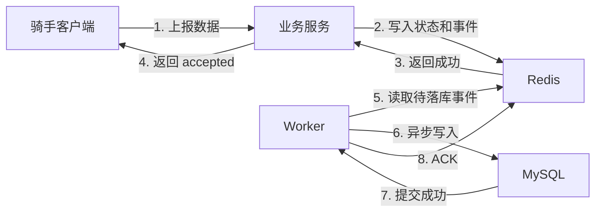
```mermaid
flowchart LR
    Client[骑手客户端]
    Service[业务服务]
    Redis[Redis]
    Worker[Worker]
    MySQL[MySQL]

    Client -->|1. 上报数据| Service
    Service -->|2. 写入状态和事件| Redis
    Redis -->|3. 返回成功| Service
    Service -->|4. 返回 accepted| Client
    Worker -->|5. 读取待落库事件| Redis
    Worker -->|6. 异步写入| MySQL
    MySQL -->|7. 提交成功| Worker
    Worker -->|8. ACK| Redis
```

## 3. 四种模式如何运行

### 3.1 Cache Aside（旁路缓存）

#### 3.1.1 定义与适用场景

> **Cache Aside 由业务服务主动管理缓存：读取时先查 Redis，未命中再查询 MySQL 并写回；更新时先提交 MySQL，再失效缓存。**

适合课程详情这类读多写少、可能存在热点，并允许缓存短暂不一致的场景。

---

#### 3.1.2 数据职责与 Key

> **MySQL 是唯一事实源，Redis 是可以删除并重新构建的性能副本。**

同一门课程使用三个 Redis Key：

```text
course:detail:v1:{course_id}:data
course:detail:v1:{course_id}:version
course:detail:v1:{course_id}:lock
```

其中：

* `data`：保存课程详情并设置短 TTL。
* `version`：阻止旧版本数据重新写回。
* `lock`：限制同一课程被并发重建。

同一课程的三个 Key 使用相同 `course_id`，便于通过 Lua 或 Redis Function 一次处理。

标题、封面、讲师介绍等展示数据适合缓存；价格、资格、支付结果等强一致数据应独立处理。

---

#### 3.1.3 三个核心机制

##### 3.1.3.1 热点保护

`data` Key 设置短 TTL 和随机抖动，减少大量缓存同时过期。

热点缓存未命中时，使用带 token 的短锁：

```text
SET course:detail:v1:{course_id}:lock {token} NX PX 3000
```

必须遵守四条规则：

1. 获得锁后再次检查缓存。
2. 仍未命中才查询 MySQL。
3. 释放锁时原子校验 token，不能直接 `DEL`。
4. 未获得锁的请求只能有限等待，超时后限流、快速失败或受控回源。

只有 MySQL 明确返回不存在时，才能缓存短期空值；数据库故障不能当成数据不存在。

---

##### 3.1.3.2 版本栅栏

`version` 必须独立于 `data` 存在，并且只能单调递增。

读请求条件写入：

```text
传入版本 < 栅栏版本或当前缓存版本：
    返回 STALE，拒绝写入

传入版本 = 当前缓存版本：
    返回 IDEMPOTENT

传入版本不小于栅栏版本，且大于当前缓存版本：
    写入缓存并同步推进栅栏版本
    返回 APPLIED
```

写请求缓存失效：

```text
事件版本 > 栅栏版本：
    推进栅栏
    删除 data Key

事件版本 <= 栅栏版本：
    忽略
```

两个操作都需要通过 Lua 或 Redis Function 原子完成。快照条件写入统一返回 `APPLIED / IDEMPOTENT / STALE / ERROR`；版本推进并删除缓存返回 `APPLIED / IGNORED / ERROR`。

> **版本栅栏可以处理旧读请求、重复事件和乱序事件，但只能保证最终收敛，不提供强一致读取。**

`version` 不应使用与 `data` 相同的短 TTL。

---

##### 3.1.3.3 Outbox 可靠失效

需要可靠失效时，业务数据、`data_version` 和 Outbox 事件必须在同一个 MySQL 事务中提交：

```text
事务内：
更新课程数据
+ 递增 data_version
+ 写入 Outbox
→ 提交事务
```

事务提交后：

```text
推进版本栅栏并删除缓存
→ 成功则完成 Outbox
→ 失败由 Worker 重试
```

Worker 根据 `data_version` 幂等处理重复和乱序事件。

> **Outbox 必须与业务数据同事务写入，否则服务崩溃时可能永久丢失缓存失效事件。**

---

#### 3.1.4 正常路径

##### 3.1.4.1 缓存命中

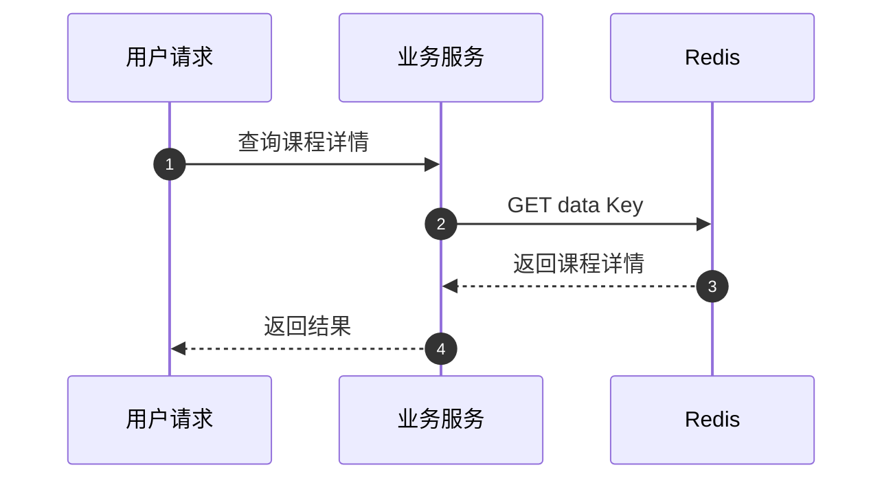
```mermaid
sequenceDiagram
    autonumber
    participant Client as 用户请求
    participant Service as 业务服务
    participant Redis as Redis

    Client->>Service: 查询课程详情
    Service->>Redis: GET data Key
    Redis-->>Service: 返回课程详情
    Service-->>Client: 返回结果
```

##### 3.1.4.2 缓存未命中并成功重建

缓存未命中后，仅获得短锁的请求负责查询 MySQL 和重建缓存。

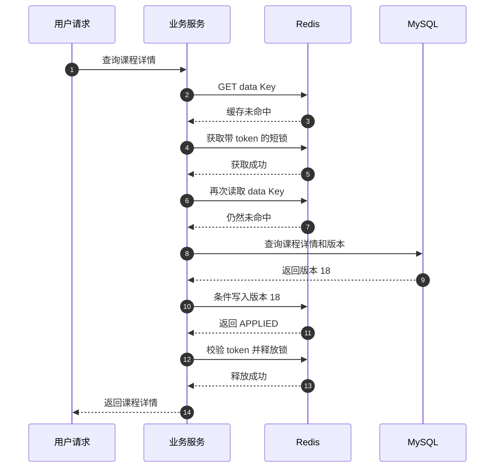
```mermaid
sequenceDiagram
    autonumber
    participant Client as 用户请求
    participant Service as 业务服务
    participant Redis as Redis
    participant MySQL as MySQL

    Client->>Service: 查询课程详情
    Service->>Redis: GET data Key
    Redis-->>Service: 缓存未命中

    Service->>Redis: 获取带 token 的短锁
    Redis-->>Service: 获取成功

    Service->>Redis: 再次读取 data Key
    Redis-->>Service: 仍然未命中

    Service->>MySQL: 查询课程详情和版本
    MySQL-->>Service: 返回版本 18

    Service->>Redis: 条件写入版本 18
    Redis-->>Service: 返回 APPLIED

    Service->>Redis: 校验 token 并释放锁
    Redis-->>Service: 释放成功

    Service-->>Client: 返回课程详情
```

Redis 写回失败时，通常仍可返回 MySQL 查询结果，并记录缓存写入失败。

---

##### 3.1.4.3 更新课程并失效缓存

业务数据和 Outbox 在同一个事务提交，事务后再失效 Redis。

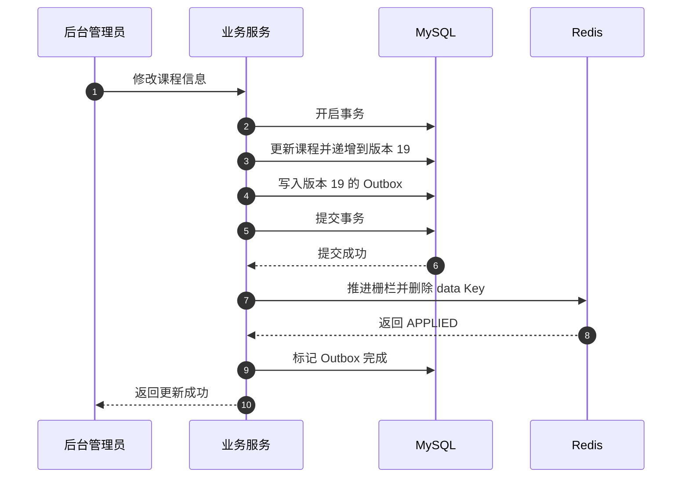
```mermaid
sequenceDiagram
    autonumber
    participant Admin as 后台管理员
    participant Service as 业务服务
    participant MySQL as MySQL
    participant Redis as Redis

    Admin->>Service: 修改课程信息

    Service->>MySQL: 开启事务
    Service->>MySQL: 更新课程并递增到版本 19
    Service->>MySQL: 写入版本 19 的 Outbox
    Service->>MySQL: 提交事务
    MySQL-->>Service: 提交成功

    Service->>Redis: 推进栅栏并删除 data Key
    Redis-->>Service: 返回 APPLIED

    Service->>MySQL: 标记 Outbox 完成
    Service-->>Admin: 返回更新成功
```

MySQL 提交成功后业务更新成立；Redis 失败由 Worker 补偿。

---

#### 3.1.5 核心异常路径

##### 3.1.5.1 热点课程并发缓存未命中

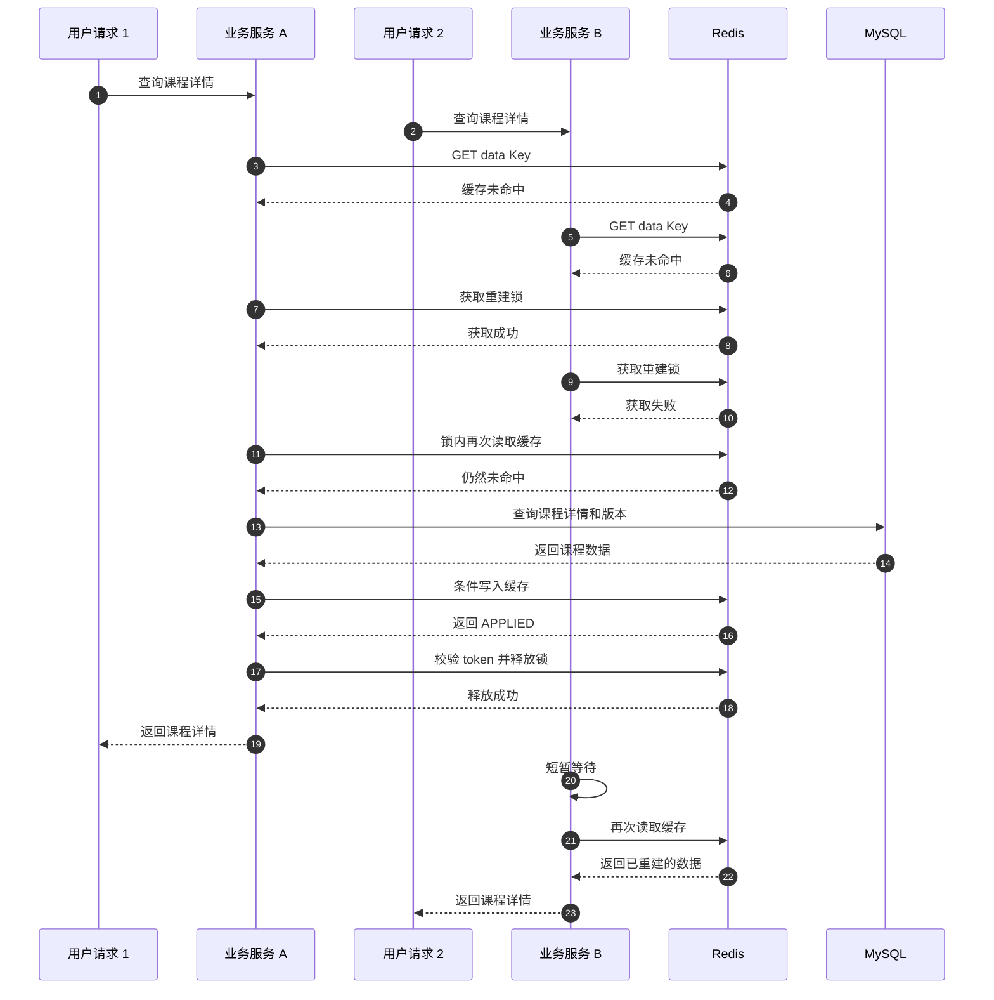
```mermaid
sequenceDiagram
    autonumber
    participant Client1 as 用户请求 1
    participant Service1 as 业务服务 A
    participant Client2 as 用户请求 2
    participant Service2 as 业务服务 B
    participant Redis as Redis
    participant MySQL as MySQL

    Client1->>Service1: 查询课程详情
    Client2->>Service2: 查询课程详情

    Service1->>Redis: GET data Key
    Redis-->>Service1: 缓存未命中

    Service2->>Redis: GET data Key
    Redis-->>Service2: 缓存未命中

    Service1->>Redis: 获取重建锁
    Redis-->>Service1: 获取成功

    Service2->>Redis: 获取重建锁
    Redis-->>Service2: 获取失败

    Service1->>Redis: 锁内再次读取缓存
    Redis-->>Service1: 仍然未命中

    Service1->>MySQL: 查询课程详情和版本
    MySQL-->>Service1: 返回课程数据

    Service1->>Redis: 条件写入缓存
    Redis-->>Service1: 返回 APPLIED

    Service1->>Redis: 校验 token 并释放锁
    Redis-->>Service1: 释放成功
    Service1-->>Client1: 返回课程详情

    Service2->>Service2: 短暂等待
    Service2->>Redis: 再次读取缓存
    Redis-->>Service2: 返回已重建的数据
    Service2-->>Client2: 返回课程详情
```

> **结论：** 短锁只用于减少重复回源、保护 MySQL，不承担业务强一致职责。

---

##### 3.1.5.2 MySQL 已更新，但 Redis 失效失败

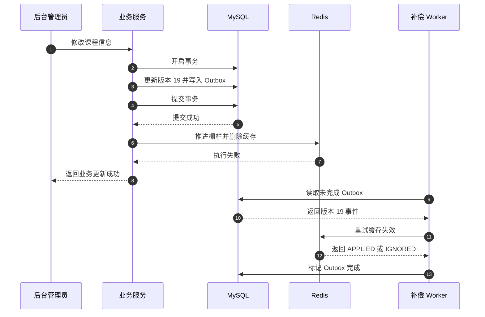
```mermaid
sequenceDiagram
    autonumber
    participant Admin as 后台管理员
    participant Service as 业务服务
    participant MySQL as MySQL
    participant Redis as Redis
    participant Worker as 补偿 Worker

    Admin->>Service: 修改课程信息

    Service->>MySQL: 开启事务
    Service->>MySQL: 更新版本 19 并写入 Outbox
    Service->>MySQL: 提交事务
    MySQL-->>Service: 提交成功

    Service->>Redis: 推进栅栏并删除缓存
    Redis-->>Service: 执行失败

    Service-->>Admin: 返回业务更新成功

    Worker->>MySQL: 读取未完成 Outbox
    MySQL-->>Worker: 返回版本 19 事件

    Worker->>Redis: 重试缓存失效
    Redis-->>Worker: 返回 APPLIED 或 IGNORED

    Worker->>MySQL: 标记 Outbox 完成
```

> **结论：** MySQL 提交成功即业务成功，Outbox Worker 负责后续缓存收敛。

---

##### 3.1.5.3 并发读写导致旧数据重新写回

版本栅栏拒绝旧读请求把版本 18 写回已经推进到版本 19 的缓存。

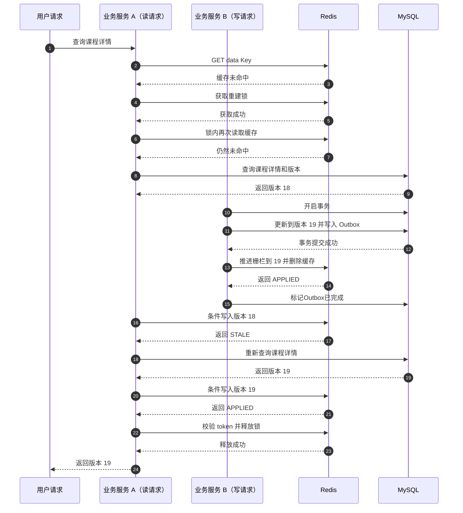
```mermaid
sequenceDiagram
    autonumber
    participant Client as 用户请求
    participant ReadService as 业务服务 A（读请求）
    participant WriteService as 业务服务 B（写请求）
    participant Redis as Redis
    participant MySQL as MySQL

    Client->>ReadService: 查询课程详情

    ReadService->>Redis: GET data Key
    Redis-->>ReadService: 缓存未命中

    ReadService->>Redis: 获取重建锁
    Redis-->>ReadService: 获取成功

    ReadService->>Redis: 锁内再次读取缓存
    Redis-->>ReadService: 仍然未命中

    ReadService->>MySQL: 查询课程详情和版本
    MySQL-->>ReadService: 返回版本 18

    WriteService->>MySQL: 开启事务
    WriteService->>MySQL: 更新到版本 19 并写入 Outbox
    MySQL-->>WriteService: 事务提交成功

    WriteService->>Redis: 推进栅栏到 19 并删除缓存
    Redis-->>WriteService: 返回 APPLIED

    WriteService->>MySQL: 标记Outbox已完成

    ReadService->>Redis: 条件写入版本 18
    Redis-->>ReadService: 返回 STALE

    ReadService->>MySQL: 重新查询课程详情
    MySQL-->>ReadService: 返回版本 19

    ReadService->>Redis: 条件写入版本 19
    Redis-->>ReadService: 返回 APPLIED

    ReadService->>Redis: 校验 token 并释放锁
    Redis-->>ReadService: 释放成功

    ReadService-->>Client: 返回版本 19
```

> **边界：** 版本栅栏不能阻止已经完成的旧读，只能阻止旧缓存长期残留。

---

##### 3.1.5.4 Redis 不可用时受控回源

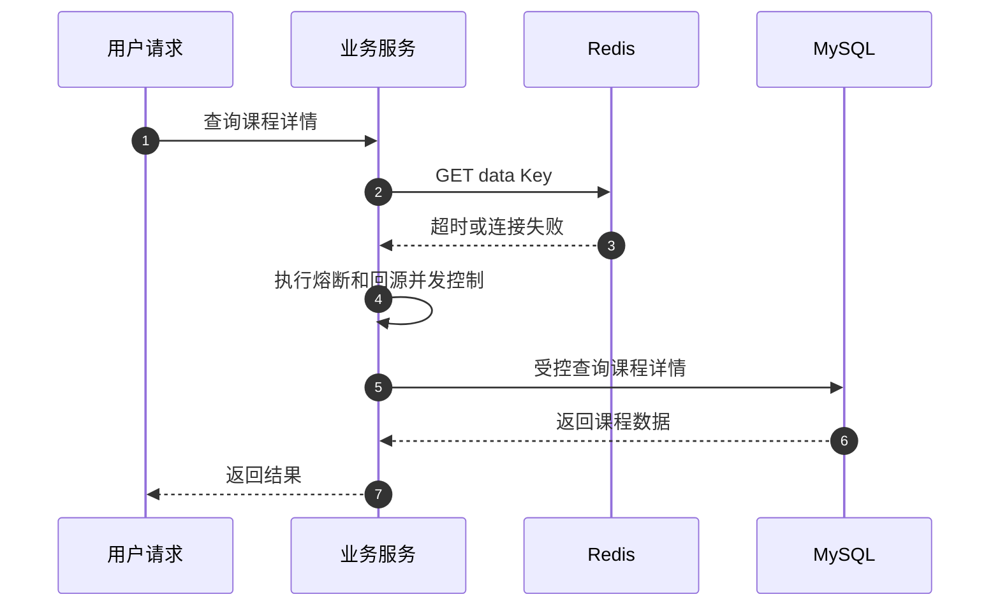
```mermaid
sequenceDiagram
    autonumber
    participant Client as 用户请求
    participant Service as 业务服务
    participant Redis as Redis
    participant MySQL as MySQL

    Client->>Service: 查询课程详情

    Service->>Redis: GET data Key
    Redis-->>Service: 超时或连接失败

    Service->>Service: 执行熔断和回源并发控制

    Service->>MySQL: 受控查询课程详情
    MySQL-->>Service: 返回课程数据

    Service-->>Client: 返回结果
```

> **结论：** Redis 故障时必须限制 MySQL 回源并发，避免数据库雪崩。

---

#### 3.1.6 最终记忆

> **Cache Aside 由业务服务管理缓存；短锁防止并发回源，版本栅栏阻止旧值写回，Outbox 补偿缓存失效失败。**

---

### 3.2 Read Through（读穿透）

#### 3.2.1 定义与适用场景

> **Read Through 把 Redis 查询、缓存未命中、MySQL 回源和缓存写回统一封装在缓存组件中，业务服务只负责调用读取接口。**

适合多个业务模块重复读取同类数据，需要统一 Key、TTL、空值和并发治理的场景。

---

#### 3.2.2 三个核心规则

##### 3.2.2.1 统一读取入口

业务服务只调用缓存组件：

```ts
const course = await courseDetailCache.get(courseId);
```

Redis 查询、缓存未命中和 MySQL 回源都由缓存组件内部处理。

---

##### 3.2.2.2 Loader 结果语义

Loader 三种返回结果：

```text
FOUND：返回课程数据
NOT_FOUND：MySQL 明确确认课程不存在
ERROR：MySQL 超时、连接失败或 SQL 错误
```

只有 `NOT_FOUND` 可以写入短期空值；`ERROR` 必须向上抛出，不能转换成课程不存在。

空值缓存只设置较短 TTL，课程创建、恢复或重新发布时主动删除对应空值缓存，并接受极短时间的错误“不存在”。

---

##### 3.2.2.3 复用基础缓存治理

TTL、版本栅栏、缓存失效和 Redis 故障时的受控回源策略复用 3.1。

singleflight 可以合并同一实例内相同 Key 的 Loader 调用；多实例热点场景仍需要 Redis 短锁。

---

#### 3.2.3 正常路径

##### 3.2.3.1 Redis 命中

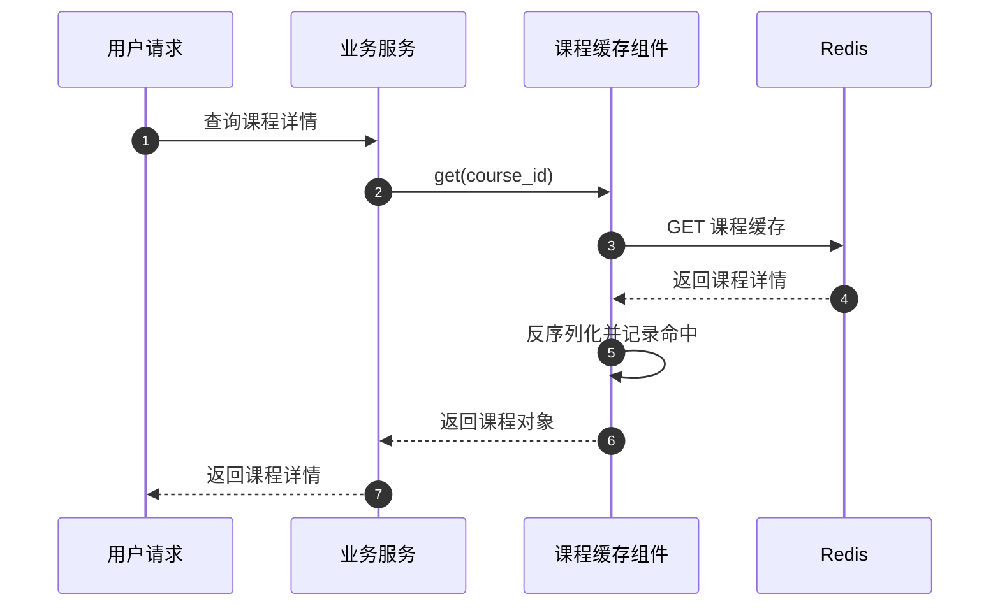
```mermaid
sequenceDiagram
    autonumber
    participant Client as 用户请求
    participant Service as 业务服务
    participant Cache as 课程缓存组件
    participant Redis as Redis

    Client->>Service: 查询课程详情
    Service->>Cache: get(course_id)
    Cache->>Redis: GET 课程缓存
    Redis-->>Cache: 返回课程详情
    Cache->>Cache: 反序列化并记录命中
    Cache-->>Service: 返回课程对象
    Service-->>Client: 返回课程详情
```

> **结论：** 缓存组件直接返回 Redis 数据，业务服务不感知缓存命中细节。

---

##### 3.2.3.2 Redis 未命中并成功回源

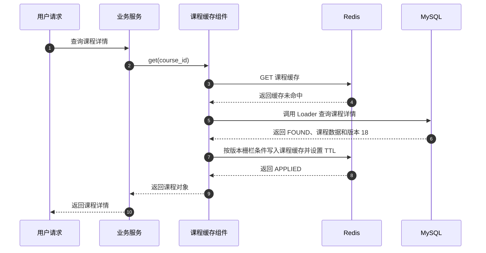
```mermaid
sequenceDiagram
    autonumber
    participant Client as 用户请求
    participant Service as 业务服务
    participant Cache as 课程缓存组件
    participant Redis as Redis
    participant MySQL as MySQL

    Client->>Service: 查询课程详情
    Service->>Cache: get(course_id)
    Cache->>Redis: GET 课程缓存
    Redis-->>Cache: 返回缓存未命中

    Cache->>MySQL: 调用 Loader 查询课程详情
    MySQL-->>Cache: 返回 FOUND、课程数据和版本 18

    Cache->>Redis: 按版本栅栏条件写入课程缓存并设置 TTL
    Redis-->>Cache: 返回 APPLIED

    Cache-->>Service: 返回课程对象
    Service-->>Client: 返回课程详情
```

> **结论：** 缓存组件内部调用 Loader 并按版本条件写回 Redis；普通写入故障时通常仍返回 MySQL 结果，返回 `STALE` 时必须重新读取或查询，不能返回旧 Loader 结果。

---

##### 3.2.3.3 课程明确不存在

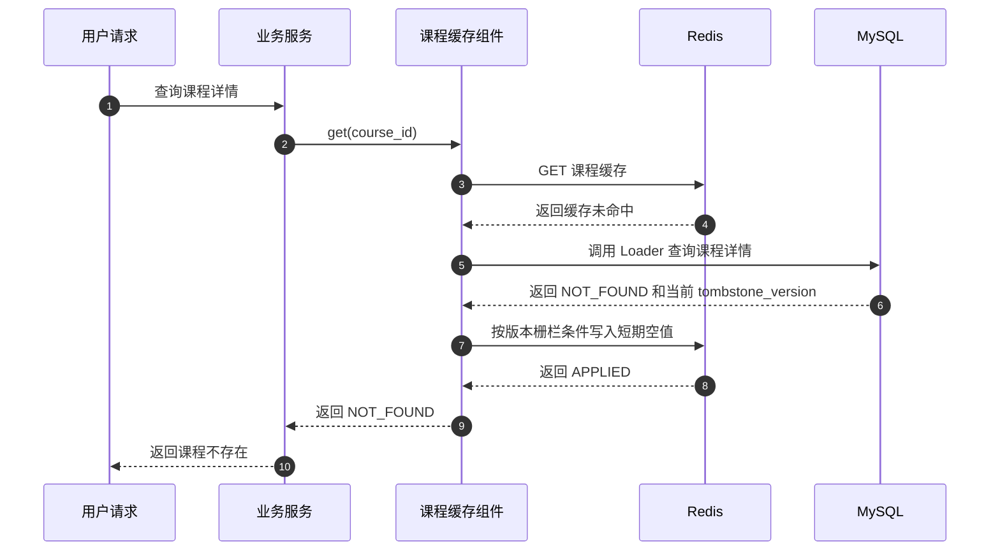
```mermaid
sequenceDiagram
    autonumber
    participant Client as 用户请求
    participant Service as 业务服务
    participant Cache as 课程缓存组件
    participant Redis as Redis
    participant MySQL as MySQL

    Client->>Service: 查询课程详情
    Service->>Cache: get(course_id)
    Cache->>Redis: GET 课程缓存
    Redis-->>Cache: 返回缓存未命中

    Cache->>MySQL: 调用 Loader 查询课程详情
    MySQL-->>Cache: 返回 NOT_FOUND 和当前 tombstone_version

    Cache->>Redis: 按版本栅栏条件写入短期空值
    Redis-->>Cache: 返回 APPLIED

    Cache-->>Service: 返回 NOT_FOUND
    Service-->>Client: 返回课程不存在
```

> **结论：** 只有 Loader 明确返回 `NOT_FOUND`，并携带可参与版本比较的 `tombstone_version` 时，缓存组件才按版本条件写入短期空值。

---

#### 3.2.4 核心异常路径

##### 3.2.4.1 同一实例并发缓存未命中

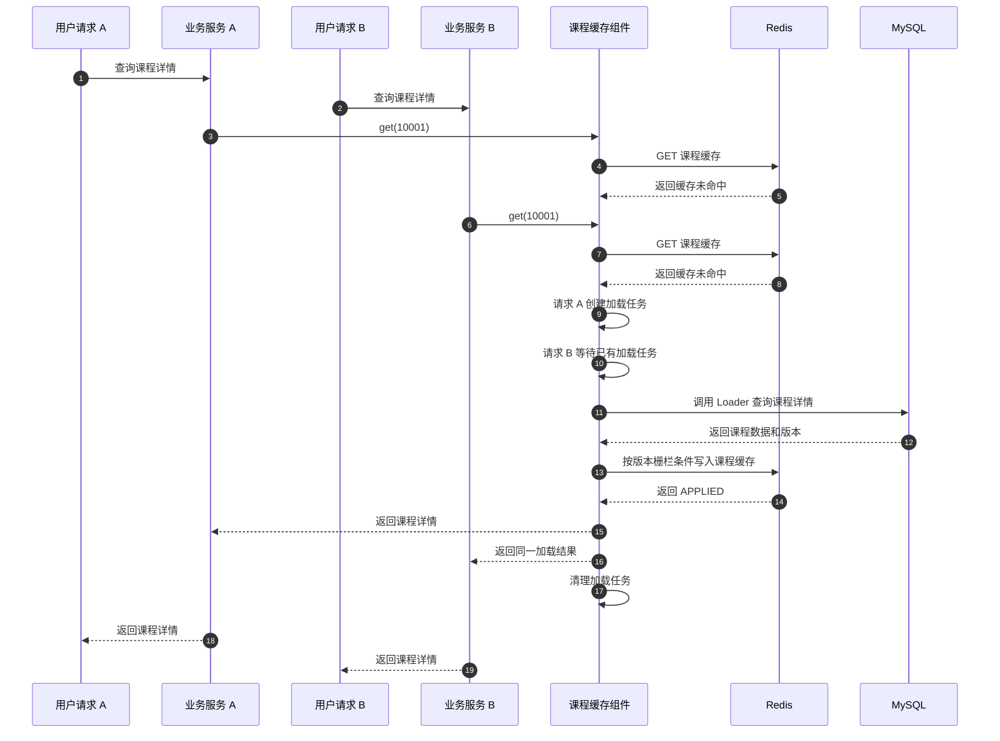
```mermaid
sequenceDiagram
    autonumber
    participant ClientA as 用户请求 A
    participant ServiceA as 业务服务 A
    participant ClientB as 用户请求 B
    participant ServiceB as 业务服务 B
    participant Cache as 课程缓存组件
    participant Redis as Redis
    participant MySQL as MySQL

    ClientA->>ServiceA: 查询课程详情
    ClientB->>ServiceB: 查询课程详情

    ServiceA->>Cache: get(10001)
    Cache->>Redis: GET 课程缓存
    Redis-->>Cache: 返回缓存未命中

    ServiceB->>Cache: get(10001)
    Cache->>Redis: GET 课程缓存
    Redis-->>Cache: 返回缓存未命中

    Cache->>Cache: 请求 A 创建加载任务
    Cache->>Cache: 请求 B 等待已有加载任务

    Cache->>MySQL: 调用 Loader 查询课程详情
    MySQL-->>Cache: 返回课程数据和版本

    Cache->>Redis: 按版本栅栏条件写入课程缓存
    Redis-->>Cache: 返回 APPLIED

    Cache-->>ServiceA: 返回课程详情
    Cache-->>ServiceB: 返回同一加载结果
    Cache->>Cache: 清理加载任务

    ServiceA-->>ClientA: 返回课程详情
    ServiceB-->>ClientB: 返回课程详情
```

> **结论：** singleflight 只合并同一实例内的回源请求，多实例热点仍需要 Redis 短锁。

---

##### 3.2.4.2 Loader 查询失败

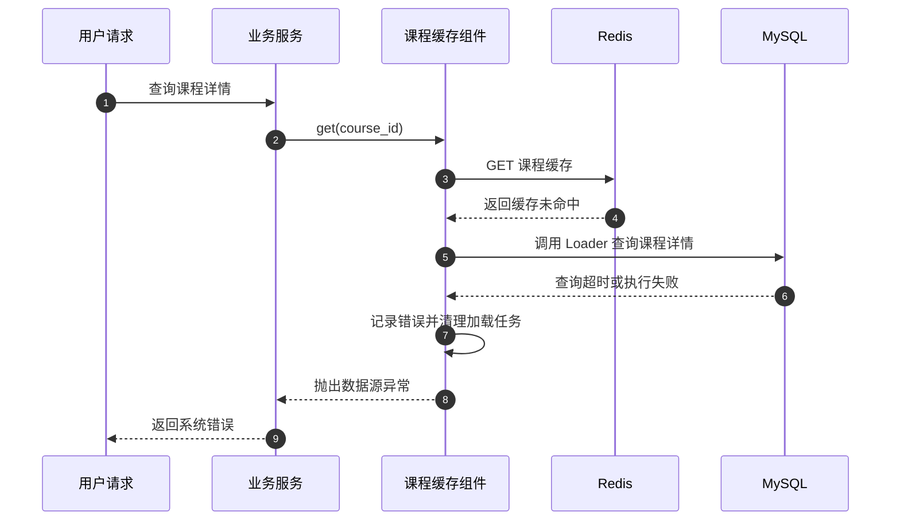
```mermaid
sequenceDiagram
    autonumber
    participant Client as 用户请求
    participant Service as 业务服务
    participant Cache as 课程缓存组件
    participant Redis as Redis
    participant MySQL as MySQL

    Client->>Service: 查询课程详情
    Service->>Cache: get(course_id)
    Cache->>Redis: GET 课程缓存
    Redis-->>Cache: 返回缓存未命中

    Cache->>MySQL: 调用 Loader 查询课程详情
    MySQL-->>Cache: 查询超时或执行失败

    Cache->>Cache: 记录错误并清理加载任务
    Cache-->>Service: 抛出数据源异常
    Service-->>Client: 返回系统错误
```

> **结论：** Loader 失败时返回错误、不写入课程数据或空值，并清理加载任务供后续请求重试。

---

#### 3.2.5 最终记忆

> **Read Through 不改变底层读取顺序，只把缓存未命中、Loader 回源和写回责任统一交给缓存组件；只有 `NOT_FOUND` 可以缓存空值，singleflight 只在单实例内有效。**

### 3.3 Write Through 式同步双写（MySQL 优先）

#### 3.3.1 它解决什么问题

课程信息可能被后台管理、运营工具、批量任务等多个入口修改。

如果每个入口都自行维护 Redis，容易出现：

* 某个入口更新 MySQL 后遗漏缓存处理。
* 并发和乱序导致旧数据覆盖新数据。
* Redis 更新失败后缺少统一补偿。

因此，可以增加统一写入层，让所有课程修改都经过同一套写入流程。

> **Write Through 的核心是统一写入口；本节采用 MySQL 优先的工程化实现。**

```text
统一写入层先提交 MySQL
→ 再同步尝试更新 Redis
→ Redis 失败时由 Outbox Worker 补偿
```

适合多个写入口需要统一维护同一份缓存，并希望数据修改后尽量立即准备好新缓存的场景。

> **MySQL 是唯一事实源，Redis 是可以重新构建的性能副本。**

---

#### 3.3.2 当前方案如何运行

##### 3.3.2.1 基础写入流程

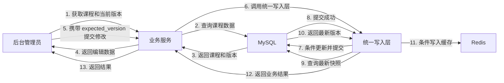
```mermaid
flowchart LR
    Admin[后台管理员]
    Service[业务服务]
    Store[统一写入层]
    MySQL[MySQL]
    Redis[Redis]

    Admin -->|1. 获取课程和当前版本| Service
    Service -->|2. 查询课程数据| MySQL
    MySQL -->|3. 返回课程和版本| Service
    Service -->|4. 返回编辑数据| Admin

    Admin -->|5. 携带 expected_version 提交修改| Service
    Service -->|6. 调用统一写入层| Store
    Store -->|7. 条件更新并提交| MySQL
    MySQL -->|8. 提交成功| Store
    Store -->|9. 查询最新快照| MySQL
    MySQL -->|10. 返回最新版本| Store
    Store -->|11. 条件写入缓存| Redis
    Store -->|12. 返回业务结果| Service
    Service -->|13. 返回结果| Admin
```

> **MySQL 提交决定业务结果，Redis 更新失败不回滚业务，由 Outbox 后续补偿。**

---

##### 3.3.2.2 业务结果与 Outbox 补偿

```text
MySQL 未提交：
    业务失败

MySQL 已提交：
    业务成功

Redis 同步失败：
    业务仍然成功，进入补偿
```

为了避免 MySQL 已经更新，但 Redis 更新任务永久丢失，需要在同一个 MySQL 事务中执行：

```text
按 expected_version 更新课程
+ 递增 data_version
+ 写入 Outbox
→ 提交事务
```

事务提交后：

```text
查询 MySQL 最新课程快照
→ 按 data_version 条件写入 Redis
→ 成功则完成 Outbox
→ 失败则由 Worker 重试
```

补偿 Worker 必须查询 MySQL 当前最新快照，不能直接写入可能已经过时的事件数据。

> **Outbox 不保证 MySQL 和 Redis 原子提交，只保证 Redis 更新失败后可以继续补偿。**

---

#### 3.3.3 两类版本机制

##### 3.3.3.1 expected_version：保护 MySQL

管理员打开编辑页面时，后端返回课程数据和当前版本：

```text
course_id = 1001
course_name = Redis 入门
data_version = 18
```

前端提交修改时携带：

```text
expected_version = 18
```

它表示：

> 我是在版本 18 的基础上修改；如果当前已经不是版本 18，就不要继续更新。

MySQL 通过条件更新实现：

```sql
UPDATE course
SET course_name = 'Redis 工程实践',
    data_version = data_version + 1
WHERE course_id = 1001
  AND data_version = 18;
```

更新成功表示版本匹配；影响行数为 `0` 表示数据已经被其他请求修改。

相同请求重复提交时，也会因为携带旧版本而被拒绝，但系统无法区分第一次请求是否已经成功，只能返回版本冲突。

> **边界：** 课程修改允许重复请求返回版本冲突，因此不引入 `request_id`；支付、下单、发奖等必须识别同一请求并返回原结果的业务，仍需要持久化的 `request_id` 幂等记录。

---

##### 3.3.3.2 data_version：保护 Redis

MySQL 每次更新成功后都会产生新的 `data_version`：

```text
第一次更新：版本 18 → 19
第二次更新：版本 19 → 20
```

由于网络延迟，Redis 更新请求可能乱序到达：

```text
版本 20 先到达 Redis
版本 19 后到达 Redis
```

Redis 按版本条件写入，低版本请求返回 `STALE`，不能覆盖已经写入的高版本。

> **data_version 防止 Redis 因请求乱序发生版本倒退。**

---

#### 3.3.4 正常路径

##### 3.3.4.1 MySQL 与 Redis 同步成功

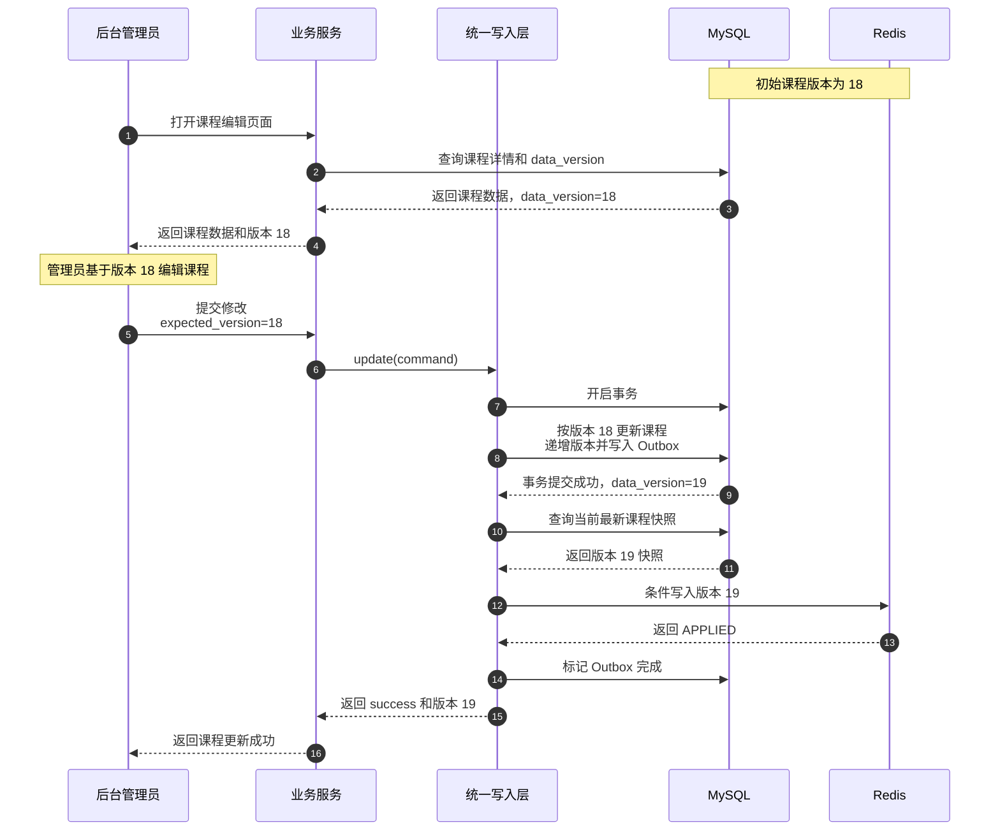
```mermaid
sequenceDiagram
    autonumber

    participant Admin as 后台管理员
    participant Service as 业务服务
    participant Store as 统一写入层
    participant MySQL as MySQL
    participant Redis as Redis

    Note over MySQL,Redis: 初始课程版本为 18

    Admin->>Service: 打开课程编辑页面
    Service->>MySQL: 查询课程详情和 data_version
    MySQL-->>Service: 返回课程数据，data_version=18
    Service-->>Admin: 返回课程数据和版本 18

    Note over Admin: 管理员基于版本 18 编辑课程

    Admin->>Service: 提交修改<br/>expected_version=18
    Service->>Store: update(command)

    Store->>MySQL: 开启事务
    Store->>MySQL: 按版本 18 更新课程<br/>递增版本并写入 Outbox
    MySQL-->>Store: 事务提交成功，data_version=19

    Store->>MySQL: 查询当前最新课程快照
    MySQL-->>Store: 返回版本 19 快照

    Store->>Redis: 条件写入版本 19
    Redis-->>Store: 返回 APPLIED

    Store->>MySQL: 标记 Outbox 完成
    Store-->>Service: 返回 success 和版本 19
    Service-->>Admin: 返回课程更新成功
```

> **结论：** 管理员携带读取到的版本提交修改；MySQL 更新成功后，统一写入层同步准备新缓存。

---

#### 3.3.5 核心异常路径

##### 3.3.5.1 MySQL 未提交

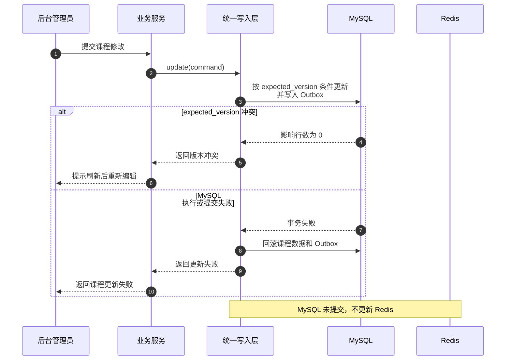
```mermaid
sequenceDiagram
    autonumber

    participant Admin as 后台管理员
    participant Service as 业务服务
    participant Store as 统一写入层
    participant MySQL as MySQL
    participant Redis as Redis

    Admin->>Service: 提交课程修改
    Service->>Store: update(command)
    Store->>MySQL: 按 expected_version 条件更新<br/>并写入 Outbox

    alt expected_version 冲突
        MySQL-->>Store: 影响行数为 0
        Store-->>Service: 返回版本冲突
        Service-->>Admin: 提示刷新后重新编辑
    else MySQL 执行或提交失败
        MySQL-->>Store: 事务失败
        Store->>MySQL: 回滚课程数据和 Outbox
        Store-->>Service: 返回更新失败
        Service-->>Admin: 返回课程更新失败
    end

    Note over Store,Redis: MySQL 未提交，不更新 Redis
```

> **结论：** MySQL 未提交时业务失败，Redis 不更新，也不产生后续补偿任务。

---

##### 3.3.5.2 MySQL 已提交，但 Redis 同步失败

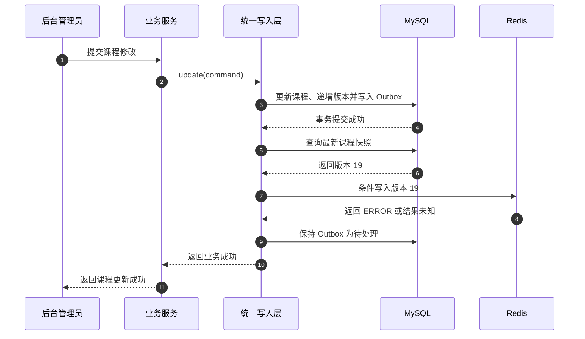
```mermaid
sequenceDiagram
    autonumber

    participant Admin as 后台管理员
    participant Service as 业务服务
    participant Store as 统一写入层
    participant MySQL as MySQL
    participant Redis as Redis

    Admin->>Service: 提交课程修改
    Service->>Store: update(command)

    Store->>MySQL: 更新课程、递增版本并写入 Outbox
    MySQL-->>Store: 事务提交成功

    Store->>MySQL: 查询最新课程快照
    MySQL-->>Store: 返回版本 19

    Store->>Redis: 条件写入版本 19
    Redis-->>Store: 返回 ERROR 或结果未知

    Store->>MySQL: 保持 Outbox 为待处理
    Store-->>Service: 返回业务成功
    Service-->>Admin: 返回课程更新成功
```

查询最新快照失败、Redis 超时、连接失败或执行结果未知时，都应保留 Outbox。

> **结论：** MySQL 已提交则业务成功，Redis 同步失败由 Worker 后续补偿。

---

##### 3.3.5.3 Worker 完成缓存补偿

```mermaid
sequenceDiagram
    autonumber

    participant Worker as 补偿 Worker
    participant MySQL as MySQL
    participant Redis as Redis

    Worker->>MySQL: 读取未完成 Outbox
    MySQL-->>Worker: 返回 course_id

    Worker->>MySQL: 查询当前最新课程快照
    MySQL-->>Worker: 返回当前最新版本

    Worker->>Redis: 按最新 data_version 条件写入
    Redis-->>Worker: 返回写入结果

    alt APPLIED、IDEMPOTENT 或 STALE
        Worker->>MySQL: 标记 Outbox 完成
    else ERROR
        Worker->>Worker: 保持待处理并退避重试
    end
```

```text
APPLIED / IDEMPOTENT / STALE：
    完成 Outbox

ERROR：
    保持待处理并重试
```

例如，Outbox 原本对应版本 19，但 MySQL 当前已经更新到版本 20，Worker 应直接写入版本 20。

> **结论：** Worker 以 MySQL 当前最新数据为准，使 Redis 最终收敛到最新版本。

---

##### 3.3.5.4 Redis 同步请求乱序到达

```mermaid
sequenceDiagram
    autonumber

    participant StoreA as 统一写入层 A
    participant StoreB as 统一写入层 B
    participant MySQL as MySQL
    participant Redis as Redis

    Note over MySQL,Redis: 初始版本为 18

    StoreA->>MySQL: 更新课程，版本 18 变为 19
    MySQL-->>StoreA: 事务提交成功

    Note over StoreA,Redis: 版本 19 的 Redis 请求发生延迟

    StoreB->>MySQL: 再次更新，版本 19 变为 20
    MySQL-->>StoreB: 事务提交成功

    StoreB->>Redis: 条件写入版本 20
    Redis-->>StoreB: 返回 APPLIED

    StoreA->>Redis: 延迟写入版本 19
    Redis-->>StoreA: 当前版本为 20，返回 STALE

    StoreA->>MySQL: 标记版本 19 的 Outbox 完成
```

`STALE` 表示当前任务已经被更高版本覆盖，不需要继续重试。

> **结论：** `data_version` 阻止 Redis 因请求乱序发生版本倒退。

---

#### 3.3.6 最终记忆

> **统一写入层先提交 MySQL，再更新 Redis；Redis 失败由 Outbox 补偿。**

```text
expected_version：保护 MySQL
data_version：保护 Redis
```

### 3.4 Write Behind（异步回写）

#### 3.4.1 它解决什么问题

骑手配送过程中会频繁上报 GPS 位置。

如果每次位置变化都同步写入 MySQL，会增加接口延迟和数据库写入压力；而用户查看地图时，通常只关心骑手的最新位置。

因此，可以先把实时位置和待落库事件写入 Redis，由 Worker 异步、批量写入 MySQL。

> **Write Behind 让前台只等待 Redis，MySQL 由 Worker 异步更新。**

适合骑手位置这类高频、可覆盖、允许延迟落库的数据。

> **`accepted` 只表示 Redis 已经接收，不代表 MySQL 已经提交。**

---

#### 3.4.2 当前方案如何运行

##### 3.4.2.1 基础流程

```mermaid
flowchart LR
    Rider[骑手客户端]
    Service[位置服务]
    Redis[Redis<br/>实时位置 + Stream]
    Worker[回写 Worker]
    MySQL[MySQL]

    Rider -->|1. 上报位置| Service
    Service -->|2. 校验位置数据| Service
    Service -->|3. 原子判断并按需写入| Redis
    Redis -->|4. 写入成功| Service
    Service -->|5. 返回 accepted| Rider

    Worker -->|6. 读取位置事件| Redis
    Worker -->|7. 合并最新位置| Worker
    Worker -->|8. 批量写入| MySQL
    MySQL -->|9. 提交成功| Worker
    Worker -->|10. XACK| Redis
```

> **前台只等待 Redis 写入成功，Worker 再异步批量写入 MySQL，并在事务提交成功后 ACK。**

---

#### 3.4.3 四个核心机制

##### 3.4.3.1 防止同一次位置上报被重复处理

骑手上报位置后，可能因为网络超时没有收到响应，于是使用相同的 `report_id` 再次提交。

位置服务对请求内容进行规范化并计算 `request_hash`，然后每次都通过 Lua 或 Redis Function 原子处理：

```text
report_id 不存在：
    处理新请求

report_id 已存在且 request_hash 相同：
    返回第一次处理结果，不重复写入

report_id 已存在但 request_hash 不同：
    说明 report_id 被错误复用，拒绝请求
```

对于新请求，原子脚本继续比较 `location_seq`，决定是否更新实时位置、写入 Stream，并保存本次处理结果。

MySQL 使用 `(producer_id, report_id)` 唯一约束，防止消息重复消费产生重复结果。

> **`report_id` 识别同一次请求，`request_hash` 防止同一个 ID 被用于不同内容。**

---

##### 3.4.3.2 防止旧位置覆盖新位置

骑手依次采集了三个位置：

```text
位置 A：location_seq=128
位置 B：location_seq=129
位置 C：location_seq=130
```

由于网络延迟，后端收到请求的顺序可能变成：

```text
位置 C：location_seq=130
位置 B：location_seq=129
位置 A：location_seq=128
```

因此，`location_seq` 不能按照后端接收顺序生成，而应由客户端在采集位置时递增。

Redis 的处理规则是：

```text
location_seq 大于当前序号：
    更新实时位置
    写入 Stream
    返回 APPLIED

location_seq 小于或等于当前序号：
    不覆盖实时位置
    不写入 Stream
    返回 STALE
```

Worker 写入 MySQL 时同样只允许更大的 `location_seq` 更新当前持久化位置。

`location_seq` 只适用于位置等可覆盖状态；接单、送达、支付等独立业务事件不能合并。

> **`location_seq` 表示真实采集顺序，用来防止延迟到达的旧位置覆盖新位置。**

本例要求客户端持久化最后的 `location_seq`，重启后继续递增，避免序号回退。

---

##### 3.4.3.3 防止消息已经确认，但位置没有落库

Worker 从 Redis Stream 读取消息后，消息会进入 Pending，但此时并不代表 MySQL 已经写入成功。

正确顺序是：

```text
读取 Stream
→ 合并最新位置
→ 幂等写入 MySQL
→ MySQL 事务提交
→ XACK
```

需要处理两种情况：

```text
MySQL 写入失败：
    不执行 XACK，消息继续保留在 Pending 中等待重试

MySQL 已提交，但 Worker 在 XACK 前崩溃：
    消息会被再次处理，由 MySQL 唯一约束保证幂等
```

> **先提交 MySQL，再执行 XACK；因为消息可能重复，所以 MySQL 写入必须幂等。**

---

##### 3.4.3.4 防止消息积压失控，并明确数据丢失边界

MySQL 不可用时，位置事件仍可能继续写入 Redis，造成：

```text
Stream lag 增长
Pending 增长
Redis 内存持续上涨
```

因此需要监控 Stream lag、Pending 和 Redis 内存，并在接近容量阈值时降低消费或上报速度。

同时，Redis 中保存着尚未落库的数据。如果 Redis 在这些数据写入 MySQL 前发生不可恢复故障，MySQL 只能保留旧位置。

> **MySQL 故障会造成消息积压，Redis 故障可能造成未落库数据丢失，这就是 Write Behind 的 RPO 边界。**

Write Behind 适合允许丢失少量中间状态的数据，不适合支付、余额、库存和订单状态等关键数据。

---

#### 3.4.4 正常路径

##### 3.4.4.1 前台接收骑手位置

骑手客户端在采集位置时递增 `location_seq`，并为本次上报生成唯一的 `report_id`。

位置服务负责业务校验和计算 `request_hash`；Redis 原子完成请求去重、位置新旧判断、实时位置更新和 Stream 写入。

```mermaid
sequenceDiagram
    autonumber

    participant Rider as 骑手客户端
    participant Service as 位置服务
    participant Redis as Redis

    Rider->>Rider: 采集位置并生成 report_id、location_seq
    Rider->>Service: 上报位置数据
    Service->>Service: 校验数据并计算 request_hash
    Service->>Redis: 执行原子位置接收脚本
    Redis->>Redis: 检查 report_id

    alt 相同 report_id、相同内容
        Redis-->>Service: 返回第一次处理结果
        Service-->>Rider: 返回 accepted
    else 相同 report_id、不同内容
        Redis-->>Service: 返回 CONFLICT
        Service-->>Rider: 拒绝请求
    else 新 report_id
        Redis->>Redis: 比较 location_seq

        alt location_seq 更新
            Redis->>Redis: 更新实时位置并 XADD
            Redis->>Redis: 保存 APPLIED 结果
            Redis-->>Service: 返回 APPLIED
            Service-->>Rider: 返回 accepted
        else location_seq 已过期
            Redis->>Redis: 保存 STALE 结果
            Redis-->>Service: 返回 STALE
            Service-->>Rider: 返回 accepted
        end
    end
```

处理结果：

```text
APPLIED：更新实时位置并写入 Stream
STALE：位置已过期，不更新、不写入 Stream
IDEMPOTENT：重复请求，返回第一次结果
CONFLICT：相同 report_id 对应不同内容
```

> **`location_seq` 判断位置新旧，`report_id` 判断是否为同一次请求重试。**

---

##### 3.4.4.2 Worker 批量落库并 ACK

Redis Stream 中只保存通过新旧判断、返回 `APPLIED` 的位置事件。

Worker 可以合并同一骑手的多个位置，只把最大的 `location_seq` 更新到位置表。

```mermaid
sequenceDiagram
    autonumber

    participant Worker as 回写 Worker
    participant Redis as Redis Stream
    participant MySQL as MySQL

    Worker->>Redis: XREADGROUP 读取有限批次
    Redis-->>Worker: 返回事件并进入 Pending
    Worker->>Worker: 按骑手合并最大 location_seq

    Worker->>MySQL: 开启事务
    Worker->>MySQL: 幂等登记事件并条件更新位置
    MySQL-->>Worker: 事务提交成功

    Worker->>Redis: XACK 本批事件
    Redis-->>Worker: ACK 成功
```

> **Worker 可以合并可覆盖的位置，但必须幂等处理每条事件，并在 MySQL 提交后才能 ACK。**

---

#### 3.4.5 核心异常路径

##### 3.4.5.1 MySQL 写入失败

```mermaid
sequenceDiagram
    autonumber

    participant Worker as 回写 Worker
    participant Redis as Redis Stream
    participant MySQL as MySQL

    Worker->>Redis: XREADGROUP 读取位置事件
    Redis-->>Worker: 消息进入 Pending
    Worker->>MySQL: 幂等批量写入位置
    MySQL-->>Worker: 事务失败并回滚
    Worker->>Worker: 不执行 XACK，等待重试
```

> **MySQL 事务失败时不能执行 `XACK`，消息继续保留在 Pending 中。**

---

##### 3.4.5.2 MySQL 已提交，但 ACK 前 Worker 崩溃

```mermaid
sequenceDiagram
    autonumber

    participant WorkerA as Worker A
    participant WorkerB as Worker B
    participant Redis as Redis Stream
    participant MySQL as MySQL

    WorkerA->>Redis: XREADGROUP 读取事件
    Redis-->>WorkerA: 消息进入 Pending
    WorkerA->>MySQL: 幂等写入
    MySQL-->>WorkerA: 事务提交成功
    WorkerA--xWorkerA: XACK 前崩溃

    WorkerB->>Redis: XAUTOCLAIM 接管超时事件
    Redis-->>WorkerB: 返回待处理事件
    WorkerB->>MySQL: 使用相同 report_id 再次写入
    MySQL-->>WorkerB: 确认事件已经处理
    WorkerB->>Redis: XACK
```

> **Stream 消息可能重复处理，MySQL 唯一约束保证不会产生第二次业务结果。**

---

##### 3.4.5.3 MySQL 长时间不可用

MySQL 长时间不可用时，应暂停或减少读取新消息，并监控：

```text
Stream lag
Pending 数量
Redis 内存
```

接近容量阈值时，需要降低位置上报速度或限制新写入；MySQL 恢复后再逐步处理积压。

> **核心目标是避免积压持续扩大，最终耗尽 Redis 内存。**

---

##### 3.4.5.4 Redis 丢失尚未落库的位置

例如：

```text
Redis 已保存 location_seq=130
MySQL 只保存到 location_seq=129
```

如果 Redis 在 130 落库前发生不可恢复故障，MySQL 最终只能保留 129。

> **Redis 丢失尚未落库的位置时，MySQL 只能保留旧位置，这就是 Write Behind 的 RPO 代价。**

---

#### 3.4.6 最终记忆

> **Write Behind 让前台只等待 Redis，Worker 异步写入 MySQL，并在提交成功后 ACK。**

```text
report_id：防止同一次请求重复处理
location_seq：防止旧位置覆盖新位置
ACK：MySQL 提交成功后才能执行
RPO：Redis 中尚未落库的位置可能丢失
```

> **适合高频、可覆盖、允许延迟落库的数据，不适合支付、余额、库存和订单状态等关键数据。**


## 4. 横向对比

| 模式 | 主要解决路径 | 缓存治理者 | 长期权威数据 | 前台写入返回时 MySQL 是否已提交 | 核心风险 | 典型场景 |
| --- | --- | --- | --- | --- | --- | --- |
| Cache Aside | 读为主，也定义更新后失效 | 业务服务 | MySQL | 是（本例更新路径） | 击穿、失效失败、短暂旧数据 | 课程详情等读多写少数据 |
| Read Through | 读 | 缓存组件 | MySQL | 不由读取模式定义 | 隐藏回源耗时、组件过度抽象 | 多个模块需要统一缓存治理 |
| Write Through 式同步双写（MySQL 优先） | 写 | 统一写入层 | MySQL | 是 | Redis 与 MySQL 部分成功、写延迟增加 | 多个写入口需要统一治理，并希望尽量同步准备缓存 |
| Write Behind | 写 | 位置服务 + Worker | MySQL 保存长期结果，Redis 保存实时状态 | 否 | 未落库数据丢失、重复、乱序和积压 | 高频且允许延迟落库的覆盖型状态 |

## 5. 最终结论

**四种模式没有高低之分，应根据数据特点，在性能、一致性和工程复杂度之间选择满足当前需求的最简单方案。**
