# Redis 四种缓存模式

> **阅读定位：**本稿以 Cache Aside 作为主案例，保留相对完整的工程细节；Read Through、Write Through 和 Write Behind 用于说明职责差异、关键风险与选型边界。四种模式不是逐级升级关系，也不是必须按顺序使用。

## 1. 缓存模式是什么

**缓存模式是规定业务服务、Redis 与 MySQL 在数据读写时由谁负责、按什么顺序访问，以及同步还是异步更新的一套协作策略，用于在性能、数据一致性和工程复杂度之间做取舍。**


## 2. 四种缓存模式的直观印象

四种模式分为两组：

* **读取模式：**Cache Aside、Read Through。
* **写入模式：**Write Through、Write Behind。

四种模式彼此并列，也可以组合使用。

### 2.1 两种读取模式

#### Cache Aside：业务服务负责回源

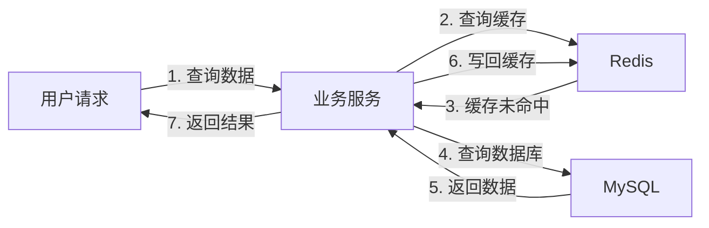
```mermaid
flowchart LR
    Client[用户请求]
    Service[业务服务]
    Redis[Redis]
    MySQL[MySQL]

    Client -->|1. 查询数据| Service
    Service -->|2. 查询缓存| Redis
    Redis -->|3. 缓存未命中| Service
    Service -->|4. 查询数据库| MySQL
    MySQL -->|5. 返回数据| Service
    Service -->|6. 写回缓存| Redis
    Service -->|7. 返回结果| Client
```

#### Read Through：缓存组件负责回源

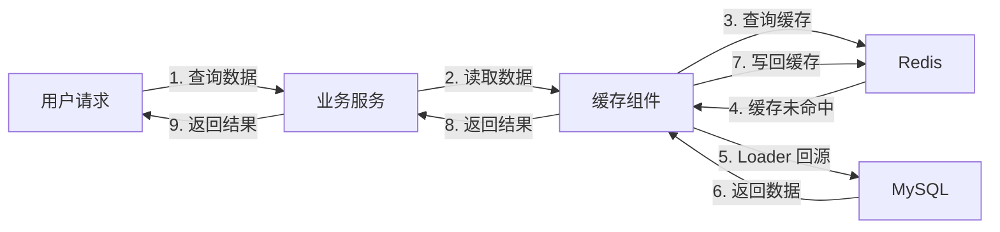
```mermaid
flowchart LR
    Client[用户请求]
    Service[业务服务]
    Cache[缓存组件]
    Redis[Redis]
    MySQL[MySQL]

    Client -->|1. 查询数据| Service
    Service -->|2. 读取数据| Cache
    Cache -->|3. 查询缓存| Redis
    Redis -->|4. 缓存未命中| Cache
    Cache -->|5. Loader 回源| MySQL
    MySQL -->|6. 返回数据| Cache
    Cache -->|7. 写回缓存| Redis
    Cache -->|8. 返回结果| Service
    Service -->|9. 返回结果| Client
```

### 2.2 两种写入模式

#### Write Through 式同步双写：前台等待 MySQL

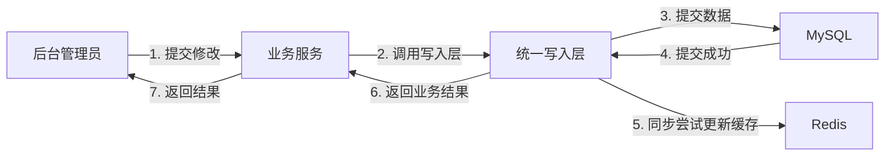
```mermaid
flowchart LR
    Client[后台管理员]
    Service[业务服务]
    Store[统一写入层]
    MySQL[MySQL]
    Redis[Redis]

    Client -->|1. 提交修改| Service
    Service -->|2. 调用写入层| Store
    Store -->|3. 提交数据| MySQL
    MySQL -->|4. 提交成功| Store
    Store -->|5. 同步尝试更新缓存| Redis
    Store -->|6. 返回业务结果| Service
    Service -->|7. 返回结果| Client
```

#### Write Behind：前台不等待 MySQL

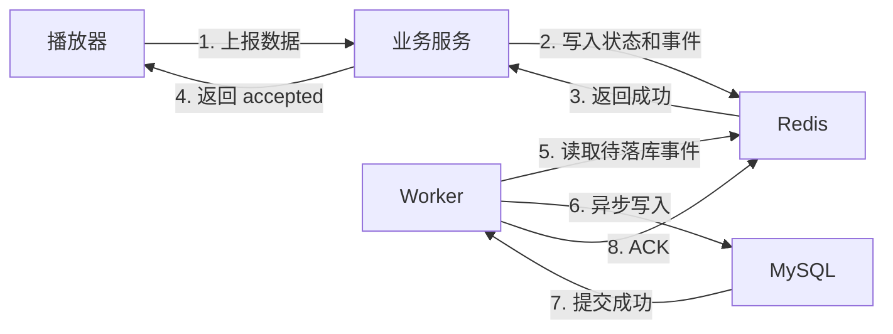
```mermaid
flowchart LR
    Client[播放器]
    Service[业务服务]
    Redis[Redis]
    Worker[Worker]
    MySQL[MySQL]

    Client -->|1. 上报数据| Service
    Service -->|2. 写入状态和事件| Redis
    Redis -->|3. 返回成功| Service
    Service -->|4. 返回 accepted| Client
    Worker -->|5. 读取待落库事件| Redis
    Worker -->|6. 异步写入| MySQL
    MySQL -->|7. 提交成功| Worker
    Worker -->|8. ACK| Redis
```

> **读取模式看谁负责回源，写入模式看前台是否等待 MySQL。**


## 3. 四种模式如何运行

### 3.1 Cache Aside（旁路缓存）

#### 3.1.1 定义与适用场景

> **Cache Aside 由业务服务主动管理缓存：读取时先查 Redis，未命中再查询 MySQL 并写回；更新时先提交 MySQL，再失效缓存。**

适合课程详情这类读多写少、存在热点访问，并允许短暂最终一致的数据。

---

#### 3.1.2 数据职责与 Key

> **MySQL 是唯一事实源，Redis 是可以删除并重新构建的性能副本。**

同一门课程使用三个 Redis Key：

```text
course:detail:v1:{cursorId}:data
course:detail:v1:{cursorId}:version
course:detail:v1:{cursorId}:lock
```

其中：

* `data`：保存课程详情并设置短 TTL。
* `version`：阻止旧版本数据重新写回。
* `lock`：限制同一课程被并发重建。

同一课程的三个 Key 使用相同 `cursorId`，便于通过 Lua 或 Redis Function 一次处理。

标题、封面、讲师介绍等展示数据适合缓存；价格、资格、支付结果等强一致数据应独立处理。

---

#### 3.1.3 三个核心机制

##### 3.1.3.1 热点保护

`data` Key 设置短 TTL 和随机抖动，减少大量缓存同时过期。

热点缓存未命中时，使用带 token 的短锁：

```text
SET course:detail:v1:{cursorId}:lock {token} NX PX 3000
```

必须遵守四条规则：

1. 获得锁后再次检查缓存。
2. 仍未命中才查询 MySQL。
3. 释放锁时原子校验 token，不能直接 `DEL`。
4. 未获得锁的请求只能有限等待，超时后限流、快速失败或受控回源。

只有 MySQL 明确返回不存在时，才能缓存短期空值；数据库故障不能当成数据不存在。

---

##### 3.1.3.2 版本栅栏

`version` 必须独立于 `data` 存在，并且只能单调递增。

读请求条件写入：

```text
数据版本 >= 栅栏版本：
    写入缓存

数据版本 < 栅栏版本：
    拒绝写入
```

写请求缓存失效：

```text
事件版本 > 栅栏版本：
    推进栅栏
    删除 data Key

事件版本 <= 栅栏版本：
    忽略
```

两个操作都需要通过 Lua 或 Redis Function 原子完成。

> **版本栅栏可以处理旧读请求、重复事件和乱序事件，但只能保证最终收敛，不提供强一致读取。**

`version` 不应使用与 `data` 相同的短 TTL。

---

##### 3.1.3.3 Outbox 可靠失效

需要可靠失效时，业务数据、`data_version` 和 Outbox 事件必须在同一个 MySQL 事务中提交：

```text
事务内：
更新课程数据
+ 递增 data_version
+ 写入 Outbox
→ 提交事务
```

事务提交后：

```text
推进版本栅栏并删除缓存
→ 成功则完成 Outbox
→ 失败由 Worker 重试
```

Worker 根据 `data_version` 幂等处理重复和乱序事件。

> **Outbox 必须与业务数据同事务写入，否则服务崩溃时可能永久丢失缓存失效事件。**

---

#### 3.1.4 正常路径

##### 3.1.4.1 缓存命中

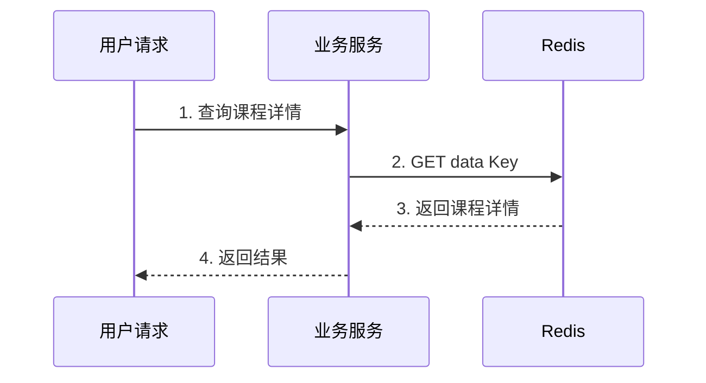
```mermaid
sequenceDiagram
    participant Client as 用户请求
    participant Service as 业务服务
    participant Redis as Redis

    Client->>Service: 1. 查询课程详情
    Service->>Redis: 2. GET data Key
    Redis-->>Service: 3. 返回课程详情
    Service-->>Client: 4. 返回结果
```

##### 3.1.4.2 缓存未命中并成功重建

缓存未命中后，仅获得短锁的请求负责查询 MySQL 和重建缓存。

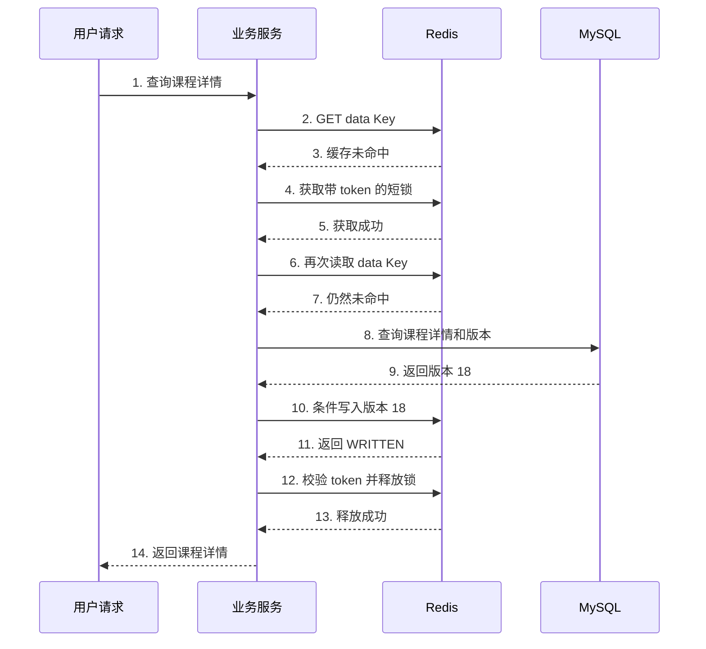
```mermaid
sequenceDiagram
    participant Client as 用户请求
    participant Service as 业务服务
    participant Redis as Redis
    participant MySQL as MySQL

    Client->>Service: 1. 查询课程详情
    Service->>Redis: 2. GET data Key
    Redis-->>Service: 3. 缓存未命中

    Service->>Redis: 4. 获取带 token 的短锁
    Redis-->>Service: 5. 获取成功

    Service->>Redis: 6. 再次读取 data Key
    Redis-->>Service: 7. 仍然未命中

    Service->>MySQL: 8. 查询课程详情和版本
    MySQL-->>Service: 9. 返回版本 18

    Service->>Redis: 10. 条件写入版本 18
    Redis-->>Service: 11. 返回 WRITTEN

    Service->>Redis: 12. 校验 token 并释放锁
    Redis-->>Service: 13. 释放成功

    Service-->>Client: 14. 返回课程详情
```

Redis 写回失败时，通常仍可返回 MySQL 查询结果，并记录缓存写入失败。

---

##### 3.1.4.3 更新课程并失效缓存

业务数据和 Outbox 在同一个事务提交，事务后再失效 Redis。

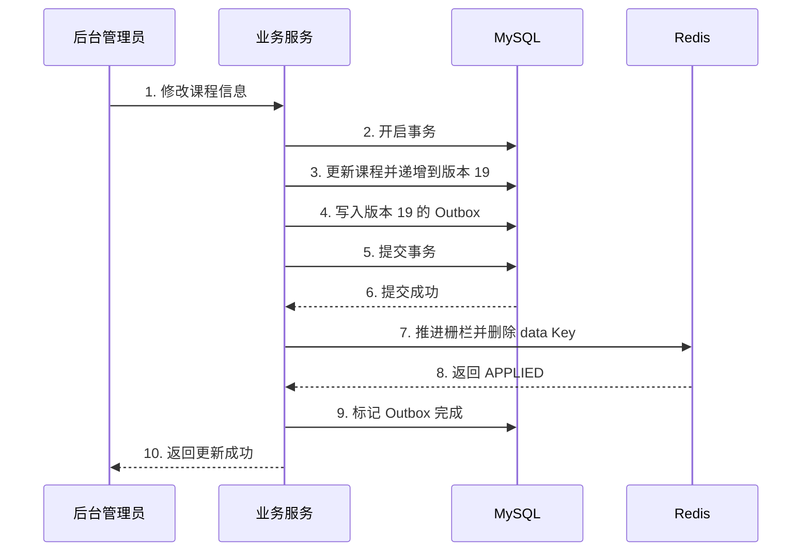
```mermaid
sequenceDiagram
    participant Admin as 后台管理员
    participant Service as 业务服务
    participant MySQL as MySQL
    participant Redis as Redis

    Admin->>Service: 1. 修改课程信息

    Service->>MySQL: 2. 开启事务
    Service->>MySQL: 3. 更新课程并递增到版本 19
    Service->>MySQL: 4. 写入版本 19 的 Outbox
    Service->>MySQL: 5. 提交事务
    MySQL-->>Service: 6. 提交成功

    Service->>Redis: 7. 推进栅栏并删除 data Key
    Redis-->>Service: 8. 返回 APPLIED

    Service->>MySQL: 9. 标记 Outbox 完成
    Service-->>Admin: 10. 返回更新成功
```

MySQL 提交成功后业务更新成立；Redis 失败由 Worker 补偿。

---

#### 3.1.5 核心异常路径

##### 3.1.5.1 热点课程并发缓存未命中

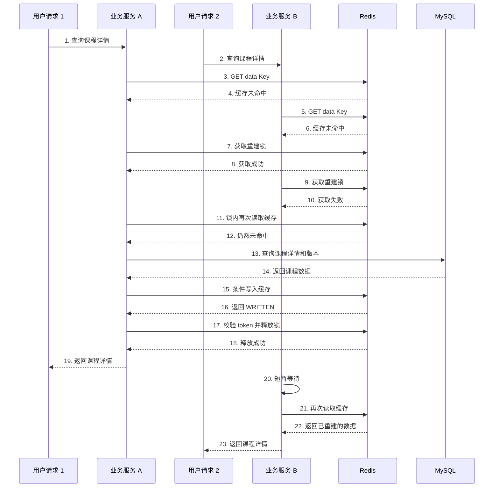
```mermaid
sequenceDiagram
    participant Client1 as 用户请求 1
    participant Service1 as 业务服务 A
    participant Client2 as 用户请求 2
    participant Service2 as 业务服务 B
    participant Redis as Redis
    participant MySQL as MySQL

    Client1->>Service1: 1. 查询课程详情
    Client2->>Service2: 2. 查询课程详情

    Service1->>Redis: 3. GET data Key
    Redis-->>Service1: 4. 缓存未命中

    Service2->>Redis: 5. GET data Key
    Redis-->>Service2: 6. 缓存未命中

    Service1->>Redis: 7. 获取重建锁
    Redis-->>Service1: 8. 获取成功

    Service2->>Redis: 9. 获取重建锁
    Redis-->>Service2: 10. 获取失败

    Service1->>Redis: 11. 锁内再次读取缓存
    Redis-->>Service1: 12. 仍然未命中

    Service1->>MySQL: 13. 查询课程详情和版本
    MySQL-->>Service1: 14. 返回课程数据

    Service1->>Redis: 15. 条件写入缓存
    Redis-->>Service1: 16. 返回 WRITTEN

    Service1->>Redis: 17. 校验 token 并释放锁
    Redis-->>Service1: 18. 释放成功
    Service1-->>Client1: 19. 返回课程详情

    Service2->>Service2: 20. 短暂等待
    Service2->>Redis: 21. 再次读取缓存
    Redis-->>Service2: 22. 返回已重建的数据
    Service2-->>Client2: 23. 返回课程详情
```

> **结论：**短锁只用于减少重复回源、保护 MySQL，不承担业务强一致职责。

---

##### 3.1.5.2 MySQL 已更新，但 Redis 失效失败

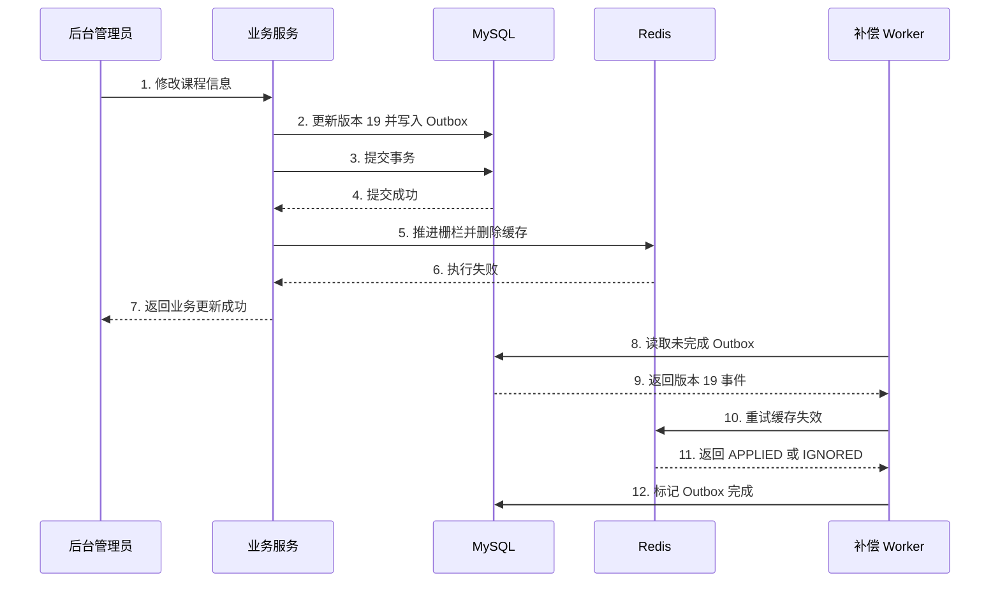
```mermaid
sequenceDiagram
    participant Admin as 后台管理员
    participant Service as 业务服务
    participant MySQL as MySQL
    participant Redis as Redis
    participant Worker as 补偿 Worker

    Admin->>Service: 1. 修改课程信息

    Service->>MySQL: 2. 更新版本 19 并写入 Outbox
    Service->>MySQL: 3. 提交事务
    MySQL-->>Service: 4. 提交成功

    Service->>Redis: 5. 推进栅栏并删除缓存
    Redis-->>Service: 6. 执行失败

    Service-->>Admin: 7. 返回业务更新成功

    Worker->>MySQL: 8. 读取未完成 Outbox
    MySQL-->>Worker: 9. 返回版本 19 事件

    Worker->>Redis: 10. 重试缓存失效
    Redis-->>Worker: 11. 返回 APPLIED 或 IGNORED

    Worker->>MySQL: 12. 标记 Outbox 完成
```

> **结论：**MySQL 提交成功即业务成功，Outbox Worker 负责后续缓存收敛。

---

##### 3.1.5.3 并发读写导致旧数据重新写回

版本栅栏拒绝旧读请求把版本 18 写回已经推进到版本 19 的缓存。

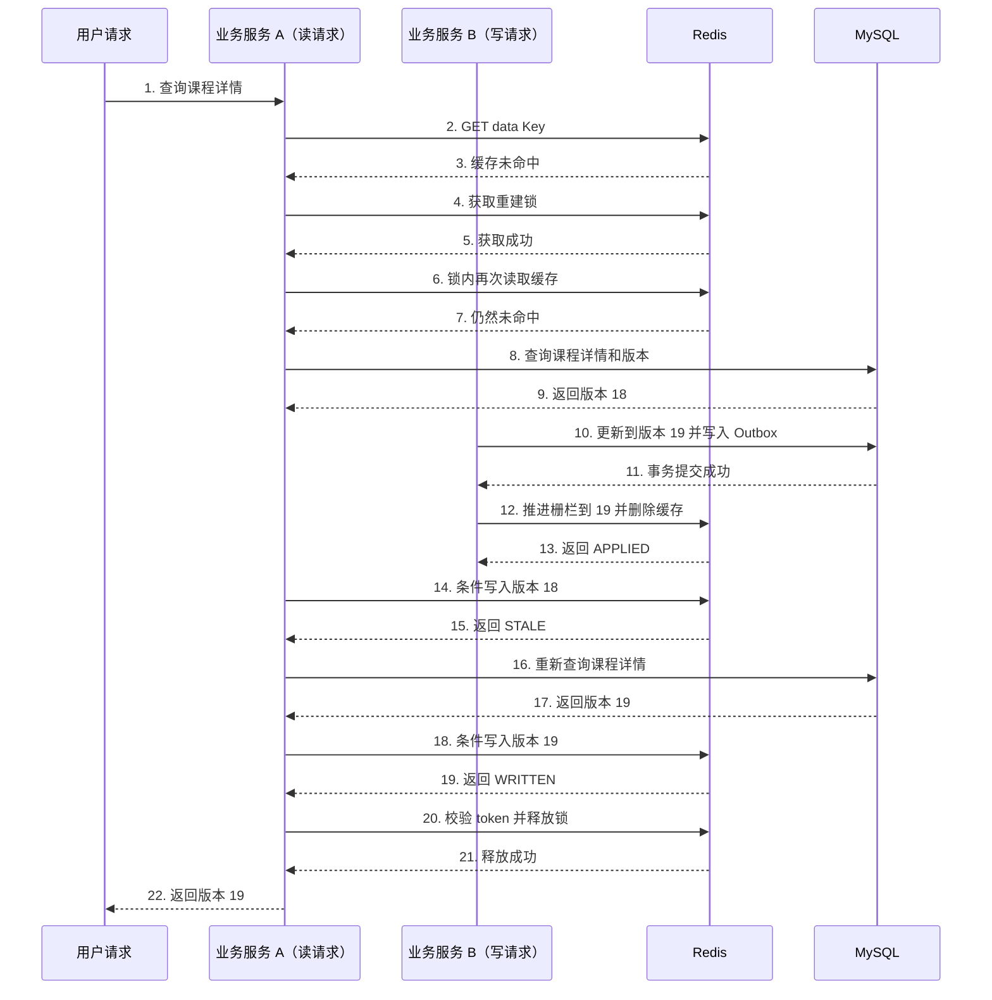
```mermaid
sequenceDiagram
    participant Client as 用户请求
    participant ReadService as 业务服务 A（读请求）
    participant WriteService as 业务服务 B（写请求）
    participant Redis as Redis
    participant MySQL as MySQL

    Client->>ReadService: 1. 查询课程详情

    ReadService->>Redis: 2. GET data Key
    Redis-->>ReadService: 3. 缓存未命中

    ReadService->>Redis: 4. 获取重建锁
    Redis-->>ReadService: 5. 获取成功

    ReadService->>Redis: 6. 锁内再次读取缓存
    Redis-->>ReadService: 7. 仍然未命中

    ReadService->>MySQL: 8. 查询课程详情和版本
    MySQL-->>ReadService: 9. 返回版本 18

    WriteService->>MySQL: 10. 更新到版本 19 并写入 Outbox
    MySQL-->>WriteService: 11. 事务提交成功

    WriteService->>Redis: 12. 推进栅栏到 19 并删除缓存
    Redis-->>WriteService: 13. 返回 APPLIED

    ReadService->>Redis: 14. 条件写入版本 18
    Redis-->>ReadService: 15. 返回 STALE

    ReadService->>MySQL: 16. 重新查询课程详情
    MySQL-->>ReadService: 17. 返回版本 19

    ReadService->>Redis: 18. 条件写入版本 19
    Redis-->>ReadService: 19. 返回 WRITTEN

    ReadService->>Redis: 20. 校验 token 并释放锁
    Redis-->>ReadService: 21. 释放成功

    ReadService-->>Client: 22. 返回版本 19
```

> **边界：**版本栅栏不能阻止已经完成的旧读，只能阻止旧缓存长期残留。

---

##### 3.1.5.4 Redis 不可用时受控回源

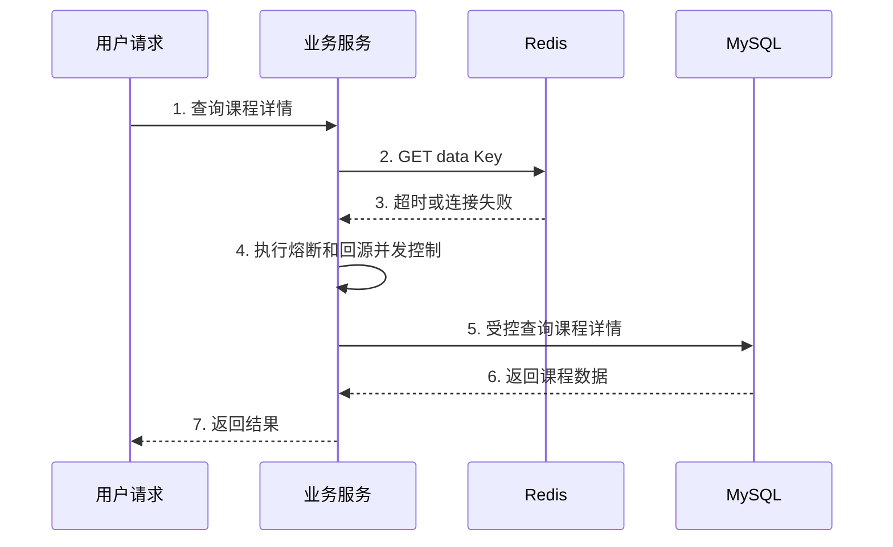
```mermaid
sequenceDiagram
    participant Client as 用户请求
    participant Service as 业务服务
    participant Redis as Redis
    participant MySQL as MySQL

    Client->>Service: 1. 查询课程详情

    Service->>Redis: 2. GET data Key
    Redis-->>Service: 3. 超时或连接失败

    Service->>Service: 4. 执行熔断和回源并发控制

    Service->>MySQL: 5. 受控查询课程详情
    MySQL-->>Service: 6. 返回课程数据

    Service-->>Client: 7. 返回结果
```

> **结论：**Redis 故障时必须限制 MySQL 回源并发，避免数据库雪崩。

---

#### 3.1.6 最终记忆

> **Cache Aside 由业务服务管理缓存；短锁防止并发回源，版本栅栏阻止旧值写回，Outbox 补偿缓存失效失败。**

---

### 3.2 Read Through（读穿透）

#### 3.2.1 定义与适用场景

> **Read Through 把 Redis 查询、缓存未命中、MySQL 回源和缓存写回统一封装在缓存组件中，业务服务只负责调用读取接口。**

适合多个业务模块重复读取同类数据，需要统一 Key、TTL、空值和并发治理的场景。

---

#### 3.2.2 三个核心规则

##### 3.2.2.1 统一读取入口

业务服务只调用缓存组件：

```ts
const course = await courseDetailCache.get(courseId);
```

Redis 查询、缓存未命中和 MySQL 回源都由缓存组件内部处理。

---

##### 3.2.2.2 Loader 结果语义

Loader 必须明确区分三种结果：

```text
FOUND：返回课程数据
NOT_FOUND：MySQL 明确确认课程不存在
ERROR：MySQL 超时、连接失败或 SQL 错误
```

只有 `NOT_FOUND` 可以写入短期空值；`ERROR` 必须向上抛出，不能转换成课程不存在。

---

##### 3.2.2.3 复用基础缓存治理

TTL、版本栅栏、缓存失效和 Redis 故障时的受控回源策略复用 3.1。

singleflight 可以合并同一实例内相同 Key 的 Loader 调用；多实例热点场景仍需要 Redis 短锁。

---

#### 3.2.3 正常路径

##### 3.2.3.1 Redis 命中

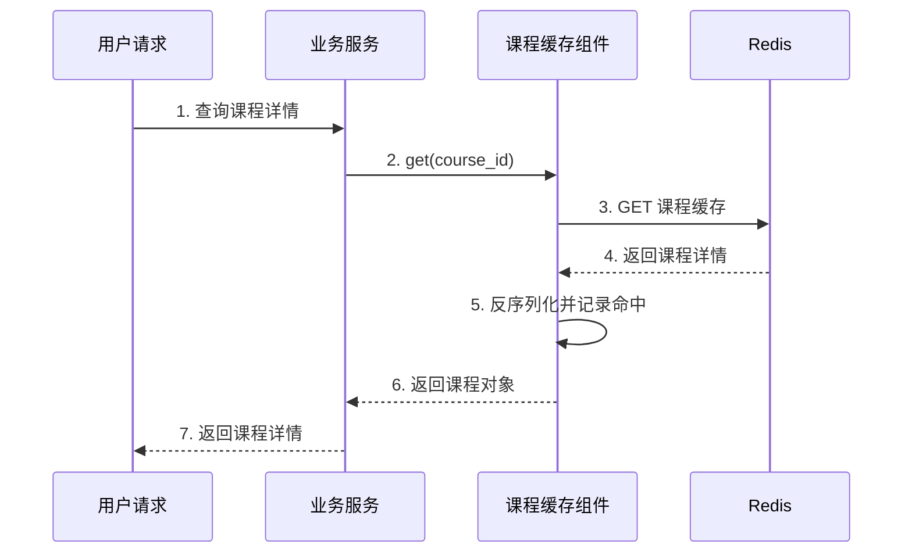
```mermaid
sequenceDiagram
    participant Client as 用户请求
    participant Service as 业务服务
    participant Cache as 课程缓存组件
    participant Redis as Redis

    Client->>Service: 1. 查询课程详情
    Service->>Cache: 2. get(course_id)
    Cache->>Redis: 3. GET 课程缓存
    Redis-->>Cache: 4. 返回课程详情
    Cache->>Cache: 5. 反序列化并记录命中
    Cache-->>Service: 6. 返回课程对象
    Service-->>Client: 7. 返回课程详情
```

> **结论：**缓存组件直接返回 Redis 数据，业务服务不感知缓存命中细节。

---

##### 3.2.3.2 Redis 未命中并成功回源

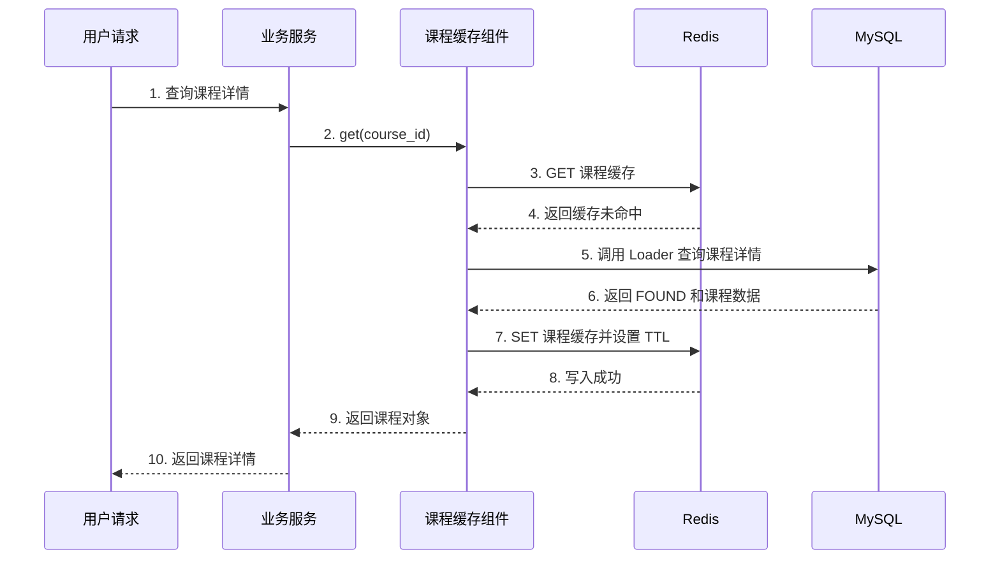
```mermaid
sequenceDiagram
    participant Client as 用户请求
    participant Service as 业务服务
    participant Cache as 课程缓存组件
    participant Redis as Redis
    participant MySQL as MySQL

    Client->>Service: 1. 查询课程详情
    Service->>Cache: 2. get(course_id)
    Cache->>Redis: 3. GET 课程缓存
    Redis-->>Cache: 4. 返回缓存未命中

    Cache->>MySQL: 5. 调用 Loader 查询课程详情
    MySQL-->>Cache: 6. 返回 FOUND 和课程数据

    Cache->>Redis: 7. SET 课程缓存并设置 TTL
    Redis-->>Cache: 8. 写入成功

    Cache-->>Service: 9. 返回课程对象
    Service-->>Client: 10. 返回课程详情
```

> **结论：**缓存组件内部调用 Loader 并写回 Redis；Redis 写回失败时通常仍返回 MySQL 结果。

---

##### 3.2.3.3 课程明确不存在

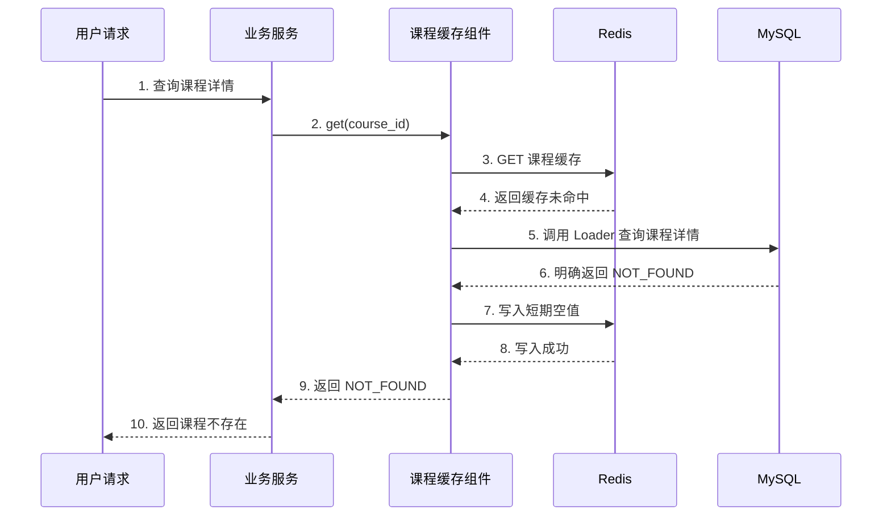
```mermaid
sequenceDiagram
    participant Client as 用户请求
    participant Service as 业务服务
    participant Cache as 课程缓存组件
    participant Redis as Redis
    participant MySQL as MySQL

    Client->>Service: 1. 查询课程详情
    Service->>Cache: 2. get(course_id)
    Cache->>Redis: 3. GET 课程缓存
    Redis-->>Cache: 4. 返回缓存未命中

    Cache->>MySQL: 5. 调用 Loader 查询课程详情
    MySQL-->>Cache: 6. 明确返回 NOT_FOUND

    Cache->>Redis: 7. 写入短期空值
    Redis-->>Cache: 8. 写入成功

    Cache-->>Service: 9. 返回 NOT_FOUND
    Service-->>Client: 10. 返回课程不存在
```

> **结论：**只有 Loader 明确返回 `NOT_FOUND` 时，缓存组件才写入短期空值。

---

#### 3.2.4 核心异常路径

##### 3.2.4.1 同一实例并发缓存未命中

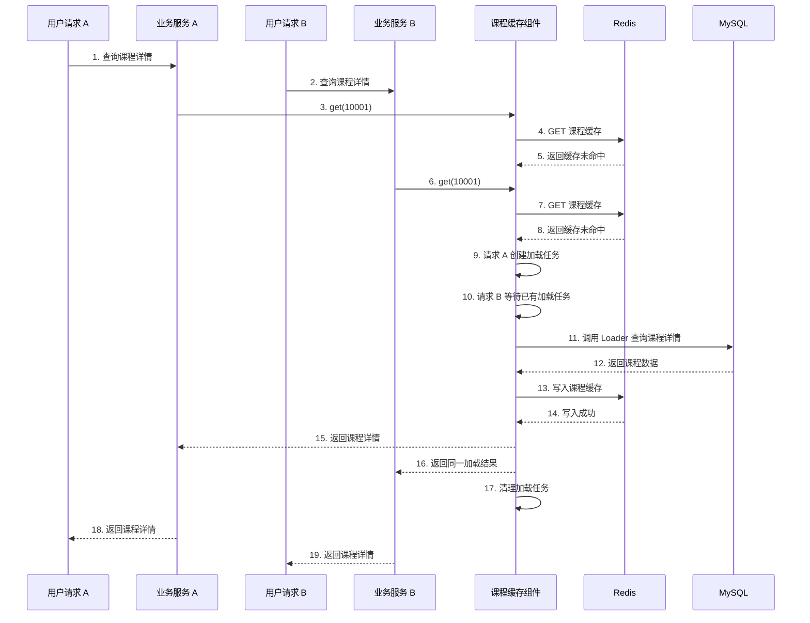
```mermaid
sequenceDiagram
    participant ClientA as 用户请求 A
    participant ServiceA as 业务服务 A
    participant ClientB as 用户请求 B
    participant ServiceB as 业务服务 B
    participant Cache as 课程缓存组件
    participant Redis as Redis
    participant MySQL as MySQL

    ClientA->>ServiceA: 1. 查询课程详情
    ClientB->>ServiceB: 2. 查询课程详情

    ServiceA->>Cache: 3. get(10001)
    Cache->>Redis: 4. GET 课程缓存
    Redis-->>Cache: 5. 返回缓存未命中

    ServiceB->>Cache: 6. get(10001)
    Cache->>Redis: 7. GET 课程缓存
    Redis-->>Cache: 8. 返回缓存未命中

    Cache->>Cache: 9. 请求 A 创建加载任务
    Cache->>Cache: 10. 请求 B 等待已有加载任务

    Cache->>MySQL: 11. 调用 Loader 查询课程详情
    MySQL-->>Cache: 12. 返回课程数据

    Cache->>Redis: 13. 写入课程缓存
    Redis-->>Cache: 14. 写入成功

    Cache-->>ServiceA: 15. 返回课程详情
    Cache-->>ServiceB: 16. 返回同一加载结果
    Cache->>Cache: 17. 清理加载任务

    ServiceA-->>ClientA: 18. 返回课程详情
    ServiceB-->>ClientB: 19. 返回课程详情
```

> **结论：**singleflight 只合并同一实例内的回源请求，多实例热点仍需要 Redis 短锁。

---

##### 3.2.4.2 Loader 查询失败

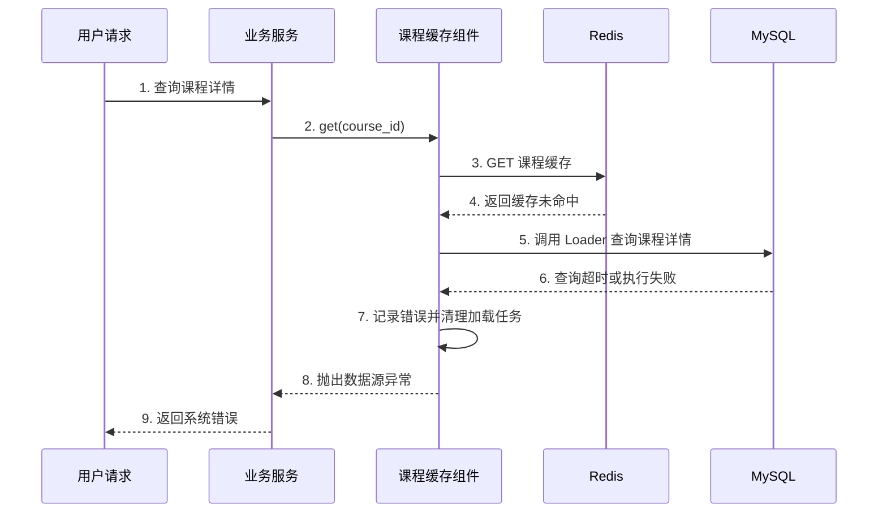
```mermaid
sequenceDiagram
    participant Client as 用户请求
    participant Service as 业务服务
    participant Cache as 课程缓存组件
    participant Redis as Redis
    participant MySQL as MySQL

    Client->>Service: 1. 查询课程详情
    Service->>Cache: 2. get(course_id)
    Cache->>Redis: 3. GET 课程缓存
    Redis-->>Cache: 4. 返回缓存未命中

    Cache->>MySQL: 5. 调用 Loader 查询课程详情
    MySQL-->>Cache: 6. 查询超时或执行失败

    Cache->>Cache: 7. 记录错误并清理加载任务
    Cache-->>Service: 8. 抛出数据源异常
    Service-->>Client: 9. 返回系统错误
```

> **结论：**Loader 失败时返回错误、不写入课程数据或空值，并清理加载任务供后续请求重试。

---

#### 3.2.5 最终记忆

> **Read Through 不改变底层读取顺序，只把缓存未命中、Loader 回源和写回责任统一交给缓存组件；只有 `NOT_FOUND` 可以缓存空值，singleflight 只在单实例内有效。**

### 3.3 Write Through 式同步双写（MySQL 优先）

#### 3.3.1 定义与适用场景

> **本节的 Write Through 式同步双写，是由统一写入层先提交 MySQL，再同步尝试更新 Redis；MySQL 提交成功后业务成立，Redis 失败由 Outbox 补偿。**

适合多个写入口需要统一维护同一份缓存，并希望数据更新后尽量立即准备新缓存的场景。

> **接口成功不代表 Redis 一定已经更新，也不表示 Redis 与 MySQL 形成了跨存储原子事务。**

---

#### 3.3.2 三个核心规则

##### 3.3.2.1 MySQL 决定业务结果

```text
MySQL 未提交：
    业务失败

MySQL 已提交：
    业务成功

Redis 同步失败：
    业务仍然成功，进入补偿
```

MySQL 是唯一事实源，不能因为 Redis 更新失败回滚已经提交的业务结果。

---

##### 3.3.2.2 三类幂等与版本机制

三类标识分别解决不同问题：

* `request_id`：防止客户端重试产生重复业务结果。
* `expected_version`：防止并发请求覆盖已经更新的 MySQL 数据。
* `data_version`：防止 Redis 低版本覆盖高版本。

相同 `request_id` 重试时返回第一次处理结果；`expected_version` 冲突时直接拒绝，二者都不能再次更新 Redis。

> **`expected_version` 解决 MySQL 业务并发，`data_version` 解决 Redis 同步乱序。**

---

##### 3.3.2.3 Redis 条件写入与 Outbox 补偿

MySQL 事务内：

```text
更新课程数据
+ 记录 request_id
+ 递增 data_version
+ 写入 Outbox
→ 提交事务
```

事务提交后：

```text
查询 MySQL 最新课程快照
→ 按 data_version 条件写入 Redis
→ 成功则完成 Outbox
→ 失败由 Worker 重试
```

Outbox 必须与业务数据在同一个 MySQL 事务中提交。

补偿 Worker 必须查询 MySQL 当前最新快照，再按 `data_version` 条件写入 Redis，不能直接使用可能已经过时的事件快照。

---

#### 3.3.3 正常路径

##### 3.3.3.1 MySQL 与 Redis 同步成功

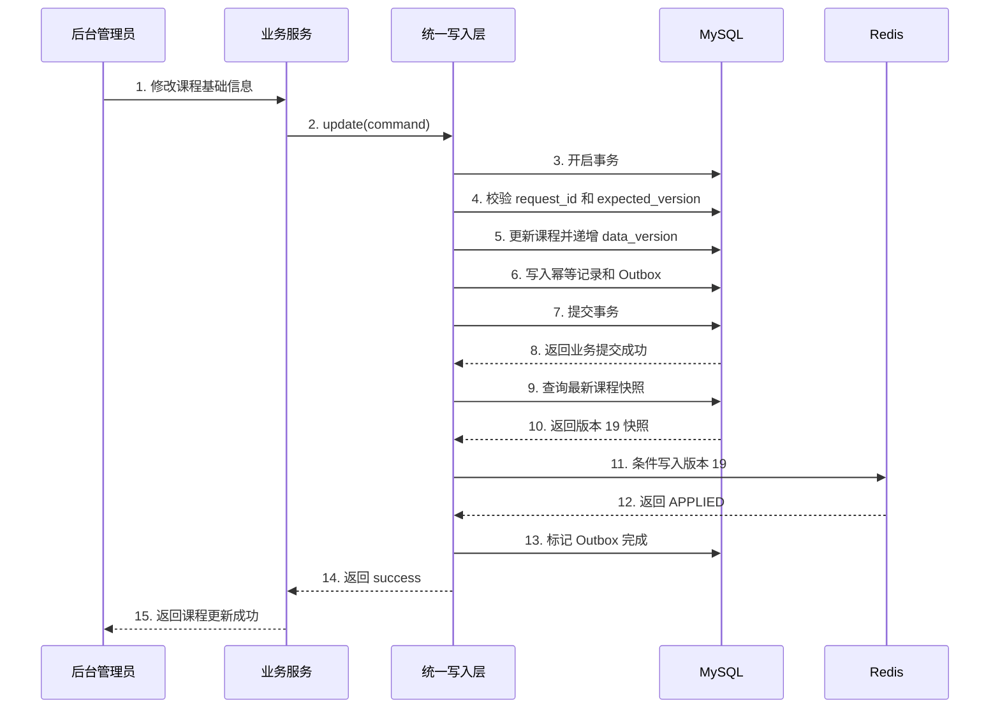
```mermaid
sequenceDiagram
    participant Admin as 后台管理员
    participant Service as 业务服务
    participant Store as 统一写入层
    participant MySQL as MySQL
    participant Redis as Redis

    Admin->>Service: 1. 修改课程基础信息
    Service->>Store: 2. update(command)

    Store->>MySQL: 3. 开启事务
    Store->>MySQL: 4. 校验 request_id 和 expected_version
    Store->>MySQL: 5. 更新课程并递增 data_version
    Store->>MySQL: 6. 写入幂等记录和 Outbox
    Store->>MySQL: 7. 提交事务
    MySQL-->>Store: 8. 返回业务提交成功

    Store->>MySQL: 9. 查询最新课程快照
    MySQL-->>Store: 10. 返回版本 19 快照

    Store->>Redis: 11. 条件写入版本 19
    Redis-->>Store: 12. 返回 APPLIED

    Store->>MySQL: 13. 标记 Outbox 完成
    Store-->>Service: 14. 返回 success
    Service-->>Admin: 15. 返回课程更新成功
```

> **结论：**MySQL 提交后业务成立，Redis 条件写入成功时缓存立即可用；后续读取仍由 Cache Aside 或 Read Through 决定。

---

#### 3.3.4 核心异常路径

##### 3.3.4.1 MySQL 更新失败

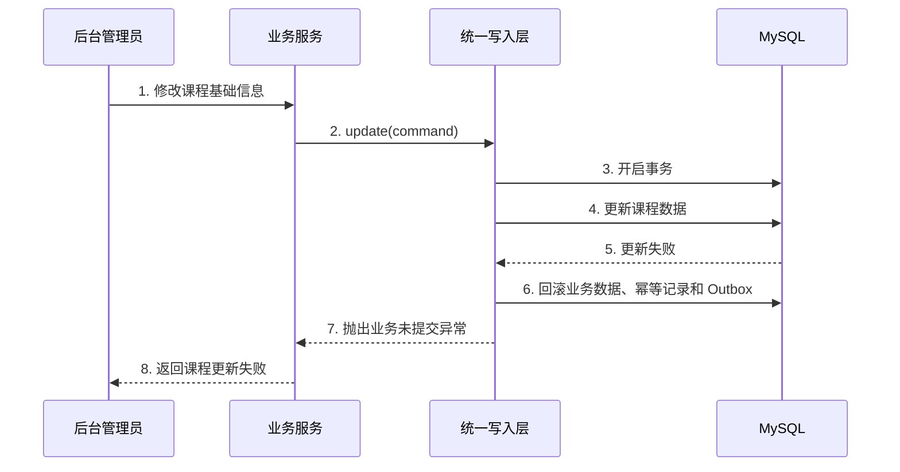
```mermaid
sequenceDiagram
    participant Admin as 后台管理员
    participant Service as 业务服务
    participant Store as 统一写入层
    participant MySQL as MySQL

    Admin->>Service: 1. 修改课程基础信息
    Service->>Store: 2. update(command)

    Store->>MySQL: 3. 开启事务
    Store->>MySQL: 4. 更新课程数据
    MySQL-->>Store: 5. 更新失败

    Store->>MySQL: 6. 回滚业务数据、幂等记录和 Outbox
    Store-->>Service: 7. 抛出业务未提交异常
    Service-->>Admin: 8. 返回课程更新失败
```

> **结论：**MySQL 未提交，Redis 不更新，也不产生后续补偿任务。

---

##### 3.3.4.2 MySQL 已提交，但 Redis 同步失败

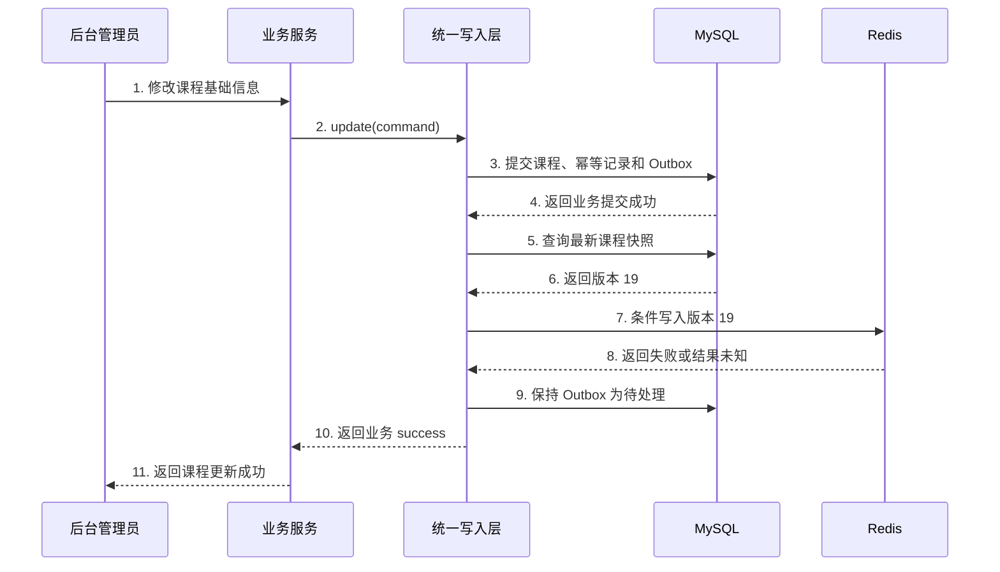
```mermaid
sequenceDiagram
    participant Admin as 后台管理员
    participant Service as 业务服务
    participant Store as 统一写入层
    participant MySQL as MySQL
    participant Redis as Redis

    Admin->>Service: 1. 修改课程基础信息
    Service->>Store: 2. update(command)

    Store->>MySQL: 3. 提交课程、幂等记录和 Outbox
    MySQL-->>Store: 4. 返回业务提交成功

    Store->>MySQL: 5. 查询最新课程快照
    MySQL-->>Store: 6. 返回版本 19

    Store->>Redis: 7. 条件写入版本 19
    Redis-->>Store: 8. 返回失败或结果未知

    Store->>MySQL: 9. 保持 Outbox 为待处理
    Store-->>Service: 10. 返回业务 success
    Service-->>Admin: 11. 返回课程更新成功
```

> **结论：**MySQL 已提交则业务成功，Outbox 保持待处理，由 Worker 查询最新快照后补偿 Redis。

---

##### 3.3.4.3 Worker 完成缓存补偿

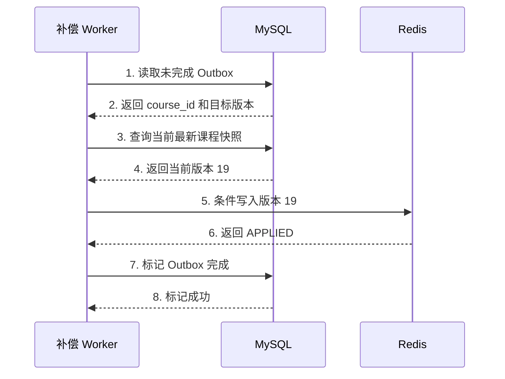
```mermaid
sequenceDiagram
    participant Worker as 补偿 Worker
    participant MySQL as MySQL
    participant Redis as Redis

    Worker->>MySQL: 1. 读取未完成 Outbox
    MySQL-->>Worker: 2. 返回 course_id 和目标版本

    Worker->>MySQL: 3. 查询当前最新课程快照
    MySQL-->>Worker: 4. 返回当前版本 19

    Worker->>Redis: 5. 条件写入版本 19
    Redis-->>Worker: 6. 返回 APPLIED

    Worker->>MySQL: 7. 标记 Outbox 完成
    MySQL-->>Worker: 8. 标记成功
```

> **结论：**Worker 以 MySQL 最新快照条件写入 Redis；成功或已被更高版本覆盖时完成 Outbox，执行失败时继续重试。

Redis 条件写入结果统一处理：

```text
APPLIED、IDEMPOTENT、STALE：
    结束当前 Outbox 事件

ERROR：
    保持待处理并退避重试
```

---

##### 3.3.4.4 Redis 同步请求乱序到达

```mermaid
sequenceDiagram
    participant StoreA as 统一写入层 A
    participant StoreB as 统一写入层 B
    participant Redis as Redis

    StoreB->>Redis: 1. 条件写入版本 20
    Redis-->>StoreB: 2. 返回 APPLIED

    StoreB->>StoreB: 3. 结束版本 20 同步任务

    StoreA->>Redis: 4. 延迟写入版本 19
    Redis-->>StoreA: 5. 当前版本为 20，返回 STALE

    StoreA->>StoreA: 6. 将版本 19 事件标记为已被高版本覆盖
```

> **结论：**`data_version` 条件写入阻止低版本覆盖高版本，缓存不会因网络到达顺序发生版本倒退。

---

#### 3.3.5 最终记忆

> **本节采用 MySQL 优先的同步双写：MySQL 提交决定业务结果，Redis 按 `data_version` 条件更新，失败由 Outbox Worker 补偿。**

### 3.4 Write Behind（异步回写）

#### 3.4.1 定义与适用场景

> **Write Behind 先把实时状态和待落库事件写入 Redis，前台不等待 MySQL；Worker 再异步、批量持久化，并在 MySQL 提交成功后执行 ACK。**

适合播放位置这类写入频繁、连续版本只关心最新状态，并允许延迟持久化的数据。

> **`accepted` 只表示 Redis 已接受实时状态和待落库事件，不代表 MySQL 已经提交。**

---

#### 3.4.2 四个核心规则

##### 3.4.2.1 前台原子接收与幂等

业务服务通过 Redis Lua 脚本或 Function 原子执行：

```text
校验请求
→ report_id 去重
→ 生成数据版本
→ XADD 待落库事件
→ 更新实时状态
→ 保存去重结果
```

端到端幂等使用：

```text
producer_id + report_id
```

必须遵守以下规则：

* 相同 `report_id`、相同 `request_hash`：返回第一次处理结果。
* 相同 `report_id`、不同 `request_hash`：拒绝请求。
* Redis 返回结果未知：使用相同的 `producer_id + report_id + request_hash` 重试。
* MySQL 对 `(producer_id, report_id)` 建立唯一约束，作为最终幂等保障。

脚本必须在首次写入前完成参数和 Key 类型校验。

> **Redis 原子执行只能保证没有其他命令穿插，不表示脚本报错后会自动回滚已经执行的写操作。**

---

##### 3.4.2.2 版本顺序与合并边界

Redis 实时状态、Stream 事件和 MySQL 统一使用：

```text
version_epoch + version_sequence
```

版本比较规则：

```text
先比较 version_epoch
→ epoch 相同再比较 version_sequence
```

灾难恢复或序列重新生成前，必须先在 MySQL 中持久化提升 `version_epoch`，再开放新的写入。

数据分为两类：

* 播放位置等覆盖型状态：可以只落库最高版本。
* 奖励、考试、计费、审计等独立事件：不能合并为最高版本。

MySQL 处理事件时，先根据 `producer_id + report_id` 去重，再比较完整版本；旧版本不更新状态，但可以视为已经处理。

---

##### 3.4.2.3 MySQL 提交后才能 ACK

Worker 的处理顺序：

```text
有限批量读取
→ 合并可覆盖状态
→ MySQL 幂等批量写入
→ MySQL 事务提交成功
→ XACK
```

MySQL 事务失败时不能执行 `XACK`，否则消息可能已经完成消费确认，但业务数据并未持久化。

---

##### 3.4.2.4 积压控制与 RPO 边界

MySQL 连续失败时，Worker 应暂停继续读取新消息，让 Stream lag 增长，而不是无限扩大 Pending。

消息只能在满足以下条件后清理：

```text
已经 ACK
+ 超过故障恢复窗口
```

Redis 保存的是尚未落库的数据，因此 Redis 故障可能造成明确的 RPO 损失。

> **成绩、余额、支付和库存等关键数据，不适合直接使用纯 Write Behind。**

---

#### 3.4.3 正常路径

##### 3.4.3.1 前台接受学习进度

```mermaid
sequenceDiagram
    participant Client as 播放器
    participant Service as 业务服务
    participant Redis as Redis

    Client->>Service: 1. 上报进度、producer_id、report_id 和 request_hash
    Service->>Service: 2. 校验用户、课程和请求参数

    Service->>Redis: 3. 执行进度写入脚本
    Redis->>Redis: 4. 预校验 Key 类型和请求字段
    Redis->>Redis: 5. 校验 report_id 或返回原结果
    Redis->>Redis: 6. 生成版本 2:128
    Redis->>Redis: 7. XADD 待落库事件
    Redis->>Redis: 8. 更新实时状态和去重结果
    Redis-->>Service: 9. 返回版本 2:128

    Service-->>Client: 10. 返回 accepted 和版本 2:128
```

> **结论：**`accepted` 只表示 Redis 已记录实时状态和待落库事件，MySQL 此时可能仍然是旧版本。

---

##### 3.4.3.2 Worker 批量落库并 ACK

```mermaid
sequenceDiagram
    participant Worker as 回写 Worker
    participant Redis as Redis Stream
    participant MySQL as MySQL

    Worker->>Worker: 1. 检查 MySQL 熔断状态
    Worker->>Redis: 2. XREADGROUP 读取有限批次
    Redis-->>Worker: 3. 返回事件并进入 Pending

    Worker->>Worker: 4. 合并可覆盖状态的最高版本
    Worker->>MySQL: 5. 开启事务并幂等批量写入
    MySQL-->>Worker: 6. 事务提交成功

    Worker->>Redis: 7. XACK 已持久化事件
    Redis-->>Worker: 8. 返回 ACK 数量

    Worker->>Worker: 9. 记录批次处理结果
```

> **结论：**Worker 只合并可覆盖状态，并且必须在 MySQL 提交成功后才能执行 `XACK`。

---

#### 3.4.4 核心异常路径

##### 3.4.4.1 MySQL 写入失败

```mermaid
sequenceDiagram
    participant Worker as 回写 Worker
    participant Redis as Redis Stream
    participant MySQL as MySQL

    Worker->>Redis: 1. XREADGROUP 读取有限批次
    Redis-->>Worker: 2. 事件进入 Pending

    Worker->>MySQL: 3. 幂等批量写入进度
    MySQL-->>Worker: 4. 事务失败并回滚

    Worker->>Worker: 5. 不执行 XACK
    Worker->>Worker: 6. 增加失败计数并退避
    Worker->>Worker: 7. 达到阈值后打开 MySQL 熔断器
```

> **结论：**MySQL 事务失败时不能 `XACK`，消息保留在 Pending，等待数据库恢复后重新处理。

---

##### 3.4.4.2 MySQL 已提交，但 ACK 前 Worker 崩溃

```mermaid
sequenceDiagram
    participant WorkerA as Worker A
    participant WorkerB as Worker B
    participant Redis as Redis Stream
    participant MySQL as MySQL

    WorkerA->>Redis: 1. XREADGROUP 读取事件
    Redis-->>WorkerA: 2. 事件进入 Pending

    WorkerA->>MySQL: 3. 按 report_id 幂等写入版本 2:128
    MySQL-->>WorkerA: 4. 事务提交成功

    WorkerA--xWorkerA: 5. ACK 前进程崩溃

    WorkerB->>Redis: 6. XAUTOCLAIM 接管超时事件
    Redis-->>WorkerB: 7. 返回事件

    WorkerB->>MySQL: 8. 按相同 report_id 再次写入版本 2:128
    MySQL-->>WorkerB: 9. 命中唯一约束并返回原结果

    WorkerB->>Redis: 10. XACK 事件
    Redis-->>WorkerB: 11. ACK 成功
```

> **结论：**事件可能被重复处理，MySQL 唯一约束保证不会产生第二次业务结果，接管 Worker 最终完成 `XACK`。

---

##### 3.4.4.3 MySQL 长时间不可用导致积压

```mermaid
sequenceDiagram
    participant Worker as 回写 Worker
    participant Redis as Redis Stream
    participant MySQL as MySQL
    participant Control as 流量控制

    Worker->>MySQL: 1. 当前在途批次写入
    MySQL-->>Worker: 2. 数据库持续不可用

    Worker->>Worker: 3. 打开 MySQL 熔断器
    Worker->>Worker: 4. 暂停读取新的 Stream 消息

    Worker->>Redis: 5. 查询 lag、Pending 和内存
    Redis-->>Worker: 6. 返回积压状态

    Worker->>Control: 7. 上报积压和容量风险
    Control->>Control: 8. 告警、扩容或限制新写入

    MySQL-->>Worker: 9. 数据库恢复
    Worker->>Worker: 10. 关闭熔断并恢复有限批量消费
```

> **结论：**MySQL 持续故障时暂停读取新消息，容量接近阈值时限制前台写入，数据库恢复后再逐步消费积压。

---

##### 3.4.4.4 Redis 故障导致未落库数据丢失

```mermaid
sequenceDiagram
    participant Client as 播放器
    participant Service as 业务服务
    participant Redis as Redis
    participant Worker as 回写 Worker
    participant MySQL as MySQL

    Client->>Service: 1. 上报学习进度
    Service->>Redis: 2. 写入实时状态和待落库事件
    Redis-->>Service: 3. 返回写入成功
    Service-->>Client: 4. 返回 accepted

    Redis--xRedis: 5. 数据可靠持久化前发生不可恢复故障

    Worker->>Redis: 6. 尝试读取待落库事件
    Redis-->>Worker: 7. 最新事件已经不存在

    Worker->>MySQL: 8. 查询持久化进度
    MySQL-->>Worker: 9. 只返回旧版本 2:127

    Worker->>Worker: 10. 记录不可自动恢复告警
    Worker->>Service: 11. 标记需要客户端重传

    Client->>Service: 12. 下次恢复时查询进度
    Service-->>Client: 13. 返回旧版本并请求使用原 report_id 重传
```

> **结论：**Redis 丢失尚未落库的事件时，服务端可能无法自动恢复，只能依赖客户端重传、其他副本或备份，这就是 Write Behind 的 RPO 代价。

---

#### 3.4.5 最终记忆

> **Write Behind 让前台只等待 Redis，Worker 在 MySQL 提交后才执行 `XACK`；它只适合可覆盖、可重放、允许延迟持久化并能接受明确 RPO 的状态数据。**


## 4. 横向对比

| 模式 | 主要解决路径 | 缓存治理者 | 长期权威数据 | 请求返回时 MySQL 是否最新 | 核心风险 | 典型场景 |
| --- | --- | --- | --- | --- | --- | --- |
| Cache Aside | 读为主，也定义更新后失效 | 业务服务 | MySQL | 是 | 击穿、失效失败、短暂旧数据 | 课程详情等读多写少数据 |
| Read Through | 读 | 缓存组件 | MySQL | 是 | 隐藏回源耗时、组件过度抽象 | 多个模块需要统一缓存治理 |
| Write Through 式同步双写（MySQL 优先） | 写 | 统一写入层 | MySQL | 是 | Redis 与 MySQL 部分成功、写延迟增加 | 多个写入口需要统一治理，并希望尽量同步准备缓存 |
| Write Behind | 写 | Redis + Worker | MySQL 保存长期结果，Redis 保存实时状态 | 不一定 | 未落库数据丢失、重复、乱序和积压 | 高频且允许延迟落库的覆盖型状态 |

## 5. 最终结论

**四种模式没有高低之分，应根据数据特点，在性能、一致性和工程复杂度之间选择满足当前需求的最简单方案。**
