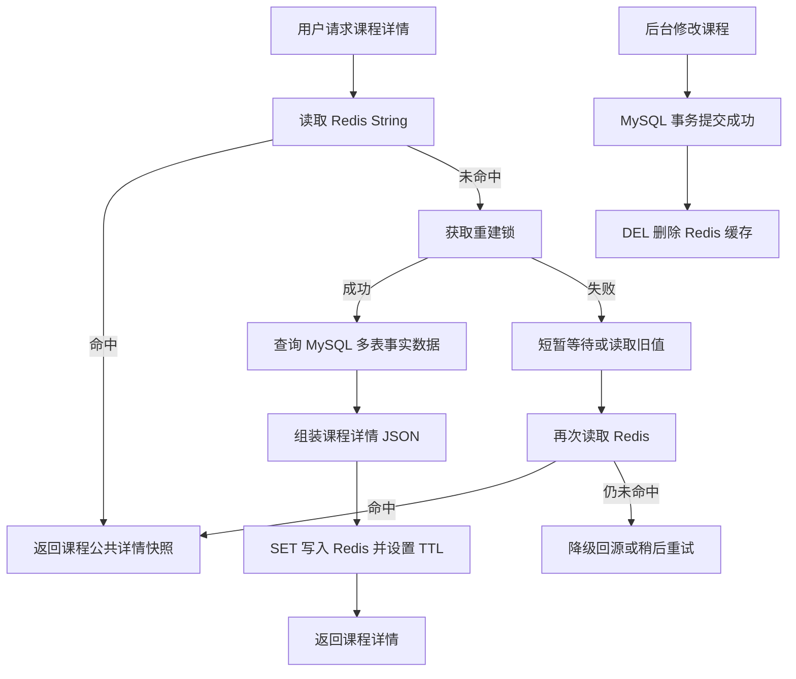
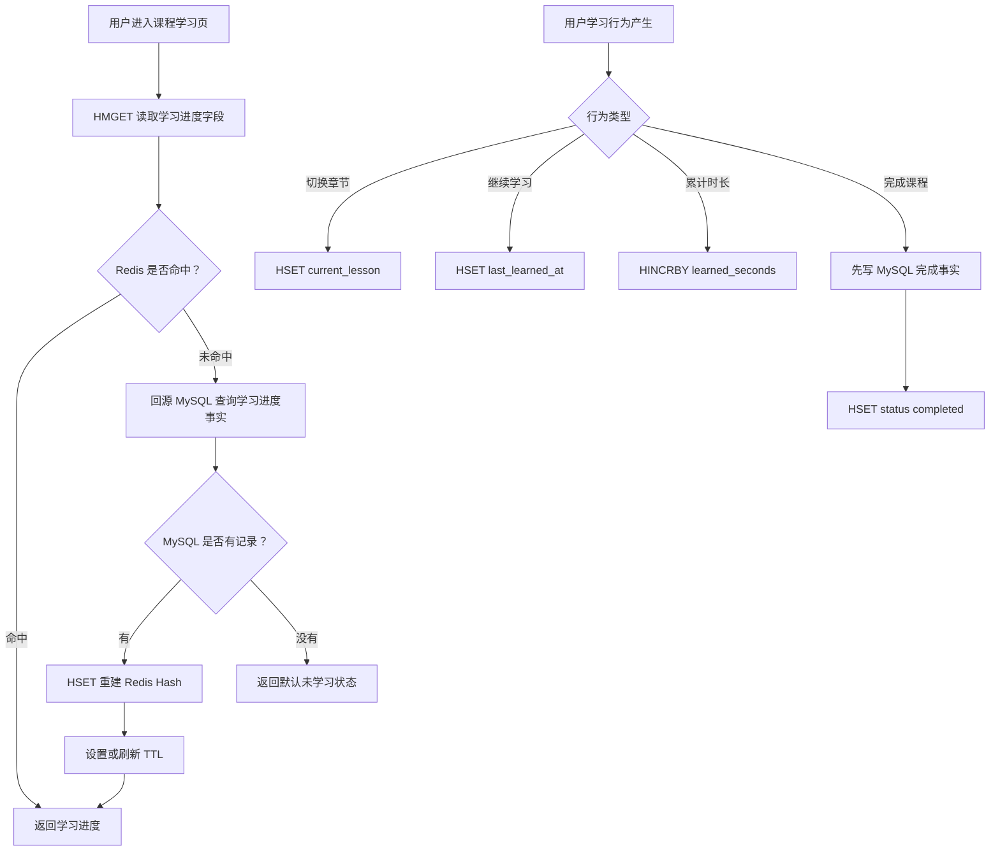
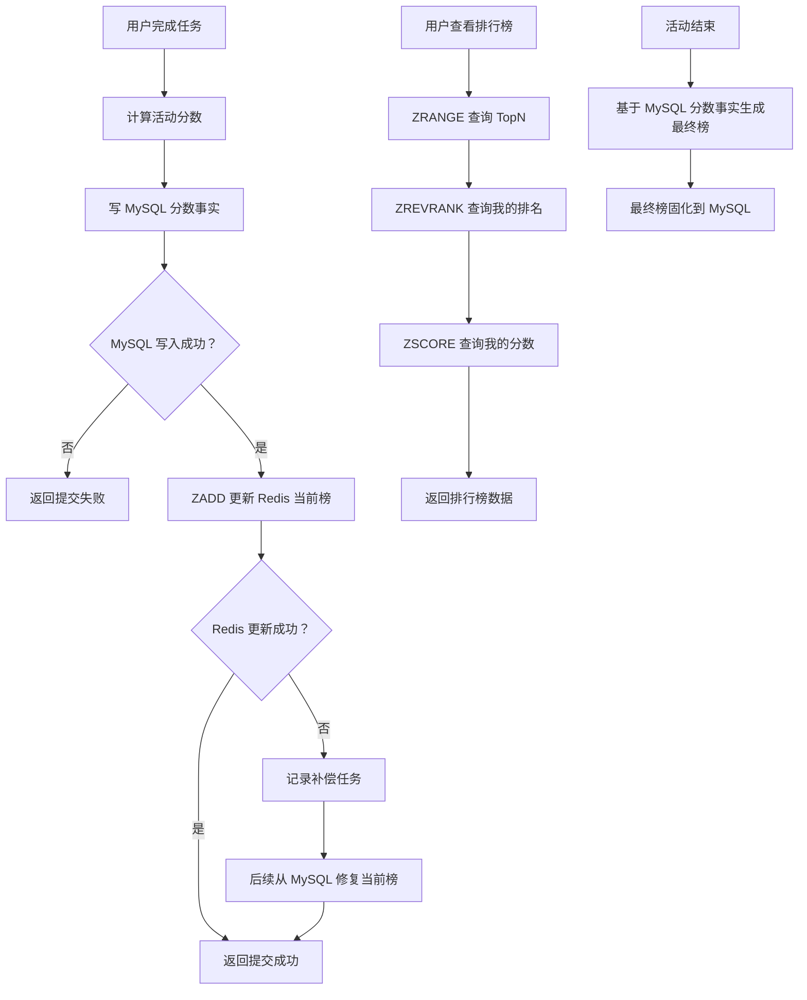
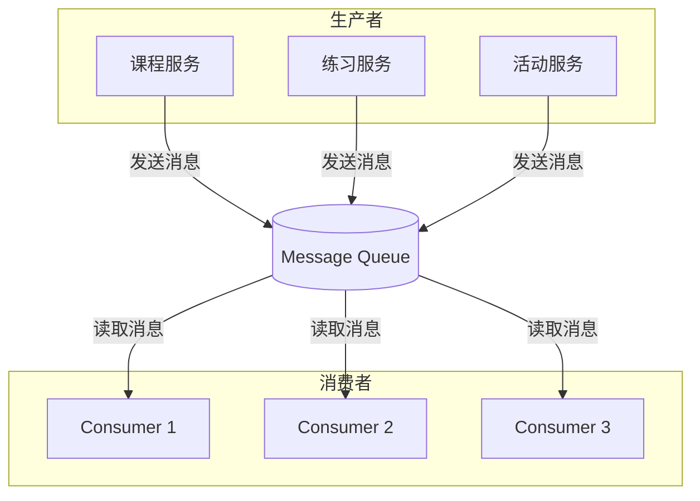
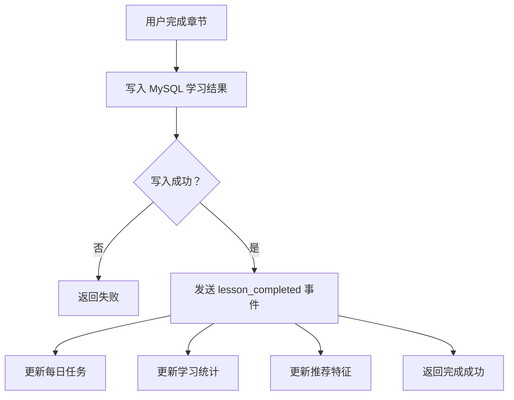
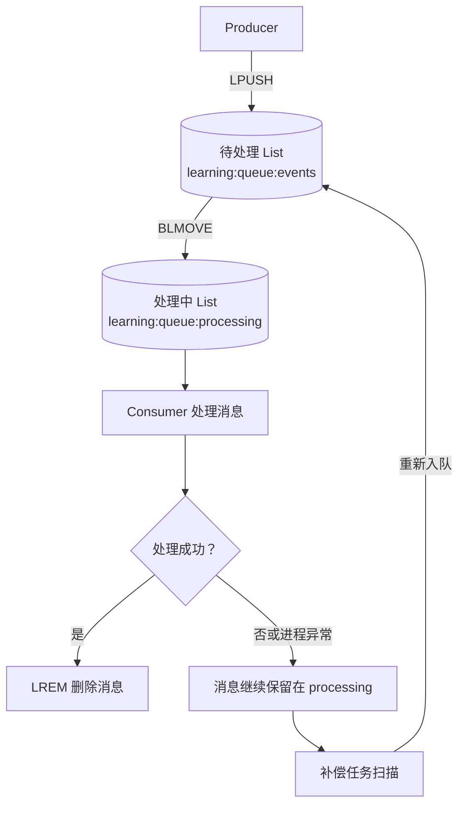
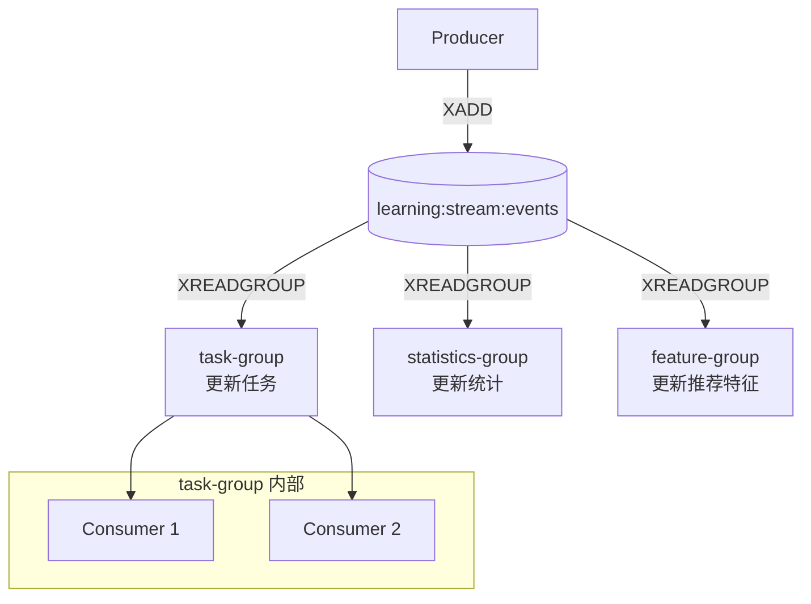
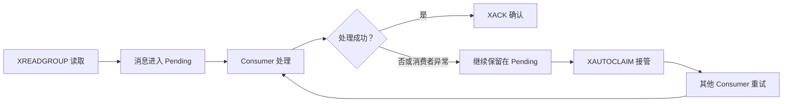

# 在线学习活动系统里的 Redis 实战选型

这次分享从在线学习活动系统出发，不讲 Redis 命令大全，只讲不同业务场景为什么选择对应的 Redis 能力。


---

## 1. 业务场景和 Redis 选择

| 业务功能    | Redis 选择    | 为什么选它                        |
| ------- | ----------- | ---------------------------- |
| 课程详情    | String      | 整体读取、整体返回，适合缓存完整快照           |
| 学习进度    | Hash        | 一个对象多个字段，适合局部更新              |
| 实时排行榜   | ZSET        | member + score，适合 TopN 和我的排名 |
| 签到 / 活跃 | Bitmap      | 只有是 / 否状态，适合海量压缩记录           |
| 每日任务    | Bitfields   | 多个小范围计数器，适合压缩存储              |
| 活动参与    | Set         | 判断是否参与、是否领取，适合去重             |
| 学习行为    | Stream      | 行为持续产生，适合异步消费                |
| 活动趋势    | Time series | 指标是时间戳 + 数值，适合看趋势            |

重点讲 4 个场景：

```text
1. 课程详情：String
2. 学习进度：Hash
3. 实时排行榜：ZSET
4. 学习行为异步处理：List 与 Stream
```

核心原则：

**MySQL 保事实，Redis 提性能；Redis 丢了要能重建，MySQL 丢了就是事故。**


---

## 2. 课程详情：String 怎么做完整快照缓存

### 2.1 核心判断

课程详情适合用 **Redis String 缓存完整 JSON 快照**。

原因不是“String 能存字符串”，而是课程详情通常符合：

```text
高频读取
整体返回
低频修改
可从 MySQL 重建
```

一句话：

**课程详情通常是整体查询、整体返回，适合提前组装好放进 Redis。**

---

### 2.2 业务问题

用户打开课程详情页时，后端可能需要查询：

```text
课程表
讲师表
章节表
价格表
上下架状态
活动配置
```

如果热门课程每次都直接查 MySQL 多表，再组装返回，会带来两个问题：

- MySQL 查询和服务端组装重复发生。
- 热门课程访问高峰时，详情接口容易变慢。

所以这里适合把课程公共详情提前缓存成一个完整快照。

---

### 2.3 Redis 设计

```text
key:
course:detail:{courseId}:v1

value:
课程公共详情 JSON 快照

示例：
{
  "courseId": 10001,
  "title": "Redis 后端实战课",
  "teacher": {...},
  "chapters": [...],
  "price": {...},
  "status": "online",
  "updatedAt": "2026-07-05T12:00:00"
}

TTL:
按课程修改频率和业务可接受旧数据时间设置

事实源:
MySQL 仍然保存课程、章节、价格、上下架等事实数据
```

注意：

**缓存里只放课程公共详情，不放用户是否已购买、是否有权限、学习进度这类用户个性化状态。**

---

### 2.4 核心流程



这个流程重点看 3 件事：

1. **读优先走 Redis**：命中后直接返回完整详情快照。
2. **miss 后回源 MySQL**：查询事实数据，重新组装快照。
3. **修改后删缓存**：MySQL 提交成功后删除 Redis，下次读取再重建。

---

### 2.5 为什么不用其他方案？

| 方案 | 为什么不是首选 |
|---|---|
| MySQL 直接查 | 热门课程高频访问时，多表查询和组装成本高 |
| Hash | Hash 适合字段级局部更新，但课程详情通常整体返回 |
| Redis JSON | 如果不需要按 JSON 路径局部修改，String 更简单 |
| 本地缓存 | 可以做热点兜底，但不适合作为主缓存方案 |

核心判断：

**整体读、整体返回、低频修改，用 String 更直接。**

---

### 2.6 最大风险和兜底

| 风险 | 兜底 |
|---|---|
| 热门课程缓存击穿 | 用重建锁或 singleflight，避免大量请求同时回源 MySQL |
| 后台修改后旧缓存未删除 | MySQL 提交成功后再删除 Redis，删除失败进入补偿 |
| 课程详情 JSON 过大 | 只缓存高频展示字段，避免大 Key |
| 公共缓存混入用户状态 | 公共详情和用户个性化状态分开查询 |

补充说明：

**热门课程缓存击穿**：某个访问量很高的课程缓存刚好失效，大量用户请求同时打到 MySQL，导致数据库压力瞬间升高。

**重建锁**：缓存失效后，只允许一个请求去查 MySQL 并重建缓存，其他请求先等一下，避免大家一起打数据库。

**singleflight**：同一时间相同的查询请求只执行一次，其他相同请求共享这一次查询结果，避免重复回源。

---

### 2.7 技术点小结：缓存击穿怎么兜底

热门课程缓存失效时，核心目标不是“每个请求都去重建缓存”，而是：

```text
只让少量请求回源 MySQL
其他请求等待、复用结果或读取旧值
```

常见做法：

| 做法           | 作用                        |
| ------------ | ------------------------- |
| 重建锁          | 控制跨服务实例并发，避免多台机器一起查 MySQL |
| singleflight | 合并单个服务进程内的重复请求，避免本机重复回源   |
| 短暂等待后重读缓存    | 没抢到锁的请求等一会儿，再读别人重建好的缓存    |
| 读取旧值 / 降级    | 极端情况下保护 MySQL，优先保证系统不被打崩  |

关键实现：

**重建锁**： 
SET lock:course:detail:1001 random_token NX EX 5


**signleflight**: 
用一个 Map 记录正在执行的查询。
如果相同 key 的查询已经在执行，后面的请求直接等待同一个 Promise。


一句话总结：

**缓存击穿兜底的核心，是让“高并发回源”变成“少量请求重建缓存，其他请求复用结果”。**

---

### 2.8 怎么选择

- 先保证业务正确性和事实源。
- 再根据访问量、热点程度、查询成本，决定要不要加缓存。
- 只有缓存 miss 会造成并发回源风险时，才需要重建锁 / singleflight。

---

### 2.9 本节记忆点

**String 适合课程详情，不是因为它能存 JSON，而是因为课程详情是高频读取、整体返回、低频修改、可重建的完整读模型。**

---

## 3. 学习进度：Hash 怎么做对象字段状态缓存

### 3.1 核心判断

学习进度适合用 **Redis Hash** 保存对象字段状态。

原因是学习进度天然是：

```text
一个用户
一门课程
多个进度字段
频繁局部更新
```

一句话：

**Hash 适合缓存“一个对象下多个字段”，尤其适合学习进度这种局部更新场景。**

---

### 3.2 业务问题

用户进入课程学习页时，后端需要快速知道：

```text
当前学到哪一节
课程是否完成
最近学习时间
累计学习时长
已完成小节数
```

如果每次都查 MySQL，学习页访问压力会变大。

如果用 String 存完整 JSON，每次只改一个字段也要重写整个对象。

所以这里更适合用 Hash 保存字段状态。

---

### 3.3 Redis 设计

```text
key:
user:course:progress:{userId}:{courseId}

type:
Hash

fields:
current_lesson（章）
status
last_learned_at
learned_seconds
completed_lessons

示例：

```json
{
  "currentLesson": "lesson_3",
  "status": "learning",
  "lastLearnedAt": "2026-07-05T12:00:00Z",
  "learnedSeconds": 3600,
  "completedLessons": 8
}
```

TTL:
活跃学习中的进度可以设置较长 TTL，并在更新时刷新

事实源:
MySQL 保存最终学习结果、完成记录等关键事实


注意：

**Redis Hash 只做过程状态加速，不做最终学习结果事实源。**

**Hashes 的核心特点不是“能存很多数据”，而是它适合表达字段相对稳定的对象状态，并支持按字段读取和更新。**

---

### 3.4 核心流程



这个流程重点看 3 件事：

1. **读进度走 Hash**：常用 `HMGET` 一次读多个字段。
2. **过程状态局部更新**：常用 `HSET` / `HINCRBY` 更新指定字段。
3. **最终结果落 MySQL**：完成课程、积分、证书不能只放 Redis。

---

### 3.5 为什么不用其他方案？

| 方案 | 为什么不是首选 |
|---|---|
| String | 每次只改一个字段也要重写完整 JSON |
| MySQL 直接查 | 学习页高频读取时，数据库压力较大 |
| Redis JSON | 如果进度字段简单，没有必要引入更复杂结构 |

核心判断：

**String 适合完整快照，Hash 适合对象字段局部更新。**

---

### 3.6 最大风险和兜底

| 风险 | 兜底 |
|---|---|
| 把最终学习结果只放 Redis | 最终完成记录、时常必须落 MySQL |
| Hash 字段无限增长 | 只放稳定字段 |
| 滥用 HGETALL | 高频读取用 HMGET，只取必要字段 |
| Redis 和 MySQL 不一致 | MySQL 是事实源，Redis miss 后可回源重建 |

---

### 3.7 和 Redis JSON 的区别

Hash 和 JSON 都能表达“对象”，但适合的对象不一样。

| 对比点  | Hash           | Redis JSON         |
| ---- | -------------- | ------------------ |
| 数据结构 | 扁平字段           | 层级结构               |
| 适合场景 | 学习进度、会话状态、活动状态 | 页面配置、活动规则、复杂结构化对象  |
| 更新方式 | 更新某个字段         | 按 JSON 路径更新某个节点    |
| 可读性  | 字段简单清楚         | 结构更完整，但也更复杂        |
| 主要风险 | 字段无限增长、大 Hash  | 大 JSON、层级过深、路径维护复杂 |

例如一个课程页或活动页有一份配置：

```json
{
  "layout": {
    "banner": {
      "title": "暑期活动",
      "image": "banner.png"
    },
    "modules": ["intro", "lessons", "reward"]
  },
  "rules": {
    "reward": {
      "enabled": true,
      "points": 100
    }
  },
  "gray": {
    "enabled": true,
    "userGroup": "A"
  }
}
```

并且需要按路径读取或修改其中一部分，才更适合考虑 Redis JSON。

**读**：JSON.get newbike $.layout.banner.image
**写**：JSON.set newbike $.layout.banner.image '"abc.png"'

一句话：

**字段简单、更新明确，用 Hash；结构复杂、层级明显、需要路径级读写，再考虑 Redis JSON。**

---

### 3.8 本节记忆点

**Hash 适合学习进度，不是因为它能存对象，而是因为学习进度是一个对象多个字段，并且经常只更新其中几个字段。**

---

## 4. 实时排行榜：ZSET 怎么做当前榜

### 4.1 核心判断

实时排行榜适合用 **Redis Sorted Set / ZSET**。

原因是排行榜天然就是：

```text
member = 用户 ID
score = 活动分数
排序 = 按 score 从高到低
```

一句话：

**ZSET 适合当前榜查询，MySQL 负责分数事实（必须）和最终榜（待定？）。**

---

### 4.2 业务问题

在线学习活动中，用户完成任务后获得积分，活动页需要展示：

```text
TopN 排行榜
我的当前排名
我的当前分数
参与排行榜人数
```

如果每次都用 MySQL 实时排序，活动高峰时查询压力会比较大。

所以这里适合用 ZSET 承接高频排行榜读取。

---

### 4.3 Redis 设计

```text
key:
activity:leaderboard:{activityId}

type:
Sorted Set

member:
userId

score:
activityScore
```

常用命令：

```text
ZADD activity:leaderboard:{activityId} {score} {userId}
ZRANGE activity:leaderboard:{activityId} 0 99 REV WITHSCORES
ZREVRANK activity:leaderboard:{activityId} {userId}
ZSCORE activity:leaderboard:{activityId} {userId}
```

注意：

**ZSET 只做活动进行中的当前榜，不做最终结算依据。**
**ZREVRANK 时间复杂度是O(log(n)+m)， n是元素数量， m是返回结果的数量**
**实现说明**：有序集合是通过包含**跳跃表**和**哈希表**的双端口数据结构实现的，因此每次添加元素时，Redis 都会执行 O(log(N)) 的操作

---

### 4.4 核心流程



这个流程重点看 3 件事：

1. **先写事实，再更新 Redis**：分数影响奖励时，MySQL 分数事实优先。
2. **Redis 承接当前榜查询**：TopN、我的排名、我的分数走 ZSET。
3. **最终榜必须固化**：活动结束后，最终榜和奖励结算不能只依赖 Redis。

补充说明：

**补偿任务**：指 MySQL 分数已经写成功，但 Redis 当前榜更新失败时，记录一条异步修复任务；后续 Worker 根据 MySQL 最新分数重新 `ZADD` 到 Redis，保证当前榜最终恢复正确。

一句话：

**MySQL 负责保存真实分数，Redis 当前榜写失败后，可以从 MySQL 再补回来。**


---

### 4.5 为什么不用其他方案？

| 方案 | 为什么不是首选 |
|---|---|
| MySQL 实时排序 | 高频 TopN 和我的排名查询压力较大 |
| Set | 只能去重，不能按分数排序 |
| Hash | 适合对象字段，不适合排名查询 |
| List | 适合顺序列表，不适合按 score 动态排序 |

核心判断：

**只要核心问题是 member + score + 排序查询，ZSET 就是最匹配的 Redis 结构。**

---

### 4.6 最大风险和兜底

| 风险 | 兜底 |
|---|---|
| 只靠 Redis 做最终榜 | 分数事实、最终榜、奖励结算必须落 MySQL |
| Redis 和 MySQL 不一致 | 先写 MySQL，再写 Redis；失败记录补偿任务 |
| 大 ZSET / 深分页 | 限制页数，优先 TopN + 我的排名 + 附近排名 |
| 热榜 key | TopN 做短 TTL 缓存、本地缓存或接口限流 |

补充说明
**大 ZSET**：排行榜成员过多，带来内存、重建和维护成本。
**深分页**：查询很靠后的页码，业务价值低，还会放大接口和查询压力。

---

### 4.7 为什么最终榜不能只用 ZSET

一句话：

**ZSET 是当前榜的性能视图，不是可审计、可结算、可追溯的最终事实源。**

换种描述：

**redis zset 会写入失败，就算采用补偿机制，还是会有失败的可能**

补充说明：

最终榜生成时，如果参与人数很大，直接基于 MySQL 全量排序可能有性能压力。

更稳的做法是：

```text
中小规模：MySQL 按分数事实排序，批量写入最终榜。
大规模：后台 Worker 异步分批结算，避免一次性大排序和大事务。
```

所以最终榜更稳的设计是：

```text
Redis 当前榜 = 快速展示
MySQL 分数事实 = 真实依据
MySQL 最终榜 = 固化结果
```

一句话总结：

**Redis ZSET 负责当前榜快，MySQL 分数事实负责最终榜准；规模大时，用异步分批结算解决性能问题。**

---

### 4.8 本节记忆点

**ZSET 适合做实时当前榜，但最终榜、奖励结算、分数追溯必须回到 MySQL。**

排行榜设计的重点不是会不会用 `ZADD / ZRANGE / ZREVRANK`，而是要分清：

```text
Redis 当前榜 = 快速展示
MySQL 分数事实 = 可追溯
MySQL 最终榜 = 可结算
```

## 5. 学习行为异步处理：Redis List 与 Stream 怎么选

### 5.1 核心判断

用户完成章节后，任务、统计、推荐等后置逻辑适合异步处理。

```text
简单工作队列：使用 List
需要消费组、ACK、Pending、失败接管：使用 Stream
```

当前学习行为场景选择 **Stream**，但学习结果、积分、奖励等关键事实仍然保存在 MySQL。

补充说明：

**消费组**：多个消费者组成一个小组一起处理同一个队列里的消息，每条消息通常只会分给组内某一个消费者处理。

举例：用户完成章节后，系统发出一条 `lesson_completed` 消息。如果有一个消费组叫 `task-group`，组里有 3 个消费者实例（C1、C2、C3）都在更新每日任务：

```text
消息 A（用户 1001 完成章节）→ 分给 C1 处理
消息 B（用户 1002 完成章节）→ 分给 C2 处理
消息 C（用户 1003 完成章节）→ 分给 C3 处理
```

同一条消息不会被 C1、C2、C3 同时各处理一遍；组内是**竞争消费、分摊负载**。  
如果任务、统计、推荐都要各自处理同一条学习行为，就应建**多个独立消费组**，而不是把它们塞进同一个消费组。

**ACK**：消费者处理完消息后，主动告诉消息队列“这条消息我处理成功了，可以标记完成”。

**Pending**：消息已经被某个消费者拿走了，但还没有 ACK，所以处于“处理中但未确认完成”的状态。

**失败接管**：如果某个消费者拿了消息后挂了或一直不 ACK，其他消费者可以把这批未完成消息接过来继续处理。


---

### 5.2 通用消息队列与学习行为场景

#### 5.2.1 通用消息队列



消息队列主要解决：

```text
异步：主接口不等待后置任务完成
解耦：生产者不直接调用每个消费者
削峰：高峰消息先排队，再逐步处理
恢复：处理失败后可以重新消费
```

---

#### 5.2.2 在线学习业务场景



**MySQL 保存关键学习事实，消息队列只负责触发后置处理。**

---

### 5.3 Redis List 实现简单队列

#### 5.3.1 生产、消费与失败恢复



核心命令：

```redis
LPUSH learning:queue:events "{message}"

BLMOVE learning:queue:events learning:queue:processing RIGHT LEFT 5

LREM learning:queue:processing 1 "{message}"
```

执行过程：

```text
LPUSH：把消息写入待处理 List 左侧
BLMOVE：从右侧取出最早消息，并原子移动到 processing
LREM：业务处理成功后删除 processing 中的消息
```

`BLMOVE` 可以阻塞等待，并把元素从一个 List 原子移动到另一个 List。
参考：[Redis 官方 BLMOVE 文档](https://redis.io/docs/latest/commands/blmove/)

#### 5.3.2 List 的边界

直接使用 `BRPOP` 时，消息被取出后如果消费者崩溃，消息可能丢失。

使用 `BLMOVE` 可以把消息暂存在 processing List，但下面这些能力仍然需要应用层实现：

```text
处理成功确认
超时消息扫描
失败重试次数
死信处理： 消息多次重试仍失败后，将其转入独立存储，等待人工排查或后续补偿。
多个业务独立消费
```

**List 适合只有一个处理目的、可靠性要求不复杂的简单工作队列。**

---

### 5.4 Redis Stream 实现可靠事件流

#### 5.4.1 多个消费组独立消费



不同消费组可以独立处理同一条消息。

同一消费组内，多个 Consumer 竞争处理消息，一条消息只分配给其中一个 Consumer。

---

#### 5.4.2 ACK、Pending 与失败接管



核心命令：

```redis
XADD learning:stream:events * event_id evt_10001 event_type lesson_completed

XREADGROUP GROUP learning-task-group consumer-1 \
  COUNT 10 BLOCK 5000 \
  STREAMS learning:stream:events >

XACK learning:stream:events learning-task-group {message_id}

XAUTOCLAIM learning:stream:events learning-task-group \
  consumer-2 60000 0-0 COUNT 10
```

```text
XREADGROUP：读取消息并记录到 Pending
XACK：确认当前消费组已经处理完成
XAUTOCLAIM：接管长时间未确认的消息
```

参考：

* [Redis 官方 XREADGROUP 文档](https://redis.io/docs/latest/commands/xreadgroup/)
* [Redis 官方 XACK 文档](https://redis.io/docs/latest/commands/xack/)
* [Redis 官方 XAUTOCLAIM 文档](https://redis.io/docs/latest/commands/xautoclaim/)

#### 5.4.3 ACK 后的消息清理

`XACK` 只会移除当前消费组的 Pending 记录，不会删除 Stream 中的消息本体。

Redis 8.8.0 可以在所有消费组都确认后删除消息：

```redis
XACKDEL learning:stream:events learning-task-group \
  ACKED IDS 1 {message_id}
```

也可以定期裁剪已经被所有消费组确认的旧消息：

```redis
XTRIM learning:stream:events MAXLEN ~ 100000 ACKED
```

参考：

* [Redis 官方 XACKDEL 文档](https://redis.io/docs/latest/commands/xackdel/)
* [Redis 官方 XTRIM 文档](https://redis.io/docs/latest/commands/xtrim/)

#### 5.4.4 Stream 的边界

| 场景           | 处理方式                      |
| ------------ | ------------------------- |
| 消费者读取后崩溃     | 消息继续保留在 Pending           |
| 长时间未确认       | 使用 `XAUTOCLAIM` 接管        |
| 消费成功但 ACK 失败 | 消息可能重复处理，消费者必须幂等          |
| Stream 持续增长  | 使用 `XACKDEL` 或 `XTRIM` 清理 |

**Stream 提供消费组、ACK、Pending 和失败接管，但不自动保证业务只执行一次。**

---

### 5.5 List 与 Stream 核心对比及选型

| 对比项     | Redis List         | Redis Stream |
| ------- | ------------------ | ------------ |
| 基本模型    | 简单工作队列             | 带消息 ID 的事件流  |
| 消费组     | 不支持                | 原生支持         |
| ACK     | 应用层实现              | 原生支持 `XACK`  |
| Pending | processing List 模拟 | 原生支持         |
| 失败接管    | 自行扫描并重新入队          | `XAUTOCLAIM` |
| 多业务消费   | 复制多个 List          | 创建多个消费组      |
| 适合场景    | 简单一次性任务            | 需要可靠消费的事件流   |

顺序边界：

**List 和 Stream 都可以按消息进入顺序读取，但多个消费者并发处理时，都不能保证业务处理完成顺序。**

当前学习行为选择 Stream，原因是：

```text
任务、统计和推荐需要独立消费同一事件
每个业务需要维护自己的消费进度
消费者失败后需要查看和接管 Pending
处理成功后需要明确 ACK
```

最终结论：

**简单工作队列使用 List；需要消费组、ACK、Pending、失败接管和多业务订阅时使用 Stream。**

---

### 5.6 最大风险与记忆点

| 风险              | 工程兜底                        |
| --------------- | --------------------------- |
| MySQL 成功、消息发送失败 | 使用补偿任务重新投递         |
| 消息重复消费          | 使用 `event_id`、唯一约束或业务状态实现幂等 |
| Pending 长期堆积    | 监控 Pending 数量、空闲时间和投递次数     |
| Stream 无限增长     | 使用 `XACKDEL` 或 `XTRIM` 定期清理 |

本节记忆点：

```text
List：简单工作队列，可靠机制主要由应用层补充
Stream：消费组 + ACK + Pending + 失败接管
当前场景：学习行为使用 Stream，关键事实仍保存在 MySQL
```


---

## 6. 其他业务场景快速带过

前面重点讲了 String、Hash、ZSET、List / Stream；下面几个场景不展开，只看 **业务特征和 Redis 选择是否匹配**。

| 业务功能 | Redis 选择 | 核心原因 | 最大风险 |
|---|---|---|---|
| 签到 / 活跃 | Bitmap | 本质是 0/1 状态，适合海量压缩记录 | offset 设计错，状态错位 |
| 每日任务 | Bitfields | 多个小范围计数器，适合压缩存储 | bit 宽度、溢出、版本设计复杂 |
| 活动参与 | Set | 判断是否参与、是否领取，适合去重 | 只靠 Redis 防重复，没有 MySQL 唯一约束 |
| 活动趋势 | Time series | 指标是时间戳 + 数值，适合看趋势 | 把它当完整监控、日志或链路追踪系统 |

补充说明：

bitmap和bitfields相同点： **它们本质上都是基于 Redis String 的二进制位操作能力，都是把数据压缩存到一串 bit 里面**
其他类型：Array(8.8.0新增),list(队列，栈)等

### 6.1 签到 / 活跃：Bitmap

```text
signin:daily:{yyyyMMdd}
```

签到、活跃、是否完成，本质都是：

```text
0 = 否
1 = 是
```

一句话：

**Bitmap 适合 0/1 状态，不适合签到时间、补签、奖励、审计。**

---

### 6.2 每日任务：Bitfields

```text
task:daily:progress:v1:{yyyyMMdd}:{userId}
```

每日任务通常是多个小计数器：

```text
是否登录：0/1
观看次数：0~15
答题次数：0~31
分享次数：0~7
是否领取：0/1
```

一句话：

**Bitfields 只有在字段稳定、范围小、规模大时才值得用；否则 Hash 更好维护。**

---

### 6.3 活动参与：Set

官方声明：

**Set 是无序的唯一字符串成员集合，可以用于跟踪唯一项、表达关系、做交集 / 并集 / 差集等集合运算。**

```text
activity:participants:{activityId}
```

活动参与最核心的问题是：

```text
这个用户是否已经参与？
这个用户是否已经领取？
```

一句话：

**Set 可以做前置判断，但最终防重复必须靠 MySQL 唯一约束。**

---

### 6.4 活动趋势：Time series

```text
ts:activity:{activityId}:qps
ts:activity:{activityId}:latency:p95
ts:activity:{activityId}:error_rate
```

活动趋势关注的是随时间变化的指标：

```text
QPS: 服务器每秒能处理多少次请求，数值越高代表系统抗并发能力越强
P95 / P99: 把所有请求耗时从快到慢排序后，P95 表示 95% 的请求都不超过这个耗时，P99 表示 99% 的请求都不超过这个耗时，主要用来看少数慢请求是否严重。
错误率
参与人数趋势
接口耗时趋势
```

一句话：

**Redis Time Series 就是专门保存“某个数值随时间发生的变化”，并支持直接按时间范围查询和聚合。**

---

### 6.5 本章记忆点

这些类型不用展开讲，只要记住它们各自解决的问题：

```text
Bitmap：0/1 状态
Bitfields：小计数器压缩
Set：去重判断
Stream：异步事件
Time series：指标趋势
```

最终还是同一个原则：

**Redis 做状态视图和访问加速，MySQL 做事实、约束、审计和结算。**

---

## 7. 持久化机制：Redis 能恢复，不代表能当事实源

Redis 持久化的作用是：

**把内存数据写到磁盘，让 Redis 重启后尽量恢复数据。**

常见方式：

| 方式 | 一句话理解 | 主要问题 |
|---|---|---|
| RDB | 定期生成数据快照 | 快照之间的数据可能丢 |
| AOF | 记录写操作，重启后回放 | 文件可能变大，恢复可能变慢 |
| RDB + AOF | 快照 + 操作日志组合 | 更稳，但也有性能和磁盘成本 |
| 不持久化 | Redis 只做临时内存存储 | 重启后数据丢失 |

在前面的在线学习活动系统里，Redis 可能保存：

```text
课程详情缓存
学习进度状态
签到状态
当前排行榜
学习行为事件
活动趋势指标
```

但要记住：

**Redis 有持久化，不等于 Redis 可以当业务强事实源。**

比如排行榜：

```text
Redis 当前榜 = 实时展示
MySQL 分数事实 = 可追溯
MySQL 最终榜 = 可结算
```

即使 Redis 开了 RDB / AOF，最终榜、奖励、结算、审计也不能只依赖 Redis。

### 7.1 本节记忆点

```text
RDB：快照恢复
AOF：日志回放
持久化：提升 Redis 恢复能力
MySQL：保存业务事实
```

一句话总结：

**Redis 持久化解决的是“Redis 怎么恢复”，不是“业务事实怎么最终正确”。**

---

## 8. 最后总结：Redis 选型先看业务数据特征

这次分享不是为了记住每个 Redis 类型的命令，而是为了形成一个判断方法。

| 数据特征 | 优先考虑 |
|---|---|
| 完整读、整体返回、低频修改 | String |
| 一个对象多个字段、局部更新 | Hash |
| member + score + 排序查询 | ZSET |
| 海量 0/1 状态 | Bitmap |
| 多个小范围计数器 | Bitfields |
| 去重和成员判断 | Set |
| 持续追加、异步消费 | Stream |
| 时间戳 + 数值趋势 | Time series |

最终记忆：

```text
String：完整快照
Hash：对象字段
ZSET：排序榜单
Bitmap：0/1 状态
Bitfields：小计数器
Set：去重判断
Stream：异步事件
Time series：指标趋势
```

最终原则：

**Redis 负责快，MySQL 负责准；Redis 可以提升性能，但不能替代业务事实源。**

使用理解：

**空间换时间**
**mysql, redis, 本地缓存** 根据业务需求选择
