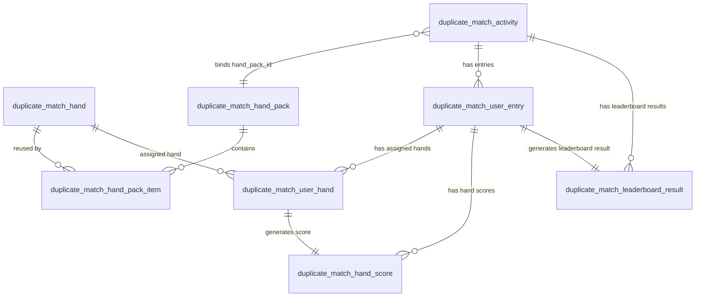
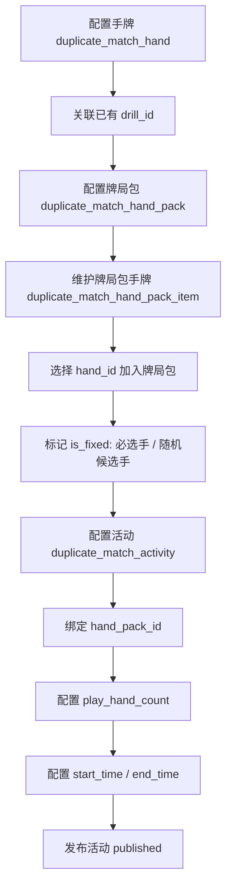
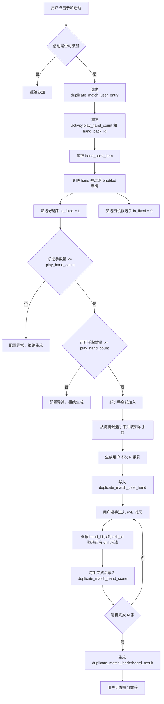

# 复式扑克 PvE 排名赛 7.15 数据表设计总结

## 1. 评审摘要

### 1.1 文档目标

本文档围绕 7.15 阶段核心业务链路，整理复式扑克 PvE 排名赛的数据表设计，覆盖活动配置、用户参赛与手牌分配、PvE 对局与恢复、每手计分、当前榜 / 最终榜和截止结算 6 个模块。

7.15 阶段目标是支持一个后台可配置的 PvE 排名赛活动：

1. 后台配置活动和牌局包。
2. 用户参加活动后，系统分配 N 手牌。
3. 用户逐手完成 PvE 对局。
4. 每手生成输赢结果和 0-100 分。
5. 用户完成全部 N 手后进入当前榜。
6. 活动截止后生成并冻结最终榜。
7. 用户中途退出后，可恢复到当前手，但不恢复单手中途局面。

---

### 1.2 设计结论

7.15 阶段建议使用以下核心表：

| 模块               | 表名                                   | 作用                                                            |
| ---------------- | ------------------------------------ | ------------------------------------------------------------- |
| 活动配置             | `duplicate_match_hand`               | 手牌基础表，通过 `drill_id` 关联已有 drill 玩法                             |
| 活动配置             | `duplicate_match_hand_pack`          | 牌局包表，定义一组候选手牌集合                                               |
| 活动配置             | `duplicate_match_hand_pack_item`     | 牌局包-手牌关联表，标记必选手 / 随机候选手                                       |
| 活动配置             | `duplicate_match_activity`           | 活动配置表，绑定牌局包，配置挑战手数、活动时间和活动状态                                  |
| 用户参赛与手牌分配        | `duplicate_match_user_entry`         | 用户参赛记录表，记录用户参加活动和完成进度                                         |
| 用户参赛与手牌分配        | `duplicate_match_user_hand`          | 用户手牌分配表，记录用户本次实际分配到的 N 手牌                                     |
| PvE 对局与恢复        | 不新增表                                 | 复用 `duplicate_match_user_entry` 和 `duplicate_match_user_hand` |
| 每手计分             | `duplicate_match_hand_score`         | 每手计分结果表，保存每手输赢结果和 0-100 分                                     |
| 当前榜 / 最终榜 / 截止结算 | `duplicate_match_leaderboard_result` | 榜单结果表，保存已完成 N 手用户的榜单结果，最终榜结算后冻结                               |

最终表清单：

| 序号 | 表名                                   |
| -: | ------------------------------------ |
|  1 | `duplicate_match_hand`               |
|  2 | `duplicate_match_hand_pack`          |
|  3 | `duplicate_match_hand_pack_item`     |
|  4 | `duplicate_match_activity`           |
|  5 | `duplicate_match_user_entry`         |
|  6 | `duplicate_match_user_hand`          |
|  7 | `duplicate_match_hand_score`         |
|  8 | `duplicate_match_leaderboard_result` |

---

### 1.3 核心设计决策

| 决策             | 说明                                                                |
| -------------- | ----------------------------------------------------------------- |
| N 不能写死 10      | 用户实际挑战手数统一来自 `duplicate_match_activity.play_hand_count`           |
| 活动只绑定牌局包       | 活动不直接绑定 `hand_id` 或 `drill_id`                                    |
| 具体牌局由 drill 驱动 | `duplicate_match_hand.drill_id` 关联已有 drill 玩法                     |
| 同一手牌可被多个牌包复用   | 通过 `duplicate_match_hand_pack_item` 实现多对多关系                       |
| 用户参赛后生成 N 手牌   | 实际分配结果写入 `duplicate_match_user_hand`                              |
| PvE 恢复只恢复到当前手  | 7.15 不恢复 flop / turn / river 等单手中途状态                              |
| 每手计分只保存单手结果    | 不在每手计分表保存总分和榜单排名                                                  |
| 未完成 N 手不入榜     | 当前榜和最终榜都只看已完成 N 手用户                                               |
| 当前榜不强制落库排名     | 当前榜可按总分和完成时间实时排序                                                  |
| 最终榜需要冻结        | 活动截止结算后写入 `rank_no`，设置 `is_final = 1`                             |
| 结算状态由活动和榜单表达   | `activity.status = finalized` + `leaderboard_result.is_final = 1` |
| 7.15 不做复杂扩展    | 暂不做标签、难度、权重抽牌、复杂计分规则版本、结算记录表                                      |

---

## 2. 核心表关系总览

### 2.1 ER 关系图



### 2.2 ER 关系说明表

下表与上方 ER 图中的关系线一一对应，用于说明每条关系在业务上的含义。

| 序号 | ER 图关系                                                             | 业务含义                        |
| -: | ------------------------------------------------------------------ | --------------------------- |
|  1 | `duplicate_match_hand -> duplicate_match_hand_pack_item`           | 同一手牌可以被多个牌局包复用              |
|  2 | `duplicate_match_hand_pack -> duplicate_match_hand_pack_item`      | 一个牌局包包含多条手牌关联记录             |
|  3 | `duplicate_match_activity -> duplicate_match_hand_pack`            | 多个活动可以复用同一个牌局包，一个活动只绑定一个牌局包 |
|  4 | `duplicate_match_activity -> duplicate_match_user_entry`           | 一个活动下可以有多个用户参赛记录            |
|  5 | `duplicate_match_user_entry -> duplicate_match_user_hand`          | 一个用户参赛记录下会生成 N 条实际分配手牌      |
|  6 | `duplicate_match_hand -> duplicate_match_user_hand`                | 用户实际分配到的每一手，都对应一条手牌配置       |
|  7 | `duplicate_match_user_hand -> duplicate_match_hand_score`          | 一条用户手牌完成后，生成一条每手计分结果        |
|  8 | `duplicate_match_user_entry -> duplicate_match_hand_score`         | 一个用户参赛记录下会有 N 条每手计分结果       |
|  9 | `duplicate_match_user_entry -> duplicate_match_leaderboard_result` | 一个完成 N 手的参赛记录生成一条榜单结果       |
| 10 | `duplicate_match_activity -> duplicate_match_leaderboard_result`   | 一个活动下会有多条已完赛用户的榜单结果         |

---

## 3. 主流程总览

### 3.1 后台配置流程

后台配置流程：



配置依赖关系：

1. 活动依赖牌局包。
2. 牌局包依赖手牌。
3. 手牌通过 `drill_id` 关联已有 drill 玩法。
4. 如果未配置有效手牌和牌局包，活动不能合法发布。

---

### 3.2 用户参赛到榜单主流程



---

## 4. 活动配置模块

### 4.1 模块目标

活动配置模块用于完成一场 PvE 排名赛的后台配置，包括：

1. 配置可复用手牌。
2. 配置牌局包。
3. 配置牌局包内的手牌。
4. 配置必选手 / 随机候选手。
5. 配置活动，绑定牌局包，设置挑战手数和活动时间。

---

### 4.2 涉及表

| 表名                               | 作用        |
| -------------------------------- | --------- |
| `duplicate_match_hand`           | 手牌基础表     |
| `duplicate_match_hand_pack`      | 牌局包表      |
| `duplicate_match_hand_pack_item` | 牌局包-手牌关联表 |
| `duplicate_match_activity`       | 活动配置表     |

---

### 4.3 `duplicate_match_hand`

#### 表作用

`duplicate_match_hand` 用于定义一手可复用手牌。

具体牌局内容由已有 drill 玩法驱动，本表通过 `drill_id` 建立关联。

#### 核心字段

| 字段名          | 类型建议         | 说明                          |
| ------------ | ------------ | --------------------------- |
| `id`         | bigint       | 主键 ID                       |
| `drill_id`   | bigint       | 关联已有 drill 玩法 ID            |
| `hand_name`  | varchar(128) | 手牌名称，方便后台识别                 |
| `hand_desc`  | varchar(512) | 手牌说明，可为空                    |
| `status`     | varchar(32)  | 手牌状态：`enabled` / `disabled` |
| `created_at` | datetime     | 创建时间                        |
| `updated_at` | datetime     | 更新时间                        |

#### 关键约束

| 约束                      | 说明                                   |
| ----------------------- | ------------------------------------ |
| `uk_drill_id(drill_id)` | 7.15 阶段建议一个 `drill_id` 只对应一条 hand 记录 |

#### 设计边界

本表不保存：

1. 牌包关系。
2. 用户分配结果。
3. PvE 对局过程。
4. 每手计分结果。
5. 榜单结果。

---

### 4.4 `duplicate_match_hand_pack`

#### 表作用

`duplicate_match_hand_pack` 用于定义一组可被活动使用的候选手牌集合。

牌局包本身只表示候选池，不直接保存具体手牌列表。

#### 核心字段

| 字段名          | 类型建议         | 说明                           |
| ------------ | ------------ | ---------------------------- |
| `id`         | bigint       | 主键 ID                        |
| `pack_name`  | varchar(128) | 牌局包名称                        |
| `pack_desc`  | varchar(512) | 牌局包说明，可为空                    |
| `status`     | varchar(32)  | 牌局包状态：`enabled` / `disabled` |
| `created_at` | datetime     | 创建时间                         |
| `updated_at` | datetime     | 更新时间                         |

#### 设计边界

本表不保存：

1. `play_hand_count`
2. `hand_id`
3. `drill_id`
4. 必选手数量
5. 随机候选手数量

这些信息分别属于活动表、手牌表或牌包-手牌关联表。

---

### 4.5 `duplicate_match_hand_pack_item`

#### 表作用

`duplicate_match_hand_pack_item` 用于维护牌局包和手牌之间的关联关系，并标记这手牌在当前牌局包中是必选手还是随机候选手。

这是支持“同一手牌可被多个牌局包复用”的关键表。

#### 核心字段

| 字段名            | 类型建议     | 说明                          |
| -------------- | -------- | --------------------------- |
| `id`           | bigint   | 主键 ID                       |
| `hand_pack_id` | bigint   | 牌局包 ID                      |
| `hand_id`      | bigint   | 手牌 ID                       |
| `is_fixed`     | tinyint  | 是否必选手；`1` = 必选手，`0` = 随机候选手 |
| `created_at`   | datetime | 创建时间                        |
| `updated_at`   | datetime | 更新时间                        |

#### 关键约束

| 约束                                         | 说明                  |
| ------------------------------------------ | ------------------- |
| `uk_hand_pack_hand(hand_pack_id, hand_id)` | 保证同一牌局包内，同一手牌只能配置一次 |

#### `is_fixed` 说明

| `is_fixed` | 含义                      |
| ---------: | ----------------------- |
|        `1` | 必选手，用户参加后必须被分配          |
|        `0` | 随机候选手，只进入随机池，不代表用户一定会打到 |

---

### 4.6 `duplicate_match_activity`

#### 表作用

`duplicate_match_activity` 是活动配置主表。

用户参加的是活动，不是直接参加牌局包，也不是直接参加某一手牌。

#### 核心字段

| 字段名               | 类型建议         | 说明                        |
| ----------------- | ------------ | ------------------------- |
| `id`              | bigint       | 主键 ID                     |
| `activity_name`   | varchar(128) | 活动名称                      |
| `activity_desc`   | varchar(512) | 活动说明，可为空，不作为 7.15 主流程强依赖  |
| `hand_pack_id`    | bigint       | 绑定的牌局包 ID                 |
| `play_hand_count` | int          | 用户本次活动实际需要完成的手牌数量，不能写死 10 |
| `start_time`      | datetime     | 活动开始时间                    |
| `end_time`        | datetime     | 活动截止时间                    |
| `status`          | varchar(32)  | 活动状态                      |
| `created_at`      | datetime     | 创建时间                      |
| `updated_at`      | datetime     | 更新时间                      |

#### 活动状态

| 状态          | 含义                      |
| ----------- | ----------------------- |
| `draft`     | 草稿，后台配置中，不可参加           |
| `published` | 已发布，是否可参加需要结合时间判断       |
| `ended`     | 已截止，未完成用户不能继续挑战，等待最终榜结算 |
| `finalized` | 已结算，最终榜已生成或结果已冻结        |
| `disabled`  | 已停用，异常下线或运营手动停用         |

7.15 阶段不单独维护 `running` 状态。

活动是否可参加，由以下条件实时判断：

```text
status = published
当前时间 >= start_time
当前时间 < end_time
```

只要当前时间满足：

```text
当前时间 >= end_time
```

即使 `status` 仍为 `published`，也不允许用户继续参加或继续挑战。

---

### 4.7 活动发布前校验

活动发布前，需要校验：

1. `activity_name` 必填。
2. `hand_pack_id` 必填。
3. `play_hand_count > 0`。
4. `start_time < end_time`。
5. 绑定的牌局包 `status = enabled`。
6. 可用手牌数量 `>= play_hand_count`。
7. 可用必选手数量 `<= play_hand_count`。
8. 所有必选手对应的 `duplicate_match_hand.status = enabled`。

可用手牌数量不是简单统计 `duplicate_match_hand_pack_item` 记录数，而是统计：

```text
duplicate_match_hand_pack_item 关联的 duplicate_match_hand.status = enabled 的手牌数量
```

---

## 5. 用户参赛与手牌分配模块

### 5.1 模块目标

本模块负责：

1. 记录用户参加某个活动。
2. 为用户生成本次实际需要挑战的 N 手牌。
3. 记录用户挑战进度。
4. 支持用户退出后恢复到当前手。
5. 为后续每手计分、榜单统计提供基础数据。

---

### 5.2 涉及表

| 表名                           | 作用      |
| ---------------------------- | ------- |
| `duplicate_match_user_entry` | 用户参赛记录表 |
| `duplicate_match_user_hand`  | 用户手牌分配表 |

---

### 5.3 `duplicate_match_user_entry`

#### 表作用

`duplicate_match_user_entry` 记录用户在某个活动中的一次参赛记录。

#### 核心字段

| 字段名                    | 类型建议        | 说明          |
| ---------------------- | ----------- | ----------- |
| `id`                   | bigint      | 主键 ID       |
| `activity_id`          | bigint      | 活动 ID       |
| `user_id`              | bigint      | 用户 ID       |
| `status`               | varchar(32) | 参赛状态        |
| `play_hand_count`      | int         | 本次活动挑战手数快照  |
| `hand_pack_id`         | bigint      | 本次活动绑定牌局包快照 |
| `completed_hand_count` | int         | 已完成手数       |
| `current_order_no`     | int         | 当前进行到第几手    |
| `join_time`            | datetime    | 参加时间        |
| `start_time`           | datetime    | 开始第一手时间     |
| `complete_time`        | datetime    | 完成全部 N 手时间  |
| `expire_time`          | datetime    | 参赛失效时间      |
| `created_at`           | datetime    | 创建时间        |
| `updated_at`           | datetime    | 更新时间        |

#### 参赛状态

| 状态          | 含义           |
| ----------- | ------------ |
| `joined`    | 已参加，尚未开始第一手  |
| `playing`   | 挑战中          |
| `completed` | 已完成全部 N 手    |
| `expired`   | 活动截止后未完成，已失效 |
| `invalid`   | 异常作废         |

说明：

7.15 阶段不建议在 `duplicate_match_user_entry.status` 中增加 `finalized`。

最终结算状态由以下字段表达：

```text
duplicate_match_activity.status = finalized
duplicate_match_leaderboard_result.is_final = 1
```

这样可以减少用户参赛状态、活动状态、榜单冻结状态之间的同步复杂度。

#### 关键约束

| 约束                                       | 说明                   |
| ---------------------------------------- | -------------------- |
| `uk_activity_user(activity_id, user_id)` | 保证一个用户在一个活动中只有一条参赛记录 |

---

### 5.4 `duplicate_match_user_hand`

#### 表作用

`duplicate_match_user_hand` 记录用户参加活动后，系统实际分配给他的 N 手牌。

#### 核心字段

| 字段名            | 类型建议        | 说明                      |
| -------------- | ----------- | ----------------------- |
| `id`           | bigint      | 主键 ID                   |
| `activity_id`  | bigint      | 活动 ID                   |
| `entry_id`     | bigint      | 用户参赛记录 ID               |
| `user_id`      | bigint      | 用户 ID                   |
| `hand_pack_id` | bigint      | 牌局包 ID 快照               |
| `hand_id`      | bigint      | 被分配的手牌 ID               |
| `order_no`     | int         | 本次挑战中的展示顺序，从 1 到 N      |
| `hand_source`  | varchar(32) | 手牌来源：`fixed` / `random` |
| `status`       | varchar(32) | 本手状态                    |
| `start_time`   | datetime    | 开始本手时间                  |
| `finish_time`  | datetime    | 完成本手时间                  |
| `created_at`   | datetime    | 创建时间                    |
| `updated_at`   | datetime    | 更新时间                    |

#### 手牌状态

| 状态            | 含义  |
| ------------- | --- |
| `not_started` | 未开始 |
| `playing`     | 进行中 |
| `completed`   | 已完成 |
| `expired`     | 已过期 |

#### 关键约束

| 约束                                   | 说明                   |
| ------------------------------------ | -------------------- |
| `uk_entry_order(entry_id, order_no)` | 保证同一用户挑战中顺序不重复       |
| `uk_entry_hand(entry_id, hand_id)`   | 保证同一用户本次挑战不会重复分配同一手牌 |

---

### 5.5 关键一致性要求

1. 创建 `duplicate_match_user_entry` 和批量插入 `duplicate_match_user_hand` 必须在同一事务中完成。
2. 某个 `entry_id` 下的 `duplicate_match_user_hand` 数量必须等于 `play_hand_count`。
3. `completed_hand_count` 不能超过 `play_hand_count`。
4. 完成某手时，只能在 `user_hand.status` 从未完成变为 `completed` 时递增 `completed_hand_count`。
5. 用户实际挑战顺序以 `duplicate_match_user_hand.order_no` 为准。

---

## 6. PvE 对局与恢复模块

### 6.1 模块目标

7.15 阶段需要支持用户在 PvE 排名赛中退出后重新进入，能恢复到当前手。

但 7.15 不支持单手中途状态恢复。

例如：

```text
用户打到 flop 后离开
重新进入时，不恢复到 flop 局面
而是恢复到当前这手
从这手牌开头重新打
```

---

### 6.2 表设计结论

7.15 阶段，本模块不新增表。

复用：

1. `duplicate_match_user_entry`
2. `duplicate_match_user_hand`

---

### 6.3 恢复规则

| 场景          | 处理方式                                                         |
| ----------- | ------------------------------------------------------------ |
| 当前手未开始      | 从该手开头开始                                                      |
| 当前手进行中      | 不恢复中途局面，从该手开头重新打                                             |
| 当前手已完成      | 不允许重复打，根据结果页或下一手继续                                           |
| 已完成全部 N 手   | 返回完成状态或当前榜                                                   |
| 活动已截止且用户未完成 | 不允许继续挑战；用户再次进入时可将该用户参赛记录更新为 `expired`，最终结算任务也会按活动维度收敛未完成用户状态 |

说明：

7.15 阶段不要求在 `activity.end_time` 到达的瞬间立即更新所有未完成用户为 `expired`。

系统可以通过两种方式处理：

1. 用户再次进入活动时，实时判断当前时间已超过 `activity.end_time` 且用户未完成，则将该用户的 `entry.status` 更新为 `expired`。
2. 截止结算任务执行时，按 `activity_id` 批量将未完成用户更新为 `expired`。

这样可以避免活动截止瞬间对大量用户做全量状态更新，同时保证最终结算前未完成用户状态能够被收敛。

---

### 6.4 不新增对局过程表的原因

7.15 不要求恢复以下内容：

1. 当前 street
2. 公共牌状态
3. 底池状态
4. 筹码状态
5. 当前行动方
6. 用户动作历史
7. AI 动作历史

因此不需要新增：

```text
duplicate_match_hand_play
duplicate_match_hand_action_log
```

如果后续要支持 flop / turn / river 中途恢复，再补充对局快照表或动作日志表。

---

## 7. 每手计分模块

### 7.1 模块目标

每手计分模块负责在用户完成某一手 PvE 对局后，保存这手牌的结果：

1. 本手牌局输赢结果。
2. 本手 0-100 分。

这些数据用于：

1. 用户查看每手结果。
2. 后续计算活动总分。
3. 当前榜和最终榜统计。
4. 防止重复计分。

---

### 7.2 涉及表

| 表名                           | 作用      |
| ---------------------------- | ------- |
| `duplicate_match_hand_score` | 每手计分结果表 |

---

### 7.3 `duplicate_match_hand_score`

#### 表作用

`duplicate_match_hand_score` 保存用户每一手完成后的计分结果。

#### 核心字段

| 字段名            | 类型建议          | 说明           |
| -------------- | ------------- | ------------ |
| `id`           | bigint        | 主键 ID        |
| `activity_id`  | bigint        | 活动 ID        |
| `entry_id`     | bigint        | 用户参赛记录 ID    |
| `user_hand_id` | bigint        | 用户手牌分配 ID    |
| `user_id`      | bigint        | 用户 ID        |
| `hand_id`      | bigint        | 手牌 ID        |
| `order_no`     | int           | 第几手          |
| `win_loss_bb`  | decimal(10,2) | 本手牌局输赢结果     |
| `score`        | decimal(5,2)  | 本手评分结果，0-100 |
| `score_at`     | datetime      | 完成计分时间       |
| `created_at`   | datetime      | 创建时间         |
| `updated_at`   | datetime      | 更新时间         |

#### 关键约束

| 约束                           | 说明                |
| ---------------------------- | ----------------- |
| `uk_user_hand(user_hand_id)` | 保证同一手牌只生成一条有效计分结果 |

---

### 7.4 关键一致性要求

1. 每手计分结果只能由服务端生成，不能由前端传入分数。
2. `activity_id`、`entry_id`、`user_id`、`hand_id`、`order_no` 应由服务端根据 `user_hand_id` 查询填充。
3. 写入计分结果、更新 `user_hand.status = completed`、更新 `entry.completed_hand_count` 必须放在同一事务中。
4. 如果同一 `user_hand_id` 已经有计分结果，应返回已有结果，不重复生成。
5. 每手计分表只保存单手结果，不保存用户总分。

---

## 8. 当前榜 / 最终榜模块

### 8.1 模块目标

本模块负责：

1. 用户完成 N 手后进入当前榜。
2. 活动进行中查看已完赛用户实时排名。
3. 活动截止后生成最终榜。
4. 将最终榜结果冻结。

---

### 8.2 涉及表

| 表名                                   | 作用    |
| ------------------------------------ | ----- |
| `duplicate_match_leaderboard_result` | 榜单结果表 |

---

### 8.3 `duplicate_match_leaderboard_result`

#### 表作用

`duplicate_match_leaderboard_result` 保存用户完成全部 N 手后的榜单结果。

本表只保存已完成 N 手用户。

未完成用户不写入本表，不进入当前榜，也不进入最终榜。

#### 核心字段

| 字段名                 | 类型建议         | 说明                                                                                      |
| ------------------- | ------------ | --------------------------------------------------------------------------------------- |
| `id`                | bigint       | 主键 ID                                                                                   |
| `activity_id`       | bigint       | 活动 ID                                                                                   |
| `entry_id`          | bigint       | 用户参赛记录 ID                                                                               |
| `user_id`           | bigint       | 用户 ID                                                                                   |
| `total_score`       | decimal(6,2) | 用户活动总分。7.15 阶段如无额外计分规则，建议按该用户 N 手 `score` 的平均值计算，使总分保持在 0-100 区间；若产品后续明确其他计分规则，则以计分规则为准 |
| `rank_no`           | int          | 榜单排名；当前榜阶段可为空，最终榜冻结后必填                                                                  |
| `play_hand_count`   | int          | 活动挑战手数快照                                                                                |
| `scored_hand_count` | int          | 实际参与总分计算的手牌数量                                                                           |
| `complete_time`     | datetime     | 用户完成全部 N 手时间                                                                            |
| `is_final`          | tinyint      | 是否已冻结为最终榜结果                                                                             |
| `finalized_at`      | datetime     | 最终榜冻结时间                                                                                 |
| `created_at`        | datetime     | 创建时间                                                                                    |
| `updated_at`        | datetime     | 更新时间                                                                                    |

#### `total_score` 说明

`total_score` 是最终用于榜单排序的活动总分，不保存每手计分明细。

如果 7.15 没有额外计分规则，使用 N 手平均分的好处是：

1. 总分仍保持在 0-100 区间，前端展示更直观。
2. 不会因为 `play_hand_count` 不同导致活动总分天然变大。
3. 后续如果要支持权重、难度、EV loss 等计分规则，可以从简单平均分扩展为加权平均分。

#### 关键约束

| 约束                                       | 说明                   |
| ---------------------------------------- | -------------------- |
| `uk_entry(entry_id)`                     | 保证一个用户参赛记录只生成一条榜单结果  |
| `uk_activity_user(activity_id, user_id)` | 保证同一用户在同一活动下只有一条榜单结果 |

---

### 8.4 当前榜规则

当前榜不是所有参赛用户榜，而是：

```text
活动进行中，已经完成 N 手用户的实时排名
```

入榜条件：

```text
completed_hand_count == play_hand_count
hand_score 数量 == play_hand_count
```

当前榜阶段：

1. 生成 `leaderboard_result`。
2. 写入 `total_score`。
3. `is_final = 0`。
4. `rank_no` 可以为空。
5. 查询时按 `total_score DESC, complete_time ASC` 实时排序。

这样避免每新增一个完赛用户就批量更新排名。

---

### 8.5 当前榜查询口径

活动进行中查询当前榜：

```text
activity.status = published
当前时间 < activity.end_time
leaderboard_result.activity_id = 当前活动
leaderboard_result.is_final = 0
按 total_score DESC, complete_time ASC 实时排序
```

活动结算后不再展示当前榜入口，统一展示最终榜。

---

### 8.6 最终榜规则

最终榜是：

```text
活动截止后，已完成 N 手用户的冻结排名
```

最终榜结算时：

1. 查询已完成 N 手且计分完整的用户。
2. 生成或刷新 `leaderboard_result`。
3. 按 `total_score DESC, complete_time ASC` 计算最终排名。
4. 写入 `rank_no`。
5. 设置 `is_final = 1`。
6. 写入 `finalized_at`。

---

### 8.7 最终榜查询口径

活动结算后查询最终榜：

```text
activity.status = finalized
leaderboard_result.activity_id = 当前活动
leaderboard_result.is_final = 1
按 rank_no ASC 排序
```

最终榜冻结后，普通流程不再更新排名。

---

## 9. 截止结算模块

### 9.1 模块目标

截止结算模块负责活动结束后的状态推进和最终榜冻结。

它的核心产物是最终榜，因此与当前榜 / 最终榜共用 `duplicate_match_leaderboard_result`。

7.15 阶段暂不新增结算记录表。

---

### 9.2 截止结算规则

活动截止后：

1. 当前时间达到 `activity.end_time`，不允许未完成用户继续挑战。
2. 未完成用户的 `entry.status` 可以通过用户再次进入时懒更新，也可以通过结算任务按活动维度批量更新为 `expired`。
3. 已完成 N 手且计分完整的用户进入最终榜。
4. 最终榜冻结后，普通流程不再更新排名。
5. 活动状态更新为 `finalized`。

---

### 9.3 结算一致性要求

最终结算完成后，需要同时满足：

1. `duplicate_match_activity.status = finalized`
2. 本活动下最终榜用户的 `leaderboard_result.is_final = 1`
3. 本活动下最终榜用户的 `leaderboard_result.rank_no` 已写入
4. 本活动下最终榜用户的 `leaderboard_result.finalized_at` 已写入
5. 未完成用户的 `entry.status = expired`

如果结算过程中失败，不能对外展示最终榜为已完成状态。

---

### 9.4 结算幂等要求

截止结算流程必须具备幂等性。

要求：

1. 如果 `activity.status = finalized`，不应重复生成或覆盖最终榜。
2. 结算应以 `activity_id` 为维度串行执行，避免多个任务同时结算同一活动。
3. 更新未完成用户为 `expired`、生成最终 `rank_no`、设置 `leaderboard_result.is_final = 1`、更新 `activity.status = finalized`，应作为同一个活动级结算流程处理。
4. 如果实现上无法做到一个大事务，也应保证 `activity.status = finalized` 是最后一步更新。
5. 只有当最终榜结果完整生成并冻结后，才允许将活动状态更新为 `finalized`。

---

## 10. 跨模块关键一致性规则

### 10.1 `play_hand_count` 是全链路核心字段

`play_hand_count` 来自：

```text
duplicate_match_activity.play_hand_count
```

使用场景包括：

1. 用户参赛时生成 N 手牌。
2. 判断用户是否完成活动。
3. 判断是否允许入榜。
4. 计算用户活动总分。
5. 当前榜和最终榜统计。

所有模块都不能写死 10。

---

### 10.2 只有完成 N 手才入榜

入榜条件：

```text
entry.completed_hand_count == activity.play_hand_count
hand_score 数量 == activity.play_hand_count
```

未完成用户不进入当前榜，也不进入最终榜。

---

### 10.3 当前榜只看已完赛用户

当前榜看的是：

```text
活动进行中，已完成 N 手用户的实时排名
```

未完成用户看挑战进度，不看榜单排名。

---

### 10.4 最终榜冻结后不再普通更新

当：

```text
leaderboard_result.is_final = 1
activity.status = finalized
```

最终榜结果不应再被普通流程更新。

如果后续要支持重算最终榜，需要单独设计重算流程和审计机制。

---

### 10.5 可用手牌数量口径

可用手牌数量不是简单统计 `duplicate_match_hand_pack_item` 记录数。

可用手牌数量应统计：

```text
duplicate_match_hand_pack_item 关联的 duplicate_match_hand.status = enabled 的手牌数量
```

如果某手牌已 `disabled`，即使仍保留在牌局包中，也不应参与新用户参赛分配。

---

## 11. 7.15 暂不设计事项

| 暂不设计项                                 | 原因                                           |
| ------------------------------------- | -------------------------------------------- |
| 不在活动表保存具体 `hand_id`                   | 活动只绑定牌局包                                     |
| 不在活动表保存 `drill_id`                    | `drill_id` 属于具体手牌                            |
| 不在牌局包表保存 `play_hand_count`            | 挑战手数属于活动配置                                   |
| 不在牌局包表保存必选手数量 / 随机候选手数量               | 可通过关联表统计                                     |
| 不设计难度 / 标签 / 权重抽牌                     | 7.15 未明确要求                                   |
| 不设计单手中途恢复表                            | 7.15 只恢复到当前手，从当前手开头重打                        |
| 不保存 PvE 动作日志                          | 7.15 不做动作级审计和恢复                              |
| 不在配置表保存用户参赛进度                         | 用户参赛进度由 `duplicate_match_user_entry` 维护      |
| 不在配置表保存用户实际手牌                         | 用户实际手牌由 `duplicate_match_user_hand` 维护       |
| 不在活动表保存最终榜明细                          | 最终榜由 `duplicate_match_leaderboard_result` 维护 |
| 暂不新增结算记录表                             | 7.15 先通过活动状态、用户状态和榜单结果表完成结算                  |
| 暂不保存 `score_rule_id`                  | 前提是 7.15 当前活动统一使用一套固定计分逻辑；如果活动需要选择计分规则，则需要补充 |
| 不在 `user_entry.status` 保存 `finalized` | 结算状态由活动状态和榜单冻结状态表达，避免多状态同步                   |

---

## 12. 评审关注点检查表

| 关注点              | 当前设计是否满足 | 说明                                                         |
| ---------------- | -------- | ---------------------------------------------------------- |
| 是否支持后台配置活动       | 是        | 通过 `duplicate_match_activity`                              |
| 是否支持活动绑定牌局包      | 是        | `activity.hand_pack_id`                                    |
| 是否支持同一手牌被多个牌包复用  | 是        | 通过 `duplicate_match_hand_pack_item`                        |
| 是否复用已有 drill 玩法  | 是        | `duplicate_match_hand.drill_id`                            |
| 是否支持 N 手可配置      | 是        | `activity.play_hand_count`                                 |
| 是否避免写死 10        | 是        | 全链路使用 `play_hand_count`                                    |
| 是否支持必选手 / 随机候选手  | 是        | `hand_pack_item.is_fixed`                                  |
| 是否支持用户参赛后生成 N 手牌 | 是        | `duplicate_match_user_entry` + `duplicate_match_user_hand` |
| 是否支持退出后恢复        | 是        | 恢复到当前手，不恢复单手中途状态                                           |
| 是否支持每手计分         | 是        | `duplicate_match_hand_score`                               |
| 是否避免重复计分         | 是        | `uk_user_hand(user_hand_id)`                               |
| 是否支持当前榜          | 是        | 已完成 N 手用户进入 `leaderboard_result`                           |
| 是否支持最终榜冻结        | 是        | `is_final`、`rank_no`、`finalized_at`                        |
| 是否支持截止结算         | 是        | 活动状态、用户状态、榜单结果配合完成                                         |
| 是否避免过度设计         | 是        | 暂不做标签、权重、动作日志、结算记录表等                                       |
| 是否便于后续扩展         | 是        | 后续可扩展中途恢复、规则版本、结算记录、标签体系                                   |

---

## 13. 最终推荐

7.15 阶段建议采用以下 8 张表：

```text
duplicate_match_hand
duplicate_match_hand_pack
duplicate_match_hand_pack_item
duplicate_match_activity
duplicate_match_user_entry
duplicate_match_user_hand
duplicate_match_hand_score
duplicate_match_leaderboard_result
```

其中：

```text
duplicate_match_activity.play_hand_count
```

是后续用户分配、完成判断、计分汇总、当前榜和最终榜的核心依据。

所有模块都不能写死 10。

本设计只覆盖 7.15 必要能力，刻意不提前引入复杂运营能力、动作日志、单手中途恢复、标签体系、权重抽牌、结算记录表等能力，以降低交付风险。
