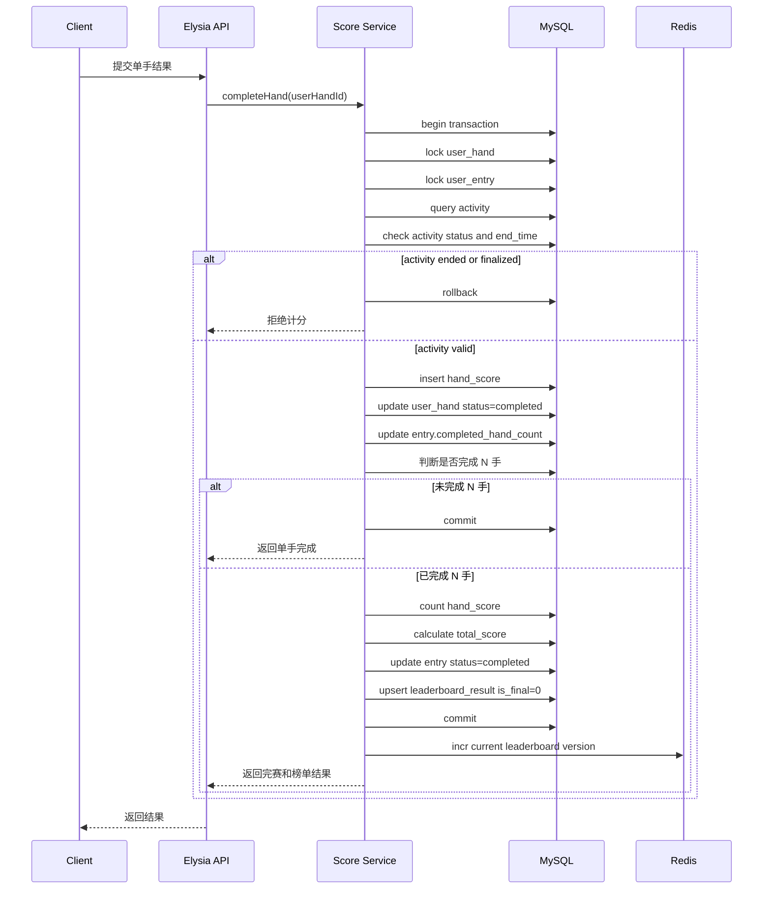
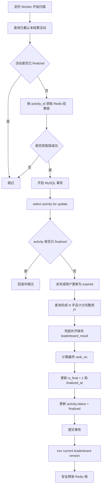

# 复式扑克 PvE 排名赛 7.15 排行榜实现方案

## 1. 阅读说明

本文档是排行榜实现方案主文档，只保留评审所需的核心结论、关键流程、风险和待确认项。

Redis 缓存、活动结算锁、version 失效、token 校验、分页性能、Redis Sorted Set 等细节，统一放在《复式扑克 PvE 排名赛 7.15 排行榜设计补充说明》中，主文档通过 Q 编号引用。

---

## 2. 核心结论

排行榜以 **MySQL 为事实源**，使用 `duplicate_match_leaderboard_result` 保存榜单结果。

Redis 不作为排行榜事实源，只做两类事情：

```text
1. 排行榜分页查询缓存
2. 防止多个服务同时结算同一个活动
```

核心原则：

```text
MySQL 保证排行榜正确性。
Redis 提升排行榜查询性能。
Redis 通过活动结算锁减少重复结算和并发覆盖风险。
当前榜动态查询。
最终榜截止后冻结。
```

Redis 活动结算锁按 `activity_id` 维度设置。获取锁成功的任务执行结算，获取失败的任务跳过；锁释放时需要校验 token，避免误删其他任务持有的锁。详细原理见《补充说明：活动结算锁相关 Q3-Q8、Q44》。

---

## 3. 数据来源与职责边界

### 3.1 相关表

| 表名                                   | 作用                                  |
| ------------------------------------ | ----------------------------------- |
| `duplicate_match_activity`           | 活动配置，包含 `play_hand_count`、活动状态、截止时间 |
| `duplicate_match_user_entry`         | 用户参赛记录，保存完成手数、参赛状态、完成时间             |
| `duplicate_match_user_hand`          | 用户被分配的手牌                            |
| `duplicate_match_hand_score`         | 每手计分结果                              |
| `duplicate_match_leaderboard_result` | 排行榜结果表                              |

### 3.2 职责边界

| 模块     | 职责                    |
| ------ | --------------------- |
| 每手计分   | 生成单手得分                |
| 用户参赛进度 | 判断用户是否完成 N 手          |
| 排行榜    | 只处理完成 N 手用户的排名        |
| 最终结算   | 活动截止后冻结最终榜            |
| Redis  | 缓存查询结果，防止多个服务同时结算同一活动 |

---

## 4. 入榜规则

用户进入排行榜必须同时满足：

```text
entry.status = completed
entry.completed_hand_count = activity.play_hand_count
hand_score_count = activity.play_hand_count
entry.complete_time < activity.end_time
```

未完成用户：

```text
不进入当前榜
不进入最终榜
活动截止后更新为 expired
```

总分口径：

```text
total_score = AVG(hand_score.score)
```

排序口径：

```text
total_score DESC
complete_time ASC
```

含义：

```text
总分越高，排名越靠前。
总分相同，越早完成，排名越靠前。
```

### 4.1 截止口径

7.15 第一版采用 **严格截止口径**。

判断标准：

```text
以服务端执行计分事务时的时间为准。
```

如果：

```text
now >= activity.end_time
```

则：

```text
不允许继续完成手牌
不生成 hand_score
不更新 entry.completed_hand_count
不写入 leaderboard_result
```

如果后续产品希望支持“已开始手牌允许宽限提交”，需要新增宽限期规则，7.15 第一版暂不支持。详细说明见《补充说明：截止口径相关 Q31-Q32》。

---

## 5. 当前榜与最终榜规则

### 5.1 当前榜

当前榜用于活动进行中展示。

数据条件：

```text
activity.status = published
now < activity.end_time
leaderboard_result.is_final = 0
```

排序方式：

```text
ORDER BY total_score DESC, complete_time ASC
```

当前榜不需要落库 `rank_no`，查询时实时计算排名。

原因：

```text
当前榜会随着新用户完赛不断变化。
如果每次有人入榜都更新所有用户 rank_no，写入成本高。
当前榜只是暂定排名，不需要冻结。
```

详细说明见《补充说明 Q29》。

### 5.2 最终榜

最终榜用于活动截止后展示。

数据条件：

```text
activity.status = finalized
leaderboard_result.is_final = 1
leaderboard_result.rank_no IS NOT NULL
```

排序方式：

```text
ORDER BY rank_no ASC
```

最终榜结算后：

```text
不允许普通完成流程继续更新榜单
不允许重复覆盖 rank_no
不允许未完成用户补入最终榜
```

最终榜需要落库 `rank_no`，用于稳定展示和后续复查。详细说明见《补充说明 Q30》。

### 5.3 当前榜与最终榜数据关系

7.15 第一版不保留历史当前榜快照。

`duplicate_match_leaderboard_result` 是同一批榜单结果记录：

```text
活动进行中：
leaderboard_result.is_final = 0
leaderboard_result.rank_no = NULL

活动结算后：
leaderboard_result.is_final = 1
leaderboard_result.rank_no = 最终排名
leaderboard_result.finalized_at = 冻结时间
```

因此，活动 `finalized` 后，不再提供当前榜语义，前端应查询最终榜。

如果后续需要保留“截止前最后一次当前榜快照”，需要新增快照表或结算记录表，7.15 第一版不做。详细说明见《补充说明 Q28》。

---

## 6. 最后一手完成后的入榜流程

用户完成第 N 手时，在同一个 MySQL 事务中完成入榜判断和榜单结果写入。

流程：

```text
1. 开启 MySQL 事务
2. 锁定 user_hand
3. 锁定 user_entry
4. 查询并校验 activity
5. 如果 activity 已截止或已 finalized，拒绝继续计分
6. 写入 hand_score
7. 更新 user_hand.status = completed
8. 更新 entry.completed_hand_count
9. 判断是否完成 N 手
10. 校验 hand_score 数量是否等于 play_hand_count
11. 计算 total_score
12. 更新 entry.status = completed
13. 写入 duplicate_match_leaderboard_result
14. 提交事务
15. 事务提交成功后，递增 current leaderboard version
```

### 6.1 时序图



### 6.2 当前榜缓存失效

当前榜缓存使用 version 机制失效。用户完成 N 手入榜后，递增该活动的 current leaderboard version；后续查询使用新 version 拼接缓存 key，旧分页缓存不再命中，等待 TTL 自动过期。

该方案可以避免使用 `KEYS` 批量删除 Redis 分页缓存。详细原理见《补充说明：当前榜缓存相关 Q9-Q13、Q38-Q40》。

---

## 7. 活动截止后的最终榜结算流程

最终榜结算按 `activity_id` 串行执行。

结算步骤：

```text
1. 定时扫描到已截止但未 finalized 的活动
2. 按 activity_id 获取 Redis 结算锁
3. 锁定 activity 记录
4. 将未完成用户更新为 expired
5. 查询已完成且计分完整的用户
6. 兜底补齐缺失的 leaderboard_result
7. 按 total_score DESC, complete_time ASC 计算 rank_no
8. 更新 leaderboard_result.is_final = 1
9. 写入 finalized_at
10. 最后更新 activity.status = finalized
11. 递增 current leaderboard version，使旧当前榜分页缓存不再命中
```

最终榜缓存不在结算流程中提前生成。最终榜缓存等用户第一次查询最终榜时再生成。详细说明见《补充说明 Q15-Q16》。

### 7.1 结算流程图



### 7.2 活动结算锁

最终结算前，需要按 `activity_id` 获取 Redis 活动结算锁。同一个活动同一时间只允许一个结算任务执行；不同活动可以并行结算。锁获取成功的任务执行结算，获取失败的任务跳过。

锁释放时必须校验 token，只能释放自己持有的锁，不能直接 `DEL lockKey`，避免误删其他任务后来获得的锁。Redis 锁只做并发控制辅助，最终正确性仍由 MySQL 的 `select for update`、`activity.status` 和事务兜底。

详细原理见《补充说明：活动结算锁相关 Q3-Q8、Q44》。

### 7.3 `activity.status = finalized` 必须最后更新

如果先更新 `activity.status = finalized`，但 `rank_no` 还没写完，前端会认为最终榜已经生成，实际数据却不完整。

所以必须保证：

```text
先完成所有最终榜数据写入
再更新 activity.status = finalized
```

详细说明见《补充说明 Q26》。

### 7.4 兜底补齐 leaderboard_result

最终结算阶段的 `leaderboard_result` 补齐是兜底补偿机制。

正常情况下，用户完成第 N 手时已经生成 `leaderboard_result`；结算阶段只针对异常遗漏数据做幂等补齐。详细说明见《补充说明 Q27、Q49》。

---

## 8. 活动截止后的结算触发机制

7.15 暂按定时扫描 Worker 触发最终结算。

流程：

```text
独立 worker 进程每分钟扫描 MySQL
-> 找到 end_time <= now 且 status 可结算的活动
-> 按 activity_id 获取结算锁
-> 获取成功后执行最终榜结算
-> 获取失败则跳过
```

扫描条件建议：

```text
扫描 end_time <= now 且 status = published 的活动。
如果系统存在 ended 中间态，也允许扫描 status IN ('published', 'ended')。
不使用 status != finalized 这种宽泛条件。
```

示例查询：

```sql
SELECT id
FROM duplicate_match_activity
WHERE end_time <= NOW()
  AND status IN ('published', 'ended')
LIMIT 100;
```

具体 status 枚举以活动表最终定义为准，不能扫描 `draft`、`disabled`、`cancelled` 等非上线活动。

该方案需要结合部署方式确认；后台手动结算作为补偿入口。用户访问懒触发暂不作为主方案。详细说明见《补充说明 Q22-Q25》。

---

## 9. Redis 使用原则

Redis 只做缓存和防重复结算辅助，不做排行榜事实源。

### 9.1 Redis 负责的内容

| 类型      | 作用                 | 是否必做           |
| ------- | ------------------ | -------------- |
| 当前榜分页缓存 | 缓存当前排行榜分页查询结果      | 建议做            |
| 最终榜分页缓存 | 缓存最终排行榜分页查询结果      | 建议做            |
| 我的排名缓存  | 缓存单个用户自己的排名结果      | 可选，7.15 第一版可不做 |
| 活动结算锁   | 防止多个无状态服务同时结算同一个活动 | 建议做            |

### 9.2 缓存策略

Redis 缓存分为当前榜分页缓存、最终榜分页缓存和可选的我的排名缓存。

当前榜和最终榜分页缓存是所有用户共用的；我的排名缓存是用户独立的，7.15 第一版可不做。缓存均采用查询时生成：Redis miss 后查 MySQL，再写入 Redis。

最终榜缓存正常不失效；如果后台人工重算或修复最终榜，需要同步删除对应活动的最终榜分页缓存。7.15 第一版不为最终榜设计 version，原因是最终榜冻结后正常不变化。

详细说明见《补充说明：Redis 缓存相关 Q14-Q18、Q41-Q43》。

### 9.3 Redis 不允许承担的职责

```text
不判断用户是否完成 N 手
不判断用户是否入榜
不保存最终可信 rank_no
不替代 MySQL 最终结算
不在 MySQL 事务提交前更新缓存
```

---

## 10. 我的当前排名与分页性能风险

### 10.1 我的排名默认策略

7.15 第一版默认策略：

```text
我的榜单结果：必做，返回我的总分、完成时间、是否入榜。
我的最终排名：必做，最终榜阶段直接读取已落库的 rank_no。
我的当前排名：默认不在列表接口中自动计算；仅当产品明确需要展示，或用户主动查看“我的排名”时再实时计算。
```

如果产品要求当前榜页面必须展示“我的当前排名”，则先按 MySQL 实时 COUNT 实现，并标记为后期性能优化点。

详细 SQL 和风险说明见《补充说明 Q19-Q21》。

### 10.2 分页性能风险

7.15 第一版当前榜使用 MySQL 实时排序和普通分页，限制最大 `pageSize`。

若单活动完赛用户量较大，深分页和我的当前排名查询可能成为性能风险。后期可按情况引入最大翻页深度限制、游标分页、Redis Sorted Set 或排行榜快照表。

深分页、游标分页和 Redis Sorted Set 原理见《补充说明：分页与扩展相关 Q33-Q37、Q50》。

---

## 11. 必要索引与唯一约束

### 11.1 排行榜结果唯一约束

```sql
ALTER TABLE duplicate_match_leaderboard_result
ADD UNIQUE KEY uk_entry (entry_id),
ADD UNIQUE KEY uk_activity_user (activity_id, user_id);
```

作用：

| 约束                 | 作用              |
| ------------------ | --------------- |
| `uk_entry`         | 防止一个参赛记录重复入榜    |
| `uk_activity_user` | 防止同一用户在同一活动重复入榜 |

### 11.2 当前榜查询索引

```sql
CREATE INDEX idx_activity_final_score_time
ON duplicate_match_leaderboard_result (
  activity_id,
  is_final,
  total_score,
  complete_time
);
```

用途：

```text
当前榜按 total_score DESC, complete_time ASC 查询
```

### 11.3 最终榜查询索引

```sql
CREATE INDEX idx_activity_final_rank
ON duplicate_match_leaderboard_result (
  activity_id,
  is_final,
  rank_no
);
```

用途：

```text
最终榜按 rank_no ASC 查询
```

### 11.4 我的榜单结果索引

如果已有：

```sql
UNIQUE KEY uk_activity_user (activity_id, user_id)
```

则不需要额外创建普通索引。

该索引用于：

```text
查询某个用户在某个活动里的榜单结果。
既可用于当前榜阶段，也可用于最终榜阶段。
```

注意：

```text
这个索引只能快速查到我的榜单结果。
不能直接解决“我的当前排名”实时计算问题。
```

详细说明见《补充说明 Q19-Q20、Q47》。

---

## 12. 关键异常与验收点

### 12.1 关键异常

| 异常                     | 处理                           |
| ---------------------- | ---------------------------- |
| 最后一手重复提交               | 返回已有结果，不重复计分                 |
| `hand_score` 写入成功但入榜失败 | 整体事务回滚                       |
| 用户未完成 N 手              | 不入榜                          |
| `hand_score` 数量不足      | 不入榜                          |
| 活动已截止                  | 不允许继续完成手牌                    |
| 结算任务重复执行               | 已 finalized 直接跳过             |
| Redis 锁过期              | MySQL 状态判断兜底                 |
| Redis 当前榜缓存失效失败        | 不影响业务正确性，依赖 version + TTL 兜底 |

Redis 当前榜缓存失效失败不会影响业务正确性，只可能导致短时间看到旧榜。当前榜缓存设置较短 TTL，旧缓存会自动过期，下一次查询会从 MySQL 重建。详细说明见《补充说明 Q38-Q40》。

### 12.2 当前榜验收

```text
未完成 N 手用户不出现在当前榜
完成 N 手但 hand_score 不完整，不出现在当前榜
完成 N 手且 hand_score 完整，生成 leaderboard_result
当前榜按 total_score DESC, complete_time ASC 排序
当前榜 rank_no 可以实时计算，不要求落库
活动截止后不允许继续完成手牌并入榜
```

### 12.3 最终榜验收

```text
活动截止后，未完成用户变为 expired
最终榜只包含完成 N 手且计分完整的用户
最终榜写入 rank_no
最终榜设置 is_final = 1
最终榜写入 finalized_at
activity.status 最后更新为 finalized
finalized 后不允许普通流程更新榜单
重复结算不会覆盖已 finalized 的结果
```

---

## 13. 实现顺序

```text
1. 完成 leaderboard_result 表唯一约束和索引
2. 完成最后一手入榜事务
3. 补充 activity 截止状态校验
4. 完成当前榜查询
5. 完成最终榜结算流程
6. 接入 Redis 当前榜 / 最终榜分页缓存
7. 接入 Redis current leaderboard version 失效机制
8. 接入 Redis activity_id 结算锁和 token 安全释放
9. 补充后台手动结算入口作为补偿
10. 评估“我的当前排名”是否需要实时展示
```

---

## 14. 待确认项

| 问题                    | 当前建议                                               |
| --------------------- | -------------------------------------------------- |
| 是否允许部署独立 Worker       | 暂按独立 Worker 设计，待确认                                 |
| 最终结算触发机制              | 定时扫描 Worker 为主，后台手动触发为补偿                           |
| 活动状态枚举                | 扫描 `published`，如存在 `ended` 中间态则包含 `ended`，不扫描非上线状态 |
| 截止口径是否严格按服务端事务时间      | 当前建议严格截止                                           |
| 我的当前排名是否必须展示          | 默认不自动计算，仅需要时计算                                     |
| 我的当前排名是否需要缓存          | 7.15 第一版可不做                                        |
| 当前榜是否限制最大翻页深度         | 待确认                                                |
| 是否使用 Redis Sorted Set | 7.15 不做，后期用户量变大再评估                                 |
| 是否需要排名快照表             | 7.15 不做，后期再评估                                      |
| 是否保留历史当前榜快照           | 7.15 不做                                            |

---

## 15. 最终判断

7.15 第一版推荐方案：

```text
排行榜正确性靠 MySQL。
当前榜查询时实时排序。
最终榜结算时写入 rank_no 并冻结。
Redis 只做分页缓存和活动结算锁。
当前榜缓存使用 version 方式失效，不使用 KEYS 批量删除。
Redis 结算锁必须使用 token，释放时校验 token。
活动 finalized 后不再提供当前榜语义，前端应查询最终榜。
我的当前排名和当前榜深分页存在性能风险，7.15 先按简单方案实现，后期再优化。
活动截止结算暂按定时 Worker 设计，但部署方式和活动状态枚举需要确认。
```
