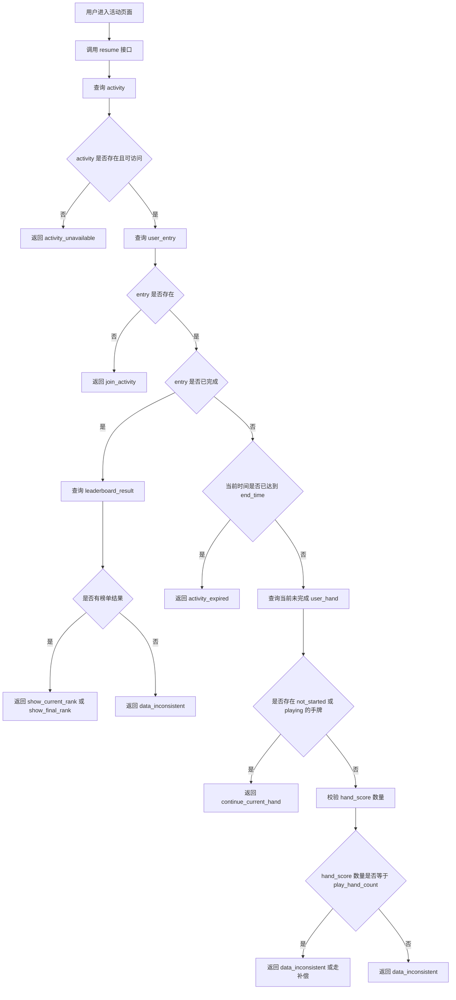
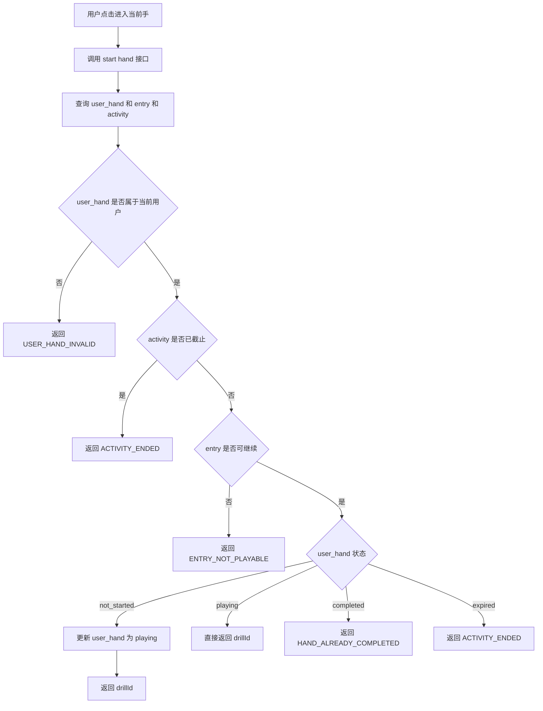
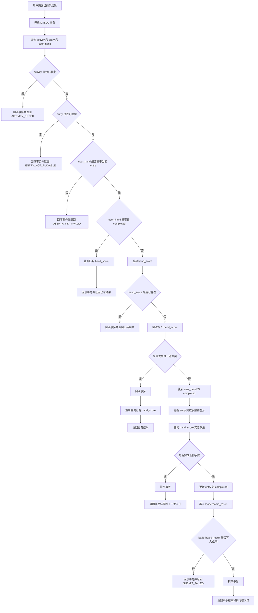

# 复式扑克 PvE 排名赛 7.15 断线 / 重启继续研发设计

## 1. 背景与目标

7.15 版本的 PvE 排名赛中，用户需要完成活动配置的 N 手牌，并基于总成绩进入排行榜。

在实际使用过程中，用户可能出现以下情况：

* 刷新页面
* 退出 App
* 网络断开
* 客户端请求超时
* 服务端重启
* 重复点击提交
* 手机和电脑同时打开同一个活动
* 完成最后一手后客户端没有收到响应

本文档用于设计这些场景下的恢复方案，保证用户可以继续当前活动，同时保证手牌分配、计分结果、活动进度和排行榜结果不出错。

本设计重点解决 4 个问题：

1. 用户重新进入活动后，服务端如何判断用户应该进入哪一步。
2. 用户已分配的手牌如何保证不变化。
3. 用户完成一手时，如何保证不重复计分。
4. 用户完成最后一手时，如何保证计分结果和排行榜结果一致。

---

## 2. 本期设计边界

## 2.1 7.15 支持范围

7.15 支持的是“活动进度恢复”，不是“单手牌中途恢复”。

本期支持：

1. 用户重新进入活动后，恢复到当前活动进度。
2. 用户已分配的 N 手牌不重新分配。
3. 用户当前手未完成时，重新进入当前手。
4. 当前手重新进入后，从这手开头重新打。
5. 已完成手牌不能重复打、不能重复计分。
6. 完成全部手牌后，稳定写入排行榜结果。
7. 服务端重启后，基于 MySQL 数据恢复用户进度。
8. 重复提交或多设备同时提交时，保证最终只计分一次。

---

## 2.2 7.15 不支持范围

### 1. 不恢复当前手的中途状态

如果用户在一手牌中途断线，例如已经打到 flop / turn / river，重新进入后不会恢复到该街口。

本期规则是：

```text
当前手未完成，重新进入后从这手开头重新打。
```

---

### 2. 不保存完整操作日志

本期不保存用户在单手牌中的每一步操作，例如：

```text
用户什么时候 check
用户什么时候 call
用户什么时候 raise
AI 做过哪些动作
每条街的动作顺序
```

原因是 7.15 的核心目标是排名赛闭环，不是牌局回放系统。

---

### 3. 不保存牌局中途快照

本期不保存以下中途状态：

```text
当前街口
公共牌状态
底池状态
筹码状态
当前行动方
当前可选动作
AI 决策状态
```

因此不能从某个具体操作节点继续。

---

### 4. 不限制用户只能在一个设备操作

7.15 不做复杂的多设备会话控制。

系统不会强制：

```text
手机打开后，电脑不能打开
电脑打开后，手机自动退出
两个设备之间实时抢操作权
给每个设备维护会话锁
```

本期只保证最终数据正确：

```text
同一手牌只能完成一次
同一手牌只能计分一次
同一个活动只能入榜一次
```

如果多个设备同时提交，服务端通过数据库唯一约束和事务保证不会重复计分。

---

### 5. 不做断线宽限期和截止宽限期

7.15 不做“断线后几分钟内恢复到原状态”的机制，也不做“活动截止后允许用户继续打完当前手”的机制。

本期规则是：

```text
用户未完成当前手，重新进入后从当前手开头开始。
用户提交计分时，如果服务端时间已经达到活动截止时间，则不允许继续计分。
```

活动截止判断以服务端接收完成计分请求的时间为准，不以用户进入当前手的时间为准。

| 场景           |  是否计分 |
| ------------ | ----: |
| 截止前进入，截止前提交  |    计分 |
| 截止前进入，截止后提交  |   不计分 |
| 截止后进入        | 不允许进入 |
| 已完成全部手牌后查看榜单 |    允许 |

---

## 3. 核心设计原则

## 3.1 MySQL 是唯一恢复事实源

断线、刷新、服务端重启后，用户进度只从 MySQL 恢复。

核心依赖表：

| 表名                                   | 作用                  |
| ------------------------------------ | ------------------- |
| `duplicate_match_activity`           | 活动配置，包含活动时间、状态、手牌数量 |
| `duplicate_match_user_entry`         | 用户在活动中的整体参赛记录       |
| `duplicate_match_user_hand`          | 用户本次活动被分配到的每一手牌     |
| `duplicate_match_hand_score`         | 用户每手牌的计分结果          |
| `duplicate_match_leaderboard_result` | 用户完成全部手牌后的排行榜结果     |

不作为恢复依据的内容：

| 来源           | 原因                 |
| ------------ | ------------------ |
| 前端内存状态       | 刷新或退出后会丢失          |
| localStorage | 可被清理，不可信           |
| Redis        | 只作为缓存或结算锁，不作为比赛事实源 |
| 服务端内存        | 服务重启后会丢失           |

补充说明：

```text
本方案的断线恢复不依赖 Redis。
Redis 即使清空，也不影响用户继续挑战。
Redis 只影响排行榜分页缓存或活动结算锁，不影响 entry、user_hand、hand_score 的事实状态。
```

---

## 3.2 手牌分配只生成一次

用户参加活动时，系统生成固定 N 手牌，写入：

```text
duplicate_match_user_hand
```

后续无论用户刷新、退出、换设备、服务重启，都只读取已有的 `user_hand` 记录，不重新分配。

需要保证：

```text
同一个 entry 下，order_no 唯一。
同一个 entry 下，手牌数量等于活动配置的 play_hand_count。
```

---

## 3.3 resume 接口原则上只读

`resume` 接口只负责判断用户当前活动状态和下一步动作，原则上不修改核心进度状态。

推荐职责边界：

| 接口            | 是否修改数据 | 作用                                     |
| ------------- | -----: | -------------------------------------- |
| `join`        |      是 | 参加活动，生成 entry 和固定手牌                    |
| `resume`      |      否 | 查询当前进度，告诉前端下一步去哪                       |
| `start hand`  |      是 | 用户真正进入当前手，把 `not_started` 改为 `playing` |
| `submit hand` |      是 | 完成当前手，计分并推进进度                          |

这样可以避免 `resume` 被频繁调用时意外改变用户状态。

---

## 3.4 每手计分必须幂等

同一手牌只能生成一条计分记录。

核心约束：

```sql
UNIQUE KEY uk_user_hand_id (user_hand_id)
```

处理规则：

```text
如果 hand_score 不存在：
  正常计分，写入 hand_score。

如果 hand_score 已存在：
  不重复计分，直接返回已有计分结果。
```

如果并发插入时发生唯一键冲突，说明该手已经被另一个请求完成。

处理规则：

```text
回滚当前事务。
重新查询已有 hand_score。
按成功结果返回给客户端。
```

---

## 3.5 最后一手完成和入榜放在同一事务

完成最后一手时，以下操作必须在同一个 MySQL 事务里完成：

```text
写入 hand_score
更新 user_hand.status = completed
更新 entry.completed_hand_count
更新 entry.total_score
更新 entry.status = completed
写入 leaderboard_result
```

目标是避免出现：

```text
有计分结果，但 entry 没完成
entry 已完成，但没有排行榜结果
排行榜有结果，但完成手数不对
```

如果写入 `leaderboard_result` 失败，则整个事务回滚。用户重新提交时，通过幂等逻辑重新完成。

---

## 4. 接口设计

## 4.1 接口清单

| 接口                                                    | 作用                    |
| ----------------------------------------------------- | --------------------- |
| `POST /duplicate-match/activities/:activityId/join`   | 参加活动，创建 entry，并生成固定手牌 |
| `GET /duplicate-match/activities/:activityId/resume`  | 恢复活动进度，判断用户下一步动作      |
| `POST /duplicate-match/user-hands/:userHandId/start`  | 进入当前手，把未开始手牌标记为进行中    |
| `POST /duplicate-match/user-hands/:userHandId/submit` | 提交当前手结果，完成计分和进度推进     |
| `GET /duplicate-match/activities/:activityId/rank/me` | 查询我的榜单结果，可选           |

---

## 4.2 join 接口

### 接口定义

```http
POST /duplicate-match/activities/:activityId/join
```

### 接口职责

1. 校验活动存在。
2. 校验活动未截止。
3. 校验用户是否已经参加。
4. 如果未参加，创建 `duplicate_match_user_entry`。
5. 按活动配置生成固定 N 手牌，写入 `duplicate_match_user_hand`。
6. 返回 entry 和第一手信息。

### 关键规则

```text
同一个 activity_id + user_id 只能有一条 entry。
如果用户已经参加，不能重复生成 user_hand。
```

如果用户重复调用 join：

```text
查询已有 entry。
查询已有 user_hand。
返回已有参赛信息。
```

---

## 4.3 resume 接口

### 接口定义

```http
GET /duplicate-match/activities/:activityId/resume
```

### 接口职责

这个接口只回答一个问题：

```text
用户现在进入活动后，应该去哪？
```

### 数据查询过程

#### 第一步：查询活动

查询表：

```text
duplicate_match_activity
```

查询条件：

```text
id = activityId
```

需要拿到：

| 字段                | 用途        |
| ----------------- | --------- |
| `id`              | 活动 ID     |
| `status`          | 判断活动是否可访问 |
| `start_time`      | 判断活动是否开始  |
| `end_time`        | 判断活动是否截止  |
| `play_hand_count` | 判断用户应完成几手 |

如果活动不存在，返回：

```text
nextAction = activity_unavailable
code = ACTIVITY_NOT_FOUND
```

---

#### 第二步：查询用户参赛记录

查询表：

```text
duplicate_match_user_entry
```

查询条件：

```text
activity_id = activityId
user_id = currentUserId
```

需要拿到：

| 字段                     | 用途                            |
| ---------------------- | ----------------------------- |
| `id`                   | entryId，后续查 user_hand / score |
| `status`               | 判断用户进行中、已完成、已过期               |
| `play_hand_count`      | 用户本次活动应完成手数                   |
| `completed_hand_count` | 用户已经完成手数                      |
| `total_score`          | 用户当前总分                        |
| `completed_at`         | 是否已经完成                        |
| `expired_at`           | 是否已经过期                        |

如果 entry 不存在，说明用户还没参加，返回：

```text
nextAction = join_activity
```

---

#### 第三步：判断是否已完成

如果：

```text
entry.status = completed
```

或者：

```text
entry.completed_hand_count >= entry.play_hand_count
```

则说明用户已经完成全部手牌。

此时查询：

```text
duplicate_match_leaderboard_result
```

查询条件：

```text
activity_id = activityId
entry_id = entry.id
```

如果存在排行榜结果：

```text
nextAction = show_current_rank 或 show_final_rank
```

如果排行榜结果不存在：

```text
nextAction = data_inconsistent
code = LEADERBOARD_RESULT_MISSING
```

---

#### 第四步：判断活动是否截止

如果用户未完成全部手牌，需要判断：

```text
当前服务端时间 >= activity.end_time
```

如果已经截止，返回：

```text
entryStatus = expired
nextAction = activity_expired
code = ACTIVITY_ENDED
```

必要时可以通过后台任务或安全修正逻辑将 entry 状态更新为 `expired`。

---

#### 第五步：查询当前未完成手牌

查询表：

```text
duplicate_match_user_hand
```

查询条件：

```text
entry_id = entry.id
status in ('not_started', 'playing')
order by order_no asc
limit 1
```

如果查到，说明这是用户当前应该继续的手牌。

返回：

```text
nextAction = continue_current_hand
currentUserHand = 当前 user_hand 信息
```

如果没有查到未完成手牌，但 entry 又不是 completed，需要校验 `hand_score` 数量。

---

## 4.4 resume 返回字段

```ts
type ResumeResult = {
  /**
   * 活动 ID。
   * 来源：duplicate_match_activity.id
   */
  activityId: string

  /**
   * 用户参赛记录 ID。
   * 如果用户还没有参加活动，则为空。
   * 来源：duplicate_match_user_entry.id
   */
  entryId?: string

  /**
   * 用户在当前活动中的状态。
   * 来源：duplicate_match_user_entry.status + 服务端截止时间判断
   */
  entryStatus: 'not_joined' | 'playing' | 'completed' | 'expired'

  /**
   * 本次活动需要完成的手牌数量。
   * 优先来源：duplicate_match_user_entry.play_hand_count
   * 如果用户未参加，则来源：duplicate_match_activity.play_hand_count
   */
  playHandCount: number

  /**
   * 用户已经完成的手牌数量。
   * 来源：duplicate_match_user_entry.completed_hand_count
   * 如果用户未参加，则为 0。
   */
  completedHandCount: number

  /**
   * 用户当前应该执行的下一步动作。
   * 服务端根据 activity、entry、user_hand、leaderboard_result 综合计算得出。
   */
  nextAction:
    | 'join_activity'
    | 'continue_current_hand'
    | 'show_current_rank'
    | 'show_final_rank'
    | 'activity_expired'
    | 'activity_unavailable'
    | 'data_inconsistent'

  /**
   * 当前需要继续的手牌。
   * 只有 nextAction = continue_current_hand 时返回。
   * 来源：duplicate_match_user_hand
   */
  currentUserHand?: {
    /**
     * 用户手牌记录 ID。
     * 来源：duplicate_match_user_hand.id
     */
    userHandId: string

    /**
     * 基础手牌 ID。
     * 来源：duplicate_match_user_hand.hand_id
     */
    handId: string

    /**
     * drill 玩法 ID。
     * 来源：duplicate_match_user_hand.drill_id
     */
    drillId: string

    /**
     * 当前是用户本次活动的第几手。
     * 来源：duplicate_match_user_hand.order_no
     */
    orderNo: number

    /**
     * 当前手牌状态。
     * 来源：duplicate_match_user_hand.status
     */
    status: 'not_started' | 'playing'
  }

  /**
   * 排行榜结果 ID。
   * 只有用户已经完成并且已入榜时返回。
   * 来源：duplicate_match_leaderboard_result.id
   */
  leaderboardResultId?: string

  /**
   * 业务码。
   * 用于前端区分异常和页面跳转。
   */
  code?: string

  /**
   * 给前端展示的原因说明。
   * 例如：活动已截止、用户已完成、当前进入第 3 手。
   * 来源：服务端根据状态生成。
   */
  message?: string
}
```

---

## 4.5 start hand 接口

### 接口定义

```http
POST /duplicate-match/user-hands/:userHandId/start
```

### 接口职责

当用户真正点击进入当前手时调用。

该接口负责：

1. 校验 user_hand 属于当前用户。
2. 校验 entry 未完成、未过期。
3. 校验 activity 未截止。
4. 如果 `user_hand.status = not_started`，更新为 `playing`。
5. 如果 `user_hand.status = playing`，直接返回当前手信息。
6. 如果 `user_hand.status = completed`，不允许重新进入打牌，返回已完成状态。

### 状态处理

| user_hand 状态  | 处理方式                     |
| ------------- | ------------------------ |
| `not_started` | 更新为 `playing`，返回 drillId |
| `playing`     | 直接返回 drillId，从当前手开头重新打   |
| `completed`   | 返回已完成，不允许重打              |
| `expired`     | 返回已截止，不允许继续              |

补充说明：

```text
playing 的主要作用不是中途恢复，而是用于区分“用户是否已经进入过该手”，便于统计、问题排查、前端展示和后续版本扩展。
```

---

## 4.6 submit hand 接口

### 接口定义

```http
POST /duplicate-match/user-hands/:userHandId/submit
```

### 接口职责

当用户完成当前手后调用。

该接口负责：

1. 校验活动未截止。
2. 校验 entry 可继续。
3. 校验 user_hand 属于当前用户和当前 entry。
4. 判断该手是否已经计分。
5. 如果未计分，写入 `hand_score`。
6. 更新 `user_hand.status = completed`。
7. 更新 entry 完成手数和总分。
8. 如果完成全部手牌，写入排行榜结果。
9. 返回本手结果和下一步动作。

---

## 5. 状态判断规则

## 5.1 entry 状态判断

| entry 状态    | 含义          | 恢复动作            |
| ----------- | ----------- | --------------- |
| 不存在         | 用户未参加       | `join_activity` |
| `playing`   | 用户已参加但未完成   | 继续判断当前手         |
| `completed` | 用户已完成全部手牌   | 查看榜单            |
| `expired`   | 用户未完成且活动已截止 | 不允许继续           |

---

## 5.2 user_hand 状态判断

| user_hand 状态  | 含义        | 恢复动作      |
| ------------- | --------- | --------- |
| `not_started` | 该手还没开始    | 进入该手      |
| `playing`     | 该手进入过但未完成 | 从该手开头重新进入 |
| `completed`   | 该手已完成并计分  | 不允许重打     |
| `expired`     | 活动截止后未完成  | 不允许继续     |

特别说明：

```text
playing 不代表可以恢复到中途牌局状态，只代表用户曾经进入过这一手。
```

---

## 6. 核心恢复流程



---

## 7. 进入当前手流程



---

## 8. 完成一手计分流程



---

## 9. 数据库约束设计

## 9.1 user_entry 唯一约束

保证一个用户在同一个活动中只有一条参赛记录。

```sql
UNIQUE KEY uk_activity_user (activity_id, user_id)
```

作用：

```text
防止重复参加活动。
防止重复生成一批 user_hand。
```

---

## 9.2 user_hand 顺序唯一约束

保证同一个 entry 下，每个顺序只有一手牌。

```sql
UNIQUE KEY uk_entry_order (entry_id, order_no)
```

作用：

```text
防止第 1 手、第 2 手重复。
恢复时可以稳定按 order_no 找当前手。
```

---

## 9.3 hand_score 唯一约束

保证同一手只能计分一次。

```sql
UNIQUE KEY uk_user_hand_id (user_hand_id)
```

作用：

```text
防止重复提交导致重复计分。
防止多设备同时提交导致重复计分。
```

---

## 9.4 leaderboard_result 唯一约束

保证同一个用户在同一个活动中只入榜一次。

推荐使用：

```sql
UNIQUE KEY uk_activity_entry (activity_id, entry_id)
```

作用：

```text
防止最后一手重复提交导致重复写榜单结果。
```

---

## 10. completed_hand_count 与完成判断

`completed_hand_count` 是进度字段，用于快速展示用户已完成手数。

但最终判断是否完成全部手牌时，不只依赖 `completed_hand_count`，还需要使用 `hand_score` 实际数量兜底。

推荐规则：

```text
只有当 user_hand 从 not_started / playing 成功变为 completed 时，才允许 completed_hand_count + 1。
```

完成全部手牌的判断建议使用：

```sql
SELECT COUNT(*)
FROM duplicate_match_hand_score
WHERE entry_id = ?
```

如果：

```text
hand_score 实际数量 == entry.play_hand_count
```

则认为用户已完成全部手牌，可以更新 entry 为 completed，并写入 leaderboard_result。

这样可以避免异常情况下：

```text
completed_hand_count 已经加了，但 hand_score 没写成功
hand_score 写成功了，但 completed_hand_count 没更新
```

---

## 11. 异常与错误码设计

## 11.1 核心业务码

| code                         | 含义          | 前端处理          |
| ---------------------------- | ----------- | ------------- |
| `ACTIVITY_NOT_FOUND`         | 活动不存在       | 展示活动不可访问      |
| `ACTIVITY_NOT_STARTED`       | 活动未开始       | 展示活动未开始       |
| `ACTIVITY_ENDED`             | 活动已截止       | 展示活动已截止，不允许继续 |
| `ENTRY_NOT_FOUND`            | 用户未参加       | 引导参加活动        |
| `ENTRY_NOT_PLAYABLE`         | 当前参赛记录不可继续  | 展示当前状态        |
| `USER_HAND_INVALID`          | 当前手无效或不属于用户 | 展示异常并上报       |
| `HAND_ALREADY_COMPLETED`     | 当前手已完成      | 返回已有结果或跳下一步   |
| `ENTRY_COMPLETED`            | 用户已完成活动     | 跳转榜单          |
| `LEADERBOARD_RESULT_MISSING` | 已完成但缺少榜单结果  | 展示异常并上报       |
| `DATA_INCONSISTENT`          | 数据状态不一致     | 展示异常并上报       |
| `SUBMIT_FAILED`              | 提交失败        | 提示用户重试        |

---

## 11.2 数据不一致处理原则

7.15 只做安全修正，不做复杂自动修复。

| 异常状态                                             | 处理建议                       |
| ------------------------------------------------ | -------------------------- |
| `hand_score` 已存在，`user_hand.status` 不是 completed | 可以安全修正为 completed          |
| `hand_score` 数量等于总手数，entry 不是 completed          | 可进入补偿逻辑或返回异常               |
| entry completed 但没有 leaderboard_result           | 返回异常或后台补偿，不建议 resume 里随意补写 |
| user_hand 数量不足                                   | 返回异常，不自动补发牌                |
| completed_hand_count 与 hand_score 数量不一致          | 以 hand_score 数量为准进行排查或补偿   |

---

## 12. 前端动作映射

前端每次进入活动页面时，必须先调用 `resume` 接口，根据 `nextAction` 决定跳转。

| nextAction              | 前端动作                                       |
| ----------------------- | ------------------------------------------ |
| `join_activity`         | 展示活动详情页和开始按钮                               |
| `continue_current_hand` | 跳转到 drill 对局页，使用 `currentUserHand.drillId` |
| `show_current_rank`     | 跳转当前榜页面                                    |
| `show_final_rank`       | 跳转最终榜页面                                    |
| `activity_expired`      | 展示活动已截止，不允许继续                              |
| `activity_unavailable`  | 展示活动不可访问                                   |
| `data_inconsistent`     | 展示异常提示，并上报日志                               |

前端不能依赖本地缓存判断：

```text
当前第几手
活动是否已完成
活动是否截止
当前手是否已计分
是否可以继续挑战
```

这些都必须以后端返回为准。

---

## 13. 关键异常场景处理

## 13.1 用户参加后退出

场景：

```text
用户点击参加活动后退出，还没开始第一手。
```

处理：

```text
重新进入时调用 resume。
服务端读取已有 entry 和 user_hand。
返回第一手作为 currentUserHand。
不重新分配手牌。
```

---

## 13.2 当前手 playing 中退出

场景：

```text
用户进入第 3 手，打到中途后退出。
```

处理：

```text
重新进入时调用 resume。
服务端查询第 3 手仍然是 playing。
返回 continue_current_hand。
前端重新进入第 3 手，从该手开头重新打。
```

---

## 13.3 客户端提交后超时

场景：

```text
用户提交当前手后，服务端已经写入 hand_score，但客户端没有收到响应。
```

处理：

```text
用户再次提交时，服务端查询 hand_score 已存在。
直接返回已有计分结果。
不重复计分。
不重复增加 completed_hand_count。
```

---

## 13.4 多设备同时提交

场景：

```text
手机和电脑同时提交同一手结果。
```

处理：

```text
依赖 hand_score.user_hand_id 唯一约束。
只有一个请求能写入成功。
另一个请求遇到唯一键冲突后，回滚事务，重新查询已有 hand_score，并返回已有结果。
```

---

## 13.5 最后一手提交后断线

场景：

```text
用户完成最后一手，服务端写入成功，但客户端没有收到响应。
```

处理：

```text
用户重新进入时调用 resume。
resume 查询 entry 已 completed。
再查询 leaderboard_result。
如果存在，返回排行榜入口。
```

---

## 13.6 服务端重启

场景：

```text
用户打到第 3 手时，服务端重启。
```

处理：

```text
服务端重启后不依赖内存。
用户重新进入时调用 resume。
resume 从 MySQL 查询 entry 和 user_hand，恢复到当前未完成手。
```

---

## 13.7 活动截止前进入，截止后提交

场景：

```text
用户 14:59:50 进入当前手。
活动 15:00:00 截止。
用户 15:00:20 提交。
```

处理：

```text
以服务端接收提交请求的时间为准。
由于提交时间已经超过 end_time，不允许计分。
返回 ACTIVITY_ENDED。
```

---

## 14. 本期最终实现重点

本期需要研发重点落地：

1. `join` 接口生成固定手牌，且支持重复调用幂等返回。
2. `resume` 接口基于 MySQL 判断下一步动作。
3. `start hand` 接口负责把当前手从 `not_started` 推进到 `playing`。
4. `submit hand` 接口负责幂等计分。
5. `hand_score.user_hand_id` 唯一约束保证同一手只计分一次。
6. 完成最后一手时，计分、entry 完成、排行榜写入放在同一事务。
7. 活动截止后，未完成用户不能继续，也不能继续提交计分。
8. 前端根据 `nextAction` 跳转，不依赖本地缓存判断进度。

最终目标：

```text
断线、刷新、重启后，用户能继续当前活动。
重复提交、多设备提交时，数据不会重复。
完成全部手牌后，排行榜结果稳定存在。
活动截止后，未完成用户不能继续。
```

---

## 15. 最终结论

7.15 断线 / 重启继续方案的核心不是恢复单手牌的中途局面，而是恢复用户在活动维度上的进度。

本期设计采用：

```text
MySQL 作为唯一事实源。
固定 user_hand 分配保证手牌不变化。
resume 接口判断下一步动作。
start hand 标记用户进入当前手。
submit hand 完成幂等计分。
最后一手计分和入榜同事务。
活动截止后未完成用户不能继续。
```

该方案能覆盖 7.15 排名赛最核心的公平性、一致性和可恢复性要求，同时避免引入复杂的动作日志、牌局快照、多设备会话锁和断线宽限期。
