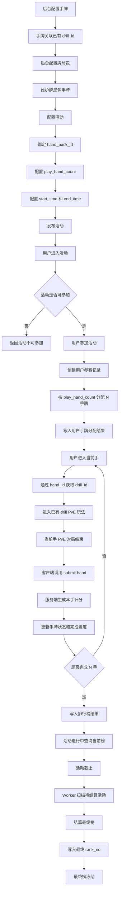
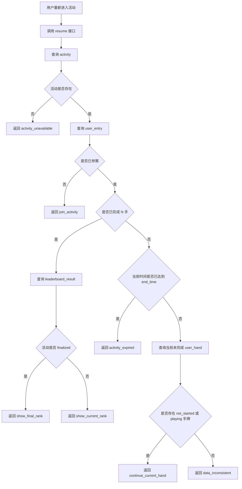
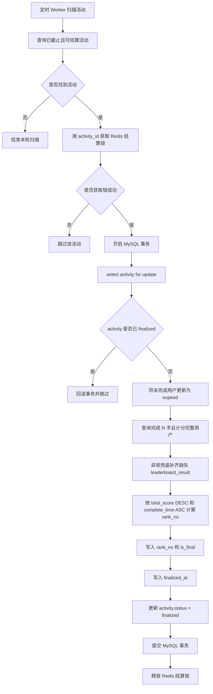
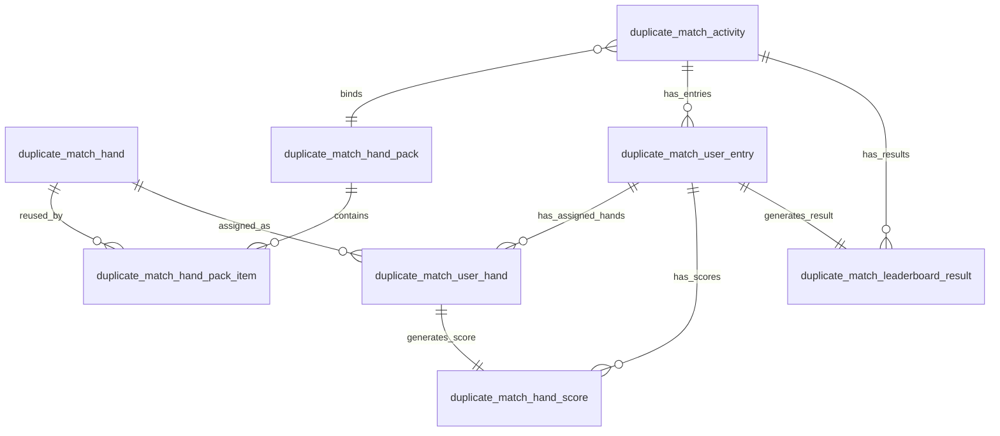
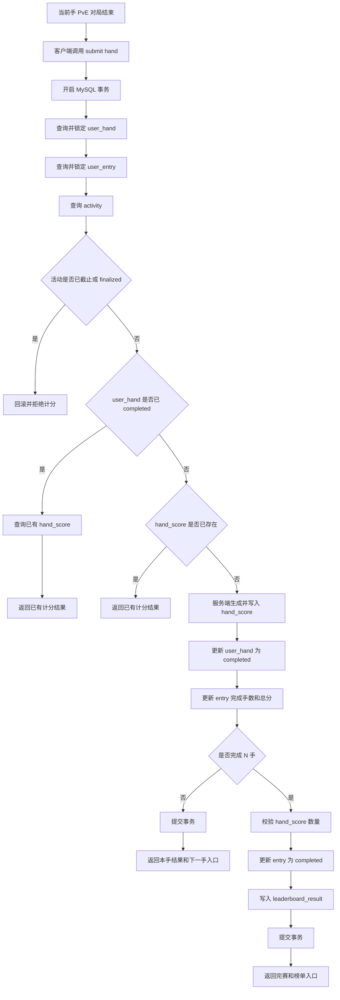

# 复式扑克 PvE 排名赛 7.15 研发设计文档

## 1. 文档目标与 7.15 交付范围

### 1.1 文档目标

本文档用于说明复式扑克 PvE 排名赛 7.15 阶段的服务端研发设计方案，重点覆盖：

1. 活动、牌局包、手牌配置。
2. 用户参加活动后的固定手牌分配。
3. 用户逐手完成 PvE 对局后的计分与进度推进。
4. 用户断线、刷新、退出、服务端重启后的继续方案。
5. 当前榜、最终榜、活动截止结算方案。
6. 重复提交、多设备提交、最后一手响应丢失等核心异常的数据兜底。

本文档重点回答：

```text
7.15 怎么做？
核心表够不够？
数据正确性怎么保证？
排行榜怎么实现？
断线重启怎么继续？
哪些能力本期不做？
哪些问题需要评审确认？
```

---

### 1.2 7.15 支持范围

| 模块     | 7.15 支持内容                                           |
| ------ | --------------------------------------------------- |
| 活动配置   | 后台配置活动、牌局包、挑战手数、开始时间、截止时间、活动状态                      |
| 手牌配置   | 手牌通过 `drill_id` 关联已有 drill 玩法                       |
| 牌局包配置  | 一个牌局包包含多手牌，支持必选手和随机候选手                              |
| 用户参赛   | 用户参加活动后生成一条参赛记录                                     |
| 手牌分配   | 用户参加活动后，按 `play_hand_count` 生成固定 N 手牌               |
| PvE 对局 | 用户按顺序逐手进入已有 drill 玩法完成挑战                            |
| 每手计分   | 当前手 PvE 对局结束后，服务端生成输赢结果和 0-100 分                    |
| 进度恢复   | 用户中途退出后，恢复到当前活动进度                                   |
| 当前榜    | 用户完成全部 N 手后进入当前榜                                    |
| 最终榜    | 活动截止后生成最终榜并冻结排名                                     |
| 截止结算   | 活动截止后由 Worker 结算最终榜                                 |
| 异常兜底   | 支持重复 join、重复 start hand、重复 submit、多设备提交、服务端重启后的数据兜底 |

---

### 1.3 7.15 不支持范围

| 不支持项         | 说明                                      |
| ------------ | --------------------------------------- |
| 单手牌中途恢复      | 不恢复 flop / turn / river 等单手中途局面         |
| 动作级日志        | 不保存 check / call / raise / fold 等完整动作日志 |
| 牌局快照         | 不保存公共牌、底池、筹码、当前行动方等中途状态                 |
| 完整回放         | 不支持基于动作日志的牌局回放                          |
| 复杂多设备会话锁     | 不限制用户只能在一个设备操作，只保证最终数据正确                |
| 截止宽限期        | 截止后不允许继续提交计分                            |
| Redis 排行榜事实源 | Redis 不作为排行榜真实数据来源                      |
| 当前榜历史快照      | 不保留活动进行中的历史排名变化                         |
| 排名快照表        | 7.15 不单独设计排名快照表                         |
| 复杂计分规则版本     | 7.15 默认按当前固定计分口径实现，复杂规则版本后续扩展           |

---

## 2. 核心业务闭环

### 2.1 主业务闭环



说明：

1. `submit hand` 不是用户提交分数，而是当前手 PvE 对局结束后，客户端通知排名赛服务端“当前手已完成，可以结算并推进进度”。
2. 服务端不信任前端分数，`win_loss_bb` 和 `score` 必须由服务端基于 PvE 对局结算结果生成。
3. 如果当前手已经打完，但客户端没有成功调用 `submit hand`，服务端不会确认该手完成；下次进入时仍按 `user_hand.status = playing` 处理，从当前手开头重新打。

---

### 2.2 用户恢复闭环



说明：

1. `resume` 原则上只读，不推进核心进度状态。
2. `resume` 遇到已截止且未完成用户，返回 `activity_expired`。
3. 未完成用户批量更新为 `expired`，由 Worker 最终结算阶段处理。
4. 7.15 恢复的是活动进度，不恢复单手牌中途状态。

---

### 2.3 最终榜结算闭环



说明：

1. 正常路径是在用户完成第 N 手时，同事务写入 `leaderboard_result`。
2. 结算阶段补齐 `leaderboard_result` 只作为异常兜底，不作为主入榜路径。
3. `activity.status = finalized` 必须最后更新。

---

## 3. 核心设计结论

| 设计点      | 结论                                                                              |
| -------- | ------------------------------------------------------------------------------- |
| 事实源      | MySQL 是唯一事实源                                                                    |
| Redis 边界 | Redis 只做排行榜分页缓存、可选我的排名缓存、活动结算锁                                                  |
| 手牌分配     | 用户参赛后生成固定 N 手牌，后续不重新分配                                                          |
| 计分方式     | 当前手 PvE 对局结束后，服务端生成 `hand_score`                                                |
| 完成判断     | `completed_hand_count = play_hand_count` 且 `hand_score_count = play_hand_count` |
| 入榜条件     | 完成 N 手、计分完整、完成时间早于活动截止时间                                                        |
| 当前榜      | 活动进行中动态查询，不落库 `rank_no`                                                         |
| 最终榜      | 活动截止后 Worker 结算，写入 `rank_no` 并冻结                                                |
| 恢复边界     | 只恢复活动进度，不恢复单手中途状态                                                               |
| 截止口径     | 以服务端执行计分事务时的时间为准                                                                |
| 幂等兜底     | MySQL 事务、行锁、唯一约束、幂等返回                                                           |
| 结算兜底     | Redis 锁减少重复结算，MySQL 状态和事务保证最终正确性                                                |

---

### 3.1 MySQL 事实源

以下数据必须以 MySQL 为准：

| 数据         | 事实源                                                                             |
| ---------- | ------------------------------------------------------------------------------- |
| 活动配置       | `duplicate_match_activity`                                                      |
| 牌局包配置      | `duplicate_match_hand_pack`、`duplicate_match_hand_pack_item`                    |
| 用户是否参赛     | `duplicate_match_user_entry`                                                    |
| 用户分配到哪些手牌  | `duplicate_match_user_hand`                                                     |
| 用户完成了哪些手牌  | `duplicate_match_user_hand`、`duplicate_match_hand_score`                        |
| 用户是否完成 N 手 | `duplicate_match_user_entry`、`duplicate_match_hand_score`                       |
| 用户是否入榜     | `duplicate_match_leaderboard_result`                                            |
| 当前榜 / 最终榜  | `duplicate_match_leaderboard_result`                                            |
| 活动是否结算完成   | `duplicate_match_activity.status`、`duplicate_match_leaderboard_result.is_final` |

以下内容不能作为事实源：

```text
前端内存
localStorage
Redis
服务端内存
```

---

### 3.2 Redis 使用边界

Redis 负责：

1. 当前榜分页缓存。
2. 最终榜分页缓存。
3. 可选的我的排名缓存。
4. 活动结算锁。

Redis 不负责：

```text
不判断用户是否完成 N 手。
不判断用户是否入榜。
不保存最终可信 rank_no。
不替代 MySQL 最终结算。
不作为断线恢复依据。
不在 MySQL 事务提交前更新缓存。
```

Redis 不可用时：

1. 查询接口可以回退 MySQL 查询。
2. 写缓存失败不影响 MySQL 事实数据。
3. 只影响查询性能或短时间展示新鲜度，不影响比赛结果正确性。

---

### 3.3 关键唯一约束

| 约束                                                      | 作用                |
| ------------------------------------------------------- | ----------------- |
| `uk_activity_user(activity_id, user_id)`                | 防止同一用户在同一活动重复参赛   |
| `uk_entry_order(entry_id, order_no)`                    | 防止同一参赛记录下手牌顺序重复   |
| `uk_entry_hand(entry_id, hand_id)`                      | 防止同一参赛记录下重复分配同一手牌 |
| `uk_user_hand(user_hand_id)`                            | 防止同一手牌重复计分        |
| `uk_entry(entry_id)` on leaderboard                     | 防止同一参赛记录重复入榜      |
| `uk_activity_user(activity_id, user_id)` on leaderboard | 防止同一用户在同一活动重复入榜   |

---

## 4. 核心表结构设计

### 4.1 核心表清单

7.15 阶段使用 8 张核心表。

| 序号 | 表名                                   | 核心职责                              |
| -: | ------------------------------------ | --------------------------------- |
|  1 | `duplicate_match_hand`               | 手牌基础表，通过 `drill_id` 关联已有 drill 玩法 |
|  2 | `duplicate_match_hand_pack`          | 牌局包表，定义一组候选手牌集合                   |
|  3 | `duplicate_match_hand_pack_item`     | 牌局包和手牌的关联表，标记必选手 / 随机候选手          |
|  4 | `duplicate_match_activity`           | 活动配置表，绑定牌局包，配置挑战手数、活动时间和活动状态      |
|  5 | `duplicate_match_user_entry`         | 用户参赛记录表，记录用户参加活动和完成进度             |
|  6 | `duplicate_match_user_hand`          | 用户手牌分配表，记录用户本次实际分配到的 N 手牌         |
|  7 | `duplicate_match_hand_score`         | 每手计分结果表，保存每手输赢结果和 0-100 分         |
|  8 | `duplicate_match_leaderboard_result` | 榜单结果表，保存完成 N 手后的榜单结果，最终榜结算后冻结     |

---

### 4.2 表关系总览



---

### 4.3 核心表职责与关键字段

| 表名                                   | 核心字段                                                                                                    | 关键说明                               |
| ------------------------------------ | ------------------------------------------------------------------------------------------------------- | ---------------------------------- |
| `duplicate_match_hand`               | `id`、`drill_id`、`status`                                                                                | 只定义手牌基础信息，`drill_id` 关联已有 drill 玩法 |
| `duplicate_match_hand_pack`          | `id`、`pack_name`、`status`                                                                               | 表示一个牌局包，不直接保存手牌                    |
| `duplicate_match_hand_pack_item`     | `hand_pack_id`、`hand_id`、`is_fixed`                                                                     | 表达牌局包和手牌关系，支持必选手和随机候选手             |
| `duplicate_match_activity`           | `hand_pack_id`、`play_hand_count`、`start_time`、`end_time`、`status`                                       | 活动主配置，`play_hand_count` 是全链路挑战手数来源 |
| `duplicate_match_user_entry`         | `activity_id`、`user_id`、`status`、`play_hand_count`、`completed_hand_count`、`total_score`、`complete_time` | 用户参赛记录，记录进度和总分                     |
| `duplicate_match_user_hand`          | `entry_id`、`user_id`、`hand_id`、`order_no`、`hand_source`、`status`                                        | 用户实际分配到的 N 手牌，是恢复和计分依据             |
| `duplicate_match_hand_score`         | `user_hand_id`、`entry_id`、`hand_id`、`win_loss_bb`、`score`、`score_at`                                    | 保存单手计分结果，同一 `user_hand` 只能计分一次     |
| `duplicate_match_leaderboard_result` | `activity_id`、`entry_id`、`user_id`、`total_score`、`rank_no`、`is_final`、`finalized_at`                    | 当前榜和最终榜共用，最终结算后写入 `rank_no`        |

---

### 4.4 活动状态与参赛状态

活动状态建议：

| 状态          | 含义                 |
| ----------- | ------------------ |
| `draft`     | 草稿，未发布             |
| `published` | 已发布，是否可参加还需要结合时间判断 |
| `finalized` | 已结算，最终榜已冻结         |
| `disabled`  | 已停用                |

如果活动状态枚举需要增加 `ended` 中间态，用于表达“已截止但未结算”，需要在评审中确认。

用户参赛状态建议：

| 状态          | 含义          |
| ----------- | ----------- |
| `joined`    | 已参加，尚未开始第一手 |
| `playing`   | 挑战中         |
| `completed` | 已完成全部 N 手   |
| `expired`   | 活动截止后未完成    |
| `invalid`   | 异常作废        |

手牌状态建议：

| 状态            | 含义           |
| ------------- | ------------ |
| `not_started` | 未开始          |
| `playing`     | 用户进入过该手，但未完成 |
| `completed`   | 已完成并计分       |
| `expired`     | 活动截止后未完成     |

---

## 5. 用户参赛、手牌分配与计分流程

### 5.1 join：用户参赛与固定手牌分配

接口：

```http
POST /duplicate-match/activities/:activityId/join
```

职责：

1. 校验活动是否存在。
2. 校验活动是否可参加。
3. 校验用户是否已经参加。
4. 未参加时，创建 `duplicate_match_user_entry`。
5. 根据活动配置生成固定 N 手牌。
6. 批量写入 `duplicate_match_user_hand`。
7. 返回参赛记录和第一手信息。
8. 重复调用时，返回已有参赛记录和已有手牌分配，不重新生成。

活动可参加条件：

```text
activity.status = published
now >= activity.start_time
now < activity.end_time
```

重复 join 处理：

```text
如果 activity_id + user_id 对应 entry 已存在：
  不重新创建 entry
  不重新分配 user_hand
  查询已有 entry 和 user_hand
  返回已有参赛信息
```

数据兜底：

```text
duplicate_match_user_entry.uk_activity_user(activity_id, user_id)
```

---

### 5.2 手牌分配规则

用户首次 join 成功时，系统根据活动配置生成 N 手牌。

数据来源：

| 数据      | 来源                                         |
| ------- | ------------------------------------------ |
| 活动挑战手数  | `duplicate_match_activity.play_hand_count` |
| 活动绑定牌局包 | `duplicate_match_activity.hand_pack_id`    |
| 牌局包内手牌  | `duplicate_match_hand_pack_item`           |
| 手牌是否可用  | `duplicate_match_hand.status`              |
| 手牌对应玩法  | `duplicate_match_hand.drill_id`            |

分配规则：

1. 读取活动绑定的 `hand_pack_id`。
2. 查询牌局包下所有可用手牌。
3. 先选择 `is_fixed = 1` 的必选手。
4. 再从 `is_fixed = 0` 的随机候选手中补足剩余手数。
5. 最终分配数量必须等于 `play_hand_count`。
6. 将最终分配结果写入 `duplicate_match_user_hand`。
7. 每条 `user_hand` 写入 `order_no`，表示用户挑战顺序。

分配前置校验：

```text
play_hand_count > 0
牌局包存在且可用
可用手牌数量 >= play_hand_count
必选手数量 <= play_hand_count
所有被分配手牌 status = enabled
所有被分配手牌存在有效 drill_id
```

---

### 5.3 start hand：进入当前手

接口：

```http
POST /duplicate-match/user-hands/:userHandId/start
```

职责：

1. 校验 `user_hand` 是否存在。
2. 校验 `user_hand` 是否属于当前用户。
3. 校验对应 `entry` 是否可继续。
4. 校验活动是否未截止。
5. 如果 `user_hand.status = not_started`，更新为 `playing`。
6. 如果 `user_hand.status = playing`，直接返回当前手信息。
7. 如果 `user_hand.status = completed`，不允许重新进入。
8. 如果 `user_hand.status = expired`，不允许继续。

状态处理：

| `user_hand.status` | 处理                          |
| ------------------ | --------------------------- |
| `not_started`      | 更新为 `playing`，返回 `drill_id` |
| `playing`          | 直接返回 `drill_id`，从当前手开头重新打   |
| `completed`        | 返回已完成，不允许重打                 |
| `expired`          | 返回活动已截止，不允许继续               |

说明：

```text
playing 只表示用户曾经进入过该手，不表示能恢复到单手中途状态。
```

---

### 5.4 submit hand：每手计分与进度推进

接口：

```http
POST /duplicate-match/user-hands/:userHandId/submit
```

职责：

1. 校验 `user_hand`、`entry`、`activity`。
2. 判断活动是否已经截止。
3. 判断当前手是否已经完成。
4. 如果不存在 `hand_score`，由服务端基于 PvE 对局结算结果生成本手计分。
5. 写入 `duplicate_match_hand_score`。
6. 更新 `user_hand.status = completed`。
7. 更新 `entry.completed_hand_count` 和 `entry.total_score`。
8. 如果完成 N 手，更新 `entry.status = completed`。
9. 如果完成 N 手，写入 `duplicate_match_leaderboard_result`。
10. 返回本手结果和下一步动作。

关键口径：

```text
submit hand 不是用户提交分数。
客户端只触发“当前手已完成”的提交。
win_loss_bb 和 score 必须由服务端生成。
```

如果：

```text
now >= activity.end_time
```

则：

```text
不生成 hand_score。
不更新 user_hand。
不更新 entry.completed_hand_count。
不写入 leaderboard_result。
返回活动已截止。
```

---

### 5.5 每手提交流程



---

### 5.6 完成 N 手与最后一手入榜

完成 N 手不能只依赖 `completed_hand_count`。

完成判断需要同时满足：

```text
entry.completed_hand_count = entry.play_hand_count
hand_score_count = entry.play_hand_count
```

完成第 N 手时，以下操作必须在同一个 MySQL 事务中完成：

1. 写入当前手 `hand_score`。
2. 更新当前 `user_hand.status = completed`。
3. 更新 `entry.completed_hand_count`。
4. 更新 `entry.total_score`。
5. 校验 `hand_score_count = play_hand_count`。
6. 更新 `entry.status = completed`。
7. 写入 `duplicate_match_leaderboard_result`。

如果 `leaderboard_result` 写入失败，整个事务必须回滚。

---

### 5.7 total_score 计算口径

`total_score` 由用户 N 手 `score` 聚合生成。

当前建议：

```text
如果产品和计分规则未额外定义，默认采用 AVG(hand_score.score)，使 total_score 保持在 0-100 区间。
```

最终以产品确认的计分规则为准。

---

## 6. 断线 / 重启 / 继续方案

### 6.1 设计目标

7.15 支持用户退出后继续活动进度。

支持范围：

| 场景             | 处理方式                                        |
| -------------- | ------------------------------------------- |
| 用户刷新页面         | 调用 resume，基于 MySQL 恢复下一步                    |
| 用户退出 App 后重新进入 | 调用 resume，返回当前未完成手牌                         |
| 网络断开后重连        | 调用 resume 或重复 submit，返回服务端真实状态              |
| 服务端重启          | 不依赖内存，从 MySQL 查询状态                          |
| 当前手未完成         | 从当前手开头重新打                                   |
| 已完成手牌          | 不允许重打，返回已完成状态                               |
| 最后一手响应丢失       | resume 查询 entry 和 leaderboard_result，返回榜单入口 |
| 多设备同时提交        | 通过事务和唯一约束保证只计分一次                            |

不支持范围：

| 场景                            | 原因             |
| ----------------------------- | -------------- |
| 恢复到 flop / turn / river 等中途街口 | 需要动作日志和牌局快照    |
| 恢复底池、筹码、当前行动方                 | 7.15 不保存单手中途状态 |
| 完整牌局回放                        | 7.15 不保存动作级日志  |
| 多设备会话抢占锁                      | 本期只保证最终数据正确    |
| 截止后宽限提交                       | 本期采用严格截止口径     |

核心规则：

```text
如果 user_hand.status = playing，但没有 hand_score，
说明服务端没有确认这一手完成；
用户下次进入时，从当前手开头重新开始。
```

---

### 6.2 resume 接口职责

接口：

```http
GET /duplicate-match/activities/:activityId/resume
```

resume 接口只回答一个问题：

```text
用户现在进入活动后，下一步应该去哪里？
```

resume 原则上只读，不修改核心进度状态。

| 接口            | 是否修改数据 | 职责                  |
| ------------- | -----: | ------------------- |
| `join`        |      是 | 创建 entry，生成固定 N 手牌  |
| `resume`      |      否 | 查询状态，返回下一步动作        |
| `start hand`  |      是 | 用户进入当前手，更新为 playing |
| `submit hand` |      是 | 完成当前手，计分并推进进度       |

推荐 `nextAction`：

| nextAction              | 含义                  |
| ----------------------- | ------------------- |
| `join_activity`         | 用户未参加活动             |
| `continue_current_hand` | 用户已参加但未完成           |
| `show_current_rank`     | 用户已完成，活动未 finalized |
| `show_final_rank`       | 用户已完成，活动已 finalized |
| `activity_expired`      | 用户未完成但活动已截止         |
| `activity_unavailable`  | 活动不存在、未发布或不可访问      |
| `data_inconsistent`     | 数据状态异常              |

---

### 6.3 恢复事实源

恢复只依赖 MySQL。

| 表名                                   | 作用                              |
| ------------------------------------ | ------------------------------- |
| `duplicate_match_activity`           | 判断活动是否存在、是否开始、是否截止、是否 finalized |
| `duplicate_match_user_entry`         | 判断用户是否参赛、是否完成、完成几手、是否过期         |
| `duplicate_match_user_hand`          | 判断用户当前应该继续哪一手                   |
| `duplicate_match_hand_score`         | 判断每手是否已有计分结果                    |
| `duplicate_match_leaderboard_result` | 判断用户完成 N 手后是否已经入榜               |

不作为恢复依据：

```text
前端内存
localStorage
Redis
服务端内存
```

---

### 6.4 关键恢复场景

| 场景                            | 处理                                              |
| ----------------------------- | ----------------------------------------------- |
| 未参赛                           | 返回 `join_activity`                              |
| 已参赛但未完成，活动未截止                 | 返回当前未完成 `user_hand`                             |
| 当前手 `not_started`             | 进入该手后更新为 `playing`                              |
| 当前手 `playing` 且无 `hand_score` | 从当前手开头重新打                                       |
| 当前手 `completed`               | 不允许重打，进入下一手或榜单                                  |
| 已完成 N 手                       | 查询 `leaderboard_result`，进入当前榜或最终榜               |
| 未完成但活动已截止                     | 返回 `activity_expired`                           |
| 最后一手响应丢失                      | 查询已有 `hand_score` 和 `leaderboard_result`，返回榜单入口 |
| 服务端重启                         | 从 MySQL 重新查询状态恢复                                |

---

## 7. 排行榜与最终结算方案

### 7.1 入榜规则

用户进入排行榜必须同时满足：

```text
entry.status = completed
entry.completed_hand_count = activity.play_hand_count
hand_score_count = activity.play_hand_count
entry.complete_time < activity.end_time
```

未完成用户：

```text
不进入当前榜。
不进入最终榜。
活动截止后更新为 expired。
```

入榜写入表：

```text
duplicate_match_leaderboard_result
```

---

### 7.2 排序口径

排行榜排序口径：

```text
total_score DESC
complete_time ASC
```

含义：

```text
总分越高，排名越靠前。
总分相同，越早完成，排名越靠前。
```

如果后续需要更复杂的同分规则，例如按单手最高分、最低分、胜率等排序，需要扩展 tie-breaker 规则。7.15 第一版先使用总分和完成时间。

---

### 7.3 当前榜规则

当前榜用于活动进行中展示。

数据条件：

```text
activity.status = published
now < activity.end_time
leaderboard_result.is_final = 0
```

排序方式：

```sql
ORDER BY total_score DESC, complete_time ASC
```

当前榜不落库 `rank_no`。

原因：

1. 当前榜会随着新用户完赛持续变化。
2. 每新增一个完赛用户，已有用户排名都可能变化。
3. 如果每次入榜都批量更新 `rank_no`，写入成本较高。
4. 当前榜只是暂定排名，不需要冻结。
5. 查询时按排序规则实时计算即可。

---

### 7.4 最终榜规则

最终榜用于活动截止后展示。

数据条件：

```text
activity.status = finalized
leaderboard_result.is_final = 1
leaderboard_result.rank_no IS NOT NULL
```

排序方式：

```sql
ORDER BY rank_no ASC
```

最终榜结算后：

1. 写入 `rank_no`。
2. 写入 `is_final = 1`。
3. 写入 `finalized_at`。
4. 普通完成流程不能继续更新榜单。
5. 未完成用户不能补入最终榜。
6. 重复结算不能覆盖已 finalized 的结果。

---

### 7.5 当前榜与最终榜数据关系

7.15 第一版不复制一份新的最终榜数据，也不保留历史当前榜快照。

同一张表表达两个阶段：

```text
活动进行中：
leaderboard_result.is_final = 0
leaderboard_result.rank_no = NULL

活动结算后：
leaderboard_result.is_final = 1
leaderboard_result.rank_no = 最终排名
leaderboard_result.finalized_at = 冻结时间
```

活动 `finalized` 后，不再提供当前榜语义，前端应查询最终榜。

---

### 7.6 Redis 缓存策略

当前榜分页缓存：

```text
用户请求当前榜
-> 查询 Redis
-> Redis miss
-> 查询 MySQL
-> 写入 Redis
-> 返回用户
```

当前榜缓存使用 version 方式失效：

```text
用户完成 N 手入榜后，MySQL 事务提交成功。
服务端递增 current leaderboard version。
后续查询使用新 version。
旧缓存不再命中，等待 TTL 自动过期。
```

最终榜分页缓存：

```text
用户第一次查询最终榜
-> Redis miss
-> 查询 MySQL
-> 写入 Redis
-> 返回用户
```

最终榜正常情况下不需要 version，因为最终榜冻结后正常不变化。
如果后台人工重算、数据修复或重新结算，需要显式删除该活动最终榜缓存。

---

### 7.7 最终结算 Worker

触发方式：

```text
独立 Worker 定时扫描 MySQL
-> 找到 end_time <= now 且 status 属于可结算状态的活动
-> 按 activity_id 获取 Redis 结算锁
-> 获取成功后执行最终榜结算
-> 获取失败则跳过
```

Worker 扫描条件建议：

```sql
SELECT id
FROM duplicate_match_activity
WHERE end_time <= NOW()
  AND status IN (<可结算状态>)
LIMIT 100;
```

说明：

1. 如果系统不设计 `ended` 中间态，可结算状态为 `published`。
2. 如果系统设计 `ended` 中间态，可结算状态为 `published`、`ended`。
3. 不建议使用 `status != finalized` 这种宽泛条件。
4. 具体状态枚举以活动表最终定义为准。

结算事务步骤：

1. `select activity for update` 锁定活动。
2. 再次判断 `activity.status` 是否已经 `finalized`。
3. 将未完成用户更新为 `expired`。
4. 查询完成 N 手且计分完整的用户。
5. 异常兜底补齐缺失的 `leaderboard_result`。
6. 按排序口径计算最终 `rank_no`。
7. 更新 `leaderboard_result.is_final = 1`。
8. 写入 `leaderboard_result.rank_no`。
9. 写入 `leaderboard_result.finalized_at`。
10. 最后更新 `activity.status = finalized`。
11. 提交事务。

Redis 锁只减少重复结算，MySQL 状态和事务保证最终正确性。

---

## 8. 异常场景、不做范围与待确认项

### 8.1 核心异常场景

| 异常场景          | 处理方式                     | 兜底机制                                    |
| ------------- | ------------------------ | --------------------------------------- |
| 重复 join       | 返回已有 entry 和 user_hand   | `uk_activity_user`                      |
| 重复 start hand | 根据 user_hand 状态幂等返回      | `user_hand.status`                      |
| 重复 submit     | 返回已有 hand_score          | `uk_user_hand`                          |
| 多设备同时 submit  | 只有一个请求成功，其他返回已有结果        | MySQL 事务 + 唯一约束                         |
| 最后一手响应丢失      | resume / submit 返回已有榜单结果 | entry + hand_score + leaderboard_result |
| 最后一手事务异常      | 整体回滚                     | 同事务提交                                   |
| 截止后提交         | 不计分，不入榜                  | 服务端事务时间判断                               |
| 未完成用户截止       | 标记 expired，不进榜           | Worker 最终结算                             |
| Worker 重复结算   | 已 finalized 则跳过          | Redis 锁 + MySQL finalized               |
| Redis 缓存异常    | 回退 MySQL 查询              | MySQL 事实源                               |
| 当前榜深分页        | 7.15 记录风险，后续优化           | 限制 pageSize                             |
| 我的当前排名        | 默认不自动计算，按需实时查            | MySQL 实时 COUNT 或后续缓存                    |

---

### 8.2 7.15 明确不做范围

| 不做项                         | 说明                           |
| --------------------------- | ---------------------------- |
| 不恢复单手牌中途状态                  | 当前手未完成，下次从当前手开头重新打           |
| 不保存动作级日志                    | 不支持完整回放和动作审计                 |
| 不做完整牌局回放                    | 后续如需回放，需要新增动作日志和快照表          |
| 不做复杂多设备会话锁                  | 只保证最终数据不重复                   |
| 不做截止宽限期                     | 以服务端执行计分事务时间为准               |
| 不使用 Redis 作为排行榜事实源          | Redis 只做缓存和结算锁               |
| 不使用 Redis Sorted Set 作为主排行榜 | 当前排序包含总分和完成时间，先用 MySQL 保证正确性 |
| 不做排名快照表                     | 当前榜动态查询，最终榜冻结                |
| 不保留历史当前榜快照                  | 如后续运营需要复盘再扩展                 |
| 不做最终榜缓存预热                   | 最终榜缓存查询时生成                   |
| 不做复杂异步消息队列                  | 主流程优先使用 MySQL 事务和 Worker     |
| 不做复杂计分规则版本                  | 如后续有多套计分规则再扩展                |

---

### 8.3 必须评审确认项

| 问题                         | 当前建议                                                         | 影响                |
| -------------------------- | ------------------------------------------------------------ | ----------------- |
| 是否允许部署独立 Worker            | 暂按独立 Worker 设计                                               | 影响最终结算触发方式        |
| 活动状态枚举是否包含 `ended`         | 如果存在则 Worker 扫描 `published`、`ended`；如果不存在则扫描已截止的 `published` | 影响 Worker 扫描条件    |
| 截止口径是否严格按服务端提交时间           | 当前建议严格截止                                                     | 影响截止前进入、截止后提交是否计分 |
| 我的当前排名是否必须展示               | 默认不自动计算，仅按需计算                                                | 影响当前榜接口性能         |
| 当前榜是否限制最大翻页深度              | 建议限制                                                         | 影响深分页性能风险         |
| 后台是否需要手动触发结算入口             | 建议保留补偿入口                                                     | 影响线上补偿能力          |
| `total_score` 聚合规则是否采用平均分  | 当前建议默认 AVG(score)，最终以产品计分规则为准                                | 影响榜单排序和测试用例       |
| 同分排序是否只按完成时间               | 当前建议 `total_score DESC, complete_time ASC`                   | 影响最终排名稳定性         |
| data_inconsistent 是否需要后台告警 | 建议记录日志并告警                                                    | 影响异常数据发现和修复       |

---

### 8.4 当前推荐结论

7.15 第一版建议按以下结论推进：

```text
1. MySQL 作为唯一事实源。
2. 用户参赛后生成固定 N 手牌。
3. 断线恢复只恢复活动进度，不恢复单手中途状态。
4. 每手计分通过唯一约束和事务保证幂等。
5. 完成最后一手时，计分、entry 完成、leaderboard_result 写入同事务。
6. 当前榜动态查询，不落库 rank_no。
7. 最终榜截止后由 Worker 结算并冻结 rank_no。
8. Redis 只做分页缓存和活动结算锁。
9. 7.15 不做 Redis Sorted Set、排名快照、历史当前榜快照和复杂宽限期。
10. 深分页、我的当前排名、Sorted Set、快照表都作为后续性能优化或扩展项。
```
