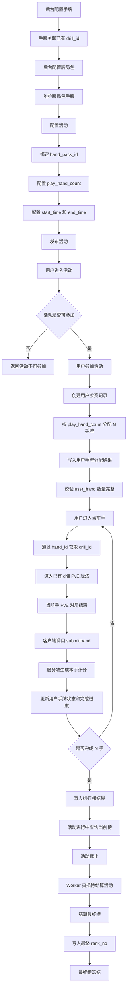
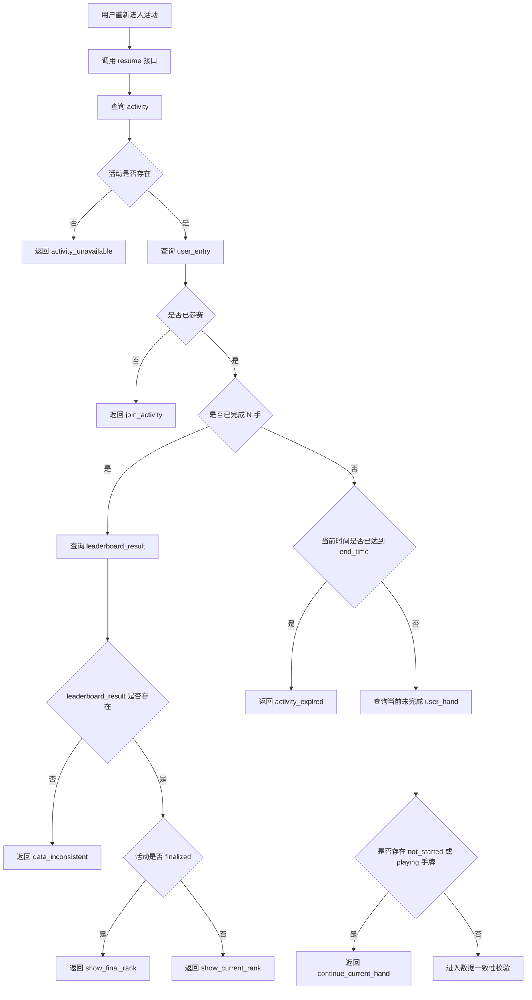
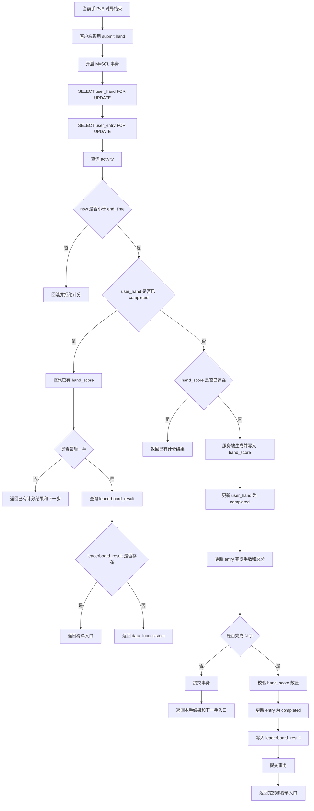
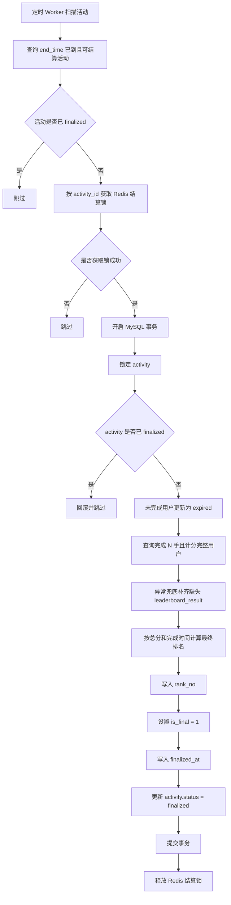
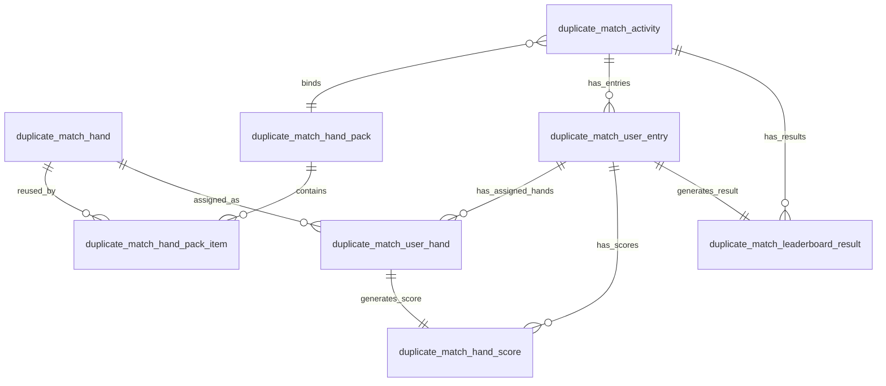
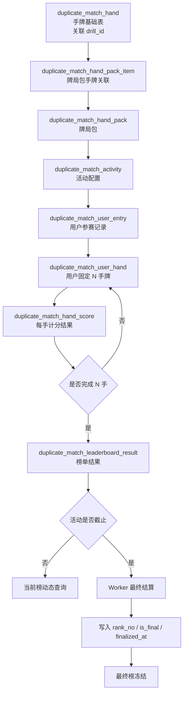
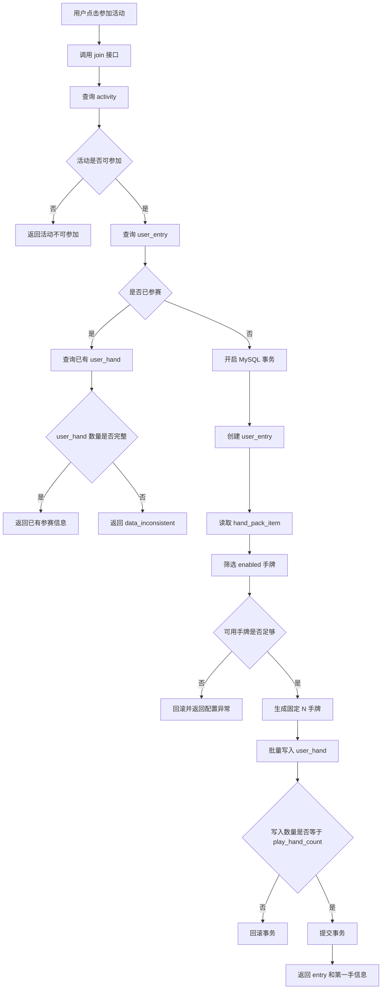
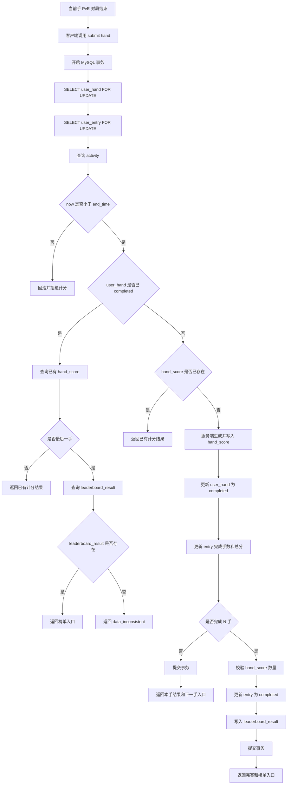
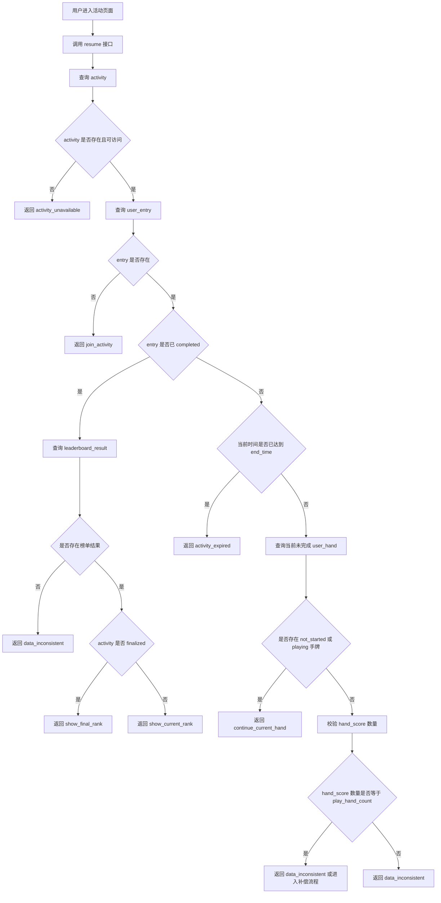

# 复式扑克 PvE 排名赛 7.15 统一研发设计文档（详细版完善稿）

## 1. 文档目标与 7.15 交付范围

### 1.1 文档目标

本文档用于说明复式扑克 PvE 排名赛 7.15 阶段的服务端研发设计方案，重点覆盖：

1. 后台活动配置与牌局包配置。
2. 用户参加活动后的手牌分配。
3. 用户逐手完成 PvE 对局后的计分与进度推进。
4. 用户断线、刷新、退出、服务端重启后的继续方案。
5. 用户完成全部手牌后的当前榜展示。
6. 活动截止后的最终榜结算与冻结。
7. 重复提交、多设备提交、最后一手响应丢失等关键异常场景的数据兜底。
8. 高并发场景下 join、submit hand、缓存重建、最终结算的实现边界。

本文档重点面向服务端研发实现和技术评审，主要解决：

1. 核心数据如何落表。
2. 主流程如何推进。
3. 状态如何流转。
4. 数据一致性如何保证。
5. 排行榜如何保证正确性。
6. 断线和重启后如何恢复用户活动进度。
7. 高并发场景下如何避免重复计分、重复入榜、半成品数据和缓存击穿。
8. 7.15 阶段哪些能力明确不做。

---

### 1.2 7.15 交付范围

7.15 阶段需要支持一个后台可配置的 PvE 排名赛活动。

| 模块     | 7.15 支持内容                                           |
| ------ | --------------------------------------------------- |
| 活动配置   | 后台配置活动、牌局包、挑战手数、开始时间、截止时间、活动状态                      |
| 手牌配置   | 手牌通过 `drill_id` 关联已有 drill 玩法                       |
| 牌局包配置  | 支持一个牌局包包含多手牌，支持必选手和随机候选手                            |
| 用户参赛   | 用户参加活动后生成一条参赛记录                                     |
| 手牌分配   | 用户参加活动后，按活动配置生成固定 N 手牌                              |
| PvE 对局 | 用户按分配顺序逐手进入已有 drill 玩法完成挑战                          |
| 每手计分   | 当前手 PvE 对局结束后，由服务端生成输赢结果和 0-100 分                   |
| 进度恢复   | 用户中途退出后，可恢复到当前活动进度                                  |
| 当前榜    | 用户完成全部 N 手后进入当前榜                                    |
| 最终榜    | 活动截止后生成最终榜并冻结排名                                     |
| 截止结算   | 活动截止后由 Worker 结算最终榜                                 |
| 异常兜底   | 支持重复 join、重复 start hand、重复 submit、多设备提交、服务端重启后的数据兜底 |
| 高并发边界  | 明确 join 半成品校验、submit 串行化、热点缓存重建保护、最终结算容量边界          |

---

### 1.3 7.15 不支持范围

| 不支持项                  | 说明                                         |
| --------------------- | ------------------------------------------ |
| 单手牌中途恢复               | 不恢复 flop / turn / river 等单手中途局面            |
| 动作级日志                 | 不保存用户每一步 check / call / raise / fold 等操作日志 |
| 牌局快照                  | 不保存公共牌、底池、筹码、当前行动方等中途状态                    |
| 完整回放                  | 不支持基于动作日志的牌局回放                             |
| 复杂多设备会话锁              | 不限制用户只能在一个设备操作，只保证最终数据正确                   |
| 截止宽限期                 | 活动截止后不允许继续提交计分                             |
| Redis 排行榜事实源          | Redis 不作为排行榜真实数据来源                         |
| 当前榜历史快照               | 不保留活动进行中的历史排名快照                            |
| 排名快照表                 | 7.15 不单独设计排名快照表                            |
| 复杂计分规则版本              | 7.15 默认按当前固定计分口径实现，复杂规则版本后续扩展              |
| 大活动分批结算任务表            | 7.15 默认按中小规模活动设计，如活动规模变大再扩展                |
| Redis Sorted Set 主排行榜 | 7.15 不把 Redis Sorted Set 作为主榜事实源，后续按规模评估   |

---

### 1.4 核心交付目标

7.15 阶段的核心交付目标是保证以下主流程稳定闭环：

```text
后台配置活动
-> 用户参加活动
-> 系统分配 N 手牌
-> 用户逐手完成 PvE
-> 每手完成后服务端计分
-> 完成 N 手后入榜
-> 活动进行中查看当前榜
-> 活动截止后结算最终榜
-> 最终榜冻结
```

同时保证以下数据正确性目标：

1. 用户参加活动后，分配到的 N 手牌不变化。
2. 同一手牌只能完成一次有效计分。
3. 用户未完成 N 手不能进入排行榜。
4. 用户完成 N 手后，计分结果和榜单结果必须一致。
5. 活动截止后，未完成用户不能继续提交计分。
6. 当前榜可以动态变化，最终榜必须冻结。
7. Redis 不影响比赛结果和排行榜正确性。
8. 服务端重启后，用户进度可以从 MySQL 恢复。
9. 重复 join 不能返回只有 entry、没有完整 user_hand 的半成品数据。
10. 重复 submit 不能只返回局部结果，最后一手必须确认 leaderboard_result。
11. data_inconsistent 必须阻断状态推进，并记录日志和告警。

---

## 2. 7.15 核心业务闭环

### 2.1 主业务闭环



---

### 2.2 用户恢复闭环

用户重新进入活动时，不依赖前端本地状态，而是通过服务端查询 MySQL 判断下一步动作。



说明：

1. resume 原则上只读，不推进核心进度状态。
2. resume 遇到已截止且未完成用户，返回 `activity_expired`。
3. 未完成用户批量更新为 `expired`，由 Worker 最终结算阶段处理。
4. 如果 entry 已 completed，但查询不到 leaderboard_result，属于数据异常，返回 `data_inconsistent`，不能继续推进流程。

---

### 2.3 每手提交闭环



说明：

1. submit hand 不信任前端分数。
2. 客户端只触发当前手完成提交。
3. `win_loss_bb` 和 `score` 由服务端基于 PvE 对局结算结果生成。
4. 最后一手计分、entry 完成、leaderboard_result 写入必须同事务完成。
5. 同一个 `user_hand` 的 submit 请求必须通过行锁串行化处理。
6. 最后一手重复 submit 不能只返回 hand_score，必须同时确认 leaderboard_result 是否存在。

---

### 2.4 最终榜结算闭环



说明：

1. 正常路径是在用户完成第 N 手时，同事务写入 `leaderboard_result`。
2. 结算阶段补齐 `leaderboard_result` 只作为异常兜底，不作为主入榜路径。
3. `activity.status = finalized` 必须最后更新。
4. 7.15 默认按中小规模活动设计，如果单活动用户量较大，需要评估分批结算或结算任务表。

---

## 3. 核心设计结论

### 3.1 数据存储结论

7.15 阶段使用以下 8 张核心表支撑完整业务闭环：

| 序号 | 表名                                   | 作用                                |
| -: | ------------------------------------ | --------------------------------- |
|  1 | `duplicate_match_hand`               | 手牌基础表，通过 `drill_id` 关联已有 drill 玩法 |
|  2 | `duplicate_match_hand_pack`          | 牌局包表，定义一组候选手牌集合                   |
|  3 | `duplicate_match_hand_pack_item`     | 牌局包-手牌关联表，标记必选手 / 随机候选手           |
|  4 | `duplicate_match_activity`           | 活动配置表，绑定牌局包，配置挑战手数、活动时间和活动状态      |
|  5 | `duplicate_match_user_entry`         | 用户参赛记录表，记录用户参加活动和完成进度             |
|  6 | `duplicate_match_user_hand`          | 用户手牌分配表，记录用户本次实际分配到的 N 手牌         |
|  7 | `duplicate_match_hand_score`         | 每手计分结果表，保存每手输赢结果和 0-100 分         |
|  8 | `duplicate_match_leaderboard_result` | 榜单结果表，保存已完成 N 手用户的榜单结果，最终榜结算后冻结   |

7.15 阶段不新增单手中途对局表、动作日志表、排名快照表、复杂计分规则表。
结算任务表 7.15 默认不新增，但如果单活动规模超过当前方案容量边界，需要作为后续扩展项。

---

### 3.2 MySQL 事实源结论

MySQL 是 7.15 阶段的唯一事实源。

以下数据必须以 MySQL 为准：

| 数据         | 事实源                                                                             |
| ---------- | ------------------------------------------------------------------------------- |
| 活动配置       | `duplicate_match_activity`                                                      |
| 牌局包配置      | `duplicate_match_hand_pack`、`duplicate_match_hand_pack_item`                    |
| 用户是否参赛     | `duplicate_match_user_entry`                                                    |
| 用户分配到哪些手牌  | `duplicate_match_user_hand`                                                     |
| 用户完成了哪些手牌  | `duplicate_match_user_hand`、`duplicate_match_hand_score`                        |
| 用户是否完成 N 手 | `duplicate_match_user_entry`、`duplicate_match_hand_score`                       |
| 用户是否入榜     | `duplicate_match_leaderboard_result`                                            |
| 当前榜数据      | `duplicate_match_leaderboard_result`                                            |
| 最终榜数据      | `duplicate_match_leaderboard_result`                                            |
| 活动是否结算完成   | `duplicate_match_activity.status`、`duplicate_match_leaderboard_result.is_final` |

以下内容不能作为事实源：

| 来源           | 不作为事实源的原因         |
| ------------ | ----------------- |
| 前端内存         | 页面刷新、App 退出后会丢失   |
| localStorage | 可被清理或篡改，不可信       |
| Redis        | 只作为缓存或结算锁，不承载比赛结果 |
| 服务端内存        | 服务重启后会丢失          |

---

### 3.3 Redis 使用结论

Redis 只承担辅助能力，不承担比赛正确性。

Redis 在 7.15 阶段只负责：

1. 当前榜分页缓存。
2. 最终榜分页缓存。
3. 活动结算锁。
4. 可选的我的排名缓存。
5. 当前榜热点页缓存重建锁。

Redis 不允许承担以下职责：

1. 不判断用户是否完成 N 手。
2. 不判断用户是否入榜。
3. 不保存最终可信 `rank_no`。
4. 不替代 MySQL 最终结算。
5. 不作为断线恢复依据。
6. 不在 MySQL 事务提交前更新排行榜缓存。

Redis 不可用时：

1. 查询接口可以回退 MySQL 查询。
2. 写缓存失败不影响 MySQL 事实数据。
3. 可能短时间影响查询性能或展示新鲜度，但不影响比赛结果正确性。
4. 如果是热点页缓存 miss，需要避免所有请求同时回源 MySQL。

---

### 3.4 排行榜结论

排行榜设计采用以下结论：

1. 用户完成全部 N 手后，才写入 `duplicate_match_leaderboard_result`。
2. 未完成用户不进入当前榜，也不进入最终榜。
3. 当前榜用于活动进行中展示，排名可以动态变化。
4. 当前榜不强制落库 `rank_no`，查询时按总分和完成时间实时排序。
5. 最终榜用于活动截止后展示，需要写入 `rank_no` 并冻结。
6. 最终榜冻结后，普通完成流程不能继续更新榜单。
7. 活动 `finalized` 后，前端应查询最终榜，不再提供当前榜语义。

排序口径：

```text
total_score DESC
complete_time ASC
```

含义：

```text
总分越高，排名越靠前。
总分相同，越早完成，排名越靠前。
```

---

### 3.5 断线 / 重启继续结论

7.15 阶段支持活动进度恢复，不支持单手牌中途恢复。

恢复规则：

1. 用户未参加活动，返回参加活动入口。
2. 用户已参加但未完成，返回当前未完成手牌。
3. 当前手未开始，进入该手。
4. 当前手进行中，重新从该手开头开始。
5. 当前手已完成，不允许重复打。
6. 用户已完成全部 N 手，进入当前榜或最终榜。
7. 活动已截止且用户未完成，不允许继续挑战。
8. 服务端重启后，仍然基于 MySQL 查询状态恢复用户进度。

统一口径：

```text
恢复的是活动进度，不是单手牌中途状态。
playing 只表示用户进入过该手，不表示可以恢复到 flop / turn / river 中途局面。
```

---

### 3.6 幂等与并发结论

7.15 阶段通过 MySQL 事务、行锁、唯一约束和幂等返回保证核心数据正确。

关键约束包括：

| 约束                                                      | 作用                |
| ------------------------------------------------------- | ----------------- |
| `uk_activity_user(activity_id, user_id)`                | 防止同一用户在同一活动重复参赛   |
| `uk_entry_order(entry_id, order_no)`                    | 防止同一参赛记录下手牌顺序重复   |
| `uk_entry_hand(entry_id, hand_id)`                      | 防止同一参赛记录下重复分配同一手牌 |
| `uk_user_hand(user_hand_id)`                            | 防止同一手牌重复计分        |
| `uk_entry(entry_id)` on leaderboard                     | 防止同一参赛记录重复入榜      |
| `uk_activity_user(activity_id, user_id)` on leaderboard | 防止同一用户在同一活动重复入榜   |

重复请求处理原则：

1. 重复 join：返回已有 entry 和 user_hand，但返回前必须校验 user_hand 数量完整。
2. 重复 start hand：如果已经是 `playing`，直接返回当前手信息。
3. 重复 submit：如果已经有 hand_score，返回已有计分结果。
4. 最后一手重复提交：如果 leaderboard_result 已存在，返回已有榜单结果。
5. 最后一手重复提交但 leaderboard_result 不存在：返回 `data_inconsistent`，不返回正常成功。
6. 多设备同时提交：通过行锁、唯一约束和事务保证最终只成功一次。

---

## 4. 全局一致性设计原则

### 4.1 用户手牌分配一致性

用户参加活动后，系统必须一次性生成本次活动固定的 N 手牌。

一致性要求：

1. 创建 `duplicate_match_user_entry` 和批量写入 `duplicate_match_user_hand` 必须在同一事务内完成。
2. 同一个 `entry_id` 下，`order_no` 必须唯一。
3. 同一个 `entry_id` 下，`hand_id` 不应重复。
4. 一个 `entry_id` 下的 `user_hand` 数量必须等于 `entry.play_hand_count`。
5. 用户后续刷新、退出、换设备、服务端重启，都只能读取已有 `user_hand`，不能重新分配。
6. 重复 join 返回已有结果前，必须校验 `user_hand_count = entry.play_hand_count`。
7. 如果 entry 存在但 user_hand 数量不足，不返回正常参赛结果，返回 `data_inconsistent`。

核心目的：

```text
同一个用户参加同一个活动后，本次实际挑战手牌固定不变。
不能出现只有 entry、没有完整 user_hand 的半成品参赛数据。
```

---

### 4.2 每手计分一致性

每手计分必须保证同一手只生成一条有效计分结果。

一致性要求：

1. `hand_score` 只能由服务端生成。
2. 前端不能直接传入最终分数。
3. 写入 `hand_score`、更新 `user_hand.status`、更新 `entry.completed_hand_count` 必须在同一事务中完成。
4. `duplicate_match_hand_score.user_hand_id` 必须唯一。
5. 如果重复提交，返回已有计分结果，不重复生成分数。
6. 如果并发提交发生唯一键冲突，回滚当前事务后查询已有结果返回。
7. 同一个 `user_hand` 的 submit 请求必须通过 `SELECT ... FOR UPDATE` 串行化。

核心目的：

```text
无论用户重复点击、网络重试，还是多设备同时提交，同一手牌都只能计分一次。
```

---

### 4.3 完成 N 手一致性

用户是否完成活动，不能只依赖单一字段判断。

完成判断需要同时满足：

```text
entry.completed_hand_count = entry.play_hand_count
hand_score 数量 = entry.play_hand_count
```

入榜时还需要满足：

```text
entry.status = completed
entry.complete_time < activity.end_time
```

一致性要求：

1. `completed_hand_count` 用于进度展示和快速判断。
2. `hand_score` 实际数量用于兜底校验。
3. 完成最后一手时，必须重新校验完成手数和计分数量。
4. 未完成 N 手用户不能写入 `leaderboard_result`。
5. 活动截止后未完成用户不能补入当前榜或最终榜。

核心目的：

```text
避免出现完成手数、计分数量、排行榜结果三者不一致。
```

---

### 4.4 最后一手计分与入榜一致性

完成最后一手时，以下操作必须在同一个 MySQL 事务中完成：

1. 写入 `duplicate_match_hand_score`。
2. 更新 `duplicate_match_user_hand.status = completed`。
3. 更新 `duplicate_match_user_entry.completed_hand_count`。
4. 更新 `duplicate_match_user_entry.total_score`。
5. 更新 `duplicate_match_user_entry.status = completed`。
6. 写入 `duplicate_match_leaderboard_result`。

如果 `leaderboard_result` 写入失败，整个事务必须回滚。

最后一手重复 submit 时，不能只返回 `hand_score`，还必须确认：

```text
entry.status = completed
leaderboard_result 存在
```

如果：

```text
entry.status = completed
但 leaderboard_result 不存在
```

则说明最后一手事务结果不完整，应返回 `data_inconsistent`，不返回正常完赛成功。

核心目的：

```text
避免出现有计分结果但 entry 没完成、entry 已完成但没有排行榜结果、排行榜有结果但完成手数不对。
```

---

### 4.5 排行榜一致性

排行榜正确性必须由 MySQL 保证。

一致性要求：

1. `leaderboard_result` 只保存完成 N 手用户。
2. 当前榜从 `leaderboard_result` 查询，不从 Redis 直接判断。
3. 当前榜查询时动态排序，不提前冻结 `rank_no`。
4. 最终榜结算时写入 `rank_no`、`is_final`、`finalized_at`。
5. 活动 finalized 后，不允许普通完成流程继续更新榜单。
6. Redis 缓存失效不能影响 MySQL 中的真实榜单结果。

核心目的：

```text
Redis 可以影响查询性能，但不能影响排行榜正确性。
```

---

### 4.6 活动截止一致性

7.15 阶段采用严格截止口径。

判断标准：

```text
以服务端执行计分事务时的时间为准。
```

如果：

```text
now >= activity.end_time
```

则不允许继续完成手牌：

1. 不生成 `hand_score`。
2. 不更新 `entry.completed_hand_count`。
3. 不更新 `entry.status = completed`。
4. 不写入 `leaderboard_result`。

需要特别明确：

```text
finalized 只表示最终榜是否已经结算完成。
end_time 才是是否允许继续 submit hand 的截止依据。
```

所以即使：

```text
activity.status 还不是 finalized
```

只要：

```text
now >= activity.end_time
```

也不能继续计分。

场景规则：

| 场景           | 是否计分 |
| ------------ | ---: |
| 截止前进入，截止前提交  |    是 |
| 截止前进入，截止后提交  |    否 |
| 截止后进入        |    否 |
| 已完成全部手牌后查看榜单 |    是 |

---

### 4.7 最终结算一致性

最终结算由 Worker 触发，按活动维度结算。

一致性要求：

1. Worker 只扫描已截止且可结算的活动。
2. 同一个活动同一时间只允许一个结算任务执行。
3. Redis 结算锁只做并发辅助。
4. MySQL 事务和 activity 状态负责最终兜底。
5. 结算时先处理未完成用户，再计算最终排名。
6. `rank_no`、`is_final`、`finalized_at` 写入完成后，最后再更新 `activity.status = finalized`。
7. 如果活动已经 finalized，重复结算任务必须跳过。
8. 7.15 默认按中小规模活动设计，如果单活动用户量较大，需要压测最终结算耗时，并评估分批结算。

核心目的：

```text
避免多个 Worker 重复结算同一个活动，避免最终榜冻结状态和榜单数据不一致。
```

---

### 4.8 Redis 与 MySQL 提交顺序原则

凡是涉及用户进度、计分、入榜、最终结算的逻辑，必须先完成 MySQL 事务，再更新 Redis。

原则：

```text
先提交 MySQL
再更新 Redis 缓存版本或缓存结果
```

不允许：

```text
MySQL 事务未提交前，提前更新排行榜缓存。
```

原因：

1. 如果 MySQL 事务回滚，但 Redis 已更新，会导致缓存数据和事实数据不一致。
2. 如果 Redis 更新失败，MySQL 仍然是事实源，可以通过缓存 miss 后重新生成。
3. Redis 清空或过期，不影响用户进度恢复、计分结果和榜单正确性。
4. 当前榜热点页缓存 miss 时，需要缓存重建保护，避免大量请求同时打到 MySQL。

---

## 5. 核心表结构设计

### 5.1 设计目标

7.15 阶段的表结构需要支撑完整 PvE 排名赛闭环：

1. 后台配置活动、牌局包和手牌。
2. 手牌通过 `drill_id` 复用已有 drill 玩法。
3. 用户参加活动后，系统生成固定 N 手牌。
4. 用户逐手完成 PvE 对局。
5. 每手完成后生成计分结果。
6. 用户完成全部 N 手后写入榜单结果。
7. 用户断线、刷新、退出、服务端重启后，可以基于 MySQL 恢复活动进度。
8. 活动截止后，系统结算并冻结最终榜。

表结构设计优先保证：

1. 用户参赛记录唯一。
2. 用户分配到的 N 手牌固定不变。
3. 同一手牌只能计分一次。
4. 未完成 N 手不能入榜。
5. 当前榜和最终榜共用一致的数据来源。
6. Redis 不参与比赛事实数据存储。
7. 高并发重复请求下，依靠唯一约束和事务兜底。

---

### 5.2 核心表清单

7.15 阶段使用 8 张核心表。

| 序号 | 表名                                   | 作用                                |
| -: | ------------------------------------ | --------------------------------- |
|  1 | `duplicate_match_hand`               | 手牌基础表，通过 `drill_id` 关联已有 drill 玩法 |
|  2 | `duplicate_match_hand_pack`          | 牌局包表，定义一组候选手牌集合                   |
|  3 | `duplicate_match_hand_pack_item`     | 牌局包和手牌的关联表，标记必选手 / 随机候选手          |
|  4 | `duplicate_match_activity`           | 活动配置表，绑定牌局包，配置挑战手数、活动时间和活动状态      |
|  5 | `duplicate_match_user_entry`         | 用户参赛记录表，记录用户参加活动和完成进度             |
|  6 | `duplicate_match_user_hand`          | 用户手牌分配表，记录用户本次实际分配到的 N 手牌         |
|  7 | `duplicate_match_hand_score`         | 每手计分结果表，保存每手输赢结果和 0-100 分         |
|  8 | `duplicate_match_leaderboard_result` | 榜单结果表，保存完成 N 手后的榜单结果，最终榜结算后冻结     |

---

### 5.3 表关系总览



---

### 5.4 活动配置相关表

#### 5.4.1 `duplicate_match_hand`

`duplicate_match_hand` 是手牌基础表，用于把 PvE 排名赛中的一手牌关联到已有 drill 玩法。

核心字段：

| 字段名          | 说明                               |
| ------------ | -------------------------------- |
| `id`         | 手牌 ID                            |
| `drill_id`   | 关联已有 drill 玩法 ID                 |
| `hand_name`  | 手牌名称，后台识别用                       |
| `hand_desc`  | 手牌说明，可选                          |
| `status`     | 手牌状态，建议使用 `enabled` / `disabled` |
| `created_at` | 创建时间                             |
| `updated_at` | 更新时间                             |

设计边界：

1. 本表只定义手牌基础信息。
2. 本表不保存牌局包关系。
3. 本表不保存用户实际分配结果。
4. 本表不保存用户计分结果。
5. 本表不保存排行榜结果。

---

#### 5.4.2 `duplicate_match_hand_pack`

`duplicate_match_hand_pack` 是牌局包表，用于定义一组候选手牌集合。

核心字段：

| 字段名          | 说明                                |
| ------------ | --------------------------------- |
| `id`         | 牌局包 ID                            |
| `pack_name`  | 牌局包名称                             |
| `pack_desc`  | 牌局包说明，可选                          |
| `status`     | 牌局包状态，建议使用 `enabled` / `disabled` |
| `created_at` | 创建时间                              |
| `updated_at` | 更新时间                              |

设计边界：

1. 牌局包只表示候选池。
2. 牌局包不直接保存 `hand_id`。
3. 牌局包不保存 `drill_id`。
4. 牌局包不保存 `play_hand_count`。
5. 牌局包不保存用户实际分配结果。

---

#### 5.4.3 `duplicate_match_hand_pack_item`

`duplicate_match_hand_pack_item` 是牌局包和手牌的关联表，用于支持一个牌局包包含多手牌，也支持同一手牌被多个牌局包复用。

核心字段：

| 字段名            | 说明                        |
| -------------- | ------------------------- |
| `id`           | 主键 ID                     |
| `hand_pack_id` | 牌局包 ID                    |
| `hand_id`      | 手牌 ID                     |
| `is_fixed`     | 是否必选手，`1` 表示必选，`0` 表示随机候选 |
| `created_at`   | 创建时间                      |
| `updated_at`   | 更新时间                      |

关键约束：

| 约束                                         | 作用                 |
| ------------------------------------------ | ------------------ |
| `uk_hand_pack_hand(hand_pack_id, hand_id)` | 保证同一牌局包内，同一手牌只配置一次 |

设计边界：

1. 本表只表达牌局包和手牌关系。
2. `is_fixed = 1` 表示用户参赛后必须分配到该手。
3. `is_fixed = 0` 表示该手进入随机候选池，不代表每个用户一定会打到。
4. 必选手数量不能超过活动的 `play_hand_count`。

---

#### 5.4.4 `duplicate_match_activity`

`duplicate_match_activity` 是活动配置主表。用户参加的是活动，活动绑定一个牌局包，并配置本次活动需要完成的手牌数量。

核心字段：

| 字段名               | 说明             |
| ----------------- | -------------- |
| `id`              | 活动 ID          |
| `activity_name`   | 活动名称           |
| `activity_desc`   | 活动说明，可选        |
| `hand_pack_id`    | 绑定的牌局包 ID      |
| `play_hand_count` | 本活动用户需要完成的手牌数量 |
| `start_time`      | 活动开始时间         |
| `end_time`        | 活动截止时间         |
| `status`          | 活动状态           |
| `created_at`      | 创建时间           |
| `updated_at`      | 更新时间           |

活动状态建议：

| 状态          | 含义                 |
| ----------- | ------------------ |
| `draft`     | 草稿，未发布             |
| `published` | 已发布，是否可参加还需要结合时间判断 |
| `finalized` | 已结算，最终榜已冻结         |
| `disabled`  | 已停用                |

如果活动状态枚举需要增加 `ended` 中间态，用于表达“已截止但未结算”，需要在评审中确认。

活动是否可参加，不只看 `status`，还需要结合时间判断：

```text
activity.status = published
now >= activity.start_time
now < activity.end_time
```

`play_hand_count` 是 7.15 全链路的核心配置，后续用户分配、完成判断、计分汇总、入榜判断、当前榜和最终榜都必须以它为准，不能在代码中写死 10。

---

### 5.5 用户参赛与手牌分配相关表

#### 5.5.1 `duplicate_match_user_entry`

`duplicate_match_user_entry` 记录用户在某个活动中的参赛记录，用于表达用户是否参加、完成几手、是否完成、是否过期。

核心字段：

| 字段名                    | 说明          |
| ---------------------- | ----------- |
| `id`                   | 参赛记录 ID     |
| `activity_id`          | 活动 ID       |
| `user_id`              | 用户 ID       |
| `status`               | 参赛状态        |
| `play_hand_count`      | 本次活动挑战手数快照  |
| `hand_pack_id`         | 本次活动绑定牌局包快照 |
| `completed_hand_count` | 已完成手数       |
| `current_order_no`     | 当前进行到第几手    |
| `total_score`          | 当前活动总分      |
| `join_time`            | 参加时间        |
| `start_time`           | 开始第一手时间     |
| `complete_time`        | 完成全部 N 手时间  |
| `expire_time`          | 过期时间        |
| `created_at`           | 创建时间        |
| `updated_at`           | 更新时间        |

参赛状态建议：

| 状态          | 含义          |
| ----------- | ----------- |
| `joined`    | 已参加，尚未开始第一手 |
| `playing`   | 挑战中         |
| `completed` | 已完成全部 N 手   |
| `expired`   | 活动截止后未完成    |
| `invalid`   | 异常作废        |

关键约束：

| 约束                                       | 作用                   |
| ---------------------------------------- | -------------------- |
| `uk_activity_user(activity_id, user_id)` | 保证一个用户在一个活动中只有一条参赛记录 |

设计边界：

1. `user_entry.status` 不表达最终榜是否冻结。
2. 最终榜冻结由 `activity.status = finalized` 和 `leaderboard_result.is_final = 1` 表达。
3. `completed_hand_count` 是进度字段，不能单独作为最终完成判断的唯一依据。
4. 入榜时还需要校验 `hand_score` 数量是否等于 `play_hand_count`。
5. entry 存在但 user_hand 数量不足，属于数据异常，不能按正常参赛结果返回。

---

#### 5.5.2 `duplicate_match_user_hand`

`duplicate_match_user_hand` 记录用户参加活动后，系统实际分配给用户的 N 手牌。

这张表是断线恢复、进度推进、逐手计分的基础。

核心字段：

| 字段名            | 说明                      |
| -------------- | ----------------------- |
| `id`           | 用户手牌记录 ID               |
| `activity_id`  | 活动 ID                   |
| `entry_id`     | 用户参赛记录 ID               |
| `user_id`      | 用户 ID                   |
| `hand_pack_id` | 牌局包 ID 快照               |
| `hand_id`      | 被分配的手牌 ID               |
| `order_no`     | 本次挑战中的顺序，从 1 到 N        |
| `hand_source`  | 手牌来源，`fixed` / `random` |
| `status`       | 本手状态                    |
| `start_time`   | 开始本手时间                  |
| `finish_time`  | 完成本手时间                  |
| `created_at`   | 创建时间                    |
| `updated_at`   | 更新时间                    |

手牌状态：

| 状态            | 含义            |
| ------------- | ------------- |
| `not_started` | 未开始           |
| `playing`     | 进行中，表示用户进入过该手 |
| `completed`   | 已完成           |
| `expired`     | 已过期           |

关键约束：

| 约束                                   | 作用                  |
| ------------------------------------ | ------------------- |
| `uk_entry_order(entry_id, order_no)` | 保证同一参赛记录下，手牌顺序不重复   |
| `uk_entry_hand(entry_id, hand_id)`   | 保证同一参赛记录下，不重复分配同一手牌 |

设计边界：

1. 用户参赛后，实际挑战手牌以本表为准。
2. 用户刷新、退出、换设备、服务端重启后，只读取已有 `user_hand`，不重新分配。
3. `playing` 只表示用户进入过该手，不表示可以恢复到单手中途牌局状态。
4. `completed` 状态的手牌不能再次进入挑战，也不能重复计分。
5. join 返回已有参赛结果前，必须校验本表数量是否等于 `entry.play_hand_count`。

---

### 5.6 每手计分相关表

#### 5.6.1 `duplicate_match_hand_score`

`duplicate_match_hand_score` 保存用户每一手完成后的计分结果。

核心字段：

| 字段名            | 说明         |
| -------------- | ---------- |
| `id`           | 计分结果 ID    |
| `activity_id`  | 活动 ID      |
| `entry_id`     | 参赛记录 ID    |
| `user_hand_id` | 用户手牌记录 ID  |
| `user_id`      | 用户 ID      |
| `hand_id`      | 手牌 ID      |
| `order_no`     | 第几手        |
| `win_loss_bb`  | 本手牌局输赢结果   |
| `score`        | 本手评分，0-100 |
| `score_at`     | 计分时间       |
| `created_at`   | 创建时间       |
| `updated_at`   | 更新时间       |

关键约束：

| 约束                           | 作用                |
| ---------------------------- | ----------------- |
| `uk_user_hand(user_hand_id)` | 保证同一手牌只生成一条有效计分结果 |

设计边界：

1. 本表只保存单手计分结果。
2. 本表不保存榜单排名。
3. 本表不保存最终总排名。
4. 总分由用户 N 手 `score` 聚合计算。
5. 分数由服务端生成，不能信任前端直接传入最终分数。

---

### 5.7 榜单结果相关表

#### 5.7.1 `duplicate_match_leaderboard_result`

`duplicate_match_leaderboard_result` 保存用户完成全部 N 手后的榜单结果。

当前榜和最终榜共用这张表：

1. 活动进行中，记录作为当前榜数据源。
2. 活动截止后，结算任务写入最终 `rank_no` 并冻结。

核心字段：

| 字段名                 | 说明                   |
| ------------------- | -------------------- |
| `id`                | 榜单结果 ID              |
| `activity_id`       | 活动 ID                |
| `entry_id`          | 参赛记录 ID              |
| `user_id`           | 用户 ID                |
| `total_score`       | 用户活动总分               |
| `rank_no`           | 排名，当前榜阶段可为空，最终榜冻结后必填 |
| `play_hand_count`   | 活动挑战手数快照             |
| `scored_hand_count` | 实际计分手数               |
| `complete_time`     | 用户完成全部 N 手时间         |
| `is_final`          | 是否最终榜结果              |
| `finalized_at`      | 最终榜冻结时间              |
| `created_at`        | 创建时间                 |
| `updated_at`        | 更新时间                 |

关键约束：

| 约束                                       | 作用              |
| ---------------------------------------- | --------------- |
| `uk_entry(entry_id)`                     | 防止同一个参赛记录重复入榜   |
| `uk_activity_user(activity_id, user_id)` | 防止同一用户在同一活动重复入榜 |

关键索引：

| 索引                                                                                 | 作用              |
| ---------------------------------------------------------------------------------- | --------------- |
| `idx_activity_final_score_time(activity_id, is_final, total_score, complete_time)` | 支撑当前榜按分数和完成时间排序 |
| `idx_activity_final_rank(activity_id, is_final, rank_no)`                          | 支撑最终榜按固定排名查询    |

设计边界：

1. 未完成 N 手的用户不写入本表。
2. 当前榜阶段 `rank_no` 可以为空。
3. 最终榜结算后必须写入 `rank_no`。
4. Redis 缓存不能替代本表作为排行榜事实源。
5. 活动 finalized 后，同一批榜单记录会被更新为 `is_final = 1` 并写入 `rank_no`，前端不再查询当前榜语义。

---

### 5.8 表结构支撑的核心闭环

8 张核心表不是孤立存在，而是共同支撑 7.15 的完整业务闭环。

核心链路如下：

```text
duplicate_match_hand
-> duplicate_match_hand_pack_item
-> duplicate_match_hand_pack
-> duplicate_match_activity
-> duplicate_match_user_entry
-> duplicate_match_user_hand
-> duplicate_match_hand_score
-> duplicate_match_leaderboard_result
```

对应业务含义：

| 业务步骤       | 支撑表                                  | 说明                             |
| ---------- | ------------------------------------ | ------------------------------ |
| 后台配置一手牌    | `duplicate_match_hand`               | 每手牌通过 `drill_id` 关联已有 drill 玩法 |
| 后台配置牌局包    | `duplicate_match_hand_pack`          | 定义一组候选手牌集合                     |
| 维护牌局包手牌    | `duplicate_match_hand_pack_item`     | 支持必选手和随机候选手                    |
| 后台配置活动     | `duplicate_match_activity`           | 绑定牌局包，配置挑战手数、开始时间、截止时间         |
| 用户参加活动     | `duplicate_match_user_entry`         | 记录用户参加活动、完成进度、总分和状态            |
| 系统分配 N 手牌  | `duplicate_match_user_hand`          | 记录用户本次实际挑战的固定手牌顺序              |
| 用户完成每手计分   | `duplicate_match_hand_score`         | 保存每一手的输赢结果和 0-100 分            |
| 用户完成 N 手入榜 | `duplicate_match_leaderboard_result` | 保存当前榜结果和最终榜冻结结果                |

完整闭环图：



这张闭环表和闭环图的作用是：

1. 让评审人快速理解 8 张表分别支撑哪个业务阶段。
2. 说明为什么 7.15 不需要额外新增动作日志表、回放表、排名快照表。
3. 说明用户活动进度、计分结果、排行榜结果都能从 MySQL 中完整复原。
4. 说明 Redis 只参与缓存和锁，不参与业务事实闭环。
5. 说明最后一手完成时，`hand_score`、`user_entry`、`leaderboard_result` 必须同事务保持一致。

核心结论：

```text
7.15 的业务事实闭环由 MySQL 8 张核心表支撑。
Redis 只做查询缓存和结算锁，不参与业务事实闭环。
```

---

## 6. 用户参赛与手牌分配设计

### 6.1 设计目标

用户参赛与手牌分配需要解决 4 个问题：

1. 用户是否已经参加过活动。
2. 用户本次活动需要完成几手。
3. 用户本次活动实际分配到哪些手牌。
4. 用户刷新、退出、换设备、服务端重启后，分配结果是否稳定。

核心目标：

```text
同一用户参加同一活动后，只生成一次参赛记录和一次固定手牌分配。
```

---

### 6.2 join 接口职责

接口：

```http
POST /duplicate-match/activities/:activityId/join
```

职责：

1. 校验活动是否存在。
2. 校验活动是否可参加。
3. 校验用户是否已经参加。
4. 未参加时，创建 `duplicate_match_user_entry`。
5. 根据活动配置生成固定 N 手牌。
6. 批量写入 `duplicate_match_user_hand`。
7. 校验 `user_hand` 数量完整。
8. 返回参赛记录和第一手信息。
9. 重复调用时，返回已有参赛记录和已有手牌分配，不重新生成。

---

### 6.3 活动可参加判断

用户 join 时，活动必须满足：

```text
activity.status = published
now >= activity.start_time
now < activity.end_time
```

以下情况不允许创建新的参赛记录：

1. 活动不存在。
2. 活动未发布。
3. 活动未开始。
4. 活动已截止。
5. 活动已最终结算。
6. 活动已停用。

---

### 6.4 重复 join 处理

重复 join 是正常场景，可能由以下原因触发：

1. 前端重复点击。
2. 网络重试。
3. 用户刷新后再次点击参加。
4. 多设备同时点击参加。

处理规则：

```text
如果 activity_id + user_id 对应 entry 已存在：
  不重新创建 entry
  不重新分配 user_hand
  查询已有 entry
  查询已有 user_hand
  校验 user_hand 数量是否等于 entry.play_hand_count
  校验通过后返回已有参赛信息
```

如果并发创建时发生唯一键冲突：

```text
回滚当前事务
查询已有 entry 和 user_hand
校验 user_hand 数量是否等于 entry.play_hand_count
校验通过后按已参加结果返回
```

如果 entry 已存在，但 user_hand 数量不足：

```text
不返回正常参赛结果
不重新随机分配手牌
返回 data_inconsistent
记录 activity_id、entry_id、user_id、expected_hand_count、actual_hand_count
触发错误日志或告警
由后台修复或人工处理
```

数据兜底依赖：

```text
duplicate_match_user_entry.uk_activity_user(activity_id, user_id)
duplicate_match_user_hand.uk_entry_order(entry_id, order_no)
duplicate_match_user_hand.uk_entry_hand(entry_id, hand_id)
```

---

### 6.5 手牌分配规则

用户首次 join 成功时，系统根据活动配置生成 N 手牌。

数据来源：

| 数据      | 来源                                         |
| ------- | ------------------------------------------ |
| 活动挑战手数  | `duplicate_match_activity.play_hand_count` |
| 活动绑定牌局包 | `duplicate_match_activity.hand_pack_id`    |
| 牌局包内手牌  | `duplicate_match_hand_pack_item`           |
| 手牌是否可用  | `duplicate_match_hand.status`              |
| 手牌对应玩法  | `duplicate_match_hand.drill_id`            |

分配规则：

1. 读取活动绑定的 `hand_pack_id`。
2. 查询该牌局包下所有可用手牌。
3. 先选择 `is_fixed = 1` 的必选手。
4. 再从 `is_fixed = 0` 的随机候选手中补足剩余手数。
5. 最终分配数量必须等于 `play_hand_count`。
6. 将最终分配结果写入 `duplicate_match_user_hand`。
7. 每条 `user_hand` 写入 `order_no`，表示用户挑战顺序。

---

### 6.6 手牌分配前置校验

生成用户手牌前，需要校验：

1. `play_hand_count > 0`。
2. 绑定的牌局包存在且可用。
3. 牌局包中可用手牌数量 `>= play_hand_count`。
4. 必选手数量 `<= play_hand_count`。
5. 所有被分配手牌对应的 `duplicate_match_hand.status = enabled`。
6. 所有被分配手牌必须能找到有效 `drill_id`。

如果配置不满足要求，应拒绝 join，并返回活动配置异常。

---

### 6.7 手牌分配事务

首次 join 时，以下操作必须在同一个 MySQL 事务中完成：

1. 查询并校验 `duplicate_match_activity`。
2. 创建 `duplicate_match_user_entry`。
3. 查询活动绑定的牌局包和可用手牌。
4. 生成本次固定 N 手牌。
5. 批量写入 `duplicate_match_user_hand`。
6. 校验本次写入的 `user_hand` 数量是否等于 `entry.play_hand_count`。
7. 提交事务。

事务提交前必须保证：

```text
entry 已创建
user_hand 数量完整
user_hand.order_no 不重复
user_hand.hand_id 不重复
user_hand_count = entry.play_hand_count
```

如果事务中任一步失败，必须整体回滚，不能出现：

1. 有 `entry` 但没有 `user_hand`。
2. `user_hand` 数量不足 N。
3. 同一个 `entry` 下 `order_no` 重复。
4. 同一个 `entry` 下 `hand_id` 重复。

如果 user_hand 写入数量不足，整个 join 事务必须回滚，不能留下只有 entry、没有完整 user_hand 的半成品数据。

---

### 6.8 join 流程图



---

### 6.9 start hand 接口职责

接口：

```http
POST /duplicate-match/user-hands/:userHandId/start
```

职责：

1. 校验 `user_hand` 是否存在。
2. 校验 `user_hand` 是否属于当前用户。
3. 校验对应 `entry` 是否可继续。
4. 校验活动是否未截止。
5. 如果 `user_hand.status = not_started`，更新为 `playing`。
6. 如果 `user_hand.status = playing`，直接返回当前手信息。
7. 如果 `user_hand.status = completed`，不允许重新进入。
8. 如果 `user_hand.status = expired`，不允许继续。

状态处理：

| `user_hand.status` | 处理                          |
| ------------------ | --------------------------- |
| `not_started`      | 更新为 `playing`，返回 `drill_id` |
| `playing`          | 直接返回 `drill_id`，从当前手开头重新打   |
| `completed`        | 返回已完成，不允许重打                 |
| `expired`          | 返回活动已截止，不允许继续               |

说明：

```text
playing 只表示用户曾经进入过该手，不表示能恢复到单手中途状态。
```

---

### 6.10 用户进度推进规则

用户进度以 `duplicate_match_user_entry` 和 `duplicate_match_user_hand` 共同表达。

规则：

1. `user_entry.completed_hand_count` 表示已完成手数。
2. `user_entry.current_order_no` 表示当前推进到第几手。
3. `user_hand.status` 表示每一手自己的状态。
4. 用户下一手应根据 `user_hand.order_no` 顺序查找。
5. 已完成手不能再次进入。
6. 当前未完成手为 `status in ('not_started', 'playing')` 且 `order_no` 最小的一手。

查询当前手建议：

```sql
SELECT *
FROM duplicate_match_user_hand
WHERE entry_id = ?
  AND status IN ('not_started', 'playing')
ORDER BY order_no ASC
LIMIT 1;
```

---

## 7. 每手计分与提交幂等设计

### 7.1 设计目标

每手计分与提交幂等需要解决以下问题：

1. 当前手 PvE 对局结束后，如何生成并保存计分结果。
2. 同一手牌如何避免重复计分。
3. 网络重试或重复点击时，如何返回稳定结果。
4. 多设备同时提交时，如何保证最终只有一次有效计分。
5. 完成最后一手时，如何保证计分结果、参赛进度和排行榜结果一致。
6. 最后一手重复 submit 时，如何避免只返回 hand_score 而丢失榜单结果。

核心目标：

```text
同一 user_hand 只能生成一条有效 hand_score。
最后一手完成时，hand_score、entry completed、leaderboard_result 必须一致。
```

---

### 7.2 submit hand 接口职责

接口：

```http
POST /duplicate-match/user-hands/:userHandId/submit
```

职责：

1. 校验 `user_hand` 是否存在。
2. 校验 `user_hand` 是否属于当前用户。
3. 查询并校验 `entry`。
4. 查询并校验 `activity`。
5. 判断活动是否已经截止。
6. 判断当前手是否已经完成。
7. 判断是否已经存在 `hand_score`。
8. 不存在时，由服务端基于 PvE 对局结算结果生成本手计分，并写入 `duplicate_match_hand_score`。
9. 更新 `user_hand.status = completed`。
10. 更新 `entry.completed_hand_count`。
11. 更新 `entry.total_score`。
12. 如果完成 N 手，更新 `entry.status = completed`。
13. 如果完成 N 手，写入 `duplicate_match_leaderboard_result`。
14. 返回本手结果和下一步动作。
15. 如果是最后一手重复提交，必须查询并返回 leaderboard_result；若缺失，返回 `data_inconsistent`。

---

### 7.3 提交前校验

submit hand 前必须校验：

1. `user_hand` 存在。
2. `user_hand.user_id = currentUserId`。
3. `user_hand.entry_id` 对应的 `entry` 存在。
4. `entry.user_id = currentUserId`。
5. `entry.status in ('joined', 'playing')`。
6. `activity` 存在。
7. `activity.status = published`。
8. `now < activity.end_time`。
9. `user_hand.status != expired`。
10. `user_hand.status != completed`，如果已完成则走幂等返回。

如果：

```text
now >= activity.end_time
```

则：

1. 不生成 `hand_score`。
2. 不更新 `user_hand`。
3. 不更新 `entry.completed_hand_count`。
4. 不写入 `leaderboard_result`。
5. 返回活动已截止。

需要特别明确：

```text
是否允许 submit hand，不能只看 activity.status 是否 finalized。
finalized 只表示最终榜是否已经结算完成。
end_time 才是是否允许继续提交计分的截止依据。
```

所以即使：

```text
activity.status 还不是 finalized
```

只要：

```text
now >= activity.end_time
```

也不能继续计分。

---

### 7.4 计分数据来源

`duplicate_match_hand_score` 中的核心数据必须由服务端生成。

| 字段            | 来源                                 |
| ------------- | ---------------------------------- |
| `activity_id` | 从 `user_hand.activity_id` 获取       |
| `entry_id`    | 从 `user_hand.entry_id` 获取          |
| `user_id`     | 从当前登录用户和 `user_hand.user_id` 校验后获取 |
| `hand_id`     | 从 `user_hand.hand_id` 获取           |
| `order_no`    | 从 `user_hand.order_no` 获取          |
| `win_loss_bb` | 从 PvE 对局结算结果计算得出                   |
| `score`       | 从服务端计分规则计算得出                       |
| `score_at`    | 服务端当前时间                            |

前端不能直接提交最终 `score` 作为可信分数。

---

### 7.5 幂等规则

同一手牌只允许有一条计分结果。

幂等判断顺序建议：

1. 查询 `user_hand`。
2. 如果 `user_hand.status = completed`，查询已有 `hand_score`。
3. 如果不是最后一手，返回已有计分结果和下一步动作。
4. 如果是最后一手，继续查询 `entry` 和 `leaderboard_result`。
5. 如果 `leaderboard_result` 存在，返回已有计分结果和榜单入口。
6. 如果 `entry.status = completed` 但 `leaderboard_result` 不存在，返回 `data_inconsistent`。
7. 如果 `user_hand.status != completed`，继续查询 `hand_score`。
8. 如果 `hand_score` 已存在，返回已有计分结果。
9. 如果 `hand_score` 不存在，尝试写入。
10. 如果写入发生唯一键冲突，说明其他请求已经写入成功，当前请求回滚后查询已有结果返回。

核心唯一约束：

```sql
UNIQUE KEY uk_user_hand (user_hand_id)
```

---

### 7.6 submit hand 事务边界

如果当前手尚未计分，以下操作必须放在同一个 MySQL 事务中：

1. 使用 `SELECT ... FOR UPDATE` 锁定 `duplicate_match_user_hand`。
2. 使用 `SELECT ... FOR UPDATE` 锁定 `duplicate_match_user_entry`。
3. 查询并校验 `duplicate_match_activity`。
4. 判断活动是否已截止。
5. 判断 `user_hand` 是否已 `completed`。
6. 判断 `hand_score` 是否已存在。
7. 服务端生成并写入 `duplicate_match_hand_score`。
8. 更新 `duplicate_match_user_hand.status = completed`。
9. 更新 `duplicate_match_user_hand.finish_time`。
10. 更新 `duplicate_match_user_entry.completed_hand_count`。
11. 更新 `duplicate_match_user_entry.total_score`。
12. 判断是否完成全部 N 手。
13. 如果未完成 N 手，提交事务。
14. 如果完成 N 手，校验 `hand_score_count = play_hand_count`。
15. 更新 `entry.status = completed`。
16. 写入 `duplicate_match_leaderboard_result`。
17. 提交事务。

同一个 `user_hand` 的 submit 请求必须通过 `user_hand` 行锁串行化处理。
第二个重复 submit 请求必须等待第一个事务提交或回滚后，再读取最终状态。

如果任何一步失败，事务必须回滚。

---

### 7.7 每手提交流程图



---

### 7.8 完成 N 手判断

完成 N 手不能只依赖 `completed_hand_count`。

完成判断需要同时满足：

```text
entry.completed_hand_count = entry.play_hand_count
hand_score_count = entry.play_hand_count
```

其中：

1. `completed_hand_count` 用于快速判断用户完成进度。
2. `hand_score_count` 用于校验计分结果是否完整。
3. `entry.play_hand_count` 是用户参加活动时保存的活动挑战手数快照。

如果出现：

```text
completed_hand_count = play_hand_count
但 hand_score_count != play_hand_count
```

说明存在数据不一致，不能直接入榜，需要返回 `data_inconsistent`，并进入后台修复流程。

---

### 7.9 最后一手入榜事务

当用户提交后完成第 N 手时，需要在同一个事务中完成：

1. 写入当前手 `hand_score`。
2. 更新当前 `user_hand.status = completed`。
3. 更新 `entry.completed_hand_count`。
4. 更新 `entry.total_score`。
5. 校验 `hand_score_count = play_hand_count`。
6. 更新 `entry.status = completed`。
7. 写入 `duplicate_match_leaderboard_result`。

如果 `leaderboard_result` 写入失败，整个事务必须回滚。

目的：

1. 避免有计分但 entry 没完成。
2. 避免 entry 已完成但没有排行榜结果。
3. 避免排行榜有结果但完成手数不对。
4. 避免最后一手响应丢失后无法恢复。

最后一手重复 submit 时，必须同时返回：

```text
已有 hand_score
entry completed 状态
leaderboard_result
show_current_rank 或 show_final_rank
```

如果发现：

```text
entry 已 completed
但 leaderboard_result 不存在
```

不应直接返回正常成功，而应返回 `data_inconsistent`，并记录日志和告警。

---

### 7.10 total_score 计算口径

7.15 阶段 `total_score` 由用户 N 手 `score` 聚合生成。

当前建议：

```text
如果产品和计分规则未额外定义，默认采用 AVG(hand_score.score)，使 total_score 保持在 0-100 区间。
```

最终以产品确认的计分规则为准。

注意：

1. `hand_score.score` 保存单手分数。
2. `entry.total_score` 保存当前汇总分，便于进度和结果展示。
3. `leaderboard_result.total_score` 保存最终用于排行榜排序的分数。
4. 最后一手入榜前，需要重新按 `hand_score` 计算总分，避免只依赖内存累加结果。

---

### 7.11 重复提交处理

重复提交可能来自：

1. 前端重复点击。
2. 网络超时后重试。
3. 客户端没有收到响应后再次提交。
4. 多设备同时提交。
5. 最后一手提交成功后客户端断线。

处理规则：

| 场景                                                    | 处理                                        |
| ----------------------------------------------------- | ----------------------------------------- |
| `hand_score` 已存在，且不是最后一手                              | 返回已有计分结果和下一手入口                            |
| `user_hand.status = completed`，且不是最后一手                | 查询已有 `hand_score` 并返回                     |
| 唯一键冲突                                                 | 回滚事务，查询已有 `hand_score` 并返回                |
| 最后一手重复提交，且 `leaderboard_result` 已存在                   | 返回已有 `hand_score`、entry completed 状态和榜单入口 |
| 最后一手重复提交，entry 已 completed 但 `leaderboard_result` 不存在 | 返回 `data_inconsistent`，记录日志并告警            |
| 活动已截止                                                 | 不允许继续计分，不返回新增结果                           |

最后一手重复 submit 不能只返回 `hand_score`。
因为最后一手的业务结果不只是本手计分，还包括 entry completed 和 leaderboard_result。
所以最后一手幂等返回必须同时确认 leaderboard_result 是否存在。

---

### 7.12 submit hand 返回结果

submit hand 成功后，建议返回以下核心字段：

```ts
type SubmitHandResult = {
  /**
   * 当前用户手牌记录 ID。
   */
  userHandId: string

  /**
   * 当前是第几手。
   */
  orderNo: number

  /**
   * 本手输赢结果，由服务端基于 PvE 对局结算结果生成。
   */
  winLossBb: number

  /**
   * 本手评分，0-100，由服务端生成。
   */
  score: number

  /**
   * 活动已完成手数。
   */
  completedHandCount: number

  /**
   * 活动需要完成的总手数。
   */
  playHandCount: number

  /**
   * 当前活动总分。
   */
  totalScore: number

  /**
   * 用户下一步动作。
   */
  nextAction:
    | 'continue_next_hand'
    | 'show_current_rank'
    | 'show_final_rank'
    | 'activity_expired'
    | 'data_inconsistent'

  /**
   * 下一手信息。
   * 只有 nextAction = continue_next_hand 时返回。
   */
  nextUserHand?: {
    userHandId: string
    handId: string
    drillId: string
    orderNo: number
  }

  /**
   * 榜单结果 ID。
   * 只有完成 N 手并成功入榜后返回。
   */
  leaderboardResultId?: string
}
```

---

### 7.13 本章关键约束汇总

| 约束                                                      | 作用                |
| ------------------------------------------------------- | ----------------- |
| `uk_activity_user(activity_id, user_id)`                | 防止重复参赛            |
| `uk_entry_order(entry_id, order_no)`                    | 防止同一参赛记录下顺序重复     |
| `uk_entry_hand(entry_id, hand_id)`                      | 防止同一参赛记录下重复分配同一手牌 |
| `uk_user_hand(user_hand_id)`                            | 防止同一手牌重复计分        |
| `uk_entry(entry_id)`                                    | 防止同一参赛记录重复入榜      |
| `uk_activity_user(activity_id, user_id)` on leaderboard | 防止同一用户在同一活动重复入榜   |

---

## 8. 断线 / 重启 / 继续方案

### 8.1 设计目标

7.15 阶段需要支持用户在 PvE 排名赛过程中退出后继续当前活动。

本章重点解决：

1. 用户刷新页面、退出 App、网络断开后，重新进入活动时应该去哪里。
2. 服务端重启后，如何恢复用户活动进度。
3. 用户当前手未完成时，如何继续。
4. 用户已完成手牌时，如何避免重复打、重复计分。
5. 用户完成最后一手但客户端没有收到响应时，如何恢复到正确状态。
6. 多设备同时打开、同时提交时，如何保证数据不重复。

核心目标：

```text
用户可以继续活动进度。
已分配手牌不变化。
已完成手牌不重复计分。
完成全部手牌后排行榜结果稳定存在。
```

---

### 8.2 设计边界

7.15 支持的是“活动进度恢复”，不是“单手牌中途恢复”。

支持范围：

| 场景             | 7.15 是否支持 | 处理方式                                        |
| -------------- | --------: | ------------------------------------------- |
| 用户刷新页面         |        支持 | 调用 resume，基于 MySQL 恢复下一步                    |
| 用户退出 App 后重新进入 |        支持 | 调用 resume，返回当前未完成手牌                         |
| 网络断开后重连        |        支持 | 调用 resume 或重复 submit，返回服务端真实状态              |
| 服务端重启          |        支持 | 不依赖内存，重新从 MySQL 查询状态                        |
| 当前手未完成         |        支持 | 从当前手开头重新打                                   |
| 已完成手牌          |        支持 | 不允许重打，返回已完成状态                               |
| 最后一手响应丢失       |        支持 | resume 查询 entry 和 leaderboard_result，返回榜单入口 |
| 多设备同时提交        |    支持数据兜底 | 通过事务和唯一约束保证只计分一次                            |

不支持范围：

| 场景                            | 7.15 是否支持 | 原因             |
| ----------------------------- | --------: | -------------- |
| 恢复到 flop / turn / river 等中途街口 |       不支持 | 需要动作日志和牌局快照    |
| 恢复底池、筹码、当前行动方                 |       不支持 | 7.15 不保存单手中途状态 |
| 完整牌局回放                        |       不支持 | 7.15 不保存动作级日志  |
| 多设备会话抢占锁                      |       不支持 | 本期只保证最终数据正确    |
| 截止后宽限提交                       |       不支持 | 本期采用严格截止口径     |

本期规则：

```text
当前手未完成，重新进入后从当前手开头开始。
用户提交计分时，如果服务端时间已经达到活动截止时间，则不允许继续计分。
```

---

### 8.3 恢复事实源

断线、刷新、服务端重启后，用户进度只从 MySQL 恢复。

恢复依赖表：

| 表名                                   | 作用                              |
| ------------------------------------ | ------------------------------- |
| `duplicate_match_activity`           | 判断活动是否存在、是否开始、是否截止、是否 finalized |
| `duplicate_match_user_entry`         | 判断用户是否参赛、是否完成、完成几手、是否过期         |
| `duplicate_match_user_hand`          | 判断用户当前应该继续哪一手                   |
| `duplicate_match_hand_score`         | 判断每手是否已有计分结果                    |
| `duplicate_match_leaderboard_result` | 判断用户完成 N 手后是否已经入榜               |

不作为恢复依据：

| 来源           | 原因                      |
| ------------ | ----------------------- |
| 前端内存         | 页面刷新或 App 退出后会丢失        |
| localStorage | 可被清理，不可信                |
| Redis        | 只做排行榜分页缓存和结算锁，不是活动进度事实源 |
| 服务端内存        | 服务端重启后会丢失               |

原则：

```text
Redis 清空不影响用户继续活动。
服务端重启不影响用户恢复进度。
前端只根据服务端 nextAction 跳转，不自己判断最终状态。
```

---

### 8.4 resume 接口职责

接口：

```http
GET /duplicate-match/activities/:activityId/resume
```

resume 接口只回答一个问题：

```text
用户现在进入活动后，下一步应该去哪里？
```

resume 原则上只读，不修改核心进度状态。

| 接口            | 是否修改数据 | 职责                  |
| ------------- | -----: | ------------------- |
| `join`        |      是 | 创建 entry，生成固定 N 手牌  |
| `resume`      |      否 | 查询状态，返回下一步动作        |
| `start hand`  |      是 | 用户进入当前手，更新为 playing |
| `submit hand` |      是 | 完成当前手，计分并推进进度       |

这样可以避免用户频繁进入页面、刷新页面时，resume 意外改变用户状态。

---

### 8.5 resume 判断规则

resume 的判断顺序如下：

1. 查询活动 `activity`。
2. 查询用户参赛记录 `user_entry`。
3. 判断用户是否已参赛。
4. 判断用户是否已完成全部手牌。
5. 如果已完成，查询 `leaderboard_result`。
6. 如果未完成，判断活动是否已截止。
7. 如果未截止，查询当前未完成 `user_hand`。
8. 返回 `nextAction` 给前端。

推荐 `nextAction`：

| nextAction              | 含义                  | 前端动作      |
| ----------------------- | ------------------- | --------- |
| `join_activity`         | 用户未参加活动             | 展示参加入口    |
| `continue_current_hand` | 用户已参加但未完成           | 进入当前手     |
| `show_current_rank`     | 用户已完成，活动未 finalized | 进入当前榜     |
| `show_final_rank`       | 用户已完成，活动已 finalized | 进入最终榜     |
| `activity_expired`      | 用户未完成但活动已截止         | 展示活动已截止   |
| `activity_unavailable`  | 活动不存在、未发布或不可访问      | 展示不可访问    |
| `data_inconsistent`     | 数据状态异常              | 展示兜底提示并上报 |

`data_inconsistent` 不是普通业务失败，而是数据异常信号。

出现 `data_inconsistent` 时：

1. 接口不能继续推进状态。
2. 前端不能继续引导用户进入下一手或榜单。
3. 服务端必须记录错误日志。
4. 服务端必须记录关键定位字段。
5. 建议触发告警。
6. 后续通过后台修复或人工处理恢复。

必须记录的关键字段包括：

```text
activity_id
entry_id
user_id
user_hand_id
hand_id
order_no
entry.status
user_hand.status
completed_hand_count
play_hand_count
hand_score_count
leaderboard_result 是否存在
当前接口名
请求时间
trace_id
```

---

### 8.6 resume 流程图



---

### 8.7 user_hand 状态恢复规则

| user_hand 状态  | 含义          | resume / start hand 处理  |
| ------------- | ----------- | ----------------------- |
| `not_started` | 该手还没开始      | 返回该手，用户进入后更新为 `playing` |
| `playing`     | 用户进入过该手但未完成 | 返回该手，从这手开头重新打           |
| `completed`   | 该手已完成并计分    | 不允许重打，跳到下一手或榜单          |
| `expired`     | 活动截止后未完成    | 不允许继续                   |

注意：

```text
playing 只表示用户进入过这一手，不表示能恢复到单手牌中途状态。
```

---

### 8.8 服务端重启恢复

服务端重启后，不依赖任何内存状态。

处理方式：

1. 用户重新进入活动页面。
2. 前端调用 `resume`。
3. 服务端从 MySQL 查询 activity、entry、user_hand、hand_score、leaderboard_result。
4. 根据查询结果返回 `nextAction`。
5. 前端根据 `nextAction` 跳转。

示例：

```text
用户打到第 3 手时服务端重启。
重启后用户重新进入活动。
resume 查询 entry 未 completed。
resume 查询最小 order_no 的 not_started / playing 手牌。
返回第 3 手，从该手开头继续。
```

---

### 8.9 最后一手响应丢失恢复

场景：

```text
用户完成最后一手。
服务端 MySQL 事务已提交。
hand_score、entry completed、leaderboard_result 都已写入。
但客户端网络异常，没有收到响应。
```

处理方式：

1. 用户重新进入活动时调用 `resume`。
2. resume 查询 `entry.status = completed`。
3. resume 查询 `leaderboard_result`。
4. 如果存在榜单结果，根据活动状态返回：

```text
show_current_rank
show_final_rank
```

如果用户再次调用 submit hand：

1. 查询已有 `hand_score`。
2. 查询 `entry.status = completed`。
3. 查询 `leaderboard_result`。
4. `leaderboard_result` 存在则幂等返回榜单入口。
5. `leaderboard_result` 不存在则返回 `data_inconsistent`。

---

### 8.10 当前手完成但客户端没有 submit hand

场景：

```text
用户在 PvE 对局中完成了当前手。
但客户端没有成功调用 submit hand。
```

服务端状态：

```text
user_hand.status = playing
hand_score 不存在
entry.completed_hand_count 未增加
```

处理规则：

1. 服务端不会认为该手已经完成。
2. 用户下次进入活动时，resume 返回当前 `playing` 手牌。
3. 用户从当前手开头重新打。
4. 只有 submit hand 成功写入 hand_score 后，才推进完成进度。

原因：

```text
服务端只以 MySQL hand_score 作为当前手完成确认。
客户端本地完成状态不作为事实源。
```

---

### 8.11 活动截止边界

7.15 采用严格截止口径：

```text
以服务端执行计分事务时的时间为准。
```

如果：

```text
now >= activity.end_time
```

则：

1. 不允许继续完成手牌。
2. 不生成 `hand_score`。
3. 不更新 `entry.completed_hand_count`。
4. 不更新 `entry.status = completed`。
5. 不写入 `leaderboard_result`。

需要注意：

活动截止后，可能存在一个状态窗口：

```text
activity.end_time 已到
但 activity.status 还没有 finalized
```

这个窗口内，用户仍然不能继续 submit hand。

原因是：

```text
end_time 控制是否允许继续计分。
finalized 只表示最终榜是否已经结算完成。
```

所以 submit hand 的截止判断必须使用服务端时间和 activity.end_time，不能使用 `activity.status != finalized` 作为是否允许提交的依据。

---

## 9. 排行榜实现方案

### 9.1 设计目标

排行榜需要解决：

1. 用户完成 N 手后是否入榜。
2. 当前榜如何展示。
3. 最终榜如何冻结。
4. Redis 如何使用。
5. 活动截止后如何结算。
6. 异常情况下如何保证榜单结果和计分结果一致。

核心目标：

```text
排行榜正确性靠 MySQL。
Redis 只提升查询性能和辅助结算锁。
```

---

### 9.2 职责边界

相关表：

| 表名                                   | 作用                                  |
| ------------------------------------ | ----------------------------------- |
| `duplicate_match_activity`           | 活动配置，包含 `play_hand_count`、活动状态、截止时间 |
| `duplicate_match_user_entry`         | 用户参赛记录，保存完成手数、参赛状态、完成时间             |
| `duplicate_match_user_hand`          | 用户被分配的手牌                            |
| `duplicate_match_hand_score`         | 每手计分结果                              |
| `duplicate_match_leaderboard_result` | 排行榜结果表                              |

职责边界：

| 模块     | 职责                     |
| ------ | ---------------------- |
| 每手计分   | 生成单手得分                 |
| 用户参赛进度 | 判断用户是否完成 N 手           |
| 排行榜    | 只处理完成 N 手用户的排名         |
| 最终结算   | 活动截止后冻结最终榜             |
| Redis  | 缓存查询结果，辅助防止重复结算和热点缓存重建 |

---

### 9.3 入榜规则

用户进入排行榜必须同时满足：

```text
entry.status = completed
entry.completed_hand_count = activity.play_hand_count
hand_score_count = activity.play_hand_count
entry.complete_time < activity.end_time
```

未完成用户：

```text
不进入当前榜。
不进入最终榜。
活动截止后更新为 expired。
```

入榜写入表：

```text
duplicate_match_leaderboard_result
```

---

### 9.4 总分与排序口径

`total_score` 由用户 N 手 `score` 聚合生成。

当前建议：

```text
如产品和计分规则未额外定义，默认 total_score = AVG(hand_score.score)。
```

最终以产品确认的计分规则为准。

排行榜排序口径：

```text
total_score DESC
complete_time ASC
```

含义：

```text
总分越高，排名越靠前。
总分相同，越早完成，排名越靠前。
```

---

### 9.5 当前榜规则

当前榜用于活动进行中展示。

数据条件：

```text
activity.status = published
now < activity.end_time
leaderboard_result.is_final = 0
```

排序方式：

```sql
ORDER BY total_score DESC, complete_time ASC
```

当前榜不落库 `rank_no`。

原因：

1. 当前榜会随着用户完成情况动态变化。
2. 每次入榜都更新所有人的 `rank_no` 成本高。
3. 7.15 第一版只需要查询时动态排序即可。

---

### 9.6 当前榜查询建议

7.15 第一版建议：

1. 限制最大 `pageSize`。
2. 当前榜分页结果可以进入 Redis 缓存。
3. 深分页暂作为性能风险记录。
4. 后续数据量大时再考虑游标分页、Redis Sorted Set 或排名快照表。

同时需要明确 7.15 的容量口径：

```text
7.15 第一版默认面向中小规模 PvE 排名赛活动。
MySQL 作为排行榜事实源。
Redis 用于热点榜单分页缓存。
```

评审时需要确认以下容量问题：

1. 单活动预计最大参赛人数。
2. 单活动预计最大完赛人数。
3. 当前榜首页峰值 QPS。
4. 用户是否会频繁刷新排行榜。
5. 是否必须支持深分页。
6. 是否必须实时展示我的当前排名。
7. 最终榜允许多长时间内结算完成。

如果出现以下情况，需要升级方案：

| 触发条件          | 升级方向                |
| ------------- | ------------------- |
| 当前榜首页 QPS 很高  | 热点缓存 + 重建锁 + 限流     |
| 完赛用户很多        | 优化索引，限制深分页          |
| 我的当前排名高频查询    | 增加缓存或异步计算           |
| 最终结算耗时过长      | 分批结算或结算任务表          |
| 需要历史排名变化      | 新增排名快照表             |
| 当前榜实时性和访问量都很高 | 评估 Redis Sorted Set |

---

### 9.7 最终榜规则

最终榜用于活动截止后展示。

最终榜生成时机：

```text
activity.end_time <= now
且 activity.status 处于可结算状态
```

最终榜结算后：

1. 写入 `rank_no`。
2. 设置 `is_final = 1`。
3. 写入 `finalized_at`。
4. 更新 `activity.status = finalized`。
5. 前端查询最终榜，不再查询当前榜语义。

最终榜排序口径与当前榜一致：

```text
total_score DESC
complete_time ASC
```

---

### 9.8 Redis 使用范围

Redis 在排行榜中只做：

1. 当前榜分页缓存。
2. 最终榜分页缓存。
3. 当前榜 version。
4. 活动结算锁。
5. 热点页缓存重建锁。
6. 可选的我的排名缓存。

Redis 不做：

1. 不作为用户入榜依据。
2. 不保存最终可信排名。
3. 不作为断线恢复依据。
4. 不替代 MySQL 最终结算。
5. 不在 MySQL 提交前更新缓存。

---

### 9.9 当前榜缓存策略

当前榜分页缓存采用查询时生成：

```text
用户请求当前榜
-> 查询 Redis
-> Redis miss
-> 尝试获取当前页缓存重建锁
-> 获取锁成功，查询 MySQL
-> 写入 Redis
-> 返回用户
-> 获取锁失败，短暂等待后再次查询 Redis
-> 如果仍未命中，再按降级策略处理
```

当前榜缓存是所有用户共用，不是每个用户单独一份。

示例 key：

```text
duplicate:leaderboard:current:{activityId}:v:{version}:page:{page}:size:{pageSize}
```

当前榜缓存使用 version 方式失效：

```text
1. 当前榜分页缓存 key 中带 version。
2. 用户完成 N 手入榜后，MySQL 事务提交成功。
3. 服务端递增 current leaderboard version。
4. 后续查询使用新 version。
5. 旧缓存不再命中，等待 TTL 自动过期。
```

不使用 `KEYS` 批量删除当前榜分页缓存，避免线上阻塞 Redis。

需要注意：

当前榜首页和前几页属于热点缓存。
当 version 变化后，新 version 的热点页可能同时被大量用户访问。
如果所有请求都在 Redis miss 后直接查询 MySQL，会造成缓存击穿。

因此，当前榜热点页 Redis miss 时，需要增加缓存重建保护：

```text
同一个 activityId + version + page + pageSize，
同一时间只允许一个请求回源 MySQL 重建缓存。
```

未拿到重建锁的请求：

1. 短暂等待后再次读取 Redis。
2. 如果缓存已经生成，直接返回缓存。
3. 如果仍未命中，可以降级查询 MySQL，或返回稍后重试。

---

### 9.10 最终榜缓存策略

最终榜分页缓存采用查询时生成：

```text
用户请求最终榜
-> 查询 Redis
-> Redis miss
-> 查询 MySQL
-> 写入 Redis
-> 返回用户
```

最终榜不在结算完成时提前生成缓存。

最终榜正常情况下不需要 version：

```text
最终榜冻结后正常不变化。
```

但如果后台人工重算、数据修复或重新结算，需要显式删除该活动最终榜缓存。

---

### 9.11 我的榜单结果与我的排名

7.15 第一版建议区分两个概念：

| 概念     | 说明                          |
| ------ | --------------------------- |
| 我的榜单结果 | 查询我是否入榜、总分、完成时间、最终榜 rank_no |
| 我的当前排名 | 当前榜阶段实时计算我排第几               |

我的榜单结果查询：

```sql
SELECT *
FROM duplicate_match_leaderboard_result
WHERE activity_id = ?
  AND user_id = ?;
```

我的榜单结果查询应使用唯一约束或索引：

```text
uk_activity_user(activity_id, user_id)
```

原因：

1. 用户查看“我的结果”是高频场景。
2. 该查询不需要分页，不需要实时计算排名。
3. 只需要根据 `activity_id + user_id` 精确命中一条结果。
4. 如果用户已完成 N 手但查不到结果，需要进入 `data_inconsistent` 判断或补偿逻辑。

我的当前排名查询成本较高，7.15 第一版建议按需计算，不在列表接口中默认返回。

我的当前排名通常需要计算：

```text
有多少用户排在当前用户前面
```

因此它与“我的榜单结果”不是同一个查询。
默认建议：

1. 我的榜单结果：必须支持。
2. 我的最终排名：最终榜冻结后直接读取 `rank_no`。
3. 我的当前排名：活动进行中按需计算，不默认每次返回。

---

### 9.12 Redis 使用边界

Redis 在 7.15 排行榜方案中属于辅助组件，不属于事实源。

Redis 负责：

| Redis 能力    | 说明                              |
| ----------- | ------------------------------- |
| 当前榜分页缓存     | 缓存当前榜前几页或常用分页结果                 |
| 当前榜 version | 用于当前榜缓存失效，避免批量删除分页 key          |
| 最终榜分页缓存     | 缓存最终榜查询结果                       |
| 我的排名缓存      | 可选能力，按性能需要决定是否启用                |
| 活动结算锁       | 降低多个 Worker 重复结算同一活动的概率         |
| 热点页重建锁      | 避免当前榜热点页缓存 miss 时大量请求同时回源 MySQL |

Redis 不负责：

| Redis 不负责项       | 原因                                           |
| ---------------- | -------------------------------------------- |
| 判断用户是否完成 N 手     | 完成判断必须依赖 MySQL 中的 entry、user_hand、hand_score |
| 判断用户是否入榜         | 入榜事实来自 `duplicate_match_leaderboard_result`  |
| 保存最终可信 `rank_no` | 最终排名必须写入 MySQL                               |
| 替代 MySQL 最终结算    | 最终结算需要事务、状态兜底和可复查结果                          |
| 断线恢复             | 恢复必须依赖 MySQL，Redis 清空不能影响用户进度                |
| 当前榜事实数据          | Redis 只缓存查询结果，缓存 miss 后从 MySQL 重建            |
| 最终榜事实数据          | 最终榜事实数据来自 MySQL，Redis 只做查询缓存                 |

Redis 使用原则：

```text
Redis 可以影响查询性能。
Redis 可以影响短时间展示新鲜度。
Redis 不能影响比赛结果正确性。
Redis 不能影响用户进度恢复。
Redis 不能影响最终榜可信结果。
```

Redis 失败时：

1. 不回滚 MySQL 事务。
2. 不影响用户完成事实。
3. 不影响用户入榜事实。
4. 不影响最终榜冻结事实。
5. 查询接口可以回退 MySQL。
6. 缓存可在 Redis 恢复后重新构建。
7. 热点页需要防止大量请求同时回源 MySQL。

核心结论：

```text
MySQL 是排行榜事实源。
Redis 是排行榜查询加速层和结算并发辅助层。
```

---

## 10. 活动截止与最终结算设计

### 10.1 设计目标

最终结算需要解决：

1. 活动截止后，未完成用户如何处理。
2. 完成用户如何冻结最终排名。
3. Worker 重复执行如何避免重复结算。
4. Redis 锁异常时如何兜底。
5. activity 状态如何更新。
6. 最终榜缓存如何处理。
7. 单活动用户量较大时，如何避免最终结算长事务风险。

---

### 10.2 Worker 扫描条件

Worker 应扫描已截止且可结算活动。

推荐条件：

```sql
WHERE end_time <= NOW()
  AND status IN (<可结算状态>)
```

不建议使用：

```sql
status != finalized
```

原因：

```text
draft、disabled、cancelled 等状态不应被结算。
```

如果存在 `ended` 状态：

```text
status IN ('published', 'ended')
```

如果不存在 `ended` 状态：

```text
status = 'published'
AND end_time <= NOW()
```

具体枚举需要评审确认。

---

### 10.3 Redis 结算锁

Redis 结算锁按 `activity_id` 维度设置。

示例 key：

```text
duplicate:activity:settlement:lock:{activityId}
```

获取锁：

```text
SET key token NX EX ttl
```

其中 token 用于标识当前 Worker 持有者，例如：

```text
serverId + workerId + timestamp + randomUUID
```

释放锁时必须校验 token：

```text
如果 Redis 中的 value 等于当前 token，才允许删除。
```

原因：

```text
避免旧 Worker 执行太久，锁过期后新 Worker 获得锁；
旧 Worker 结束时误删新 Worker 的锁。
```

---

### 10.4 MySQL 兜底

Redis 锁只能减少重复执行，不能作为最终正确性的唯一保证。

最终兜底必须靠 MySQL：

1. 事务内 `select activity for update`。
2. 再次判断 `activity.status` 是否已经 `finalized`。
3. 如果已 finalized，直接跳过。
4. 如果未 finalized，执行最终结算。
5. 结算完成后最后更新 `activity.status = finalized`。

核心原则：

```text
Redis 锁减少重复结算。
MySQL 状态保证最终正确性。
```

---

### 10.5 结算事务步骤

同一个活动的最终结算，需要在 MySQL 事务中完成以下操作：

1. `select activity for update` 锁定活动。
2. 再次判断 `activity.status` 是否已经 finalized。
3. 将未完成用户更新为 expired。
4. 查询完成 N 手且计分完整的用户。
5. 异常兜底补齐缺失的 leaderboard_result。
6. 按排序口径计算最终 rank_no。
7. 更新 `leaderboard_result.is_final = 1`。
8. 写入 `leaderboard_result.rank_no`。
9. 写入 `leaderboard_result.finalized_at`。
10. 最后更新 `activity.status = finalized`。
11. 提交事务。

7.15 第一版默认按中小规模活动设计，最终结算可以在单个活动维度内完成。

但最终结算存在长事务风险：

如果单活动参赛用户或完赛用户数量较大，一次性更新 expired、计算 rank_no、批量更新 leaderboard_result，可能导致：

1. 事务时间过长。
2. MySQL 锁持有时间过久。
3. 一次性更新数据量过大。
4. Worker 执行超时。
5. Redis 锁 TTL 难以设置。

因此上线前需要确认单活动最大参赛人数和最大完赛人数，并压测最终结算耗时。

如果最终结算耗时超过可接受范围，需要将最终结算改成分批处理：

1. 增加结算任务状态。
2. 分批查询 leaderboard_result。
3. 分批写入 rank_no、is_final、finalized_at。
4. 全部批次完成后，再更新 `activity.status = finalized`。

---

### 10.6 未完成用户过期处理

活动截止后，未完成用户应更新为 `expired`。

未完成判断：

```text
entry.status in ('joined', 'playing')
entry.completed_hand_count < entry.play_hand_count
```

处理结果：

```text
entry.status = expired
entry.expire_time = now
```

未完成用户：

1. 不能继续 submit hand。
2. 不进入当前榜。
3. 不进入最终榜。

---

### 10.7 最终榜入榜条件

最终榜只包含完成 N 手且计分完整的用户。

条件：

```text
entry.status = completed
entry.completed_hand_count = entry.play_hand_count
hand_score_count = entry.play_hand_count
leaderboard_result 存在
entry.complete_time < activity.end_time
```

如果发现 completed 用户缺少 leaderboard_result：

1. 正常情况下不应出现。
2. Worker 可以作为异常兜底补齐。
3. 需要记录日志。
4. 如果无法补齐，返回或标记数据异常，不应强行 finalized。

---

### 10.8 rank_no 计算规则

最终榜排序：

```text
total_score DESC
complete_time ASC
```

生成规则：

```text
排序后从 1 开始依次写入 rank_no。
```

7.15 第一版默认简单排名：

```text
第 1 名 rank_no = 1
第 2 名 rank_no = 2
第 3 名 rank_no = 3
```

如需并列排名，需要产品单独确认，不进入当前默认设计。

---

### 10.9 activity finalized 更新时机

`activity.status = finalized` 必须最后更新。

原因：

```text
finalized 是最终榜已经生成完成的信号。
```

如果提前更新 finalized，可能出现：

1. 前端认为最终榜已完成。
2. 实际 `rank_no` 还没写完。
3. 用户看到不完整最终榜。
4. 重复 Worker 误判已经完成，跳过修复。

正确顺序：

```text
先写 leaderboard_result.rank_no / is_final / finalized_at
再更新 activity.status = finalized
```

---

### 10.10 重复结算处理

重复结算来源：

1. 多个 Worker 同时扫描。
2. Redis 锁过期。
3. Worker 重启后重试。
4. 后台手动触发结算。

处理原则：

1. Redis 锁减少重复执行。
2. MySQL `select for update` 串行化活动结算。
3. 如果 activity 已 finalized，直接跳过。
4. 不重复覆盖最终榜。
5. 如需人工重算，必须走后台修复流程，并清理最终榜缓存。

---

### 10.11 最终结算验收点

最终结算完成后，应满足：

1. 活动截止后，未完成用户变为 expired。
2. 最终榜只包含完成 N 手且计分完整的用户。
3. 最终榜写入 rank_no。
4. 最终榜设置 `is_final = 1`。
5. 最终榜写入 finalized_at。
6. `activity.status` 最后更新为 finalized。
7. finalized 后不允许普通流程更新榜单。
8. 重复结算不会覆盖已 finalized 的结果。
9. Redis 缓存异常不影响 MySQL 中的最终榜事实数据。

同时需要满足技术实现验收：

1. 上线前明确单活动最大参赛人数和最大完赛人数。
2. 上线前压测最终结算耗时。
3. Redis 结算锁 TTL 必须大于正常结算耗时，并预留安全边界。
4. 如果结算耗时超过可接受范围，需要改成分批结算，不能让一个超长事务处理全部用户。

---

## 11. 核心异常场景处理

异常处理的目标不是覆盖所有复杂业务分支，而是保证核心数据不出错。

如果异常属于普通幂等场景，例如重复 join、重复 start hand、重复 submit，应尽量返回已有结果，避免用户感知为失败。

如果异常属于数据状态不一致，例如：

```text
entry 已 completed，但 leaderboard_result 不存在
completed_hand_count = play_hand_count，但 hand_score_count 不足
entry 存在，但 user_hand 数量不足
user_hand completed，但 hand_score 不存在
```

则不能继续推进流程，必须返回 `data_inconsistent`。

`data_inconsistent` 的处理原则是：

```text
阻断状态推进
记录关键上下文
写错误日志
触发告警
等待后台修复或人工处理
```

---

### 11.1 重复 join

场景：

```text
用户重复点击参加活动。
网络重试。
多设备同时点击参加。
```

处理：

1. 依赖 `uk_activity_user(activity_id, user_id)` 防止重复 entry。
2. 如果 entry 已存在，查询已有 entry。
3. 查询已有 user_hand。
4. 校验 `user_hand_count = entry.play_hand_count`。
5. 校验通过后返回已有参赛信息。
6. 如果 user_hand 数量不足，返回 `data_inconsistent`。

---

### 11.2 重复 start hand

场景：

```text
用户重复点击开始当前手。
```

处理：

| 当前状态          | 处理            |
| ------------- | ------------- |
| `not_started` | 更新为 `playing` |
| `playing`     | 直接返回当前手信息     |
| `completed`   | 不允许重新开始       |
| `expired`     | 不允许继续         |

---

### 11.3 重复 submit

场景：

```text
用户重复点击提交。
网络超时后重试。
多设备同时 submit。
```

处理：

1. 通过 `SELECT user_hand FOR UPDATE` 串行化同一手提交。
2. 如果 hand_score 已存在，返回已有结果。
3. 如果唯一键冲突，回滚后查询已有 hand_score。
4. 如果是最后一手，必须继续查询 leaderboard_result。
5. 最后一手 leaderboard_result 存在，返回榜单入口。
6. 最后一手 entry completed 但 leaderboard_result 不存在，返回 `data_inconsistent`。

---

### 11.4 最后一手响应丢失

场景：

```text
服务端已提交事务。
客户端没有收到响应。
```

处理：

1. resume 查询 entry completed。
2. 查询 leaderboard_result。
3. 存在则返回榜单入口。
4. 不存在则返回 `data_inconsistent`。

---

### 11.5 活动截止边界提交

场景：

```text
用户截止前进入当前手。
截止后才 submit hand。
```

处理：

1. 以服务端执行计分事务时间为准。
2. 如果 `now >= activity.end_time`，拒绝计分。
3. 不生成 hand_score。
4. 不更新 entry。
5. 不入榜。

---

### 11.6 Worker 重复结算

场景：

```text
多个 Worker 同时扫描到同一个活动。
Redis 锁过期后又被新 Worker 获取。
```

处理：

1. Redis lock 减少重复执行。
2. MySQL `select activity for update` 兜底。
3. 判断 activity 是否 finalized。
4. 已 finalized 直接跳过。
5. 未 finalized 执行结算。

---

### 11.7 Redis 锁过期

场景：

```text
Worker A 获取锁。
Worker A 执行时间过长，锁过期。
Worker B 获取新锁。
Worker A 执行结束，尝试释放锁。
```

处理：

1. Redis lock value 必须保存 token。
2. 释放锁时用 Lua 脚本校验 token。
3. token 不匹配不能删除锁。
4. MySQL finalized 状态最终兜底。

---

### 11.8 Redis 缓存失效失败

场景：

```text
用户完成 N 手后，MySQL 已提交。
服务端递增当前榜 version 失败。
Redis 短暂不可用。
当前榜热点页缓存刚失效，大量请求同时访问。
```

处理规则：

1. 不回滚 MySQL 事务。
2. 不影响用户入榜事实。
3. 不影响最终榜正确性。
4. 可能短时间看到旧缓存。
5. 依赖 TTL 自动过期。
6. Redis 恢复后，后续查询重新从 MySQL 构建缓存。
7. Redis 不可用时，查询接口可以回退 MySQL 查询。
8. 当前榜热点页 Redis miss 时，需要使用短时间重建锁，避免大量请求同时回源 MySQL。
9. 未拿到重建锁的请求，优先短暂等待后重读缓存。

核心原则：

```text
Redis 异常只影响查询性能或短时间展示，不影响比赛结果。
但热点缓存 miss 不能让所有请求同时打到 MySQL，需要对热点页做缓存重建保护。
```

---

### 11.9 data_inconsistent

触发场景：

1. entry 已 completed，但 leaderboard_result 不存在。
2. completed_hand_count = play_hand_count，但 hand_score_count 不足。
3. entry 存在，但 user_hand 数量不足。
4. user_hand completed，但 hand_score 不存在。
5. 最后一手重复 submit 时，查询不到 leaderboard_result。
6. resume 时发现状态无法推导出合法 nextAction。

处理：

1. 返回 `data_inconsistent`。
2. 不继续推进状态。
3. 记录错误日志。
4. 记录关键定位字段。
5. 触发告警。
6. 用户侧展示兜底提示。
7. 等待后台修复或人工处理。

用户侧建议文案：

```text
当前活动数据处理中，请稍后重试。
```

或者：

```text
当前活动状态异常，请联系客服或稍后再试。
```

必须记录的字段：

```text
activity_id
entry_id
user_id
user_hand_id
hand_id
order_no
entry.status
user_hand.status
completed_hand_count
play_hand_count
hand_score_count
leaderboard_result 是否存在
当前接口名
请求时间
trace_id
```

---

### 11.10 异常场景验收点

异常场景处理完成后，应满足以下验收点：

| 验收点               | 要求                                                        |
| ----------------- | --------------------------------------------------------- |
| 重复 join           | 不创建重复 entry，不重新分配手牌，不返回 user_hand 半成品                     |
| 重复 start hand     | 不重复推进状态，`playing` 可幂等返回当前手                                |
| 重复 submit         | 不重复生成 hand_score                                          |
| 并发 submit         | 同一 user_hand 只会有一条有效 hand_score                           |
| 最后一手重复 submit     | 必须能返回已有 leaderboard_result 或返回 data_inconsistent          |
| 最后一手响应丢失          | 用户重新进入后能通过 resume 到达榜单入口                                  |
| 活动截止后提交           | 不生成 hand_score，不更新 entry，不入榜                              |
| Worker 重复结算       | 不重复 finalized，不覆盖已冻结最终榜                                   |
| Redis 缓存失效失败      | 不影响 MySQL 事实数据，不影响最终榜正确性                                  |
| data_inconsistent | 阻断状态推进，记录日志和关键字段，触发告警                                     |
| 前端 nextAction     | 每种异常都有明确 nextAction 或错误码                                  |
| 数据一致性             | 异常场景不产生重复计分、重复入榜、半完成 entry 或缺失 leaderboard_result 的正常成功响应 |

异常场景验收的核心原则：

```text
普通重复请求走幂等返回。
数据不一致走 data_inconsistent。
任何异常都不能破坏 MySQL 事实数据。
任何异常都不能让用户进入错误的下一步。
```

---

## 12. 7.15 明确不做范围

| 不做项                   | 原因                           |
| --------------------- | ---------------------------- |
| 单手中途恢复                | 需要动作日志和牌局快照，超出 7.15          |
| 完整牌局回放                | 需要保存完整动作序列                   |
| 动作级审计                 | 当前只需要活动进度和计分闭环               |
| 复杂多设备会话锁              | 7.15 只保证最终数据正确，不限制同一时间只能一个设备 |
| 截止后宽限期                | 会引入复杂时间口径                    |
| Redis 排行榜事实源          | Redis 只做缓存和锁                 |
| 当前榜历史快照               | 当前榜动态查询即可                    |
| 排名快照表                 | 最终榜冻结即可满足 7.15               |
| Redis Sorted Set 主排行榜 | 后续按活动规模和访问量评估                |
| 大活动分批结算任务表            | 7.15 默认中小规模活动，超过容量边界再扩展      |
| 复杂计分规则版本              | 当前按固定计分口径实现                  |
| 最终榜预热所有分页缓存           | 查询时生成即可                      |

---

## 13. 研发实现顺序

推荐实现顺序：

1. 核心表结构。
2. 活动、牌局包、手牌配置。
3. join 与手牌分配。
4. start hand。
5. submit hand 单手计分。
6. 最后一手完成和 leaderboard_result 写入。
7. resume。
8. 当前榜查询。
9. Redis 当前榜缓存和 version 失效。
10. Worker 最终结算。
11. 最终榜查询。
12. 异常场景和幂等测试。
13. data_inconsistent 日志和告警。
14. 容量压测和结算耗时验证。

每一阶段需要优先验证：

1. 数据是否完整。
2. 状态是否可恢复。
3. 重复调用是否幂等。
4. MySQL 事务是否覆盖关键写入。
5. Redis 失败是否不影响事实数据。
6. 并发 join 是否不会返回半成品 user_hand。
7. 并发 submit 是否只计分一次。
8. 最后一手重复 submit 是否能返回榜单结果。
9. Worker 结算是否不会产生重复 finalized。
10. 当前榜热点页缓存 miss 是否不会导致大量请求同时回源。

---

## 14. 待确认项

### 14.1 必须评审确认项

| 问题                         | 当前建议                                                         | 影响                                |
| -------------------------- | ------------------------------------------------------------ | --------------------------------- |
| 是否允许部署独立 Worker            | 暂按独立 Worker 设计                                               | 影响最终结算触发方式                        |
| 活动状态枚举是否包含 `ended`         | 如果存在则 Worker 扫描 `published`、`ended`；如果不存在则扫描已截止的 `published` | 影响 Worker 扫描条件                    |
| 截止口径是否严格按服务端提交时间           | 当前建议严格截止                                                     | 影响截止前进入、截止后提交是否计分                 |
| 我的当前排名是否必须展示               | 默认不自动计算，仅按需计算                                                | 影响当前榜接口性能                         |
| 当前榜是否限制最大翻页深度              | 建议限制                                                         | 影响深分页性能风险                         |
| 后台是否需要手动触发结算入口             | 建议保留补偿入口                                                     | 影响线上补偿能力                          |
| total_score 聚合规则是否采用平均分    | 当前建议默认 AVG(score)，最终以产品计分规则为准                                | 影响榜单排序和测试用例                       |
| 单活动最大参赛人数                  | 需要确认                                                         | 影响 MySQL 查询、user_hand 数据量和最终结算耗时  |
| 单活动最大完赛人数                  | 需要确认                                                         | 影响 leaderboard_result 数据量和最终榜结算方式 |
| 当前榜首页峰值 QPS                | 需要确认                                                         | 影响 Redis 缓存策略和缓存击穿保护              |
| 最终榜允许多长时间内结算完成             | 需要确认                                                         | 影响是否需要分批结算或结算任务表                  |
| data_inconsistent 是否需要后台告警 | 建议需要                                                         | 影响异常数据发现和修复                       |
| 是否需要后台修复入口                 | 建议至少保留人工修复能力                                                 | 影响 data_inconsistent 后的恢复能力       |

---

### 14.2 接口实现待确认项

| 问题                                   | 当前建议                   |
| ------------------------------------ | ---------------------- |
| join 是否返回完整 user_hand 列表             | 建议返回当前第一手和进度摘要，完整列表可按需 |
| resume 是否返回所有手牌状态                    | 建议返回当前手和进度摘要           |
| submit hand 是否返回 leaderboardResultId | 完成 N 手后建议返回            |
| data_inconsistent 前端文案               | 需要产品确认                 |
| activity_expired 前端文案                | 需要产品确认                 |
| 排行榜页是否区分当前榜和最终榜文案                    | 建议区分                   |

---

### 14.3 运维和容量待确认项

| 问题                 | 当前建议                                           |
| ------------------ | ---------------------------------------------- |
| Worker 执行频率        | 按分钟级扫描即可                                       |
| Redis 锁 TTL        | 根据结算最大耗时预估，预留安全边界                              |
| Redis 锁 token 生成规则 | `serverId + workerId + timestamp + randomUUID` |
| Redis 释放锁方式        | Lua 脚本校验 token 后删除                             |
| 当前榜缓存 TTL          | 设置较短 TTL，避免旧榜长期存在                              |
| 最终榜缓存 TTL          | 可设置较长 TTL，最终榜正常不变                              |
| 当前榜热点页缓存重建锁 TTL    | 设置短 TTL，避免锁长期占用                                |
| Redis 不可用时接口策略     | 回退 MySQL 查询，缓存失败不影响结果                          |
| 单活动最大参赛人数          | 需要评审确认                                         |
| 单活动最大完赛人数          | 需要评审确认                                         |
| 最终结算最大允许耗时         | 需要评审确认                                         |
| 最终结算是否需要压测         | 建议上线前压测                                        |

---

### 14.4 后续扩展项，不进入 7.15 主流程

| 扩展项                  | 触发条件                           |
| -------------------- | ------------------------------ |
| Redis Sorted Set 排行榜 | 单活动用户量和榜单访问量明显上升               |
| 游标分页                 | 当前榜深分页成为性能瓶颈                   |
| 排名快照表                | 需要保留当前榜历史变化                    |
| 历史当前榜快照              | 需要复盘活动过程排名                     |
| 动作日志表                | 需要牌局回放或争议复核                    |
| 牌局快照表                | 需要恢复到 flop / turn / river 中途状态 |
| 多设备会话锁               | 需要限制同一时间只能一个设备操作               |
| 截止宽限期                | 产品要求截止前已开始手牌可延迟提交              |
| 计分规则版本表              | 后续存在多套计分规则                     |
| 结算记录表                | 需要记录每次结算任务和重算历史                |
| 分批结算任务表              | 单活动用户量较大，最终结算长事务不可接受           |
| 后台数据修复入口             | data_inconsistent 需要产品化后台处理能力  |

---

### 14.5 当前推荐结论

7.15 第一版建议按以下结论推进：

```text
1. MySQL 是唯一事实源。
2. Redis 只做缓存、结算锁和热点页重建保护。
3. 用户参赛后生成固定 N 手牌。
4. join 创建 entry 和 user_hand 必须同事务。
5. 重复 join 返回前必须校验 user_hand 数量完整。
6. submit hand 由服务端生成计分。
7. 同一 user_hand 只能计分一次。
8. submit hand 需要通过 user_hand 行锁串行化。
9. 最后一手计分、entry completed、leaderboard_result 必须同事务。
10. 最后一手重复 submit 必须确认 leaderboard_result。
11. 当前榜动态查询，不落库 rank_no。
12. 最终榜截止后冻结 rank_no。
13. Worker 负责最终结算，Redis 锁减少重复执行，MySQL 状态最终兜底。
14. activity finalized 必须最后更新。
15. 7.15 默认中小规模活动，最终结算耗时需要压测。
16. data_inconsistent 必须记录日志、告警并阻断状态推进。
17. 不做单手中途恢复、动作日志、回放、宽限期、Redis 主排行榜和复杂异步链路。
```

---

## 15. 最终总结

这版设计的核心判断是：

```text
7.15 先保证比赛正确性，再做查询性能优化。
```

因此：

```text
MySQL 负责事实数据。
事务负责一致性。
唯一约束负责并发兜底。
Redis 负责缓存和锁。
Worker 负责最终结算。
resume 负责恢复活动进度。
data_inconsistent 负责异常状态阻断和告警。
```

当前设计适合 7.15 第一版落地。
如果后续单活动用户量、榜单访问量、最终结算数据量明显上升，再升级 Redis Sorted Set、排名快照表、分批结算任务表和更完整的后台修复能力。
