# 三、系统交互

## 3.1 是否有新增服务器

无。

本需求不新增独立服务器，复用当前项目已有链路，在现有 `Game` 服务中新增 PvE 排名赛相关能力。

| 模块       | 说明                                 |
| -------- | ---------------------------------- |
| `Admin`  | 管理后台，配置手牌、牌局包、活动                   |
| `client` | 用户端，进入活动、参赛、打牌、查榜                  |
| `web`    | Web 接入层，负责转发请求                     |
| `Game`   | 游戏服务，承载活动、参赛、手牌分配、PvE 对局接入、计分、榜单逻辑 |
| `MySQL`  | 比赛事实源，保存活动、参赛、计分、榜单数据              |
| `Redis`  | 排行榜缓存、活动结算锁                        |
| `Worker` | 活动截止后的最终榜结算                        |
| `AI`     | 复用已有 AI / drill 对局能力               |

说明：

```text
PlayerProxy、TableSession、TableMachine 属于 Game 内部子功能模块。
本设计文档主时序图不展开这些内部模块。
```

## 3.2 是否有CS交互，ss交互

有。

| 类型    | 说明                                     |
| ----- | -------------------------------------- |
| CS 交互 | `client / Admin -> web -> Game`        |
| SS 交互 | `Game -> AI`、`Worker -> MySQL / Redis` |
| DB 交互 | `Game -> MySQL`、`Game -> Redis`        |

---

### 3.2.1 系统交互总览

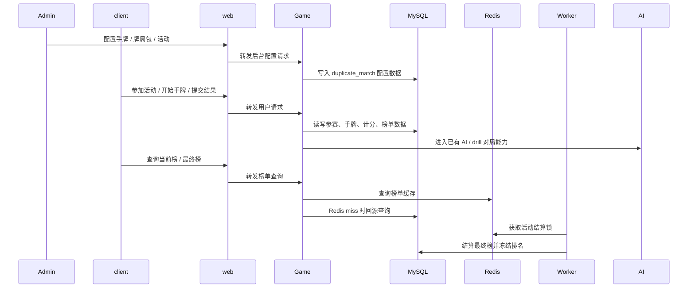

关键说明：

```text
MySQL 是事实源。
Redis 只做缓存和结算锁。
Game 内部如何驱动 TableSession / TableMachine 不在主时序图展开。
```

---

### 3.2.2 后台角度接口时序图：创建手牌

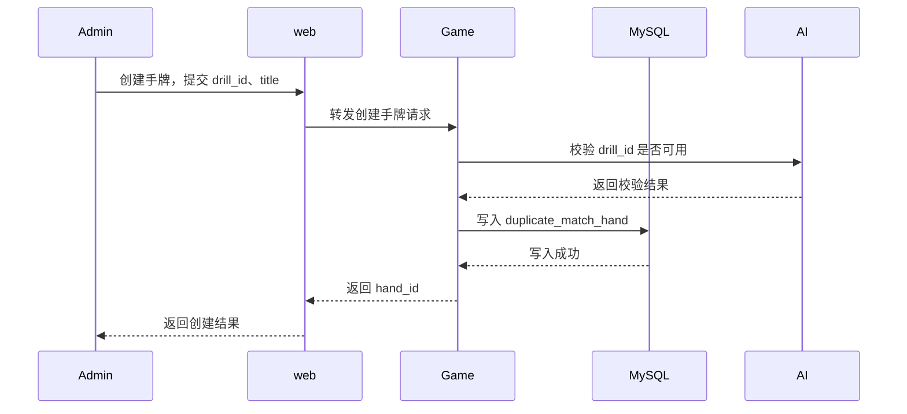

关键说明：

```text
手牌通过 drill_id 关联已有 drill 玩法。
duplicate_match_hand 不复制 drill 内部数据。
```

---

### 3.2.3 后台角度接口时序图：创建牌局包

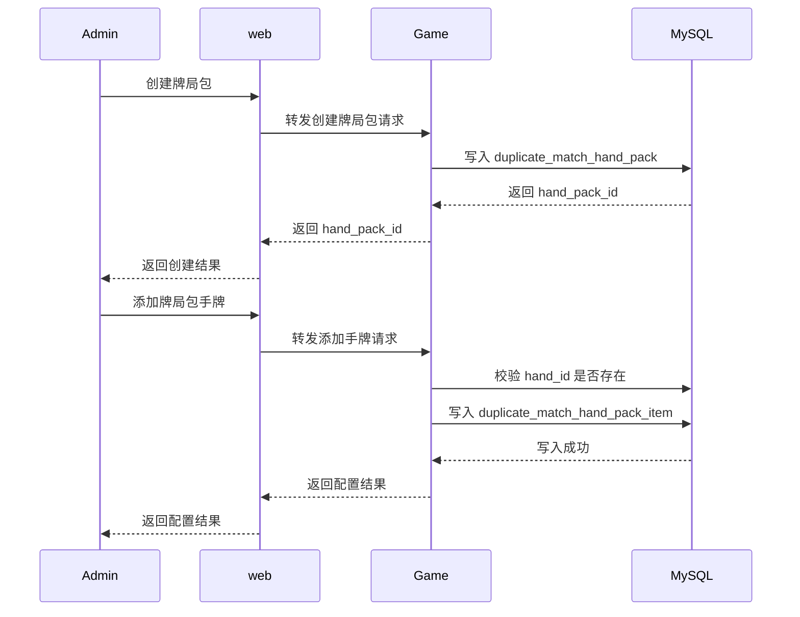

关键说明：

```text
牌局包用于组织活动可用手牌。
hand_pack_item 维护必选手 / 随机候选手。
```

---

### 3.2.4 后台角度接口时序图：创建活动

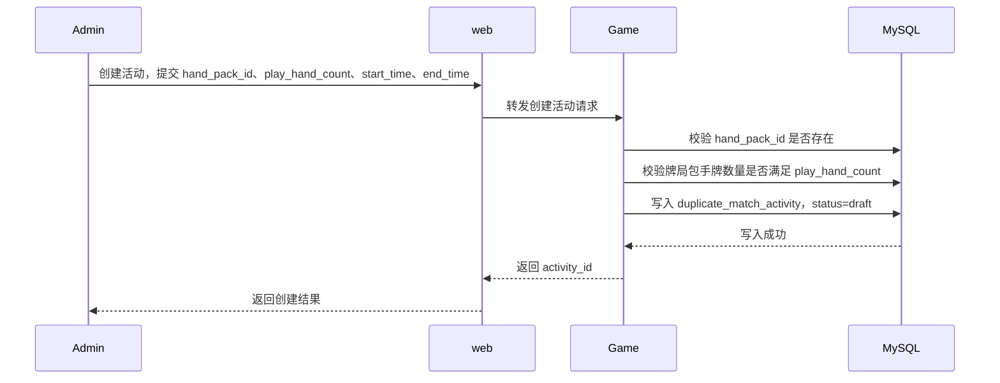

关键说明：

```text
play_hand_count 来自后台配置，不能写死。
活动创建后默认 draft。
```

---

### 3.2.5 后台角度接口时序图：发布活动

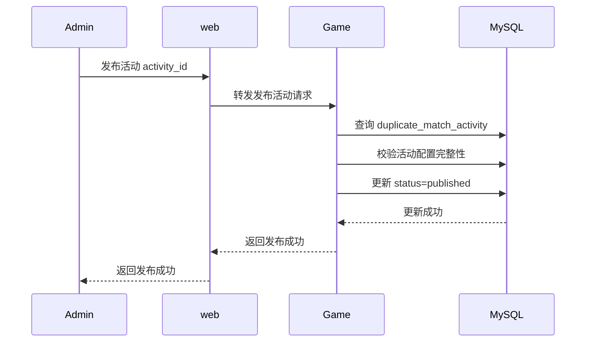

关键说明：

```text
发布前校验活动时间、牌局包、挑战手数。
发布后用户端可见并可参与。
```

---

### 3.2.6 用户角度接口时序图：进入活动 / 恢复进度

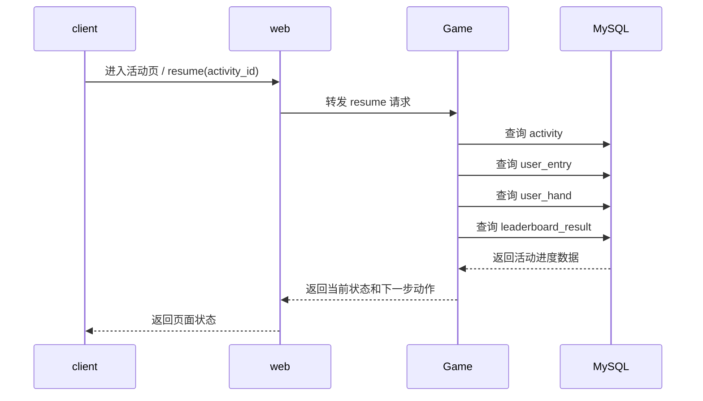

返回状态示例：

| 状态           | 前端动作          |
| ------------ | ------------- |
| `not_joined` | 展示开始挑战        |
| `playing`    | 展示继续挑战        |
| `completed`  | 展示当前榜 / 最终榜入口 |
| `expired`    | 展示已截止         |

关键说明：

```text
恢复的是活动进度。
不恢复单手中途牌局状态。
```

---

### 3.2.7 用户角度接口时序图：参加活动 / 分配手牌

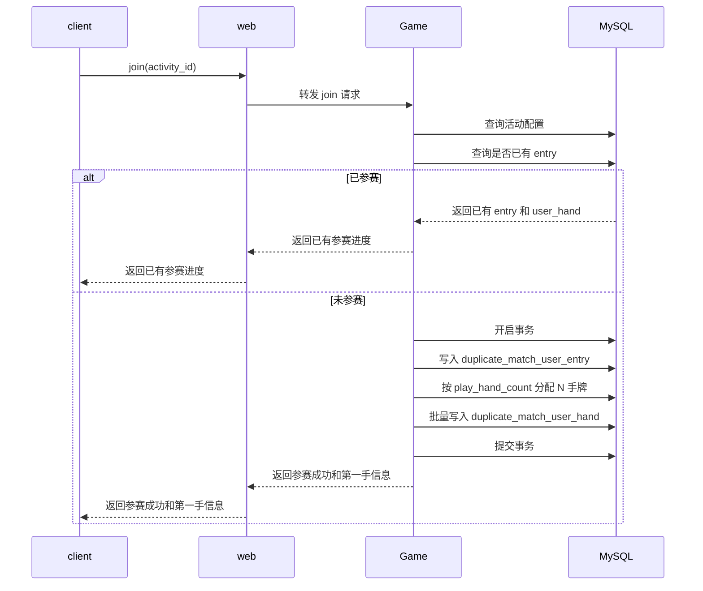

关键说明：

```text
join 需要幂等。
手牌分配结果写入 MySQL 后固定不变。
```

---

### 3.2.8 用户角度接口时序图：开始当前手

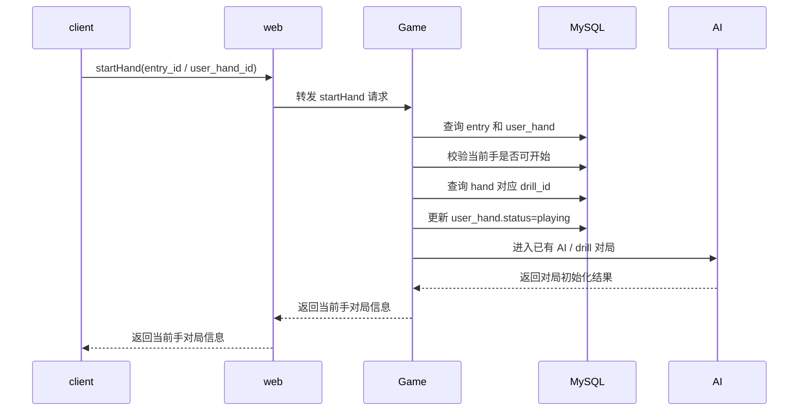

关键说明：

```text
当前手通过 hand_id 找到 drill_id。
Game 内部如何创建 table / session 不在本图展开。
```

---

### 3.2.9 用户角度接口时序图：提交每手结果

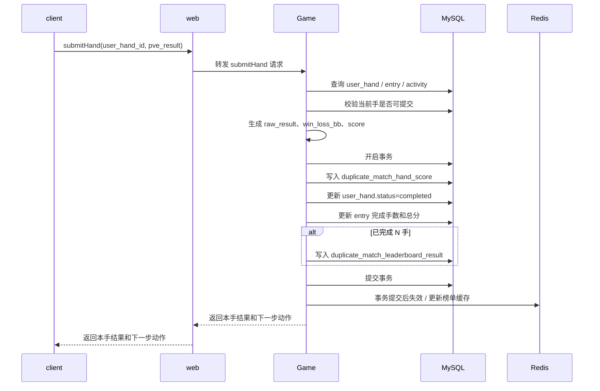

关键说明：

```text
submit hand 需要幂等。
最后一手完成时，同事务写 score、entry、leaderboard_result。
Redis 必须在 MySQL 事务提交后处理。
```

---

### 3.2.10 用户角度接口时序图：完成 N 手后查看当前榜

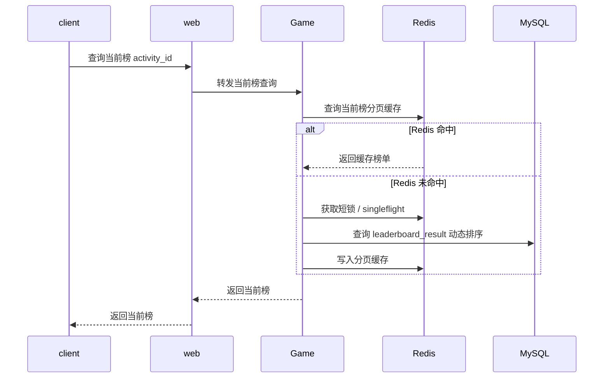

关键说明：

```text
当前榜只展示完成 N 手的用户。
排序：total_score DESC, complete_time ASC。
```

---

### 3.2.11 用户角度接口时序图：活动结算后查看最终榜

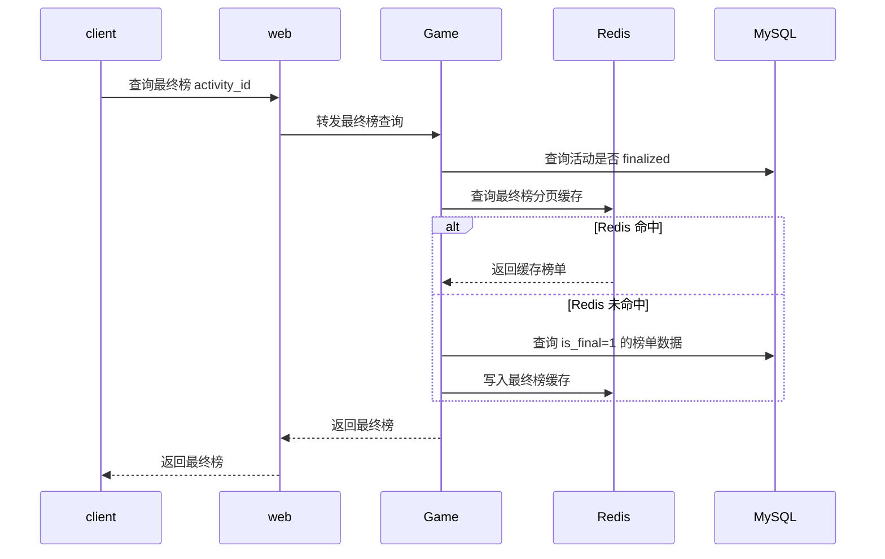

关键说明：

```text
最终榜以 rank_no 为准。
活动 finalized 后最终榜结果冻结。
```

---

### 3.2.12 用户角度接口时序图：断线 / 刷新 / 换设备恢复

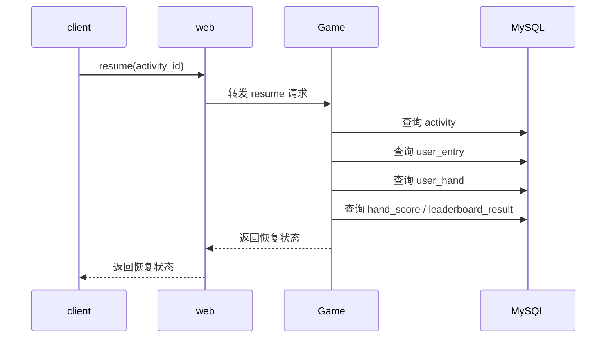

恢复规则：

| 状态        | 处理        |
| --------- | --------- |
| 未参赛       | 返回开始挑战    |
| 已参赛未完成    | 返回当前应继续手牌 |
| 当前手已完成    | 返回下一手     |
| 已完成 N 手   | 返回榜单入口    |
| 活动已截止且未完成 | 不允许继续挑战   |

关键说明：

```text
只恢复活动进度。
不恢复单手中途状态。
```

---

### 3.2.13 Worker 角度时序图：活动截止后最终榜结算

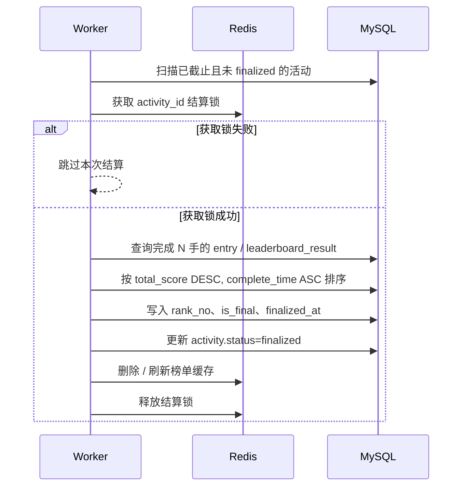

关键说明：

```text
Worker 通过 Redis 结算锁避免重复结算。
最终榜以 MySQL 写入结果为准。
Worker 重复执行需要幂等。
```
