# 三、系统交互

## 3.1 是否有新增服务器

无。

本需求不新增独立服务器，复用当前已有链路，在现有系统上新增复式扑克 PvE 排名赛相关能力。

| 模块       | 说明                                          |
| -------- | ------------------------------------------- |
| `client` | 用户端 / 管理后台前端，负责活动查看、参赛、打牌、查榜，以及后台配置入口       |
| `Admin`  | 管理后台服务，负责手牌、牌局包、活动配置，直接操作 MySQL             |
| `web`    | 无状态 Web 层，负责用户活动业务编排、进度查询、计分落库、榜单查询         |
| `Game`   | 有状态游戏服务，负责具体 table / drill 对局运行             |
| `MySQL`  | 比赛事实源，保存活动、参赛、手牌分配、计分、榜单数据                  |
| `Redis`  | 保存本手临时结果、Redis Sorted Set 加速当前榜、排行榜缓存、活动结算锁 |
| `Worker` | 活动截止后的最终榜结算任务                               |

## 3.2 是否有 CS 交互，SS 交互

有。

| 类型            | 说明                                             |
| ------------- | ---------------------------------------------- |
| 管理后台交互        | `client -> Admin -> MySQL`                     |
| 用户端 CS 交互     | `client -> web`                                |
| web 与 Game 交互 | `web -> Game`，用于创建排名赛 drill 对局、转发牌桌操作、获取牌桌状态   |
| DB 交互         | `Admin / web / Game / Worker -> MySQL / Redis` |
| Worker 交互     | `Worker -> MySQL / Redis`                      |

时序图标记说明：

```text
->>  尖角实线：异步请求 / 异步返回
-->> 虚线：同步请求 / 同步返回
-)   圆角实线：快速跳过步骤，用于表示本图不展开的简化流程
```

交互规则：

```text
client -> Admin：HTTP 异步请求 / 异步返回
client -> web：HTTP 异步请求 / 异步返回
web -> Game：HTTP/RPC 异步请求 / 异步返回

Admin / web / Game / Worker -> MySQL：同步请求 / 同步返回
Admin / web / Game / Worker -> Redis：同步请求 / 同步返回
```

---

### 3.2.1 系统交互总览：以 N=2 为例

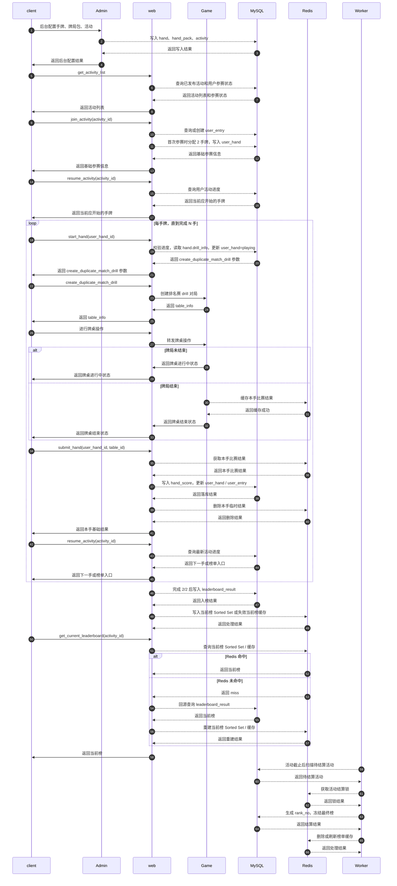
```mermaid
sequenceDiagram
    autonumber
    participant client
    participant Admin
    participant web
    participant Game
    participant MySQL
    participant Redis
    participant Worker

    client->>Admin: 后台配置手牌、牌局包、活动
    Admin-->>MySQL: 写入 hand、hand_pack、activity
    MySQL-->>Admin: 返回写入结果
    Admin->>client: 返回后台配置结果

    client->>web: get_activity_list
    web-->>MySQL: 查询已发布活动和用户参赛状态
    MySQL-->>web: 返回活动列表和参赛状态
    web->>client: 返回活动列表

    client->>web: join_activity(activity_id)
    web-->>MySQL: 查询或创建 user_entry
    web-->>MySQL: 首次参赛时分配 2 手牌，写入 user_hand
    MySQL-->>web: 返回基础参赛信息
    web->>client: 返回基础参赛信息

    client->>web: resume_activity(activity_id)
    web-->>MySQL: 查询用户活动进度
    MySQL-->>web: 返回当前应开始的手牌
    web->>client: 返回当前应开始的手牌

    loop 每手牌，直到完成 N 手
        client->>web: start_hand(user_hand_id)
        web-->>MySQL: 校验进度，读取 hand.drill_info，更新 user_hand=playing
        MySQL-->>web: 返回 create_duplicate_match_drill 参数
        web->>client: 返回 create_duplicate_match_drill 参数

        client->>web: create_duplicate_match_drill
        web->>Game: 创建排名赛 drill 对局
        Game->>web: 返回 table_info
        web->>client: 返回 table_info

        client->>web: 进行牌桌操作
        web->>Game: 转发牌桌操作

        alt 牌局未结束
            Game->>web: 返回牌桌进行中状态
            web->>client: 返回牌桌进行中状态
        else 牌局结束
            Game-->>Redis: 缓存本手比赛结果
            Redis-->>Game: 返回缓存成功
            Game->>web: 返回牌桌结束状态
            web->>client: 返回牌桌结束状态
        end

        client->>web: submit_hand(user_hand_id, table_id)
        web-->>Redis: 获取本手比赛结果
        Redis-->>web: 返回本手比赛结果
        web-->>MySQL: 写入 hand_score，更新 user_hand / user_entry
        MySQL-->>web: 返回落库结果
        web-->>Redis: 删除本手临时结果
        Redis-->>web: 返回删除结果
        web->>client: 返回本手基础结果

        client->>web: resume_activity(activity_id)
        web-->>MySQL: 查询最新活动进度
        MySQL-->>web: 返回下一手或榜单入口
        web->>client: 返回下一手或榜单入口
    end

    web-->>MySQL: 完成 2/2 后写入 leaderboard_result
    MySQL-->>web: 返回入榜结果
    web-->>Redis: 写入当前榜 Sorted Set 或失效当前榜缓存
    Redis-->>web: 返回处理结果

    client->>web: get_current_leaderboard(activity_id)
    web-->>Redis: 查询当前榜 Sorted Set / 缓存

    alt Redis 命中
        Redis-->>web: 返回当前榜
    else Redis 未命中
        Redis-->>web: 返回 miss
        web-->>MySQL: 回源查询 leaderboard_result
        MySQL-->>web: 返回当前榜
        web-->>Redis: 重建当前榜 Sorted Set / 缓存
        Redis-->>web: 返回重建结果
    end

    web->>client: 返回当前榜

    Worker-->>MySQL: 活动截止后扫描待结算活动
    MySQL-->>Worker: 返回待结算活动
    Worker-->>Redis: 获取活动结算锁
    Redis-->>Worker: 返回锁结果
    Worker-->>MySQL: 生成 rank_no，冻结最终榜
    MySQL-->>Worker: 返回结算结果
    Worker-->>Redis: 删除或刷新榜单缓存
    Redis-->>Worker: 返回处理结果
```

关键说明：

```text
submit_hand 根据 user_hand_id + table_id 从 Redis 读取本手比赛结果，并落库到 MySQL。

完成 N 手后，web 写入 leaderboard_result，并同步更新 Redis Sorted Set 或失效当前榜缓存。

当前榜以 MySQL 的 leaderboard_result 为事实源，Redis Sorted Set 只用于加速查询。

活动截止后由 Worker 结算最终榜，最终榜以 MySQL 冻结后的 rank_no 为准。
```

---

### 3.2.2 后台角度接口时序图：配置活动

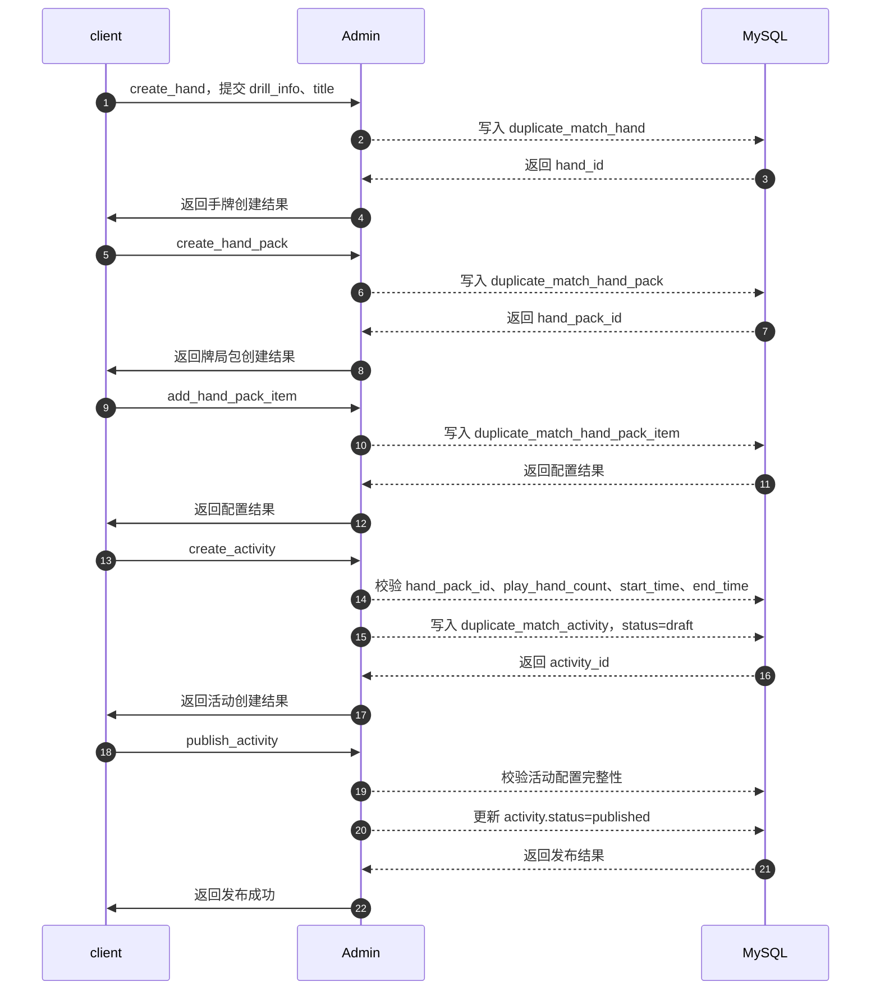
```mermaid
sequenceDiagram
    autonumber
    participant client
    participant Admin
    participant MySQL

    client->>Admin: create_hand，提交 drill_info、title
    Admin-->>MySQL: 写入 duplicate_match_hand
    MySQL-->>Admin: 返回 hand_id
    Admin->>client: 返回手牌创建结果

    client->>Admin: create_hand_pack
    Admin-->>MySQL: 写入 duplicate_match_hand_pack
    MySQL-->>Admin: 返回 hand_pack_id
    Admin->>client: 返回牌局包创建结果

    client->>Admin: add_hand_pack_item
    Admin-->>MySQL: 写入 duplicate_match_hand_pack_item
    MySQL-->>Admin: 返回配置结果
    Admin->>client: 返回配置结果

    client->>Admin: create_activity
    Admin-->>MySQL: 校验 hand_pack_id、play_hand_count、start_time、end_time
    Admin-->>MySQL: 写入 duplicate_match_activity，status=draft
    MySQL-->>Admin: 返回 activity_id
    Admin->>client: 返回活动创建结果

    client->>Admin: publish_activity
    Admin-->>MySQL: 校验活动配置完整性
    Admin-->>MySQL: 更新 activity.status=published
    MySQL-->>Admin: 返回发布结果
    Admin->>client: 返回发布成功
```

关键说明：

```text
duplicate_match_hand 保存 drill_info。
用户开始手牌时，再基于 drill_info 创建排名赛专用 drill 对局。

play_hand_count 来自后台配置，不能写死。
```

---

### 3.2.3 用户角度接口时序图：获取活动列表

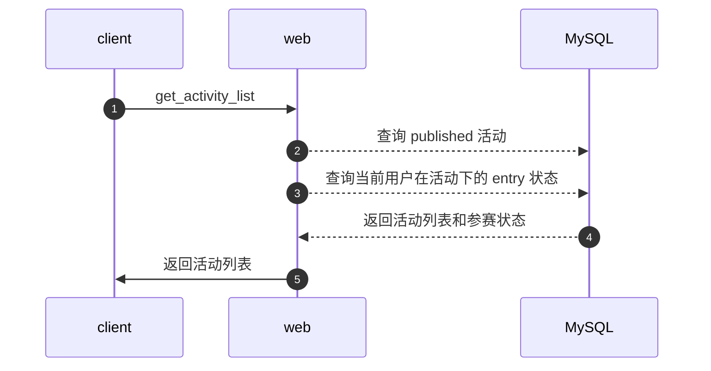
```mermaid
sequenceDiagram
    autonumber
    participant client
    participant web
    participant MySQL

    client->>web: get_activity_list
    web-->>MySQL: 查询 published 活动
    web-->>MySQL: 查询当前用户在活动下的 entry 状态
    MySQL-->>web: 返回活动列表和参赛状态
    web->>client: 返回活动列表
```

关键说明：

```text
get_activity_list 只查询活动和用户参与状态。
不需要 Game 参与。
```

---

### 3.2.4 用户角度接口时序图：参加活动

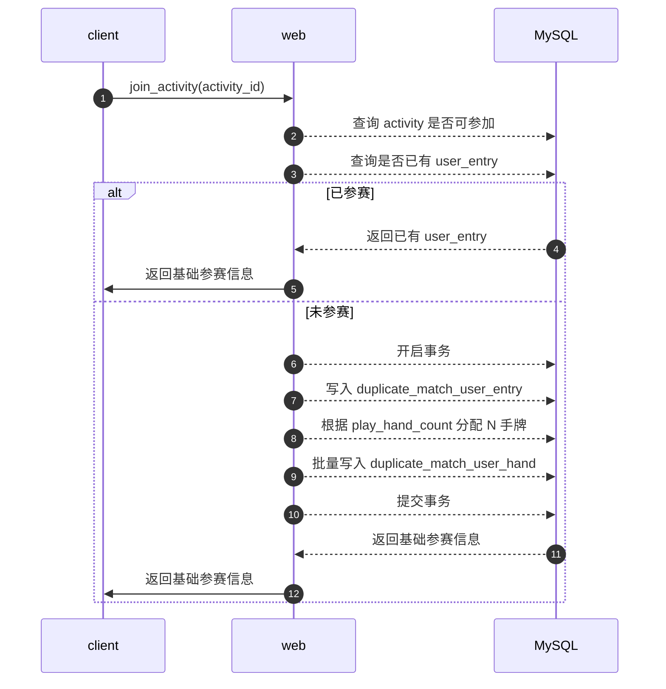
```mermaid
sequenceDiagram
    autonumber
    participant client
    participant web
    participant MySQL

    client->>web: join_activity(activity_id)
    web-->>MySQL: 查询 activity 是否可参加
    web-->>MySQL: 查询是否已有 user_entry

    alt 已参赛
        MySQL-->>web: 返回已有 user_entry
        web->>client: 返回基础参赛信息
    else 未参赛
        web-->>MySQL: 开启事务
        web-->>MySQL: 写入 duplicate_match_user_entry
        web-->>MySQL: 根据 play_hand_count 分配 N 手牌
        web-->>MySQL: 批量写入 duplicate_match_user_hand
        web-->>MySQL: 提交事务
        MySQL-->>web: 返回基础参赛信息
        web->>client: 返回基础参赛信息
    end
```

返回信息：

```text
entry_id
activity_id
join_status
```

关键说明：

```text
join_activity 需要幂等。
join_activity 不返回完整当前进度。
join_activity 成功后，client 继续调用 resume_activity 获取当前进度。
```

---

### 3.2.5 用户角度接口时序图：恢复活动进度

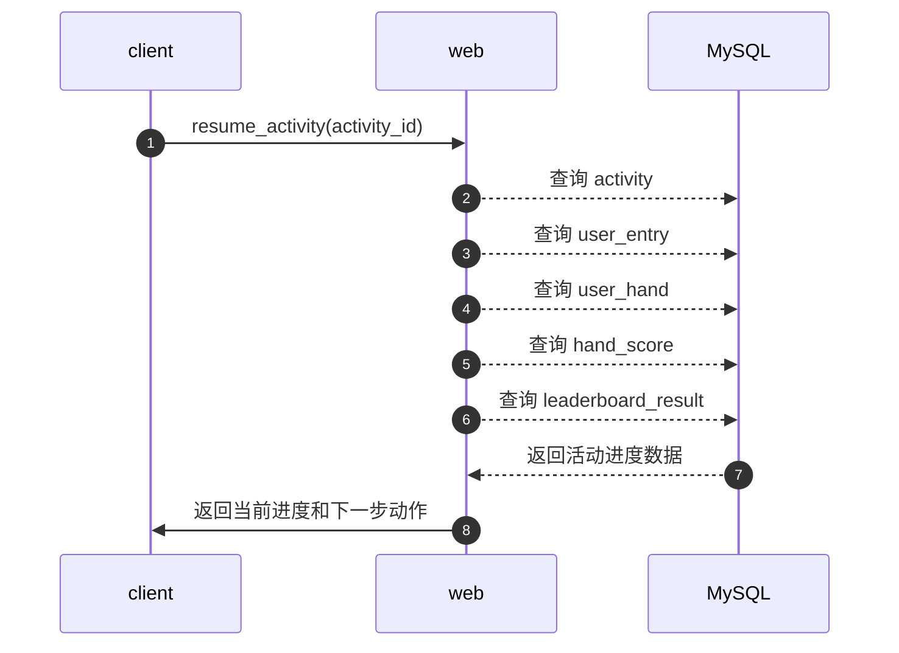
```mermaid
sequenceDiagram
    autonumber
    participant client
    participant web
    participant MySQL

    client->>web: resume_activity(activity_id)
    web-->>MySQL: 查询 activity
    web-->>MySQL: 查询 user_entry
    web-->>MySQL: 查询 user_hand
    web-->>MySQL: 查询 hand_score
    web-->>MySQL: 查询 leaderboard_result
    MySQL-->>web: 返回活动进度数据
    web->>client: 返回当前进度和下一步动作
```

返回状态示例：

| 状态           | 前端动作       |
| ------------ | ---------- |
| `not_joined` | 展示开始挑战     |
| `joined`     | 展示当前应开始的手牌 |
| `playing`    | 展示继续当前手    |
| `completed`  | 展示当前榜入口    |
| `finalized`  | 展示最终榜入口    |
| `expired`    | 展示已截止      |

关键说明：

```text
resume_activity 是统一恢复活动进度的接口。
前端页面跳转优先以 resume_activity 返回结果为准。
恢复的是活动进度，不恢复单手中途牌局状态。
```

---

### 3.2.6 用户角度接口时序图：开始当前手

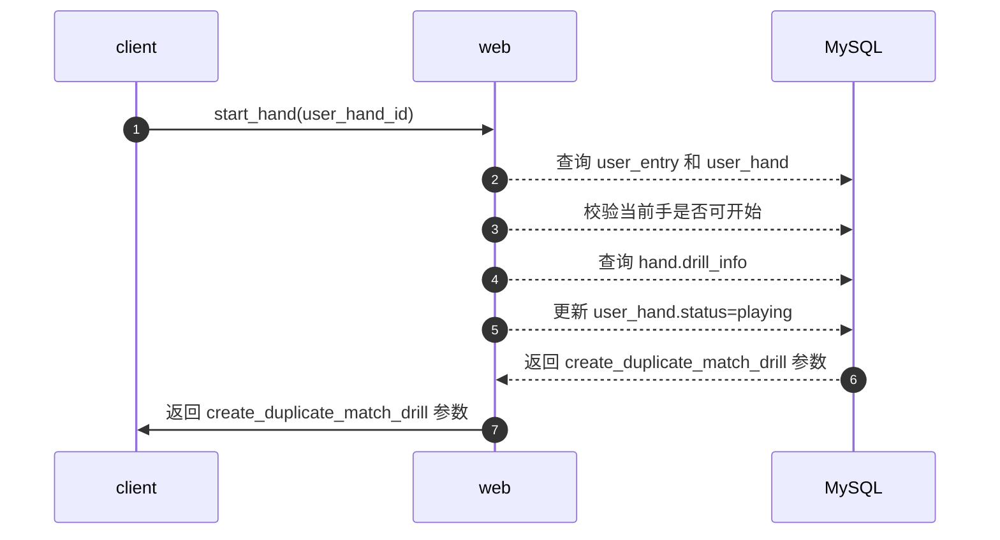
```mermaid
sequenceDiagram
    autonumber
    participant client
    participant web
    participant MySQL

    client->>web: start_hand(user_hand_id)
    web-->>MySQL: 查询 user_entry 和 user_hand
    web-->>MySQL: 校验当前手是否可开始
    web-->>MySQL: 查询 hand.drill_info
    web-->>MySQL: 更新 user_hand.status=playing
    MySQL-->>web: 返回 create_duplicate_match_drill 参数
    web->>client: 返回 create_duplicate_match_drill 参数
```

返回信息：

```text
activity_id
entry_id
user_hand_id
hand_id
order_no
play_hand_count
create_duplicate_match_drill_params
```

关键说明：

```text
start_hand 不创建牌桌。
start_hand 只做活动进度校验，并返回 create_duplicate_match_drill 所需参数。
client 收到参数后，继续调用 create_duplicate_match_drill。
```

---

### 3.2.7 用户角度接口时序图：创建排名赛 drill 对局并进行牌局

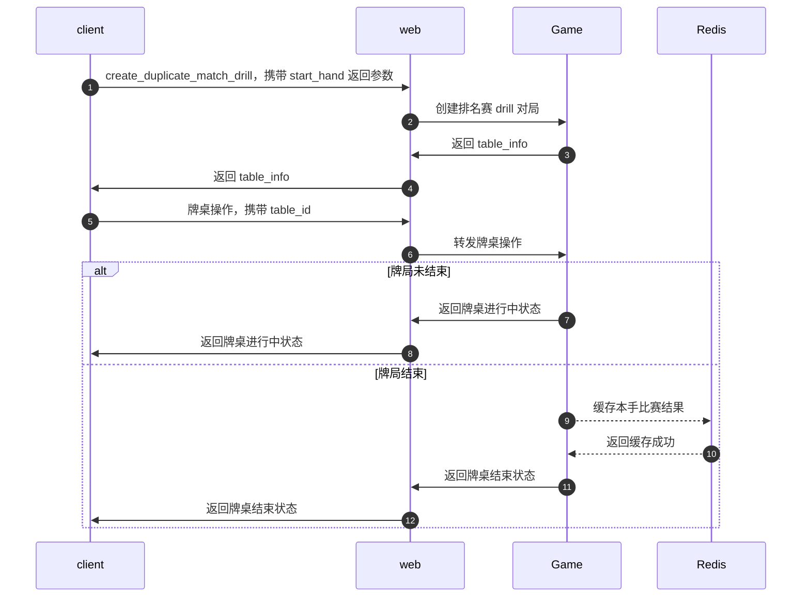
```mermaid
sequenceDiagram
    autonumber
    participant client
    participant web
    participant Game
    participant Redis

    client->>web: create_duplicate_match_drill，携带 start_hand 返回参数
    web->>Game: 创建排名赛 drill 对局
    Game->>web: 返回 table_info
    web->>client: 返回 table_info

    client->>web: 牌桌操作，携带 table_id
    web->>Game: 转发牌桌操作

    alt 牌局未结束
        Game->>web: 返回牌桌进行中状态
        web->>client: 返回牌桌进行中状态
    else 牌局结束
        Game-->>Redis: 缓存本手比赛结果
        Redis-->>Game: 返回缓存成功
        Game->>web: 返回牌桌结束状态
        web->>client: 返回牌桌结束状态
    end
```

关键说明：

```text
具体牌桌过程由 Game 负责。
web 不保存牌桌状态。
牌局结束时，Game 先把本手比赛结果同步写入 Redis，再返回结束状态。
```

---

### 3.2.8 用户角度接口时序图：提交每手结果

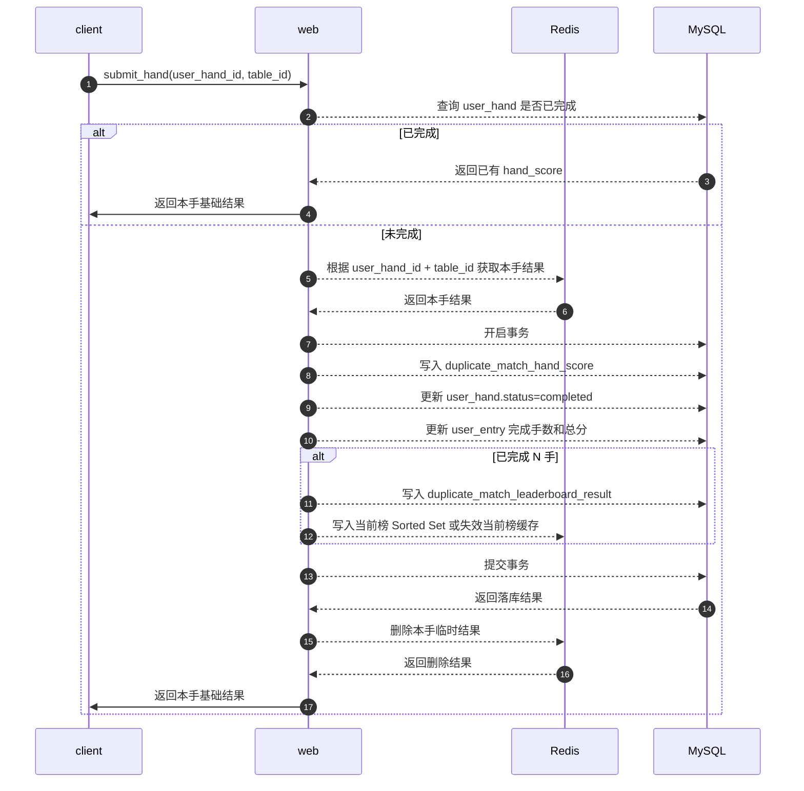
```mermaid
sequenceDiagram
    autonumber
    participant client
    participant web
    participant Redis
    participant MySQL

    client->>web: submit_hand(user_hand_id, table_id)
    web-->>MySQL: 查询 user_hand 是否已完成

    alt 已完成
        MySQL-->>web: 返回已有 hand_score
        web->>client: 返回本手基础结果
    else 未完成
        web-->>Redis: 根据 user_hand_id + table_id 获取本手结果
        Redis-->>web: 返回本手结果
        web-->>MySQL: 开启事务
        web-->>MySQL: 写入 duplicate_match_hand_score
        web-->>MySQL: 更新 user_hand.status=completed
        web-->>MySQL: 更新 user_entry 完成手数和总分

        alt 已完成 N 手
            web-->>MySQL: 写入 duplicate_match_leaderboard_result
            web-->>Redis: 写入当前榜 Sorted Set 或失效当前榜缓存
        end

        web-->>MySQL: 提交事务
        MySQL-->>web: 返回落库结果
        web-->>Redis: 删除本手临时结果
        Redis-->>web: 返回删除结果
        web->>client: 返回本手基础结果
    end
```

返回信息：

```text
user_hand_id
score
win_loss_bb
completed_hand_count
```

关键说明：

```text
submit_hand 只返回本手基础结果。
submit_hand 不负责返回完整下一步页面状态。
submit_hand 后，client 继续调用 resume_activity 获取最新进度。
submit_hand 需要幂等。
```

---

### 3.2.9 用户角度接口时序图：查询当前榜

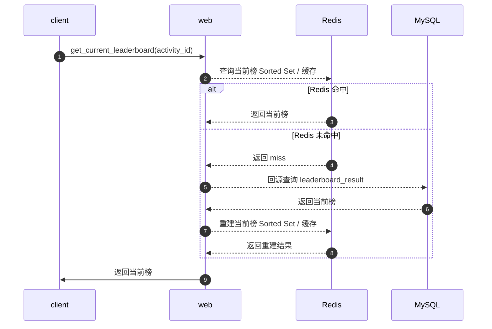
```mermaid
sequenceDiagram
    autonumber
    participant client
    participant web
    participant Redis
    participant MySQL

    client->>web: get_current_leaderboard(activity_id)
    web-->>Redis: 查询当前榜 Sorted Set / 缓存

    alt Redis 命中
        Redis-->>web: 返回当前榜
    else Redis 未命中
        Redis-->>web: 返回 miss
        web-->>MySQL: 回源查询 leaderboard_result
        MySQL-->>web: 返回当前榜
        web-->>Redis: 重建当前榜 Sorted Set / 缓存
        Redis-->>web: 返回重建结果
    end

    web->>client: 返回当前榜
```

关键说明：

```text
当前榜只展示完成 N 手的用户。
当前榜以 MySQL 的 leaderboard_result 为事实源。
Redis Sorted Set 只用于加速当前榜查询。
Redis miss 时回源 MySQL。
```

---

### 3.2.10 用户角度接口时序图：查询最终榜

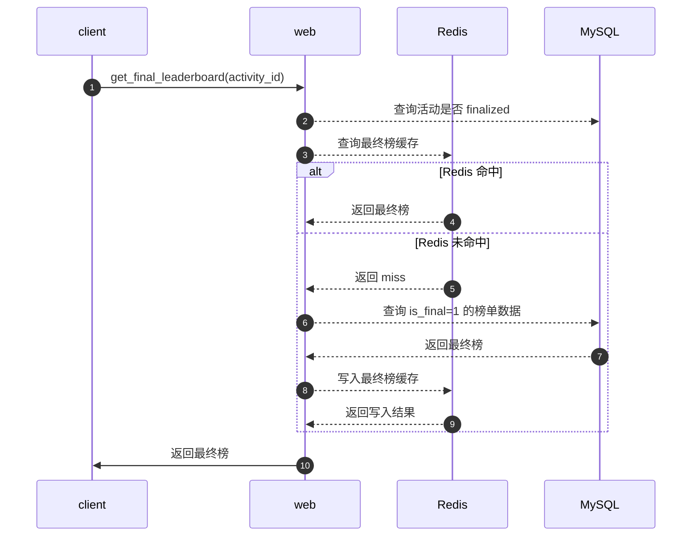
```mermaid
sequenceDiagram
    autonumber
    participant client
    participant web
    participant Redis
    participant MySQL

    client->>web: get_final_leaderboard(activity_id)
    web-->>MySQL: 查询活动是否 finalized
    web-->>Redis: 查询最终榜缓存

    alt Redis 命中
        Redis-->>web: 返回最终榜
    else Redis 未命中
        Redis-->>web: 返回 miss
        web-->>MySQL: 查询 is_final=1 的榜单数据
        MySQL-->>web: 返回最终榜
        web-->>Redis: 写入最终榜缓存
        Redis-->>web: 返回写入结果
    end

    web->>client: 返回最终榜
```

关键说明：

```text
最终榜以 rank_no 为准。
活动 finalized 后最终榜结果冻结。
```

---

### 3.2.11 Worker 角度时序图：活动截止后最终榜结算

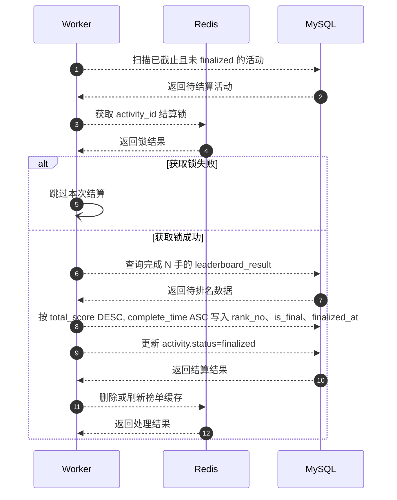
```mermaid
sequenceDiagram
    autonumber
    participant Worker
    participant Redis
    participant MySQL

    Worker-->>MySQL: 扫描已截止且未 finalized 的活动
    MySQL-->>Worker: 返回待结算活动
    Worker-->>Redis: 获取 activity_id 结算锁
    Redis-->>Worker: 返回锁结果

    alt 获取锁失败
        Worker-)Worker: 跳过本次结算
    else 获取锁成功
        Worker-->>MySQL: 查询完成 N 手的 leaderboard_result
        MySQL-->>Worker: 返回待排名数据
        Worker-->>MySQL: 按 total_score DESC, complete_time ASC 写入 rank_no、is_final、finalized_at
        Worker-->>MySQL: 更新 activity.status=finalized
        MySQL-->>Worker: 返回结算结果
        Worker-->>Redis: 删除或刷新榜单缓存
        Redis-->>Worker: 返回处理结果
    end
```

关键说明：

```text
Worker 通过 Redis 结算锁避免重复结算。
最终榜以 MySQL 写入结果为准。
Worker 重复执行需要幂等。

最终榜结算是低频操作，7.15 阶段优先保证正确性和可追溯性。
Worker 结算时从 MySQL leaderboard_result 重新读取完成用户并排序生成 rank_no。
Redis 当前榜 Sorted Set 不作为最终榜事实源。
如后续单活动完赛人数达到十万级，再评估分批结算、临时表或离线排行榜方案。
```

---

### 3.2.12 异常与幂等处理时序图

本节用于补充主流程中容易被追问的异常、幂等、并发和缓存一致性问题。

主流程时序图只表达正常链路；异常与特殊情况单独展开，避免主流程过重。

---

#### 3.2.12.1 `submit_hand` 重复提交 / 幂等处理

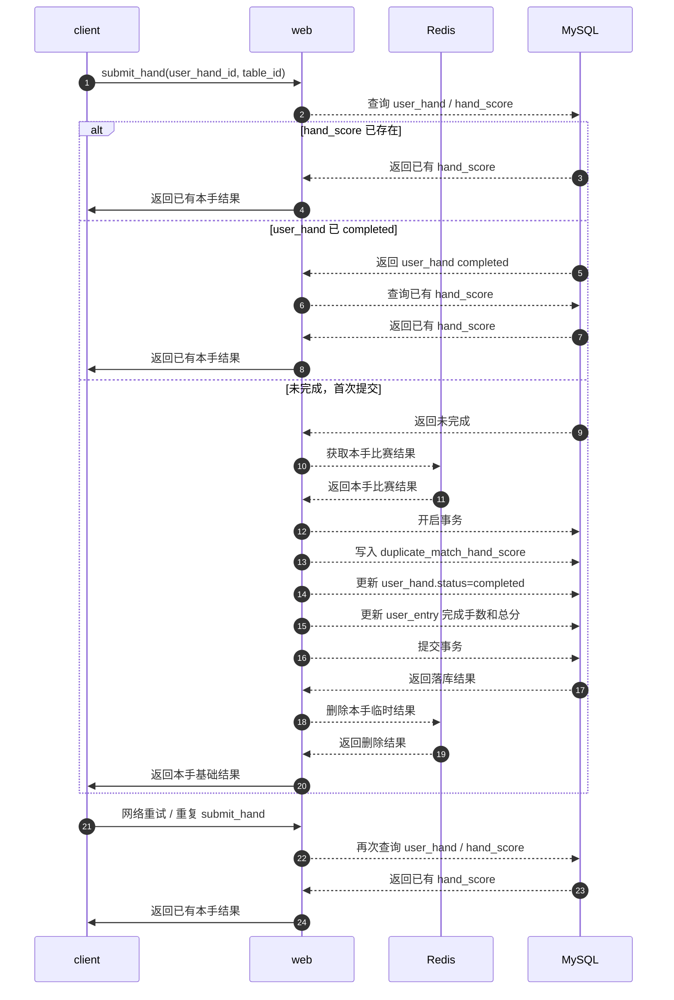
```mermaid
sequenceDiagram
    autonumber
    participant client
    participant web
    participant Redis
    participant MySQL

    client->>web: submit_hand(user_hand_id, table_id)
    web-->>MySQL: 查询 user_hand / hand_score

    alt hand_score 已存在
        MySQL-->>web: 返回已有 hand_score
        web->>client: 返回已有本手结果
    else user_hand 已 completed
        MySQL-->>web: 返回 user_hand completed
        web-->>MySQL: 查询已有 hand_score
        MySQL-->>web: 返回已有 hand_score
        web->>client: 返回已有本手结果
    else 未完成，首次提交
        MySQL-->>web: 返回未完成
        web-->>Redis: 获取本手比赛结果
        Redis-->>web: 返回本手比赛结果

        web-->>MySQL: 开启事务
        web-->>MySQL: 写入 duplicate_match_hand_score
        web-->>MySQL: 更新 user_hand.status=completed
        web-->>MySQL: 更新 user_entry 完成手数和总分
        web-->>MySQL: 提交事务
        MySQL-->>web: 返回落库结果

        web-->>Redis: 删除本手临时结果
        Redis-->>web: 返回删除结果
        web->>client: 返回本手基础结果
    end

    client->>web: 网络重试 / 重复 submit_hand
    web-->>MySQL: 再次查询 user_hand / hand_score
    MySQL-->>web: 返回已有 hand_score
    web->>client: 返回已有本手结果
```

关键说明：

```text
submit_hand 必须先查 user_hand / hand_score。

如果 hand_score 已存在，直接返回已有结果。

duplicate_match_hand_score.uk_user_hand(user_hand_id) 作为数据库唯一约束兜底。

重复提交不能重复计分，不能重复推进 completed_hand_count。
```

---

#### 3.2.12.2 Redis 本手比赛结果缺失

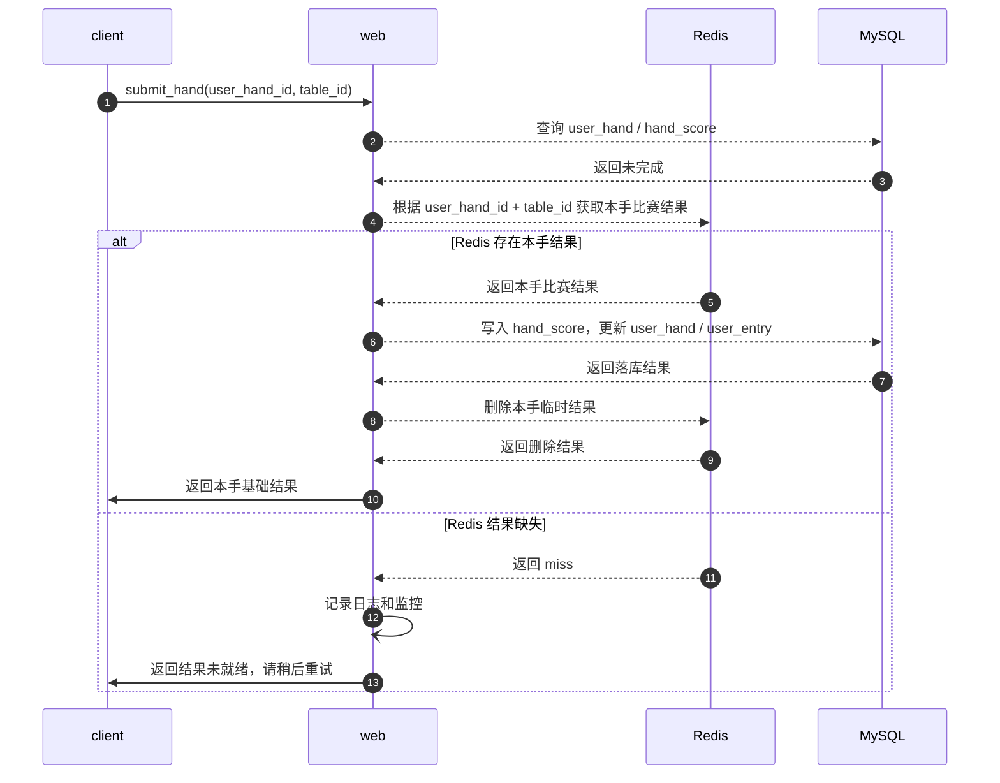
```mermaid
sequenceDiagram
    autonumber
    participant client
    participant web
    participant Redis
    participant MySQL

    client->>web: submit_hand(user_hand_id, table_id)
    web-->>MySQL: 查询 user_hand / hand_score
    MySQL-->>web: 返回未完成

    web-->>Redis: 根据 user_hand_id + table_id 获取本手比赛结果

    alt Redis 存在本手结果
        Redis-->>web: 返回本手比赛结果
        web-->>MySQL: 写入 hand_score，更新 user_hand / user_entry
        MySQL-->>web: 返回落库结果
        web-->>Redis: 删除本手临时结果
        Redis-->>web: 返回删除结果
        web->>client: 返回本手基础结果
    else Redis 结果缺失
        Redis-->>web: 返回 miss
        web-)web: 记录日志和监控
        web->>client: 返回结果未就绪，请稍后重试
    end
```

关键说明：

```text
Redis 本手结果缺失时，submit_hand 不落库。

不更新 user_hand.status=completed。

不更新 user_entry.completed_hand_count。

不写 leaderboard_result。

前端收到结果未就绪后，可稍后重试 submit_hand。

7.15 阶段不做复杂补偿队列，优先保证不错误计分、不错误推进进度。
```

---

#### 3.2.12.3 MySQL 写 `hand_score` 失败

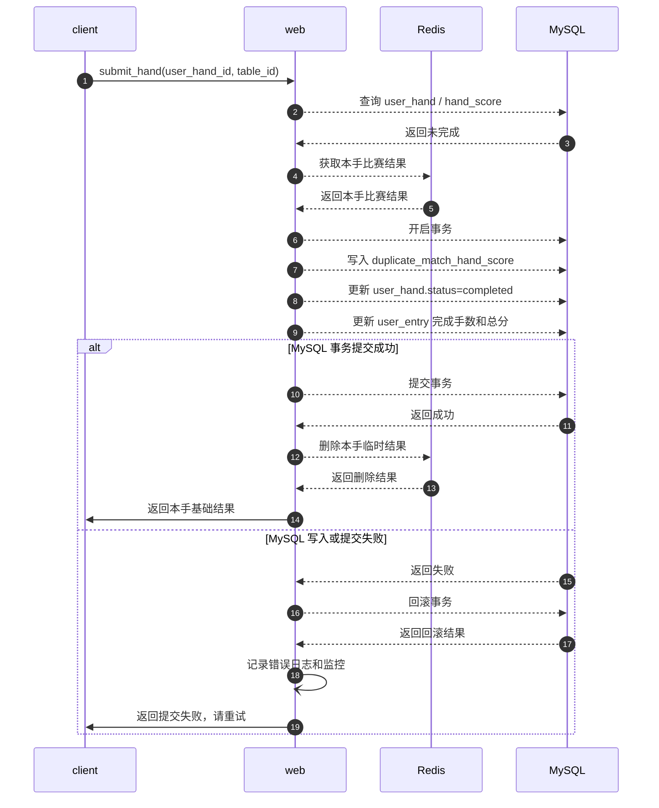
```mermaid
sequenceDiagram
    autonumber
    participant client
    participant web
    participant Redis
    participant MySQL

    client->>web: submit_hand(user_hand_id, table_id)
    web-->>MySQL: 查询 user_hand / hand_score
    MySQL-->>web: 返回未完成

    web-->>Redis: 获取本手比赛结果
    Redis-->>web: 返回本手比赛结果

    web-->>MySQL: 开启事务
    web-->>MySQL: 写入 duplicate_match_hand_score
    web-->>MySQL: 更新 user_hand.status=completed
    web-->>MySQL: 更新 user_entry 完成手数和总分

    alt MySQL 事务提交成功
        web-->>MySQL: 提交事务
        MySQL-->>web: 返回成功
        web-->>Redis: 删除本手临时结果
        Redis-->>web: 返回删除结果
        web->>client: 返回本手基础结果
    else MySQL 写入或提交失败
        MySQL-->>web: 返回失败
        web-->>MySQL: 回滚事务
        MySQL-->>web: 返回回滚结果
        web-)web: 记录错误日志和监控
        web->>client: 返回提交失败，请重试
    end
```

关键说明：

```text
MySQL 写失败时，业务状态不推进。

hand_score、user_hand、user_entry 必须在同一个事务中处理。

事务失败后，不能删除 Redis 本手临时结果。

Redis 临时结果保留给下一次 submit_hand 重试使用。
```

---

#### 3.2.12.4 完成 N 手写 `leaderboard_result` 失败

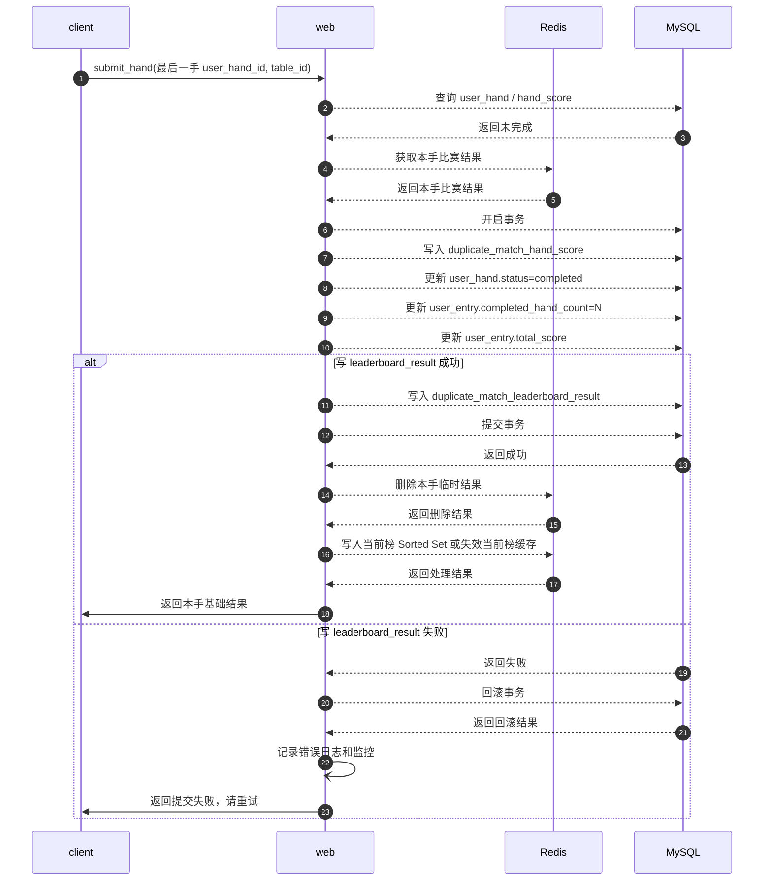
```mermaid
sequenceDiagram
    autonumber
    participant client
    participant web
    participant Redis
    participant MySQL

    client->>web: submit_hand(最后一手 user_hand_id, table_id)
    web-->>MySQL: 查询 user_hand / hand_score
    MySQL-->>web: 返回未完成

    web-->>Redis: 获取本手比赛结果
    Redis-->>web: 返回本手比赛结果

    web-->>MySQL: 开启事务
    web-->>MySQL: 写入 duplicate_match_hand_score
    web-->>MySQL: 更新 user_hand.status=completed
    web-->>MySQL: 更新 user_entry.completed_hand_count=N
    web-->>MySQL: 更新 user_entry.total_score

    alt 写 leaderboard_result 成功
        web-->>MySQL: 写入 duplicate_match_leaderboard_result
        web-->>MySQL: 提交事务
        MySQL-->>web: 返回成功
        web-->>Redis: 删除本手临时结果
        Redis-->>web: 返回删除结果
        web-->>Redis: 写入当前榜 Sorted Set 或失效当前榜缓存
        Redis-->>web: 返回处理结果
        web->>client: 返回本手基础结果
    else 写 leaderboard_result 失败
        MySQL-->>web: 返回失败
        web-->>MySQL: 回滚事务
        MySQL-->>web: 返回回滚结果
        web-)web: 记录错误日志和监控
        web->>client: 返回提交失败，请重试
    end
```

关键说明：

```text
最后一手完成时，hand_score、user_hand、user_entry、leaderboard_result 建议放在同一个 MySQL 事务中。

如果 leaderboard_result 写失败，整个事务回滚。

避免出现“手牌已完成、entry 已完成，但用户没有入榜”的不一致状态。

事务失败时不删除 Redis 本手临时结果，允许用户重试 submit_hand。
```

---

#### 3.2.12.5 Worker 重复结算 / 并发结算 / 中途失败

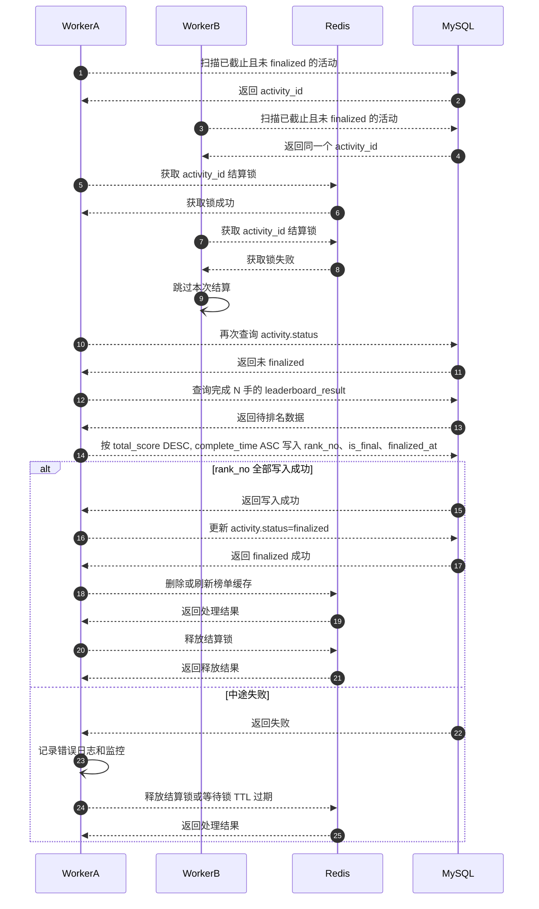
```mermaid
sequenceDiagram
    autonumber
    participant WorkerA
    participant WorkerB
    participant Redis
    participant MySQL

    WorkerA-->>MySQL: 扫描已截止且未 finalized 的活动
    MySQL-->>WorkerA: 返回 activity_id

    WorkerB-->>MySQL: 扫描已截止且未 finalized 的活动
    MySQL-->>WorkerB: 返回同一个 activity_id

    WorkerA-->>Redis: 获取 activity_id 结算锁
    Redis-->>WorkerA: 获取锁成功

    WorkerB-->>Redis: 获取 activity_id 结算锁
    Redis-->>WorkerB: 获取锁失败
    WorkerB-)WorkerB: 跳过本次结算

    WorkerA-->>MySQL: 再次查询 activity.status
    MySQL-->>WorkerA: 返回未 finalized

    WorkerA-->>MySQL: 查询完成 N 手的 leaderboard_result
    MySQL-->>WorkerA: 返回待排名数据

    WorkerA-->>MySQL: 按 total_score DESC, complete_time ASC 写入 rank_no、is_final、finalized_at

    alt rank_no 全部写入成功
        MySQL-->>WorkerA: 返回写入成功
        WorkerA-->>MySQL: 更新 activity.status=finalized
        MySQL-->>WorkerA: 返回 finalized 成功
        WorkerA-->>Redis: 删除或刷新榜单缓存
        Redis-->>WorkerA: 返回处理结果
        WorkerA-->>Redis: 释放结算锁
        Redis-->>WorkerA: 返回释放结果
    else 中途失败
        MySQL-->>WorkerA: 返回失败
        WorkerA-)WorkerA: 记录错误日志和监控
        WorkerA-->>Redis: 释放结算锁或等待锁 TTL 过期
        Redis-->>WorkerA: 返回处理结果
    end
```

关键说明：

```text
Worker 通过 activity_id 维度的 Redis 结算锁避免并发结算。

获取锁失败的 Worker 直接跳过。

获取锁成功后，还需要再次检查 activity.status，防止重复结算。

最终榜以 MySQL leaderboard_result 重新排序为准，不使用 Redis 当前榜排名作为事实源。

activity.status=finalized 只在全部 rank_no 写入完成后更新。

如果中途失败，activity 不进入 finalized，下次 Worker 可以重新执行结算。

Worker 重复执行需要幂等。
```

---

#### 3.2.12.6.1 `join_activity` 重复参加

场景：用户已经参加过活动，后续又点击了一次参加活动，或者刷新页面后重复调用 `join_activity`。

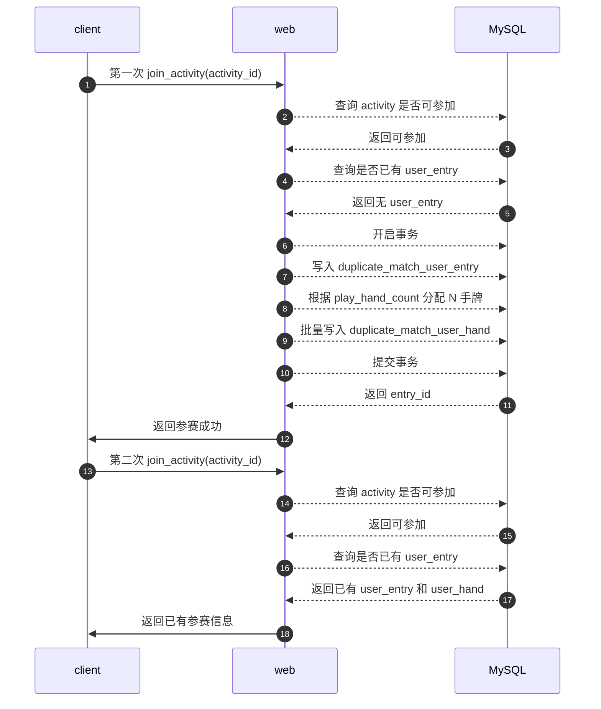
```mermaid
sequenceDiagram
    autonumber
    participant client
    participant web
    participant MySQL

    client->>web: 第一次 join_activity(activity_id)
    web-->>MySQL: 查询 activity 是否可参加
    MySQL-->>web: 返回可参加
    web-->>MySQL: 查询是否已有 user_entry
    MySQL-->>web: 返回无 user_entry

    web-->>MySQL: 开启事务
    web-->>MySQL: 写入 duplicate_match_user_entry
    web-->>MySQL: 根据 play_hand_count 分配 N 手牌
    web-->>MySQL: 批量写入 duplicate_match_user_hand
    web-->>MySQL: 提交事务
    MySQL-->>web: 返回 entry_id
    web->>client: 返回参赛成功

    client->>web: 第二次 join_activity(activity_id)
    web-->>MySQL: 查询 activity 是否可参加
    MySQL-->>web: 返回可参加
    web-->>MySQL: 查询是否已有 user_entry
    MySQL-->>web: 返回已有 user_entry 和 user_hand

    web->>client: 返回已有参赛信息
```

关键说明：

```text
重复参加不是异常失败。

如果用户已经存在 user_entry，join_activity 直接返回已有参赛信息。

不会重新创建 user_entry。

不会重新分配 user_hand。

不会重置用户当前进度。

join_activity 需要设计成幂等接口。
```

---

#### 3.2.12.6.2 `join_activity` 并发参加

场景：用户多设备、网络重试、前端重复点击，导致两个 `join_activity` 请求几乎同时到达服务端。

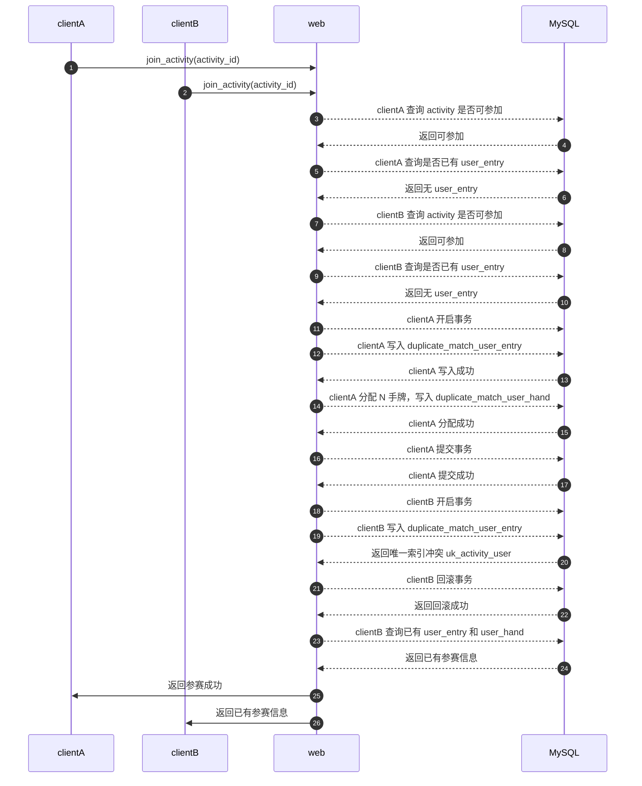
```mermaid
sequenceDiagram
    autonumber
    participant clientA
    participant clientB
    participant web
    participant MySQL

    clientA->>web: join_activity(activity_id)
    clientB->>web: join_activity(activity_id)

    web-->>MySQL: clientA 查询 activity 是否可参加
    MySQL-->>web: 返回可参加
    web-->>MySQL: clientA 查询是否已有 user_entry
    MySQL-->>web: 返回无 user_entry

    web-->>MySQL: clientB 查询 activity 是否可参加
    MySQL-->>web: 返回可参加
    web-->>MySQL: clientB 查询是否已有 user_entry
    MySQL-->>web: 返回无 user_entry

    web-->>MySQL: clientA 开启事务
    web-->>MySQL: clientA 写入 duplicate_match_user_entry
    MySQL-->>web: clientA 写入成功
    web-->>MySQL: clientA 分配 N 手牌，写入 duplicate_match_user_hand
    MySQL-->>web: clientA 分配成功
    web-->>MySQL: clientA 提交事务
    MySQL-->>web: clientA 提交成功

    web-->>MySQL: clientB 开启事务
    web-->>MySQL: clientB 写入 duplicate_match_user_entry
    MySQL-->>web: 返回唯一索引冲突 uk_activity_user
    web-->>MySQL: clientB 回滚事务
    MySQL-->>web: 返回回滚成功

    web-->>MySQL: clientB 查询已有 user_entry 和 user_hand
    MySQL-->>web: 返回已有参赛信息

    web->>clientA: 返回参赛成功
    web->>clientB: 返回已有参赛信息
```

关键说明：

```text
并发参加需要依赖 MySQL 唯一索引兜底。

duplicate_match_user_entry 使用 uk_activity_user(activity_id, user_id)，保证同一用户同一活动只能有一条参赛记录。

如果并发插入触发唯一索引冲突，不作为业务失败处理。

冲突请求回滚当前事务后，重新查询已有 user_entry 和 user_hand，并返回已有参赛信息。

duplicate_match_user_hand 通过 uk_entry_order(entry_id, order_no) 和 uk_entry_hand(entry_id, hand_id) 防止重复分配。
```

---

#### 3.2.12.7 Redis 当前榜 Sorted Set 更新失败

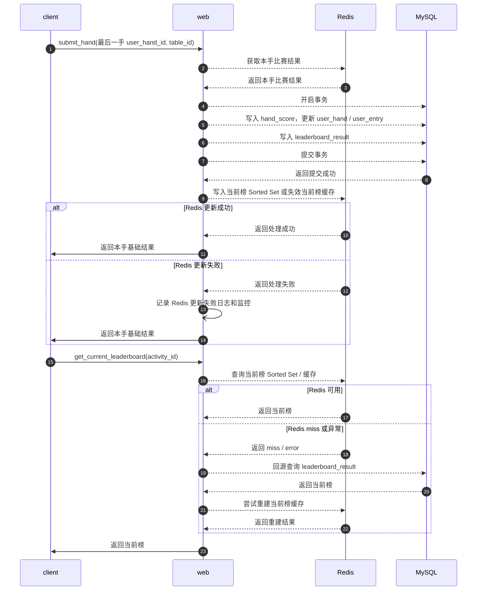
```mermaid
sequenceDiagram
    autonumber
    participant client
    participant web
    participant Redis
    participant MySQL

    client->>web: submit_hand(最后一手 user_hand_id, table_id)
    web-->>Redis: 获取本手比赛结果
    Redis-->>web: 返回本手比赛结果

    web-->>MySQL: 开启事务
    web-->>MySQL: 写入 hand_score，更新 user_hand / user_entry
    web-->>MySQL: 写入 leaderboard_result
    web-->>MySQL: 提交事务
    MySQL-->>web: 返回提交成功

    web-->>Redis: 写入当前榜 Sorted Set 或失效当前榜缓存

    alt Redis 更新成功
        Redis-->>web: 返回处理成功
        web->>client: 返回本手基础结果
    else Redis 更新失败
        Redis-->>web: 返回处理失败
        web-)web: 记录 Redis 更新失败日志和监控
        web->>client: 返回本手基础结果
    end

    client->>web: get_current_leaderboard(activity_id)
    web-->>Redis: 查询当前榜 Sorted Set / 缓存

    alt Redis 可用
        Redis-->>web: 返回当前榜
    else Redis miss 或异常
        Redis-->>web: 返回 miss / error
        web-->>MySQL: 回源查询 leaderboard_result
        MySQL-->>web: 返回当前榜
        web-->>Redis: 尝试重建当前榜缓存
        Redis-->>web: 返回重建结果
    end

    web->>client: 返回当前榜
```

关键说明：

```text
MySQL 写入 leaderboard_result 成功后，用户已经正式入榜。

Redis Sorted Set 更新失败只影响当前榜查询加速，不影响入榜事实。

当前榜查询时，如果 Redis miss 或异常，web 回源 MySQL 查询 leaderboard_result。

Redis 恢复后，可以在查询链路中重建当前榜 Sorted Set / 缓存。
```

---

#### 3.2.12.8 当前榜 Redis miss / 缓存击穿

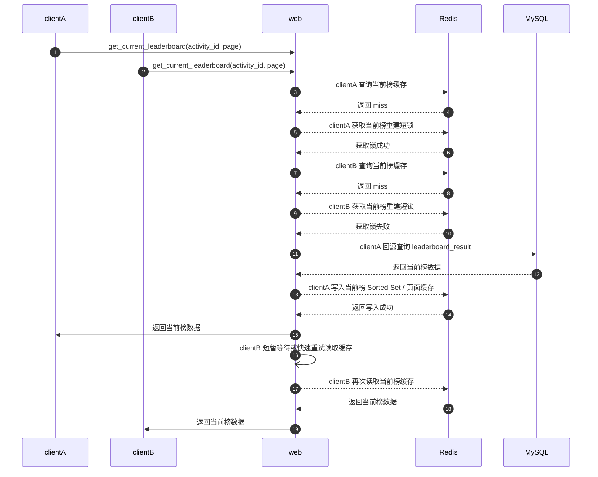
```mermaid
sequenceDiagram
    autonumber
    participant clientA
    participant clientB
    participant web
    participant Redis
    participant MySQL

    clientA->>web: get_current_leaderboard(activity_id, page)
    clientB->>web: get_current_leaderboard(activity_id, page)

    web-->>Redis: clientA 查询当前榜缓存
    Redis-->>web: 返回 miss

    web-->>Redis: clientA 获取当前榜重建短锁
    Redis-->>web: 获取锁成功

    web-->>Redis: clientB 查询当前榜缓存
    Redis-->>web: 返回 miss

    web-->>Redis: clientB 获取当前榜重建短锁
    Redis-->>web: 获取锁失败

    web-->>MySQL: clientA 回源查询 leaderboard_result
    MySQL-->>web: 返回当前榜数据

    web-->>Redis: clientA 写入当前榜 Sorted Set / 页面缓存
    Redis-->>web: 返回写入成功

    web->>clientA: 返回当前榜数据

    web-)web: clientB 短暂等待或快速重试读取缓存
    web-->>Redis: clientB 再次读取当前榜缓存
    Redis-->>web: 返回当前榜数据

    web->>clientB: 返回当前榜数据
```

关键说明：

```text
当前榜 Redis miss 时，使用短锁或 singleflight 控制同一页 / 同一活动缓存重建。

只有一个请求回源 MySQL 重建缓存。

其他请求短暂等待后读取 Redis，避免大量请求同时打到 MySQL。

如果等待后仍未命中，可以降级回源 MySQL，但要限制并发。
```

---

#### 3.2.12.9 MySQL 写成功但 Redis 临时结果删除失败

```mermaid
sequenceDiagram
    autonumber
    participant client
    participant web
    participant Redis
    participant MySQL

    client->>web: submit_hand(user_hand_id, table_id)
    web-->>MySQL: 查询 user_hand / hand_score
    MySQL-->>web: 返回未完成

    web-->>Redis: 获取本手比赛结果
    Redis-->>web: 返回本手比赛结果

    web-->>MySQL: 开启事务
    web-->>MySQL: 写入 duplicate_match_hand_score
    web-->>MySQL: 更新 user_hand.status=completed
    web-->>MySQL: 更新 user_entry 完成手数和总分
    web-->>MySQL: 提交事务
    MySQL-->>web: 返回提交成功

    web-->>Redis: 删除本手临时结果

    alt Redis 删除成功
        Redis-->>web: 返回删除成功
        web->>client: 返回本手基础结果
    else Redis 删除失败
        Redis-->>web: 返回删除失败
        web-)web: 记录 Redis 删除失败日志和监控
        web->>client: 返回本手基础结果
    end

    client->>web: 重复 submit_hand(user_hand_id, table_id)
    web-->>MySQL: 查询 user_hand / hand_score
    MySQL-->>web: 返回已有 hand_score
    web->>client: 返回已有本手结果
```

关键说明：

```text
MySQL 是事实源。

只要 hand_score 已写入，且 user_hand 已 completed，本手就已经完成。

Redis 临时结果删除失败不影响主流程。

后续重复 submit_hand 时，优先通过 MySQL hand_score 幂等返回已有结果。

Redis 临时结果依赖 TTL 自动过期。
```

---

#### 3.2.12.10 `start_hand` 重复请求 / 当前手状态已是 playing

```mermaid
sequenceDiagram
    autonumber
    participant client
    participant web
    participant MySQL

    client->>web: start_hand(user_hand_id)
    web-->>MySQL: 查询 user_entry / user_hand
    MySQL-->>web: 返回 user_hand.status=pending

    web-->>MySQL: 校验当前手是否可开始
    MySQL-->>web: 返回校验通过

    web-->>MySQL: 更新 user_hand.status=playing
    MySQL-->>web: 返回更新成功

    web-->>MySQL: 查询 hand.drill_info
    MySQL-->>web: 返回 create_duplicate_match_drill 参数

    web->>client: 返回 create_duplicate_match_drill 参数

    client->>web: 网络重试 / 重复 start_hand(user_hand_id)
    web-->>MySQL: 查询 user_entry / user_hand
    MySQL-->>web: 返回 user_hand.status=playing

    web-->>MySQL: 查询 hand.drill_info
    MySQL-->>web: 返回 create_duplicate_match_drill 参数

    web->>client: 返回 create_duplicate_match_drill 参数

    client->>web: start_hand(已完成的 user_hand_id)
    web-->>MySQL: 查询 user_entry / user_hand
    MySQL-->>web: 返回 user_hand.status=completed

    web->>client: 返回当前手已完成，请调用 resume_activity 获取下一步
```

关键说明：

```text
start_hand 只做活动进度校验，不创建牌桌。

如果 user_hand.status=pending，则更新为 playing，并返回 create_duplicate_match_drill 参数。

如果 user_hand.status=playing，说明当前手已经开始，重复请求直接返回 create_duplicate_match_drill 参数。

如果 user_hand.status=completed，说明当前手已经完成，不允许重新开始，前端应调用 resume_activity 获取下一步。

start_hand 不负责处理牌桌重复创建问题。
```

#### 3.2.12.11 断线 / 刷新 / 服务重启后继续活动

场景：用户打牌过程中断线、刷新页面、换设备重新进入，或 web 服务重启后，用户重新进入活动页。

```mermaid
sequenceDiagram
    autonumber
    participant client
    participant web
    participant MySQL
    participant Redis

    client->>web: resume_activity(activity_id)
    web-->>MySQL: 查询 activity
    web-->>MySQL: 查询 user_entry
    web-->>MySQL: 查询 user_hand
    web-->>MySQL: 查询 hand_score
    web-->>MySQL: 查询 leaderboard_result
    MySQL-->>web: 返回活动进度数据

    alt 未参赛
        web->>client: 返回 not_joined，展示开始挑战
    else 已完成 N 手
        web->>client: 返回 completed / finalized，展示榜单入口
    else 当前手 status=pending
        web->>client: 返回当前应开始的 user_hand
    else 当前手 status=playing 且 hand_score 不存在
        web->>client: 返回当前 user_hand，提示从本手开头重新开始
    else 当前手 status=completed 或 hand_score 已存在
        web-->>MySQL: 查询下一手 user_hand
        MySQL-->>web: 返回下一手或榜单入口
        web->>client: 返回下一步动作
    end

    opt 前端继续当前手
        client->>web: start_hand(user_hand_id)
        web-->>MySQL: 校验进度，读取 hand.drill_info
        MySQL-->>web: 返回 create_duplicate_match_drill 参数
        web->>client: 返回 create_duplicate_match_drill 参数
    end

    opt 如果前一次牌局已结束但 client 未 submit_hand
        client->>web: submit_hand(user_hand_id, table_id)
        web-->>Redis: 获取本手比赛结果
        alt Redis 仍存在本手结果
            Redis-->>web: 返回本手比赛结果
            web-->>MySQL: 写入 hand_score，更新 user_hand / user_entry
            MySQL-->>web: 返回落库结果
            web->>client: 返回本手基础结果
        else Redis 结果不存在
            Redis-->>web: 返回 miss
            web->>client: 返回结果未就绪，请重新开始本手或稍后重试
        end
    end
```

关键说明：

```text
resume_activity 是断线 / 刷新 / 换设备后的统一恢复入口。

web 是无状态服务，web 重启不影响活动恢复；恢复数据以 MySQL 为准。

恢复的是活动进度，不恢复单手中途牌局状态。

如果 user_hand.status=playing，但 hand_score 不存在，表示当前手未正式完成，重新进入时从这一手开头重新打。

如果 hand_score 已存在，说明本手已经完成，resume_activity 返回下一手或榜单入口。

如果前一次牌局已经结束，但 client 断线导致没有 submit_hand，可以再次 submit_hand 尝试从 Redis 获取本手结果。

如果 Redis 本手结果已经过期或缺失，submit_hand 不推进进度，前端需要重新开始本手或稍后重试。

最终是否完成、是否入榜，只以 MySQL 中的 user_hand、hand_score、leaderboard_result 为准。
```

