# 三、系统交互

## 3.1 是否有新增服务器

无。

本需求不新增独立服务器，复用当前已有链路，在现有系统上新增复式扑克 PvE 排名赛相关能力。

| 模块       | 说明                                |
| -------- | --------------------------------- |
| `Admin`  | 管理后台，配置手牌、牌局包、活动                  |
| `client` | 用户端，查看活动、参赛、打牌、查榜                 |
| `web`    | 无状态 Web 层，负责活动业务编排、进度查询、计分落库、榜单查询 |
| `Game`   | 有状态游戏服务，负责具体 table 运行过程           |
| `MySQL`  | 比赛事实源，保存活动、参赛、手牌、计分、榜单数据          |
| `Redis`  | 保存本手临时结果、排行榜缓存、活动结算锁              |
| `Worker` | 活动截止后的最终榜结算任务                     |

说明：

```text
PlayerProxy、TableSession、TableMachine 属于 Game 内部子功能模块。
本设计文档主时序图不展开这些内部模块。
AI 只是一局牌内部轮到 AI 行动时的能力，不放入排名赛系统主流程。
```

## 3.2 是否有 CS 交互，SS 交互

有。

| 类型            | 说明                               |
| ------------- | -------------------------------- |
| CS 交互         | `client / Admin -> web`          |
| web 与 Game 交互 | `web -> Game`，用于创建牌桌、牌桌操作、获取牌局结果 |
| DB 交互         | `web -> MySQL`、`web -> Redis`    |
| Worker 交互     | `Worker -> MySQL / Redis`        |

### 3.2.1 系统交互总览：以 N=2 为例

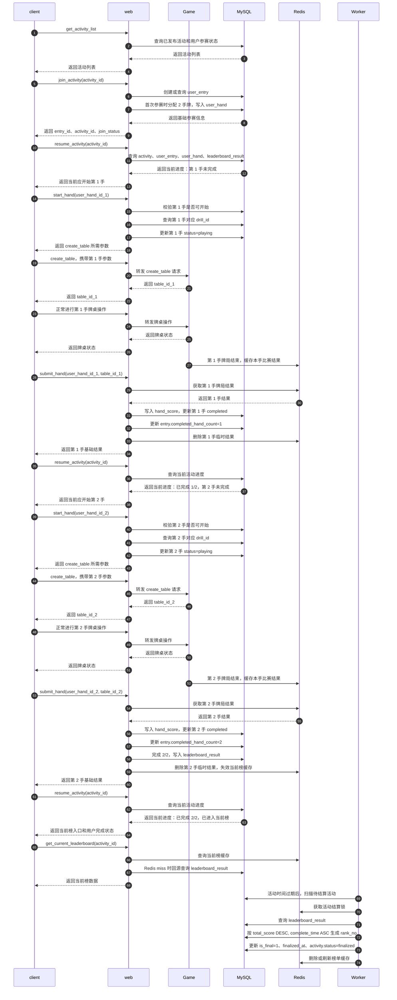

关键说明：

```text
本例中 N=2，用户必须完成 2 手牌才算完赛。
join_activity 只返回基础参赛信息。
resume_activity 是统一恢复活动进度的接口。
start_hand 不创建牌桌，只返回 create_table 所需参数。
client 根据 start_hand 返回参数走已有 create_table 流程。
submit_hand 每次只返回本手基础结果。
每次 submit_hand 后，client 都再次调用 resume_activity 获取最新进度。
第 1 手 submit_hand 后，resume_activity 判断未完成 2/2，继续第 2 手。
第 2 手 submit_hand 后，resume_activity 判断已完成 2/2，进入当前榜。
活动时间过期后，由 Worker 触发最终榜结算。
```

### 3.2.2 后台角度接口时序图：配置活动

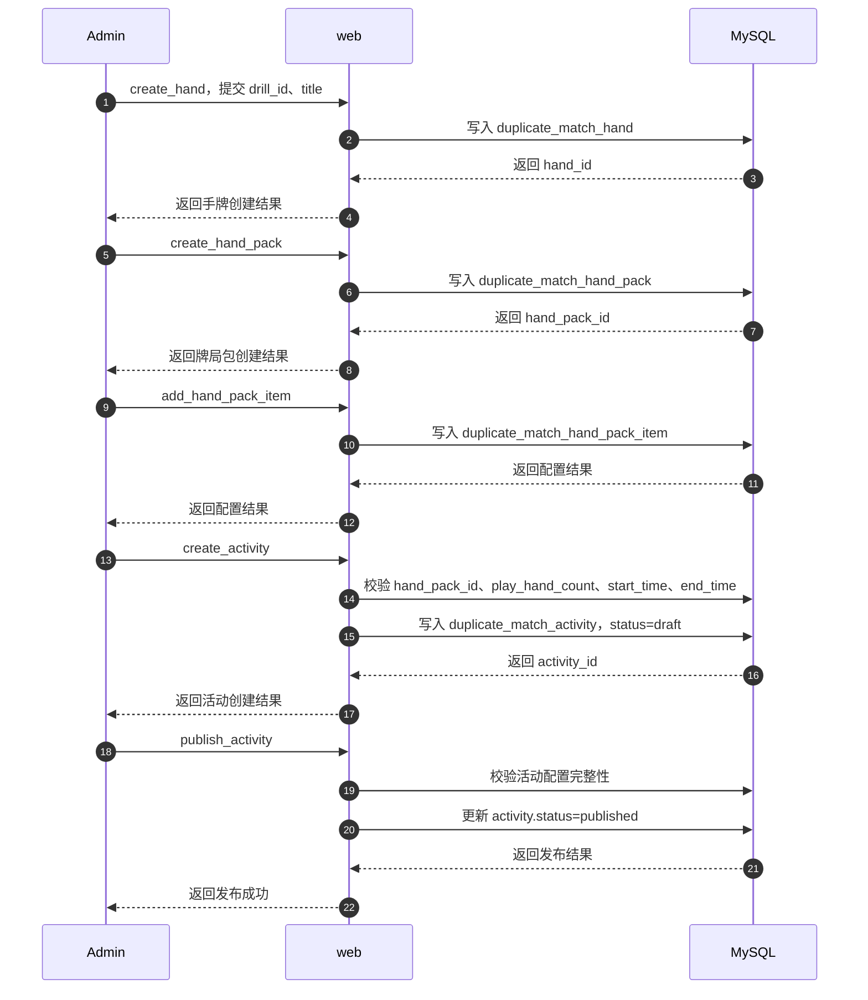

关键说明：

```text
后台配置流程只经过 web 和 MySQL，不需要 Game 参与。
手牌通过 drill_id 关联已有 drill 玩法，不复制 drill 内部数据。
play_hand_count 来自后台配置，不能写死。
```

### 3.2.3 用户角度接口时序图：获取活动列表

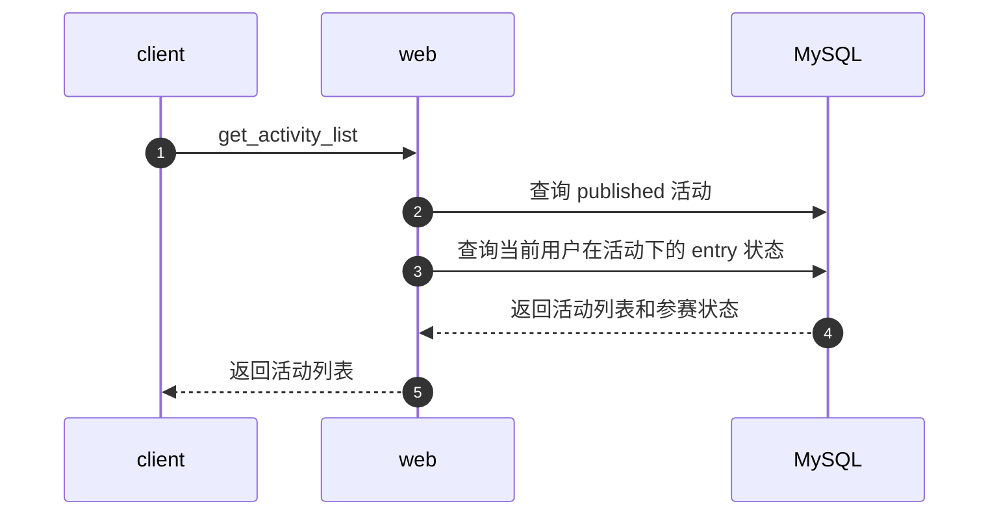

关键说明：

```text
get_activity_list 只查询活动和用户参与状态。
不需要 Game 参与。
```

### 3.2.4 用户角度接口时序图：参加活动

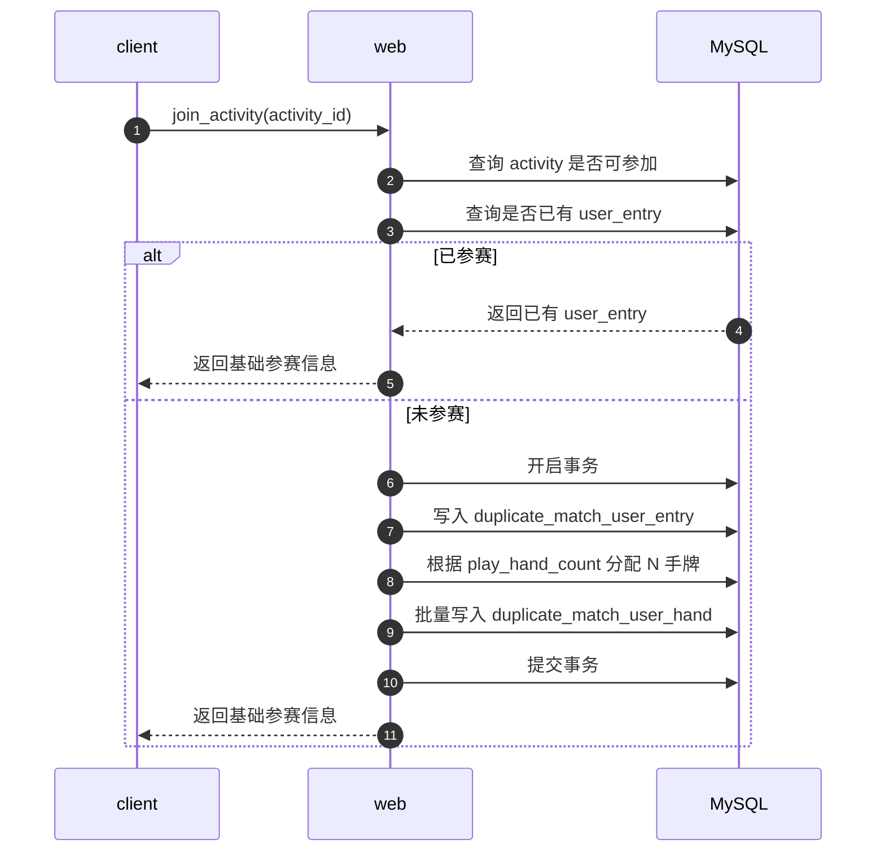

返回信息：

```text
entry_id
activity_id
join_status
```

关键说明：

```text
join_activity 需要幂等。
join_activity 不返回完整当前进度。
join_activity 成功后，client 继续调用 resume_activity 获取当前进度。
```

### 3.2.5 用户角度接口时序图：恢复活动进度

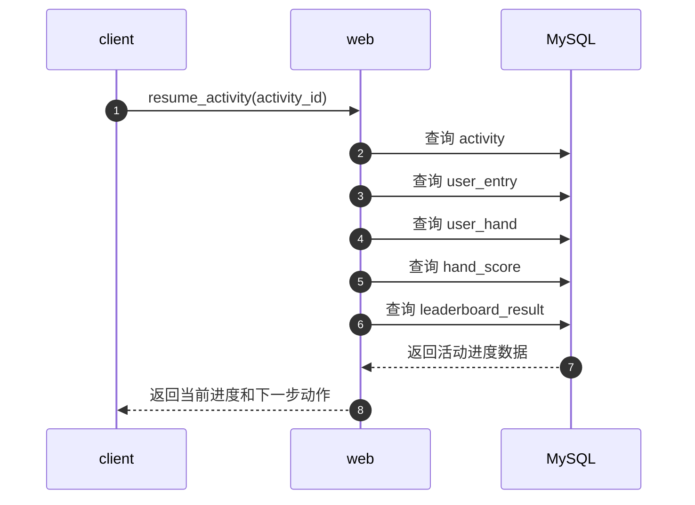

返回状态示例：

| 状态           | 前端动作       |
| ------------ | ---------- |
| `not_joined` | 展示开始挑战     |
| `joined`     | 展示当前应开始的手牌 |
| `playing`    | 展示继续当前手    |
| `completed`  | 展示当前榜入口    |
| `finalized`  | 展示最终榜入口    |
| `expired`    | 展示已截止      |

关键说明：

```text
resume_activity 是统一恢复活动进度的接口。
前端页面跳转优先以 resume_activity 返回结果为准。
```

### 3.2.6 用户角度接口时序图：开始当前手

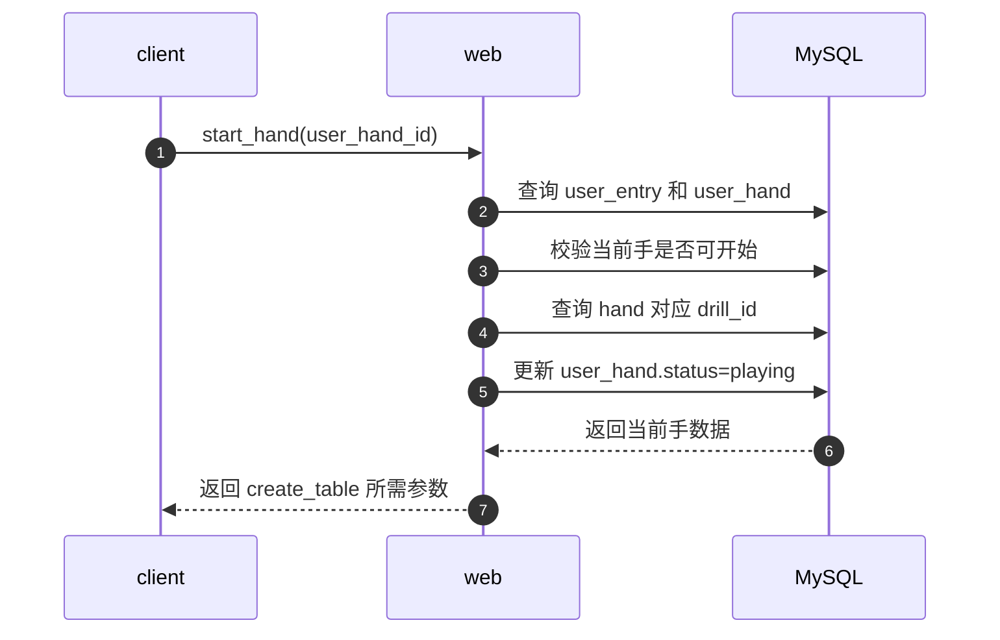

返回信息：

```text
activity_id
entry_id
user_hand_id
hand_id
drill_id
order_no
play_hand_count
create_table_params
```

关键说明：

```text
start_hand 不创建牌桌。
start_hand 只做活动进度校验，并返回 create_table 所需参数。
client 收到参数后，继续走已有 create_table 流程。
```

### 3.2.7 用户角度接口时序图：创建牌桌并进行牌局

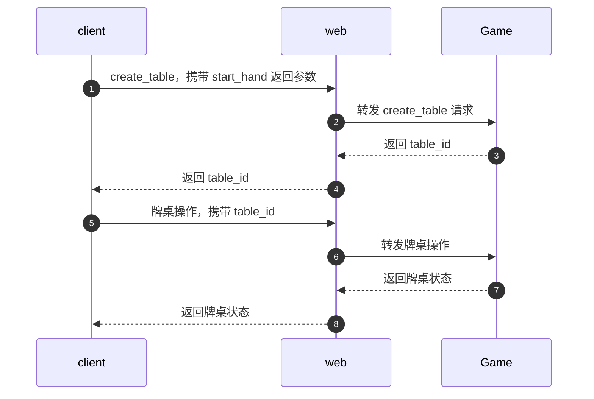

关键说明：

```text
具体牌桌过程由 Game 负责。
table_id 映射到固定 Game。
web 不保存牌桌状态。
```

### 3.2.8 Game 角度时序图：牌局结束缓存比赛结果

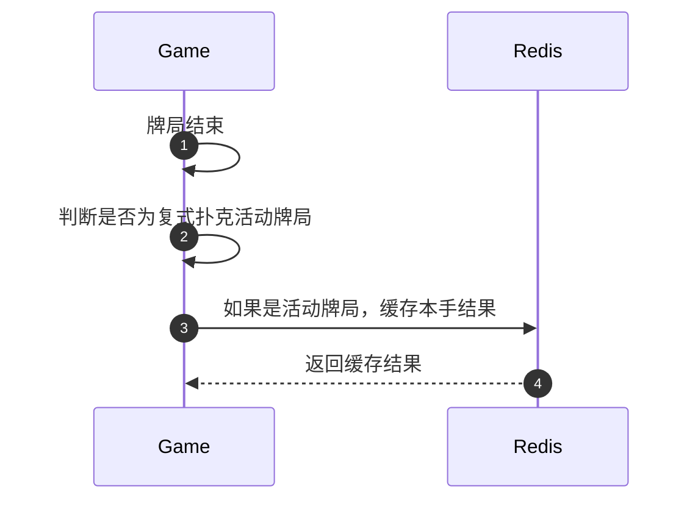

缓存内容示例：

```text
activity_id
entry_id
user_hand_id
table_id
raw_result
win_loss_bb
score
finished_at
```

关键说明：

```text
Redis 这里只作为 submit_hand 前的临时中转。
Redis 本手结果需要设置 TTL。
最终事实数据仍以 MySQL 为准。
```

### 3.2.9 用户角度接口时序图：提交每手结果

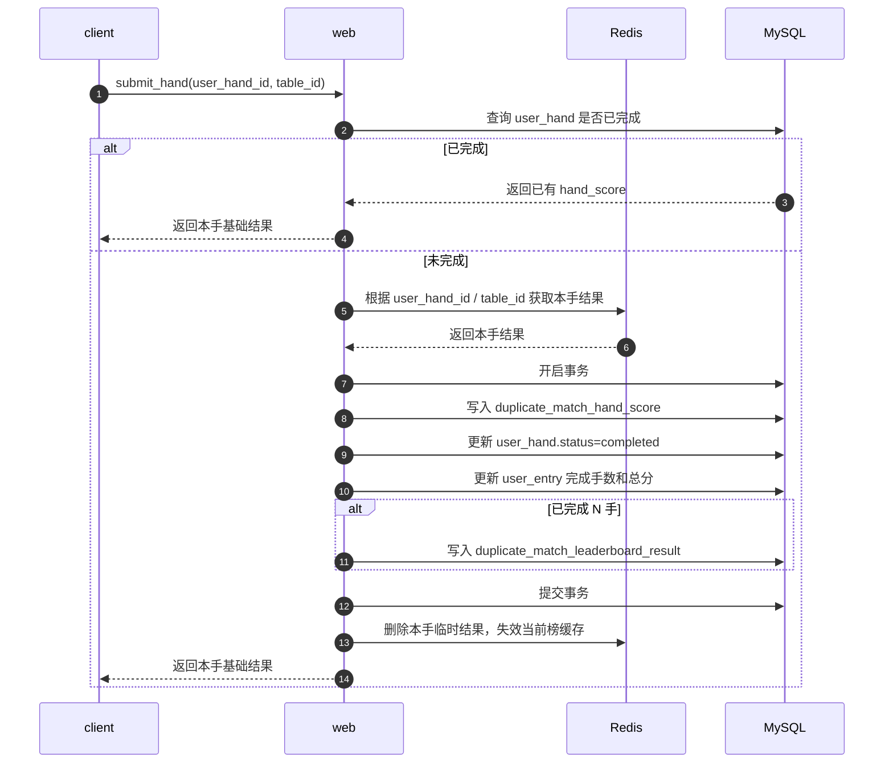

返回信息：

```text
user_hand_id
score
win_loss_bb
completed_hand_count
```

关键说明：

```text
submit_hand 只返回本手基础结果。
submit_hand 不负责返回完整下一步页面状态。
submit_hand 后，client 继续调用 resume_activity 获取最新进度。
submit_hand 需要幂等。
```

### 3.2.10 用户角度接口时序图：查询当前榜

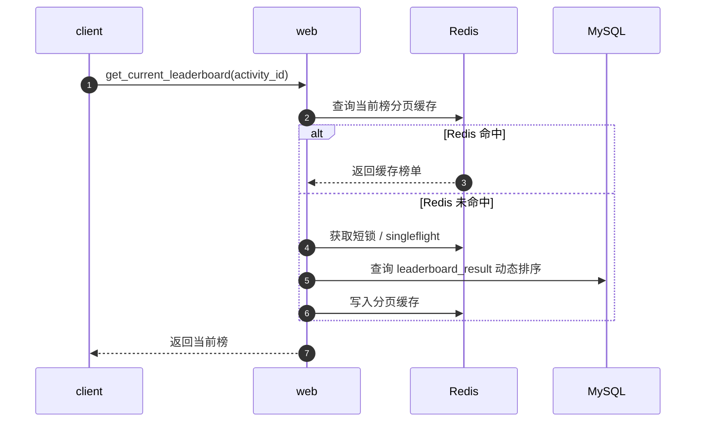

关键说明：

```text
当前榜只展示完成 N 手的用户。
排序：total_score DESC, complete_time ASC。
Redis miss 时回源 MySQL。
```

### 3.2.11 用户角度接口时序图：查询最终榜

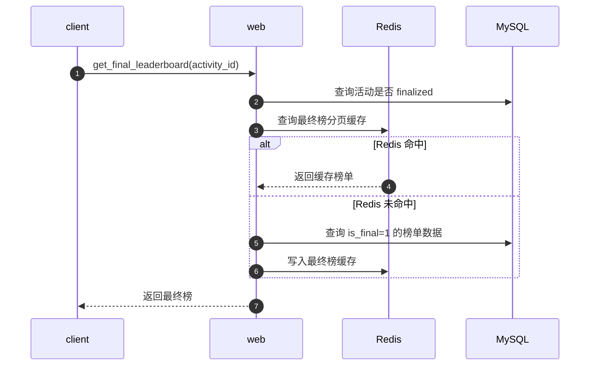

关键说明：

```text
最终榜以 rank_no 为准。
活动 finalized 后最终榜结果冻结。
```

### 3.2.12 Worker 角度时序图：活动截止后最终榜结算

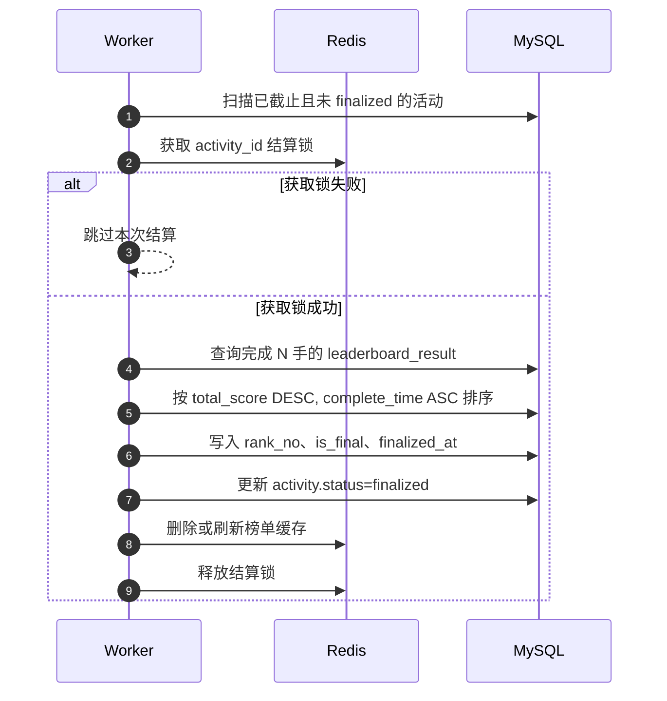

关键说明：

```text
Worker 通过 Redis 结算锁避免重复结算。
最终榜以 MySQL 写入结果为准。
Worker 重复执行需要幂等。
```
