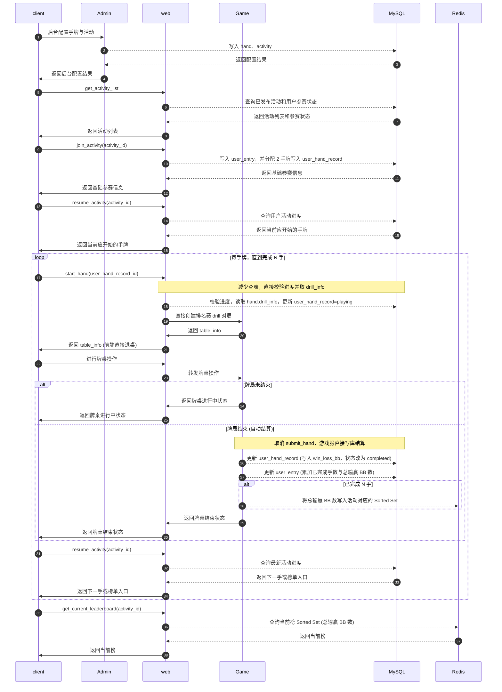
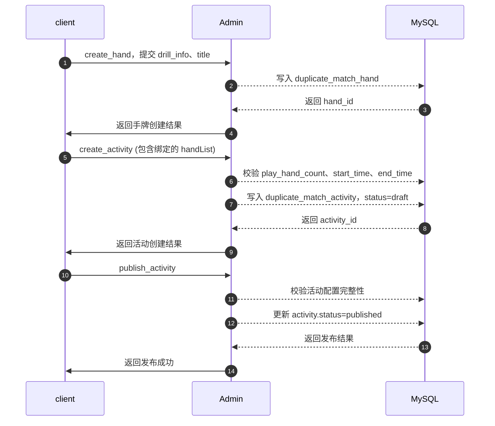
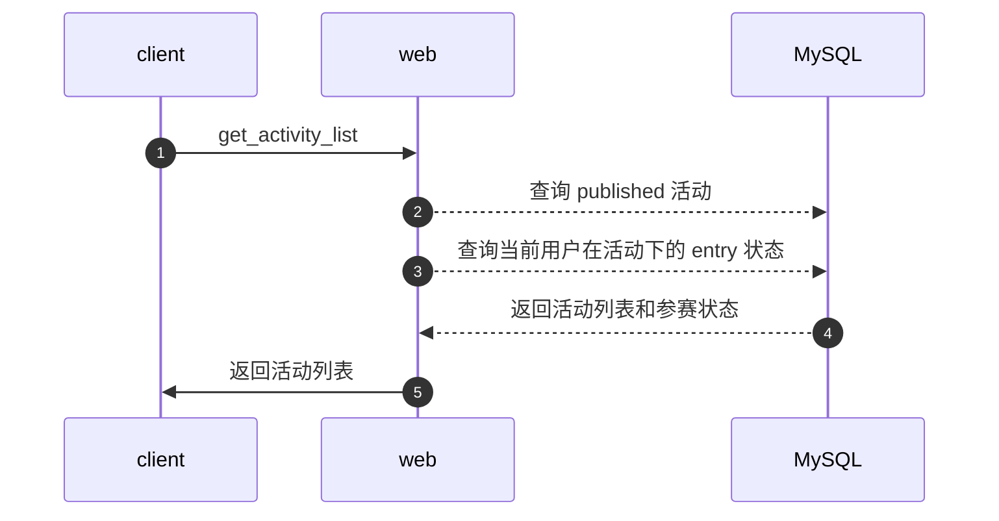
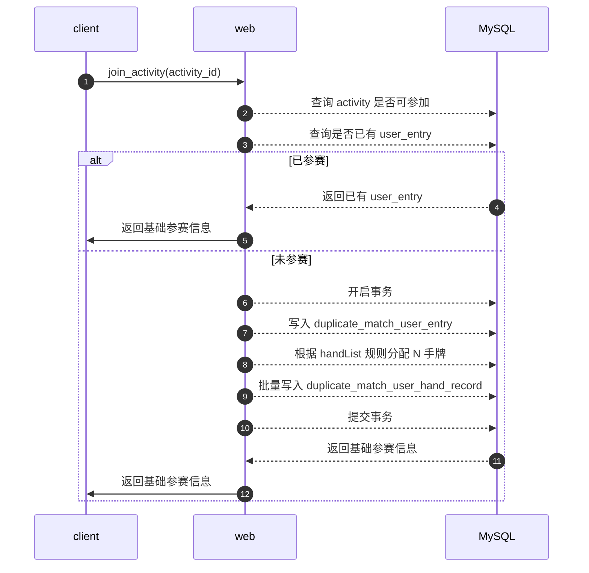
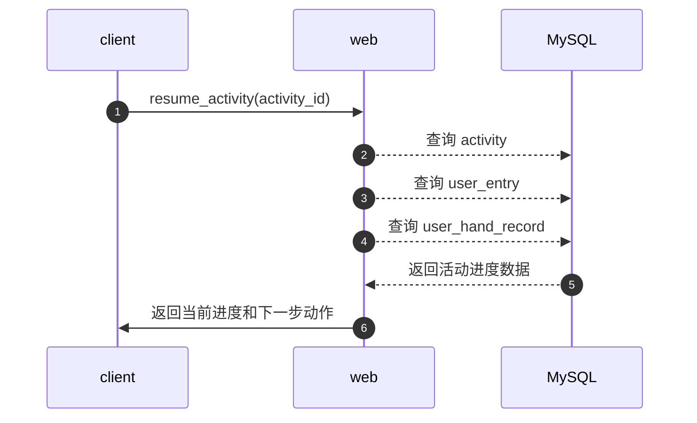
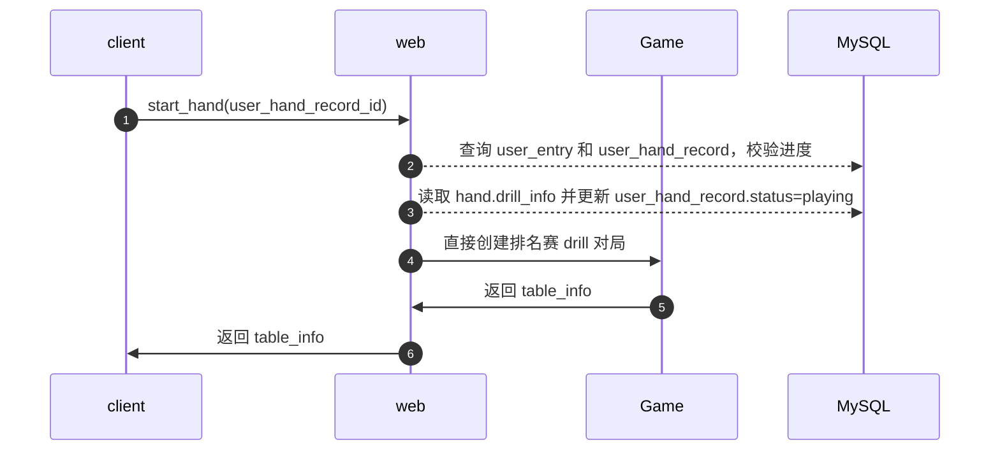
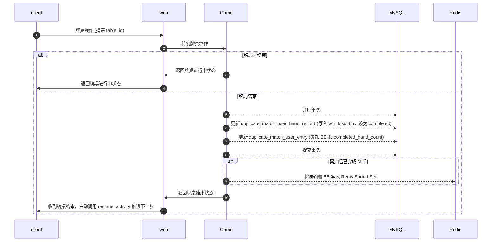
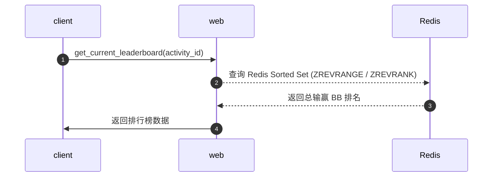

# 三、系统交互

## 3.1 是否有新增服务器

无。

本需求不新增独立服务器，复用当前已有链路，在现有系统上新增复式扑克 PvE 排名赛相关能力。

| 模块       | 说明                                          |
| -------- | ------------------------------------------- |
| `client` | 用户端 / 管理后台前端，负责活动查看、参赛、打牌、查榜，以及后台配置入口       |
| `Admin`  | 管理后台服务，负责活动及手牌配置，直接操作 MySQL               |
| `web`    | 无状态 Web 层，负责用户活动业务编排、进度查询、榜单查询             |
| `Game`   | 有状态游戏服务，负责具体 drill 对局运行及单局结束后的输赢落库         |
| `MySQL`  | 比赛事实源，保存活动、参赛、手牌分配记录数据                      |
| `Redis`  | 保存N手完成临时结果、实现以输赢BB数为准的排行榜、活动结算锁             |

## 3.2 是否有 CS 交互，SS 交互

有。

| 类型            | 说明                                             |
| ------------- | ---------------------------------------------- |
| 管理后台交互        | `client -> Admin -> MySQL`                     |
| 用户端 CS 交互     | `client -> web`                                |
| web 与 Game 交互 | `web -> Game`，用于创建排名赛 drill 对局、转发牌桌操作、获取牌桌状态   |
| DB 交互         | `Admin / web / Game -> MySQL / Redis`          |

时序图标记说明：

```text
->>  尖角实线：异步请求 / 异步返回
-->> 虚线：同步请求 / 同步返回
-)   圆角实线：快速跳过步骤，用于表示本图不展开的简化流程
```

---

### 3.2.1 系统交互总览：以 N=2 为例



关键说明：

```text
submit_hand 流程被取消。
单局结束后，由 Game 服务器直接更新 MySQL 中的对局记录 (user_hand_record) 和参赛总表 (user_entry)。
排行榜无 MySQL 表，达到完成条件时直接写 Redis Sorted Set。
Worker 结算本期暂不实现。
```

---

### 3.2.2 后台角度接口时序图：配置活动



关键说明：

```text
取消了 pack 牌局包概念，活动创建时直接在 handList(JSON) 中配置手牌集合。
duplicate_match_hand 保存 drill_info，开始牌局时直接通过配置启动 drill。
```

---

### 3.2.3 用户角度接口时序图：获取活动列表



---

### 3.2.4 用户角度接口时序图：参加活动



---

### 3.2.5 用户角度接口时序图：恢复活动进度



---

### 3.2.6 用户角度接口时序图：开始并创建当前手



关键说明：

```text
取消了 `create_duplicate_match_drill` 暴露给前端。
内部直接将 `start_hand` 与 `建桌` 合二为一，前端拿到 table_info 即可直接进桌，减少查表。
```

---

### 3.2.7 用户角度接口时序图：进行牌局与自动结算



关键说明：

```text
取代了原先的 `submit_hand`，由 Game 服务端直接落地结果，杜绝作弊和并发问题。
```

---

### 3.2.8 用户角度接口时序图：查询排行榜



关键说明：

```text
完全脱离 MySQL 排行榜表，仅由 Redis 提供榜单支持。
```