# 一、背景介绍

## 1.1 需求介绍

本文档用于说明 **复式扑克 PvE 排名赛 7.15** 的研发设计方案。

本需求基于已有 **drill 能力** 实现，新增一个后台可配置的 PvE 排名赛活动。核心闭环如下：

```text
后台配置活动
-> 用户参加活动
-> 系统分配 N 手牌
-> 用户逐手完成 PvE 对局
-> 每手完成后计分
-> 完成 N 手后进入当前榜
-> 活动截止后结算最终榜
```

## 1.1.1 需求点整理

7.15 本期聚焦 6 个核心模块。

| 模块        | 说明                      |
| --------- | ----------------------- |
| 活动配置      | 后台配置活动、牌局包、挑战手数、活动时间    |
| 用户参赛与手牌分配 | 用户参加活动后生成参赛记录和固定 N 手牌   |
| PvE 对局与恢复 | 用户按顺序完成 PvE 对局，支持活动进度恢复 |
| 每手计分      | 每手完成后生成计分结果             |
| 当前榜 / 最终榜 | 完成 N 手进入当前榜，活动截止后生成最终榜  |
| 截止结算      | Worker 扫描到期活动并冻结最终排名    |

## 1.1.2 需求点细节

| 角色 / 模块 | 影响范围                                        |
| ------- | ------------------------------------------- |
| 用户端     | 活动入口、活动详情、开始挑战、继续挑战、进度展示、榜单展示               |
| 管理后台    | 手牌配置、牌局包配置、活动配置、活动发布                        |
| 服务端     | 用户参赛、手牌分配、drill 对局接入、计分、进度推进、入榜、结算、恢复       |
| 数据库     | 新增 duplicate_match 相关表，支撑活动、参赛、手牌、计分、榜单闭环   |
| Redis   | 保存本手临时结果、Redis Sorted Set 加速当前榜、排行榜缓存、活动结算锁 |

## 1.2 周边文档链接（包括策划案、UI交互等资料）

无。

## 1.3 需求的 TAPD 单链接

待补充。

## 1.4 需求变更记录

| 日期  | 变更内容 | 影响范围 |
| --- | ---- | ---- |
| 待补充 | 待补充  | 待补充  |

# 二、参考方案介绍

## 2.1 设计原则

| 原则          | 说明                                                |
| ----------- | ------------------------------------------------- |
| MySQL 事实源   | 活动、参赛、手牌、计分、榜单、最终结算都以 MySQL 为准                    |
| Redis 辅助    | Redis 保存本手临时结果、Redis Sorted Set 加速当前榜、排行榜缓存和活动结算锁 |
| 完成 N 手才入榜   | 用户必须完成 `activity.play_hand_count` 才能进入榜单          |
| 当前榜 / 最终榜分离 | 当前榜动态查询，最终榜截止后冻结                                  |
| 只恢复活动进度     | 不恢复单手中途牌局状态                                       |
| 幂等兜底        | join、start hand、submit hand 需要支持重复请求              |
| 不影响普通 drill | 排名赛基于 drill 能力实现，但活动数据闭环独立                        |

## 2.2 数据结构

### 2.2.1 `duplicate_match_hand`：手牌基础表

用途：保存排名赛可引用的手牌配置。

排名赛手牌不直接复制已有牌局过程数据，而是通过 `drill_info` 创建新的 drill 牌局。用户开始某一手时，服务端通过手牌配置生成本次 PvE 对局需要的 drill 参数，并调用新的创建接口：

```text
create_duplicate_match_drill
```

该接口用于根据排名赛手牌配置创建本次活动专用的 drill 对局。

| 字段           | 类型           | 说明                  |
| ------------ | ------------ | ------------------- |
| `id`         | BIGINT       | 主键 ID               |
| `drill_info` | JSON         | 创建排名赛 drill 所需的手牌配置 |
| `title`      | VARCHAR(255) | 手牌名称                |
| `status`     | TINYINT      | 状态：启用 / 禁用          |
| `created_at` | DATETIME     | 创建时间                |
| `updated_at` | DATETIME     | 更新时间                |

关键索引：

| 索引           | 字段       | 说明       |
| ------------ | -------- | -------- |
| `idx_status` | `status` | 后台筛选可用手牌 |

### 2.2.2 `duplicate_match_hand_pack`：牌局包表

用途：定义一组可用于活动分配的手牌集合。

| 字段           | 类型           | 说明         |
| ------------ | ------------ | ---------- |
| `id`         | BIGINT       | 主键 ID      |
| `name`       | VARCHAR(255) | 牌局包名称      |
| `status`     | TINYINT      | 状态：启用 / 禁用 |
| `created_at` | DATETIME     | 创建时间       |
| `updated_at` | DATETIME     | 更新时间       |

关键索引：

| 索引           | 字段       | 说明      |
| ------------ | -------- | ------- |
| `idx_status` | `status` | 查询可用牌局包 |

### 2.2.3 `duplicate_match_hand_pack_item`：牌局包手牌关联表

用途：维护牌局包和手牌的关联关系，支持必选手和随机候选手。

| 字段             | 类型          | 说明           |
| -------------- | ----------- | ------------ |
| `id`           | BIGINT      | 主键 ID        |
| `hand_pack_id` | BIGINT      | 牌局包 ID       |
| `hand_id`      | BIGINT      | 手牌 ID        |
| `item_type`    | VARCHAR(32) | 类型：必选 / 随机候选 |
| `sort_no`      | INT         | 排序值          |
| `created_at`   | DATETIME    | 创建时间         |
| `updated_at`   | DATETIME    | 更新时间         |

关键索引：

| 索引                 | 字段                      | 说明              |
| ------------------ | ----------------------- | --------------- |
| `idx_hand_pack_id` | `hand_pack_id`          | 查询牌局包下的手牌       |
| `uk_pack_hand`     | `hand_pack_id, hand_id` | 防止同一牌局包重复绑定同一手牌 |

### 2.2.4 `duplicate_match_activity`：活动配置表

用途：保存 PvE 排名赛活动配置。

| 字段                | 类型           | 说明                                   |
| ----------------- | ------------ | ------------------------------------ |
| `id`              | BIGINT       | 主键 ID                                |
| `title`           | VARCHAR(255) | 活动名称                                 |
| `hand_pack_id`    | BIGINT       | 绑定的牌局包 ID                            |
| `play_hand_count` | INT          | 用户需要完成的手数 N                          |
| `start_time`      | DATETIME     | 活动开始时间                               |
| `end_time`        | DATETIME     | 活动截止时间                               |
| `status`          | VARCHAR(32)  | 活动状态：draft / published / finalized 等 |
| `scoring_mode`    | VARCHAR(64)  | 计分模式                                 |
| `finalized_at`    | DATETIME     | 最终榜结算完成时间                            |
| `created_at`      | DATETIME     | 创建时间                                 |
| `updated_at`      | DATETIME     | 更新时间                                 |

关键索引：

| 索引                    | 字段                             | 说明            |
| --------------------- | ------------------------------ | ------------- |
| `idx_status_time`     | `status, start_time, end_time` | 活动列表和活动状态判断   |
| `idx_status_end_time` | `status, end_time`             | Worker 扫描到期活动 |

关键规则：

```text
play_hand_count 不能写死为 10。
完成判断、入榜判断、结算判断都必须基于 activity.play_hand_count。
```

### 2.2.5 `duplicate_match_user_entry`：用户参赛记录表

用途：记录用户在某个活动下的一次有效参赛记录。

| 字段                     | 类型            | 说明                                          |
| ---------------------- | ------------- | ------------------------------------------- |
| `id`                   | BIGINT        | 主键 ID                                       |
| `activity_id`          | BIGINT        | 活动 ID                                       |
| `user_id`              | BIGINT        | 用户 ID                                       |
| `status`               | VARCHAR(32)   | 参赛状态：joined / playing / completed / expired |
| `completed_hand_count` | INT           | 已完成手数                                       |
| `total_score`          | DECIMAL(10,2) | 当前总分                                        |
| `current_order_no`     | INT           | 当前进行到第几手                                    |
| `joined_at`            | DATETIME      | 参赛时间                                        |
| `complete_time`        | DATETIME      | 完成全部 N 手时间                                  |
| `expired_at`           | DATETIME      | 过期时间                                        |
| `created_at`           | DATETIME      | 创建时间                                        |
| `updated_at`           | DATETIME      | 更新时间                                        |

关键索引：

| 索引                    | 字段                     | 说明          |
| --------------------- | ---------------------- | ----------- |
| `uk_activity_user`    | `activity_id, user_id` | 防止同一用户重复参赛  |
| `idx_activity_status` | `activity_id, status`  | 查询活动下不同状态用户 |
| `idx_user_activity`   | `user_id, activity_id` | 用户恢复进度      |

### 2.2.6 `duplicate_match_user_hand`：用户手牌分配表

用途：记录用户参加活动后实际分配到的 N 手牌。

`duplicate_match_user_hand` 是 **用户被分配到哪手、当前打到哪** 的进度事实。

| 字段             | 类型          | 说明                               |
| -------------- | ----------- | -------------------------------- |
| `id`           | BIGINT      | 主键 ID                            |
| `entry_id`     | BIGINT      | 用户参赛记录 ID                        |
| `activity_id`  | BIGINT      | 活动 ID                            |
| `user_id`      | BIGINT      | 用户 ID                            |
| `hand_id`      | BIGINT      | 手牌 ID                            |
| `order_no`     | INT         | 用户本次挑战中的顺序                       |
| `source_type`  | VARCHAR(32) | 来源类型：必选 / 随机                     |
| `status`       | VARCHAR(32) | 状态：pending / playing / completed |
| `started_at`   | DATETIME    | 开始时间                             |
| `completed_at` | DATETIME    | 完成时间                             |
| `created_at`   | DATETIME    | 创建时间                             |
| `updated_at`   | DATETIME    | 更新时间                             |

关键索引：

| 索引                  | 字段                     | 说明               |
| ------------------- | ---------------------- | ---------------- |
| `uk_entry_order`    | `entry_id, order_no`   | 防止同一参赛记录下顺序重复    |
| `uk_entry_hand`     | `entry_id, hand_id`    | 防止同一参赛记录重复分配同一手牌 |
| `idx_entry_status`  | `entry_id, status`     | 查询当前进度           |
| `idx_activity_user` | `activity_id, user_id` | 用户恢复进度           |

### 2.2.7 `duplicate_match_hand_score`：每手计分结果表

用途：保存用户每一手 PvE 对局完成后的计分结果。

`duplicate_match_hand_score` 是 **这手完成后得了多少分** 的计分事实。

| 字段             | 类型            | 说明      |
| -------------- | ------------- | ------- |
| `id`           | BIGINT        | 主键 ID   |
| `activity_id`  | BIGINT        | 活动 ID   |
| `entry_id`     | BIGINT        | 参赛记录 ID |
| `user_hand_id` | BIGINT        | 用户手牌 ID |
| `hand_id`      | BIGINT        | 手牌 ID   |
| `user_id`      | BIGINT        | 用户 ID   |
| `raw_result`   | JSON          | 原始结果    |
| `win_loss_bb`  | DECIMAL(10,2) | BB 输赢结果 |
| `score`        | DECIMAL(10,2) | 0-100 分 |
| `score_status` | VARCHAR(32)   | 分数状态    |
| `scored_at`    | DATETIME      | 计分时间    |
| `created_at`   | DATETIME      | 创建时间    |
| `updated_at`   | DATETIME      | 更新时间    |

关键索引：

| 索引                  | 字段                     | 说明           |
| ------------------- | ---------------------- | ------------ |
| `uk_user_hand`      | `user_hand_id`         | 防止同一手牌重复计分   |
| `idx_entry`         | `entry_id`             | 查询用户本次活动所有计分 |
| `idx_activity_user` | `activity_id, user_id` | 查询用户活动计分     |

补充说明：

```text
duplicate_match_user_hand 和 duplicate_match_hand_score 生命周期不同、职责不同。

duplicate_match_user_hand 负责进度：
- 用户被分配到哪手
- 当前打到第几手
- 当前手是 pending、playing 还是 completed

duplicate_match_hand_score 负责计分：
- 这一手完成后的 raw_result
- win_loss_bb
- score
- scored_at

两者分开，更利于幂等、恢复、入榜校验和后续扩展。
```

### 2.2.8 `duplicate_match_leaderboard_result`：榜单结果表

用途：保存完成 N 手用户的榜单结果，当前榜和最终榜共用该表。

| 字段              | 类型            | 说明      |
| --------------- | ------------- | ------- |
| `id`            | BIGINT        | 主键 ID   |
| `activity_id`   | BIGINT        | 活动 ID   |
| `entry_id`      | BIGINT        | 参赛记录 ID |
| `user_id`       | BIGINT        | 用户 ID   |
| `total_score`   | DECIMAL(10,2) | 总分      |
| `complete_time` | DATETIME      | 完成时间    |
| `rank_no`       | INT           | 最终排名    |
| `is_final`      | TINYINT       | 是否最终榜   |
| `finalized_at`  | DATETIME      | 最终榜冻结时间 |
| `created_at`    | DATETIME      | 创建时间    |
| `updated_at`    | DATETIME      | 更新时间    |

关键索引：

| 索引                   | 字段                                                  | 说明             |
| -------------------- | --------------------------------------------------- | -------------- |
| `uk_entry`           | `entry_id`                                          | 防止同一参赛记录重复入榜   |
| `uk_activity_user`   | `activity_id, user_id`                              | 防止同一用户同一活动重复入榜 |
| `idx_activity_score` | `activity_id, is_final, total_score, complete_time` | 支持榜单排序查询       |
| `idx_activity_rank`  | `activity_id, is_final, rank_no`                    | 支持最终榜分页查询      |

排序规则：

```text
total_score DESC
complete_time ASC
```

当前榜：

```text
MySQL 仍然是排行榜事实源。
Redis Sorted Set 可用于加速当前榜查询。
当前榜写入或更新时，可以把完成 N 手用户写入 activity 维度的 sorted set。
查询当前榜时优先查 Redis Sorted Set，Redis miss 或数据异常时回源 MySQL。
```

最终榜：

```text
Worker 结算后写入 rank_no、is_final、finalized_at。
最终榜以 MySQL 中冻结后的 rank_no 为准。
```
# 三、系统交互

## 3.1 是否有新增服务器

无。

本需求不新增独立服务器，复用当前已有链路，在现有系统上新增复式扑克 PvE 排名赛相关能力。

| 模块       | 说明                                          |
| -------- | ------------------------------------------- |
| `client` | 用户端 / 管理后台前端，负责活动查看、参赛、打牌、查榜，以及后台配置入口       |
| `Admin`  | 管理后台服务，负责手牌、牌局包、活动配置，直接操作 MySQL             |
| `web`    | 无状态 Web 层，负责用户活动业务编排、进度查询、计分落库、榜单查询         |
| `Game`   | 有状态游戏服务，负责具体 table / drill 对局运行             |
| `MySQL`  | 比赛事实源，保存活动、参赛、手牌分配、计分、榜单数据                  |
| `Redis`  | 保存本手临时结果、Redis Sorted Set 加速当前榜、排行榜缓存、活动结算锁 |
| `Worker` | 活动截止后的最终榜结算任务                               |

## 3.2 是否有 CS 交互，SS 交互

有。

| 类型            | 说明                                             |
| ------------- | ---------------------------------------------- |
| 管理后台交互        | `client -> Admin -> MySQL`                     |
| 用户端 CS 交互     | `client -> web`                                |
| web 与 Game 交互 | `web -> Game`，用于创建排名赛 drill 对局、转发牌桌操作、获取牌桌状态   |
| DB 交互         | `Admin / web / Game / Worker -> MySQL / Redis` |
| Worker 交互     | `Worker -> MySQL / Redis`                      |

时序图标记说明：

```text
->>  尖角实线：异步请求 / 异步返回
-->> 虚线：同步请求 / 同步返回
-)   圆角实线：快速跳过步骤，用于表示本图不展开的简化流程
```

交互规则：

```text
client -> Admin：HTTP 异步请求 / 异步返回
client -> web：HTTP 异步请求 / 异步返回
web -> Game：HTTP/RPC 异步请求 / 异步返回

Admin / web / Game / Worker -> MySQL：同步请求 / 同步返回
Admin / web / Game / Worker -> Redis：同步请求 / 同步返回
```

---

### 3.2.1 系统交互总览：以 N=2 为例

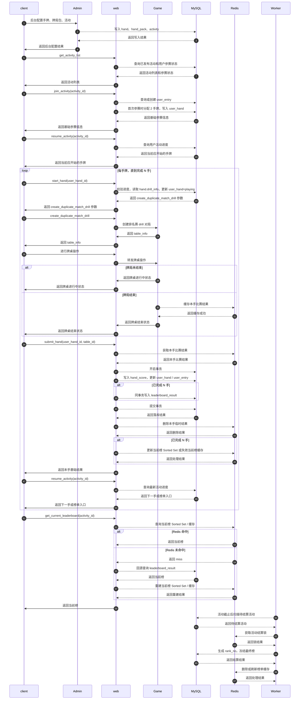
```mermaid
sequenceDiagram
    autonumber
    participant client
    participant Admin
    participant web
    participant Game
    participant MySQL
    participant Redis
    participant Worker

    client->>Admin: 后台配置手牌、牌局包、活动
    Admin-->>MySQL: 写入 hand、hand_pack、activity
    MySQL-->>Admin: 返回写入结果
    Admin->>client: 返回后台配置结果

    client->>web: get_activity_list
    web-->>MySQL: 查询已发布活动和用户参赛状态
    MySQL-->>web: 返回活动列表和参赛状态
    web->>client: 返回活动列表

    client->>web: join_activity(activity_id)
    web-->>MySQL: 查询或创建 user_entry
    web-->>MySQL: 首次参赛时分配 2 手牌，写入 user_hand
    MySQL-->>web: 返回基础参赛信息
    web->>client: 返回基础参赛信息

    client->>web: resume_activity(activity_id)
    web-->>MySQL: 查询用户活动进度
    MySQL-->>web: 返回当前应开始的手牌
    web->>client: 返回当前应开始的手牌

    loop 每手牌，直到完成 N 手
        client->>web: start_hand(user_hand_id)
        web-->>MySQL: 校验进度，读取 hand.drill_info，更新 user_hand=playing
        MySQL-->>web: 返回 create_duplicate_match_drill 参数
        web->>client: 返回 create_duplicate_match_drill 参数

        client->>web: create_duplicate_match_drill
        web->>Game: 创建排名赛 drill 对局
        Game->>web: 返回 table_info
        web->>client: 返回 table_info

        client->>web: 进行牌桌操作
        web->>Game: 转发牌桌操作

        alt 牌局未结束
            Game->>web: 返回牌桌进行中状态
            web->>client: 返回牌桌进行中状态
        else 牌局结束
            Game-->>Redis: 缓存本手比赛结果
            Redis-->>Game: 返回缓存成功
            Game->>web: 返回牌桌结束状态
            web->>client: 返回牌桌结束状态
        end

        client->>web: submit_hand(user_hand_id, table_id)
        web-->>Redis: 获取本手比赛结果
        Redis-->>web: 返回本手比赛结果
        web-->>MySQL: 开启事务
        web-->>MySQL: 写入 hand_score，更新 user_hand / user_entry
        alt 已完成 N 手
            web-->>MySQL: 同事务写入 leaderboard_result
        end
        web-->>MySQL: 提交事务
        MySQL-->>web: 返回落库结果
        web-->>Redis: 删除本手临时结果
        Redis-->>web: 返回删除结果
        alt 已完成 N 手
            web-->>Redis: 更新当前榜 Sorted Set 或失效当前榜缓存
            Redis-->>web: 返回处理结果
        end
        web->>client: 返回本手基础结果

        client->>web: resume_activity(activity_id)
        web-->>MySQL: 查询最新活动进度
        MySQL-->>web: 返回下一手或榜单入口
        web->>client: 返回下一手或榜单入口
    end

    client->>web: get_current_leaderboard(activity_id)
    web-->>Redis: 查询当前榜 Sorted Set / 缓存

    alt Redis 命中
        Redis-->>web: 返回当前榜
    else Redis 未命中
        Redis-->>web: 返回 miss
        web-->>MySQL: 回源查询 leaderboard_result
        MySQL-->>web: 返回当前榜
        web-->>Redis: 重建当前榜 Sorted Set / 缓存
        Redis-->>web: 返回重建结果
    end

    web->>client: 返回当前榜

    Worker-->>MySQL: 活动截止后扫描待结算活动
    MySQL-->>Worker: 返回待结算活动
    Worker-->>Redis: 获取活动结算锁
    Redis-->>Worker: 返回锁结果
    Worker-->>MySQL: 生成 rank_no，冻结最终榜
    MySQL-->>Worker: 返回结算结果
    Worker-->>Redis: 删除或刷新榜单缓存
    Redis-->>Worker: 返回处理结果
```

关键说明：

```text
submit_hand 根据 user_hand_id + table_id 从 Redis 读取本手比赛结果，并落库到 MySQL。

最后一手完成时，web 在 MySQL 事务内写入 hand_score、user_hand、user_entry 和 leaderboard_result。

MySQL 事务提交成功后，web 再更新 Redis Sorted Set 或失效当前榜缓存。

当前榜以 MySQL 的 leaderboard_result 为事实源，Redis Sorted Set 只用于加速查询。

活动截止后由 Worker 结算最终榜，最终榜以 MySQL 冻结后的 rank_no 为准。
```

---

### 3.2.2 后台角度接口时序图：配置活动

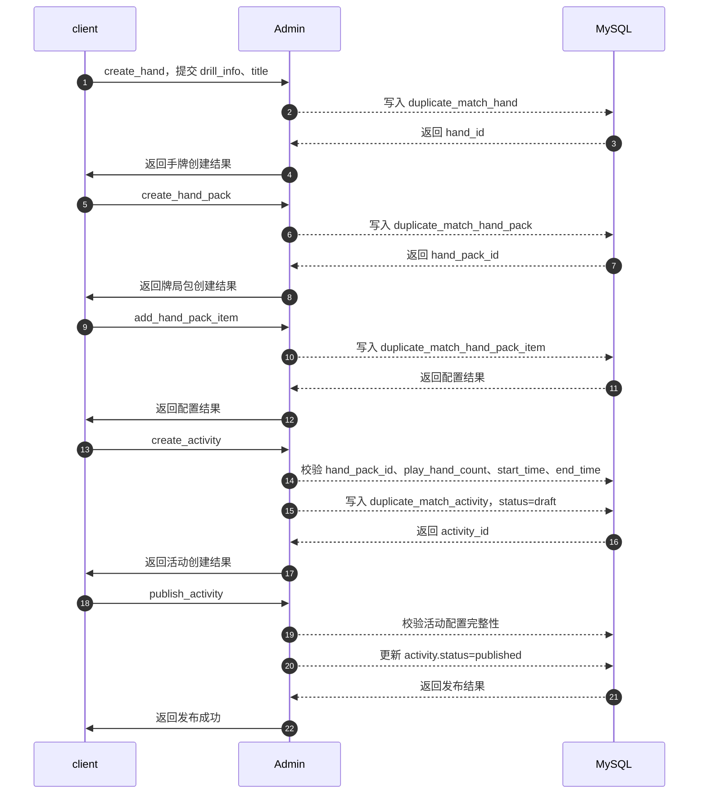
```mermaid
sequenceDiagram
    autonumber
    participant client
    participant Admin
    participant MySQL

    client->>Admin: create_hand，提交 drill_info、title
    Admin-->>MySQL: 写入 duplicate_match_hand
    MySQL-->>Admin: 返回 hand_id
    Admin->>client: 返回手牌创建结果

    client->>Admin: create_hand_pack
    Admin-->>MySQL: 写入 duplicate_match_hand_pack
    MySQL-->>Admin: 返回 hand_pack_id
    Admin->>client: 返回牌局包创建结果

    client->>Admin: add_hand_pack_item
    Admin-->>MySQL: 写入 duplicate_match_hand_pack_item
    MySQL-->>Admin: 返回配置结果
    Admin->>client: 返回配置结果

    client->>Admin: create_activity
    Admin-->>MySQL: 校验 hand_pack_id、play_hand_count、start_time、end_time
    Admin-->>MySQL: 写入 duplicate_match_activity，status=draft
    MySQL-->>Admin: 返回 activity_id
    Admin->>client: 返回活动创建结果

    client->>Admin: publish_activity
    Admin-->>MySQL: 校验活动配置完整性
    Admin-->>MySQL: 更新 activity.status=published
    MySQL-->>Admin: 返回发布结果
    Admin->>client: 返回发布成功
```

关键说明：

```text
duplicate_match_hand 保存 drill_info。
用户开始手牌时，再基于 drill_info 创建排名赛专用 drill 对局。

play_hand_count 来自后台配置，不能写死。
```

---

### 3.2.3 用户角度接口时序图：获取活动列表

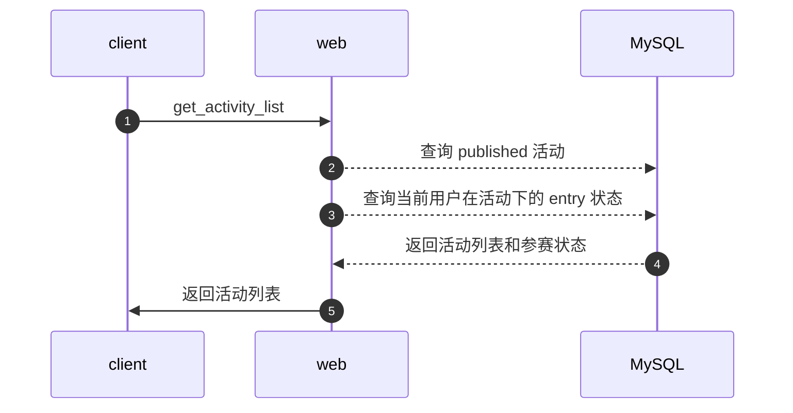
```mermaid
sequenceDiagram
    autonumber
    participant client
    participant web
    participant MySQL

    client->>web: get_activity_list
    web-->>MySQL: 查询 published 活动
    web-->>MySQL: 查询当前用户在活动下的 entry 状态
    MySQL-->>web: 返回活动列表和参赛状态
    web->>client: 返回活动列表
```

关键说明：

```text
get_activity_list 只查询活动和用户参与状态。
不需要 Game 参与。
```

---

### 3.2.4 用户角度接口时序图：参加活动

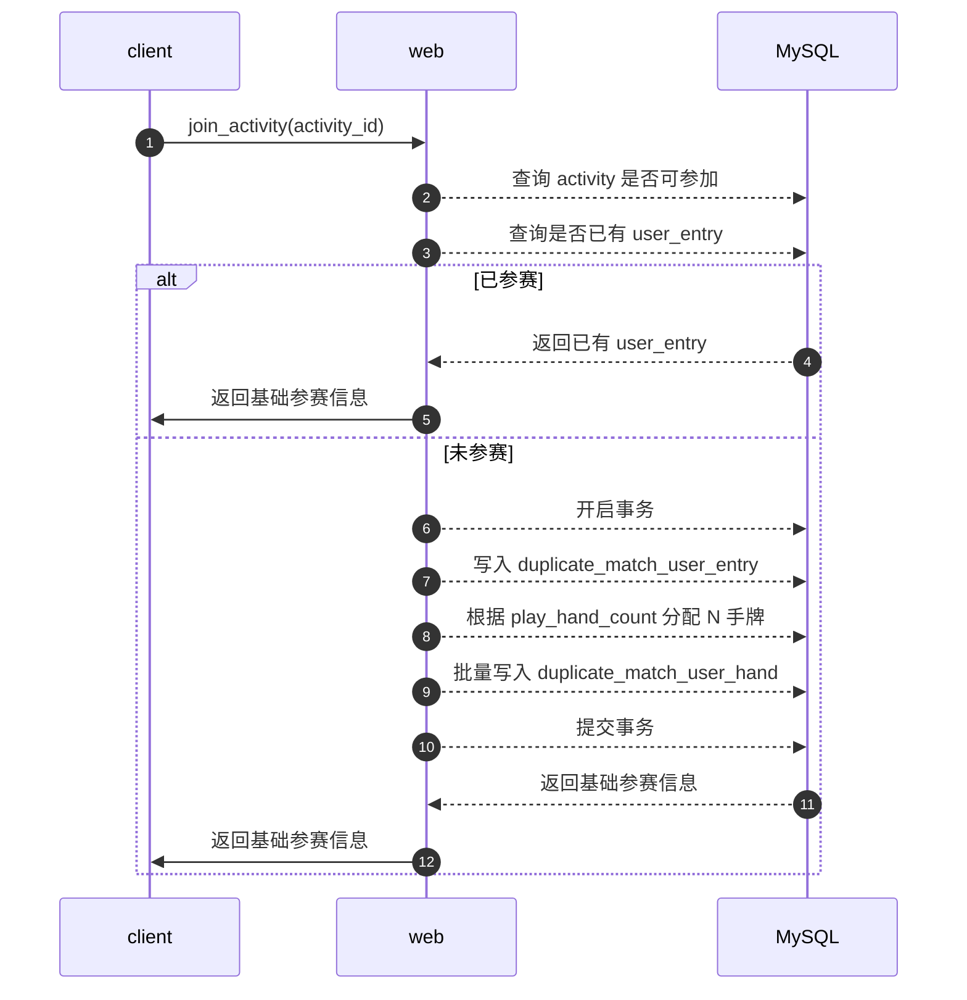
```mermaid
sequenceDiagram
    autonumber
    participant client
    participant web
    participant MySQL

    client->>web: join_activity(activity_id)
    web-->>MySQL: 查询 activity 是否可参加
    web-->>MySQL: 查询是否已有 user_entry

    alt 已参赛
        MySQL-->>web: 返回已有 user_entry
        web->>client: 返回基础参赛信息
    else 未参赛
        web-->>MySQL: 开启事务
        web-->>MySQL: 写入 duplicate_match_user_entry
        web-->>MySQL: 根据 play_hand_count 分配 N 手牌
        web-->>MySQL: 批量写入 duplicate_match_user_hand
        web-->>MySQL: 提交事务
        MySQL-->>web: 返回基础参赛信息
        web->>client: 返回基础参赛信息
    end
```

返回信息：

```text
entry_id
activity_id
join_status
```

关键说明：

```text
join_activity 需要幂等。
join_activity 不返回完整当前进度。
join_activity 成功后，client 继续调用 resume_activity 获取当前进度。
```

---

### 3.2.5 用户角度接口时序图：恢复活动进度

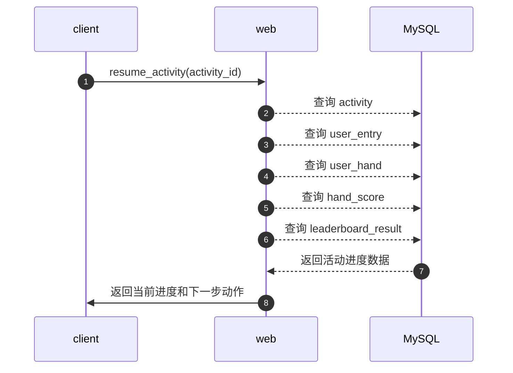
```mermaid
sequenceDiagram
    autonumber
    participant client
    participant web
    participant MySQL

    client->>web: resume_activity(activity_id)
    web-->>MySQL: 查询 activity
    web-->>MySQL: 查询 user_entry
    web-->>MySQL: 查询 user_hand
    web-->>MySQL: 查询 hand_score
    web-->>MySQL: 查询 leaderboard_result
    MySQL-->>web: 返回活动进度数据
    web->>client: 返回当前进度和下一步动作
```

返回状态示例：

| 状态           | 前端动作       |
| ------------ | ---------- |
| `not_joined` | 展示开始挑战     |
| `joined`     | 展示当前应开始的手牌 |
| `playing`    | 展示继续当前手    |
| `completed`  | 展示当前榜入口    |
| `finalized`  | 展示最终榜入口    |
| `expired`    | 展示已截止      |

关键说明：

```text
resume_activity 是统一恢复活动进度的接口。
前端页面跳转优先以 resume_activity 返回结果为准。
恢复的是活动进度，不恢复单手中途牌局状态。
```

---

### 3.2.6 用户角度接口时序图：开始当前手

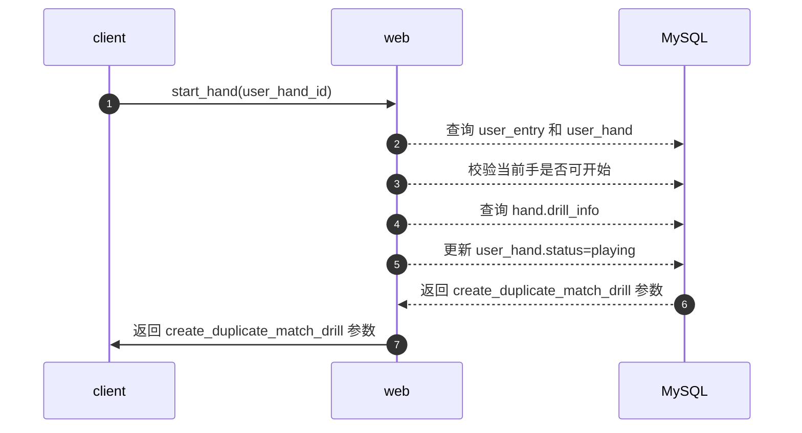
```mermaid
sequenceDiagram
    autonumber
    participant client
    participant web
    participant MySQL

    client->>web: start_hand(user_hand_id)
    web-->>MySQL: 查询 user_entry 和 user_hand
    web-->>MySQL: 校验当前手是否可开始
    web-->>MySQL: 查询 hand.drill_info
    web-->>MySQL: 更新 user_hand.status=playing
    MySQL-->>web: 返回 create_duplicate_match_drill 参数
    web->>client: 返回 create_duplicate_match_drill 参数
```

返回信息：

```text
activity_id
entry_id
user_hand_id
hand_id
order_no
play_hand_count
create_duplicate_match_drill_params
```

关键说明：

```text
start_hand 不创建牌桌。
start_hand 只做活动进度校验，并返回 create_duplicate_match_drill 所需参数。
client 收到参数后，继续调用 create_duplicate_match_drill。
```

---

### 3.2.7 用户角度接口时序图：创建排名赛 drill 对局并进行牌局

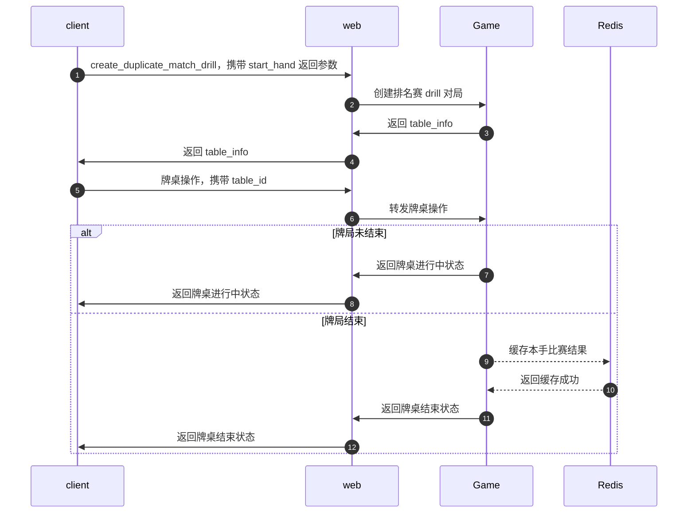
```mermaid
sequenceDiagram
    autonumber
    participant client
    participant web
    participant Game
    participant Redis

    client->>web: create_duplicate_match_drill，携带 start_hand 返回参数
    web->>Game: 创建排名赛 drill 对局
    Game->>web: 返回 table_info
    web->>client: 返回 table_info

    client->>web: 牌桌操作，携带 table_id
    web->>Game: 转发牌桌操作

    alt 牌局未结束
        Game->>web: 返回牌桌进行中状态
        web->>client: 返回牌桌进行中状态
    else 牌局结束
        Game-->>Redis: 缓存本手比赛结果
        Redis-->>Game: 返回缓存成功
        Game->>web: 返回牌桌结束状态
        web->>client: 返回牌桌结束状态
    end
```

关键说明：

```text
具体牌桌过程由 Game 负责。
web 不保存牌桌状态。
牌局结束时，Game 先把本手比赛结果同步写入 Redis，再返回结束状态。
```

---

### 3.2.8 用户角度接口时序图：提交每手结果

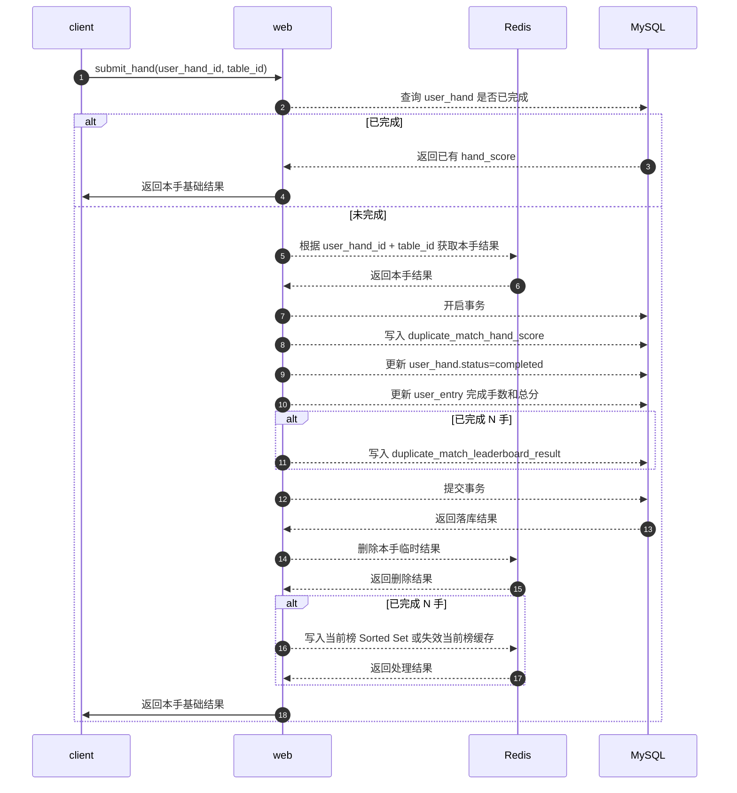
```mermaid
sequenceDiagram
    autonumber
    participant client
    participant web
    participant Redis
    participant MySQL

    client->>web: submit_hand(user_hand_id, table_id)
    web-->>MySQL: 查询 user_hand 是否已完成

    alt 已完成
        MySQL-->>web: 返回已有 hand_score
        web->>client: 返回本手基础结果
    else 未完成
        web-->>Redis: 根据 user_hand_id + table_id 获取本手结果
        Redis-->>web: 返回本手结果
        web-->>MySQL: 开启事务
        web-->>MySQL: 写入 duplicate_match_hand_score
        web-->>MySQL: 更新 user_hand.status=completed
        web-->>MySQL: 更新 user_entry 完成手数和总分

        alt 已完成 N 手
            web-->>MySQL: 写入 duplicate_match_leaderboard_result
        end

        web-->>MySQL: 提交事务
        MySQL-->>web: 返回落库结果
        web-->>Redis: 删除本手临时结果
        Redis-->>web: 返回删除结果

        alt 已完成 N 手
            web-->>Redis: 写入当前榜 Sorted Set 或失效当前榜缓存
            Redis-->>web: 返回处理结果
        end

        web->>client: 返回本手基础结果
    end
```

返回信息：

```text
user_hand_id
score
win_loss_bb
completed_hand_count
```

关键说明：

```text
submit_hand 只返回本手基础结果。
submit_hand 不负责返回完整下一步页面状态。
submit_hand 后，client 继续调用 resume_activity 获取最新进度。
submit_hand 需要幂等。

如果本手完成后达到 N 手，leaderboard_result 必须在 MySQL 事务内写入。
Redis 当前榜更新必须发生在 MySQL 事务提交成功之后。
Redis 更新失败不影响 MySQL 入榜事实，只影响当前榜查询加速。
```

---

### 3.2.9 用户角度接口时序图：查询当前榜

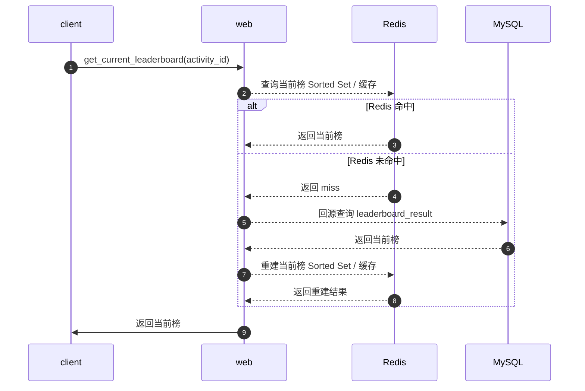
```mermaid
sequenceDiagram
    autonumber
    participant client
    participant web
    participant Redis
    participant MySQL

    client->>web: get_current_leaderboard(activity_id)
    web-->>Redis: 查询当前榜 Sorted Set / 缓存

    alt Redis 命中
        Redis-->>web: 返回当前榜
    else Redis 未命中
        Redis-->>web: 返回 miss
        web-->>MySQL: 回源查询 leaderboard_result
        MySQL-->>web: 返回当前榜
        web-->>Redis: 重建当前榜 Sorted Set / 缓存
        Redis-->>web: 返回重建结果
    end

    web->>client: 返回当前榜
```

关键说明：

```text
当前榜只展示完成 N 手的用户。
当前榜以 MySQL 的 leaderboard_result 为事实源。
Redis Sorted Set 只用于加速当前榜查询。
Redis miss 时回源 MySQL。
```

---

### 3.2.10 用户角度接口时序图：查询最终榜

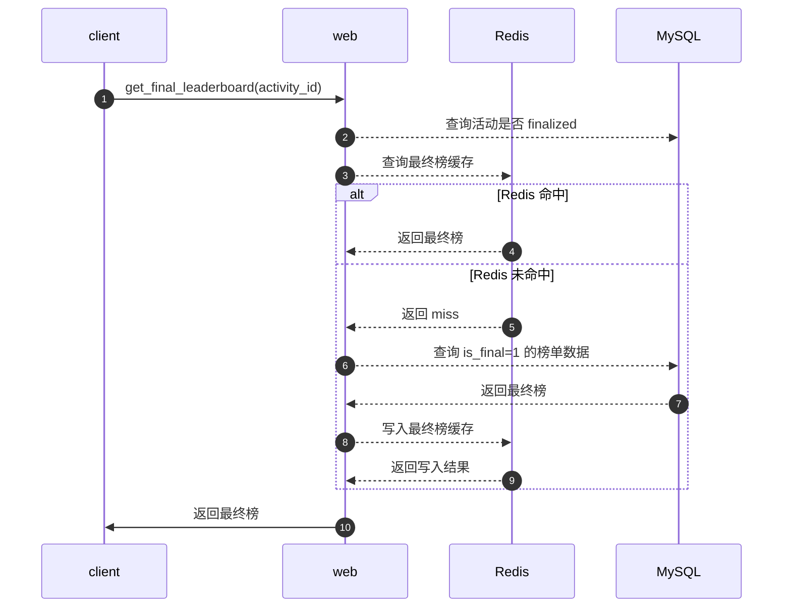
```mermaid
sequenceDiagram
    autonumber
    participant client
    participant web
    participant Redis
    participant MySQL

    client->>web: get_final_leaderboard(activity_id)
    web-->>MySQL: 查询活动是否 finalized
    web-->>Redis: 查询最终榜缓存

    alt Redis 命中
        Redis-->>web: 返回最终榜
    else Redis 未命中
        Redis-->>web: 返回 miss
        web-->>MySQL: 查询 is_final=1 的榜单数据
        MySQL-->>web: 返回最终榜
        web-->>Redis: 写入最终榜缓存
        Redis-->>web: 返回写入结果
    end

    web->>client: 返回最终榜
```

关键说明：

```text
最终榜以 rank_no 为准。
活动 finalized 后最终榜结果冻结。
```

---

### 3.2.11 Worker 角度时序图：活动截止后最终榜结算

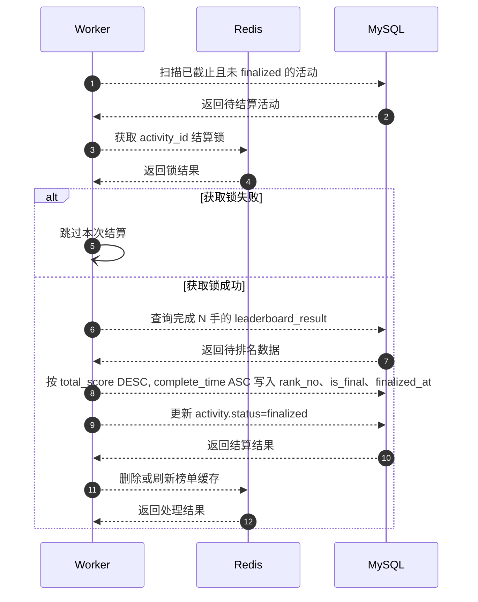
```mermaid
sequenceDiagram
    autonumber
    participant Worker
    participant Redis
    participant MySQL

    Worker-->>MySQL: 扫描已截止且未 finalized 的活动
    MySQL-->>Worker: 返回待结算活动
    Worker-->>Redis: 获取 activity_id 结算锁
    Redis-->>Worker: 返回锁结果

    alt 获取锁失败
        Worker-)Worker: 跳过本次结算
    else 获取锁成功
        Worker-->>MySQL: 查询完成 N 手的 leaderboard_result
        MySQL-->>Worker: 返回待排名数据
        Worker-->>MySQL: 按 total_score DESC, complete_time ASC 写入 rank_no、is_final、finalized_at
        Worker-->>MySQL: 更新 activity.status=finalized
        MySQL-->>Worker: 返回结算结果
        Worker-->>Redis: 删除或刷新榜单缓存
        Redis-->>Worker: 返回处理结果
    end
```

关键说明：

```text
Worker 通过 Redis 结算锁避免重复结算。
最终榜以 MySQL 写入结果为准。
Worker 重复执行需要幂等。

最终榜结算是低频操作，7.15 阶段优先保证正确性和可追溯性。
Worker 结算时从 MySQL leaderboard_result 重新读取完成用户并排序生成 rank_no。
Redis 当前榜 Sorted Set 不作为最终榜事实源。
如后续单活动完赛人数达到十万级，再评估分批结算、临时表或离线排行榜方案。
```

---

### 3.2.12 异常与幂等处理时序图

本节用于补充主流程中容易被追问的异常、幂等、并发和缓存一致性问题。

主流程时序图只表达正常链路；异常与特殊情况单独展开，避免主流程过重。

---

#### 3.2.12.1 `submit_hand` 重复提交 / 幂等处理

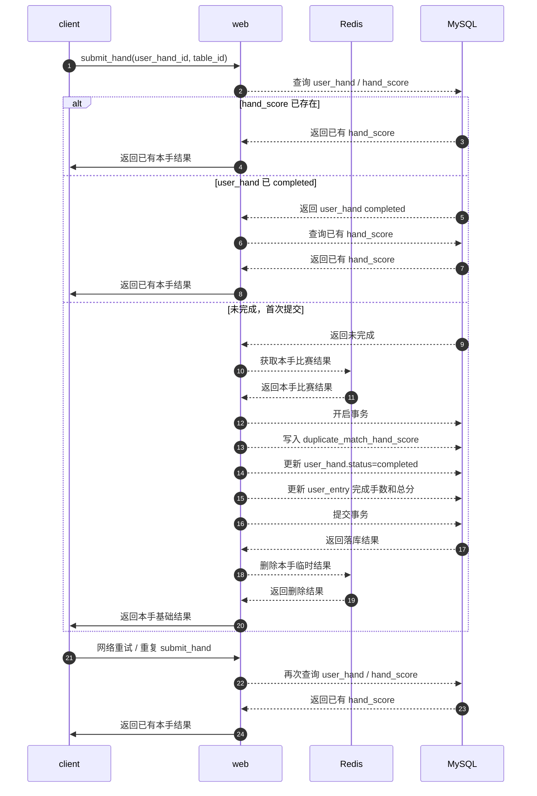
```mermaid
sequenceDiagram
    autonumber
    participant client
    participant web
    participant Redis
    participant MySQL

    client->>web: submit_hand(user_hand_id, table_id)
    web-->>MySQL: 查询 user_hand / hand_score

    alt hand_score 已存在
        MySQL-->>web: 返回已有 hand_score
        web->>client: 返回已有本手结果
    else user_hand 已 completed
        MySQL-->>web: 返回 user_hand completed
        web-->>MySQL: 查询已有 hand_score
        MySQL-->>web: 返回已有 hand_score
        web->>client: 返回已有本手结果
    else 未完成，首次提交
        MySQL-->>web: 返回未完成
        web-->>Redis: 获取本手比赛结果
        Redis-->>web: 返回本手比赛结果

        web-->>MySQL: 开启事务
        web-->>MySQL: 写入 duplicate_match_hand_score
        web-->>MySQL: 更新 user_hand.status=completed
        web-->>MySQL: 更新 user_entry 完成手数和总分
        web-->>MySQL: 提交事务
        MySQL-->>web: 返回落库结果

        web-->>Redis: 删除本手临时结果
        Redis-->>web: 返回删除结果
        web->>client: 返回本手基础结果
    end

    client->>web: 网络重试 / 重复 submit_hand
    web-->>MySQL: 再次查询 user_hand / hand_score
    MySQL-->>web: 返回已有 hand_score
    web->>client: 返回已有本手结果
```

关键说明：

```text
submit_hand 必须先查 user_hand / hand_score。

如果 hand_score 已存在，直接返回已有结果。

duplicate_match_hand_score.uk_user_hand(user_hand_id) 作为数据库唯一约束兜底。

重复提交不能重复计分，不能重复推进 completed_hand_count。
```

---

#### 3.2.12.2 Redis 本手比赛结果缺失

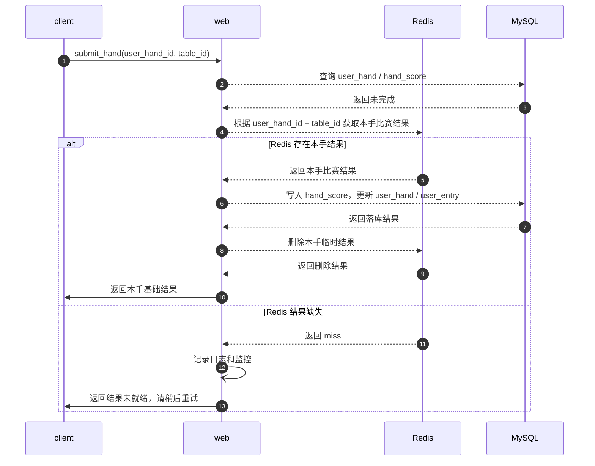
```mermaid
sequenceDiagram
    autonumber
    participant client
    participant web
    participant Redis
    participant MySQL

    client->>web: submit_hand(user_hand_id, table_id)
    web-->>MySQL: 查询 user_hand / hand_score
    MySQL-->>web: 返回未完成

    web-->>Redis: 根据 user_hand_id + table_id 获取本手比赛结果

    alt Redis 存在本手结果
        Redis-->>web: 返回本手比赛结果
        web-->>MySQL: 写入 hand_score，更新 user_hand / user_entry
        MySQL-->>web: 返回落库结果
        web-->>Redis: 删除本手临时结果
        Redis-->>web: 返回删除结果
        web->>client: 返回本手基础结果
    else Redis 结果缺失
        Redis-->>web: 返回 miss
        web-)web: 记录日志和监控
        web->>client: 返回结果未就绪，请稍后重试
    end
```

关键说明：

```text
Redis 本手结果缺失时，submit_hand 不落库。

不更新 user_hand.status=completed。

不更新 user_entry.completed_hand_count。

不写 leaderboard_result。

前端收到结果未就绪后，可稍后重试 submit_hand。

7.15 阶段不做复杂补偿队列，优先保证不错误计分、不错误推进进度。
```

---

#### 3.2.12.3 MySQL 写 `hand_score` 失败

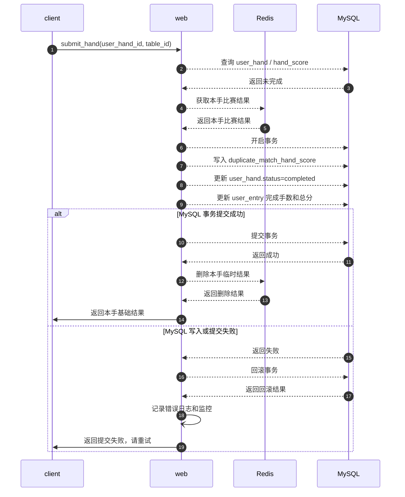
```mermaid
sequenceDiagram
    autonumber
    participant client
    participant web
    participant Redis
    participant MySQL

    client->>web: submit_hand(user_hand_id, table_id)
    web-->>MySQL: 查询 user_hand / hand_score
    MySQL-->>web: 返回未完成

    web-->>Redis: 获取本手比赛结果
    Redis-->>web: 返回本手比赛结果

    web-->>MySQL: 开启事务
    web-->>MySQL: 写入 duplicate_match_hand_score
    web-->>MySQL: 更新 user_hand.status=completed
    web-->>MySQL: 更新 user_entry 完成手数和总分

    alt MySQL 事务提交成功
        web-->>MySQL: 提交事务
        MySQL-->>web: 返回成功
        web-->>Redis: 删除本手临时结果
        Redis-->>web: 返回删除结果
        web->>client: 返回本手基础结果
    else MySQL 写入或提交失败
        MySQL-->>web: 返回失败
        web-->>MySQL: 回滚事务
        MySQL-->>web: 返回回滚结果
        web-)web: 记录错误日志和监控
        web->>client: 返回提交失败，请重试
    end
```

关键说明：

```text
MySQL 写失败时，业务状态不推进。

hand_score、user_hand、user_entry 必须在同一个事务中处理。

事务失败后，不能删除 Redis 本手临时结果。

Redis 临时结果保留给下一次 submit_hand 重试使用。
```

---

#### 3.2.12.4 完成 N 手写 `leaderboard_result` 失败

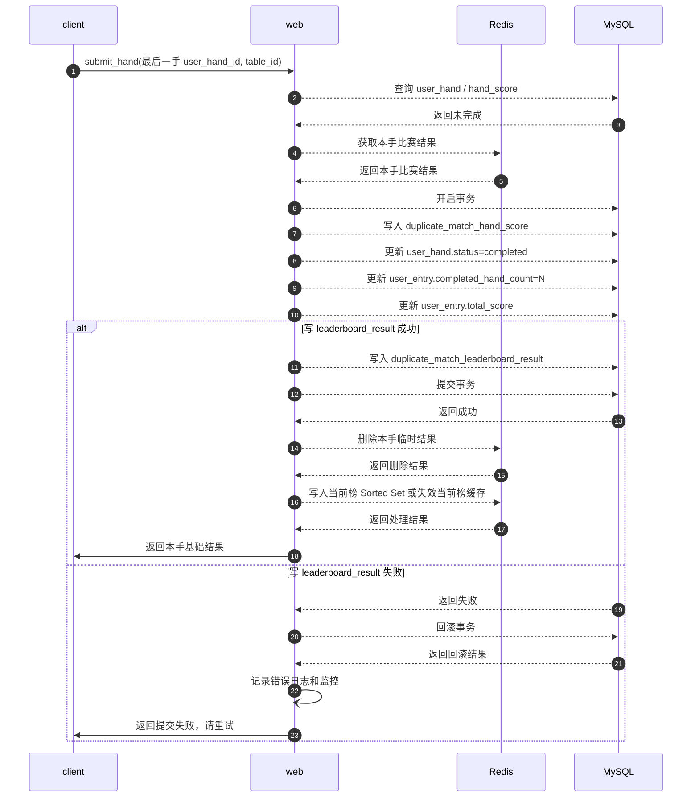
```mermaid
sequenceDiagram
    autonumber
    participant client
    participant web
    participant Redis
    participant MySQL

    client->>web: submit_hand(最后一手 user_hand_id, table_id)
    web-->>MySQL: 查询 user_hand / hand_score
    MySQL-->>web: 返回未完成

    web-->>Redis: 获取本手比赛结果
    Redis-->>web: 返回本手比赛结果

    web-->>MySQL: 开启事务
    web-->>MySQL: 写入 duplicate_match_hand_score
    web-->>MySQL: 更新 user_hand.status=completed
    web-->>MySQL: 更新 user_entry.completed_hand_count=N
    web-->>MySQL: 更新 user_entry.total_score

    alt 写 leaderboard_result 成功
        web-->>MySQL: 写入 duplicate_match_leaderboard_result
        web-->>MySQL: 提交事务
        MySQL-->>web: 返回成功
        web-->>Redis: 删除本手临时结果
        Redis-->>web: 返回删除结果
        web-->>Redis: 写入当前榜 Sorted Set 或失效当前榜缓存
        Redis-->>web: 返回处理结果
        web->>client: 返回本手基础结果
    else 写 leaderboard_result 失败
        MySQL-->>web: 返回失败
        web-->>MySQL: 回滚事务
        MySQL-->>web: 返回回滚结果
        web-)web: 记录错误日志和监控
        web->>client: 返回提交失败，请重试
    end
```

关键说明：

```text
最后一手完成时，hand_score、user_hand、user_entry、leaderboard_result 建议放在同一个 MySQL 事务中。

如果 leaderboard_result 写失败，整个事务回滚。

避免出现“手牌已完成、entry 已完成，但用户没有入榜”的不一致状态。

事务失败时不删除 Redis 本手临时结果，允许用户重试 submit_hand。
```

---

#### 3.2.12.5 Worker 重复结算 / 并发结算 / 中途失败

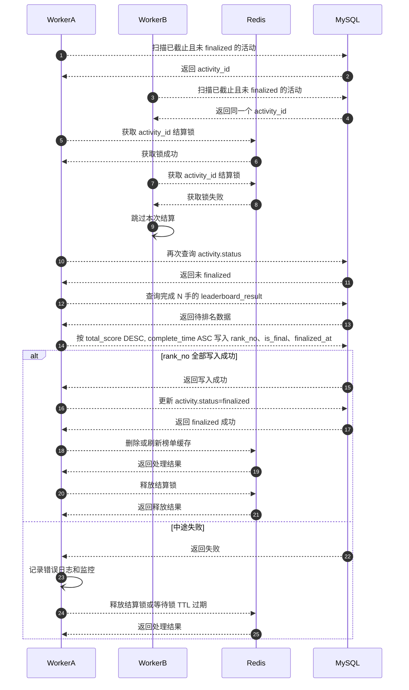
```mermaid
sequenceDiagram
    autonumber
    participant WorkerA
    participant WorkerB
    participant Redis
    participant MySQL

    WorkerA-->>MySQL: 扫描已截止且未 finalized 的活动
    MySQL-->>WorkerA: 返回 activity_id

    WorkerB-->>MySQL: 扫描已截止且未 finalized 的活动
    MySQL-->>WorkerB: 返回同一个 activity_id

    WorkerA-->>Redis: 获取 activity_id 结算锁
    Redis-->>WorkerA: 获取锁成功

    WorkerB-->>Redis: 获取 activity_id 结算锁
    Redis-->>WorkerB: 获取锁失败
    WorkerB-)WorkerB: 跳过本次结算

    WorkerA-->>MySQL: 再次查询 activity.status
    MySQL-->>WorkerA: 返回未 finalized

    WorkerA-->>MySQL: 查询完成 N 手的 leaderboard_result
    MySQL-->>WorkerA: 返回待排名数据

    WorkerA-->>MySQL: 按 total_score DESC, complete_time ASC 写入 rank_no、is_final、finalized_at

    alt rank_no 全部写入成功
        MySQL-->>WorkerA: 返回写入成功
        WorkerA-->>MySQL: 更新 activity.status=finalized
        MySQL-->>WorkerA: 返回 finalized 成功
        WorkerA-->>Redis: 删除或刷新榜单缓存
        Redis-->>WorkerA: 返回处理结果
        WorkerA-->>Redis: 释放结算锁
        Redis-->>WorkerA: 返回释放结果
    else 中途失败
        MySQL-->>WorkerA: 返回失败
        WorkerA-)WorkerA: 记录错误日志和监控
        WorkerA-->>Redis: 释放结算锁或等待锁 TTL 过期
        Redis-->>WorkerA: 返回处理结果
    end
```

关键说明：

```text
Worker 通过 activity_id 维度的 Redis 结算锁避免并发结算。

获取锁失败的 Worker 直接跳过。

获取锁成功后，还需要再次检查 activity.status，防止重复结算。

最终榜以 MySQL leaderboard_result 重新排序为准，不使用 Redis 当前榜排名作为事实源。

activity.status=finalized 只在全部 rank_no 写入完成后更新。

如果中途失败，activity 不进入 finalized，下次 Worker 可以重新执行结算。

Worker 重复执行需要幂等。
```

---

#### 3.2.12.6.1 `join_activity` 重复参加

场景：用户已经参加过活动，后续又点击了一次参加活动，或者刷新页面后重复调用 `join_activity`。

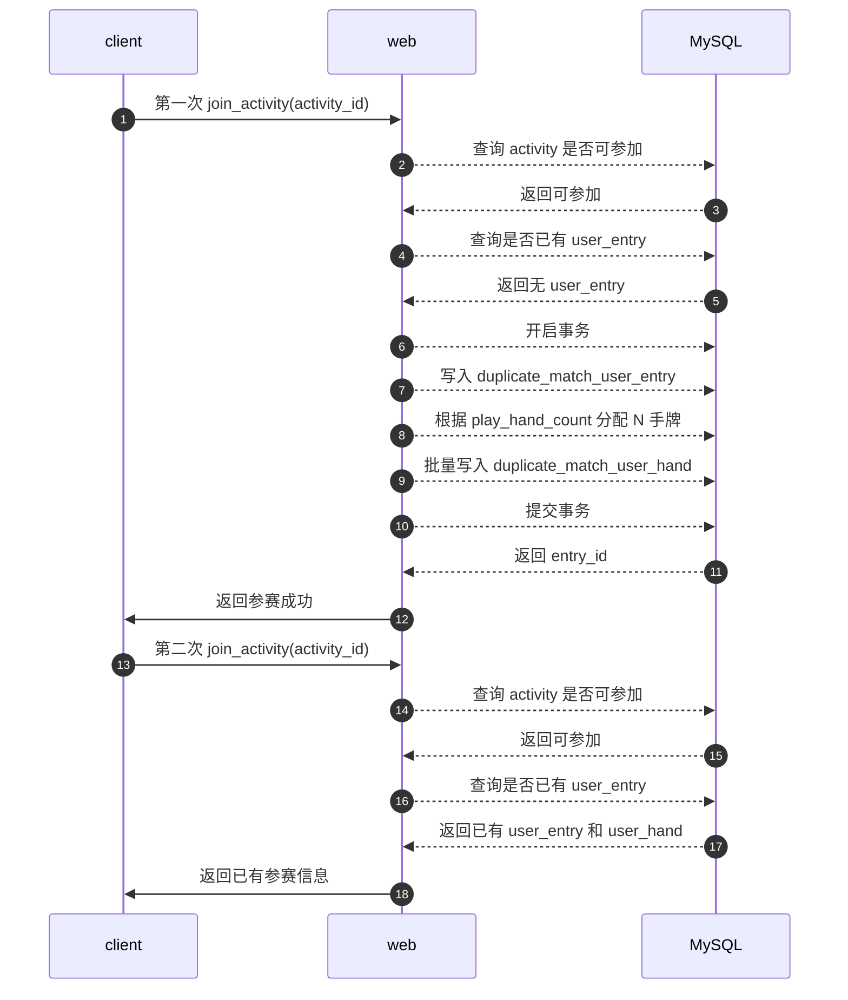
```mermaid
sequenceDiagram
    autonumber
    participant client
    participant web
    participant MySQL

    client->>web: 第一次 join_activity(activity_id)
    web-->>MySQL: 查询 activity 是否可参加
    MySQL-->>web: 返回可参加
    web-->>MySQL: 查询是否已有 user_entry
    MySQL-->>web: 返回无 user_entry

    web-->>MySQL: 开启事务
    web-->>MySQL: 写入 duplicate_match_user_entry
    web-->>MySQL: 根据 play_hand_count 分配 N 手牌
    web-->>MySQL: 批量写入 duplicate_match_user_hand
    web-->>MySQL: 提交事务
    MySQL-->>web: 返回 entry_id
    web->>client: 返回参赛成功

    client->>web: 第二次 join_activity(activity_id)
    web-->>MySQL: 查询 activity 是否可参加
    MySQL-->>web: 返回可参加
    web-->>MySQL: 查询是否已有 user_entry
    MySQL-->>web: 返回已有 user_entry 和 user_hand

    web->>client: 返回已有参赛信息
```

关键说明：

```text
重复参加不是异常失败。

如果用户已经存在 user_entry，join_activity 直接返回已有参赛信息。

不会重新创建 user_entry。

不会重新分配 user_hand。

不会重置用户当前进度。

join_activity 需要设计成幂等接口。
```

---

#### 3.2.12.6.2 `join_activity` 并发参加

场景：用户多设备、网络重试、前端重复点击，导致两个 `join_activity` 请求几乎同时到达服务端。

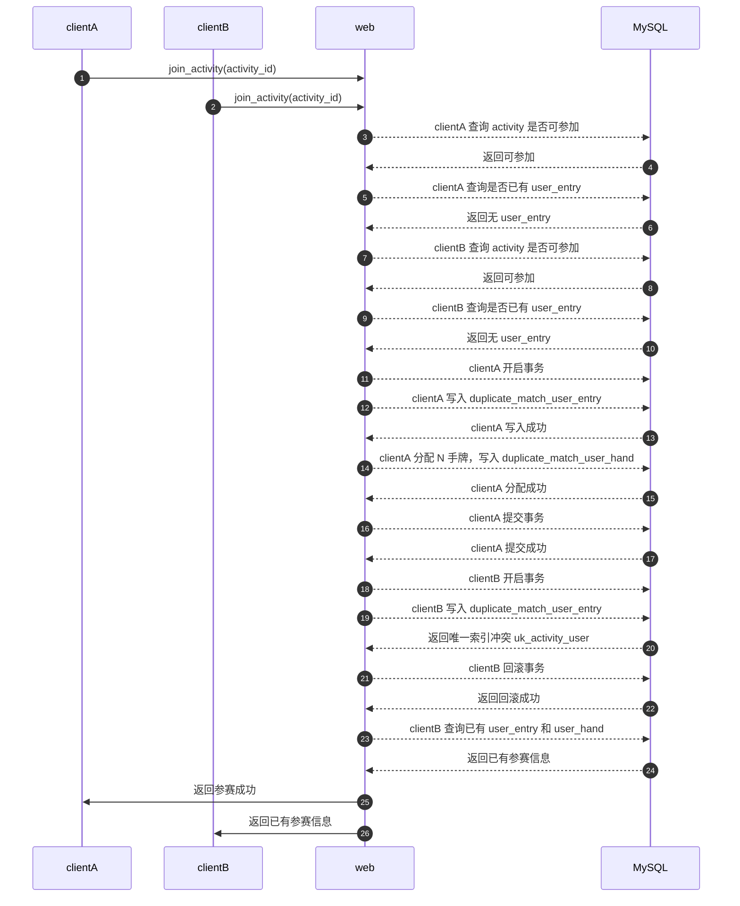
```mermaid
sequenceDiagram
    autonumber
    participant clientA
    participant clientB
    participant web
    participant MySQL

    clientA->>web: join_activity(activity_id)
    clientB->>web: join_activity(activity_id)

    web-->>MySQL: clientA 查询 activity 是否可参加
    MySQL-->>web: 返回可参加
    web-->>MySQL: clientA 查询是否已有 user_entry
    MySQL-->>web: 返回无 user_entry

    web-->>MySQL: clientB 查询 activity 是否可参加
    MySQL-->>web: 返回可参加
    web-->>MySQL: clientB 查询是否已有 user_entry
    MySQL-->>web: 返回无 user_entry

    web-->>MySQL: clientA 开启事务
    web-->>MySQL: clientA 写入 duplicate_match_user_entry
    MySQL-->>web: clientA 写入成功
    web-->>MySQL: clientA 分配 N 手牌，写入 duplicate_match_user_hand
    MySQL-->>web: clientA 分配成功
    web-->>MySQL: clientA 提交事务
    MySQL-->>web: clientA 提交成功

    web-->>MySQL: clientB 开启事务
    web-->>MySQL: clientB 写入 duplicate_match_user_entry
    MySQL-->>web: 返回唯一索引冲突 uk_activity_user
    web-->>MySQL: clientB 回滚事务
    MySQL-->>web: 返回回滚成功

    web-->>MySQL: clientB 查询已有 user_entry 和 user_hand
    MySQL-->>web: 返回已有参赛信息

    web->>clientA: 返回参赛成功
    web->>clientB: 返回已有参赛信息
```

关键说明：

```text
并发参加需要依赖 MySQL 唯一索引兜底。

duplicate_match_user_entry 使用 uk_activity_user(activity_id, user_id)，保证同一用户同一活动只能有一条参赛记录。

如果并发插入触发唯一索引冲突，不作为业务失败处理。

冲突请求回滚当前事务后，重新查询已有 user_entry 和 user_hand，并返回已有参赛信息。

duplicate_match_user_hand 通过 uk_entry_order(entry_id, order_no) 和 uk_entry_hand(entry_id, hand_id) 防止重复分配。
```

---

#### 3.2.12.7 Redis 当前榜 Sorted Set 更新失败

该场景已合并到 `3.2.13.1 当前榜入榜与 Redis Sorted Set 更新` 中统一说明。

保留本小节标题用于异常清单完整性，避免在异常章节和排行榜专项章节重复展开同一张时序图。

关键说明：

```text
MySQL 写入 leaderboard_result 成功后，用户已经正式入榜。
Redis Sorted Set 更新失败只影响当前榜查询加速，不影响入榜事实。
当前榜查询时，如果 Redis miss 或异常，web 回源 MySQL 查询 leaderboard_result。
详细时序见 3.2.13.1。
```

---

#### 3.2.12.8 当前榜 Redis miss / 缓存击穿

该场景已合并到 `3.2.13.2 当前榜查询与缓存击穿处理` 中统一说明。

保留本小节标题用于异常清单完整性，避免在异常章节和排行榜专项章节重复展开同一张时序图。

关键说明：

```text
当前榜 Redis miss 时，使用短锁或 singleflight 控制同一页 / 同一活动缓存重建。
只有一个请求回源 MySQL 重建缓存。
其他请求短暂等待后读取 Redis，避免大量请求同时打到 MySQL。
详细时序见 3.2.13.2。
```

---

#### 3.2.12.9 MySQL 写成功但 Redis 临时结果删除失败

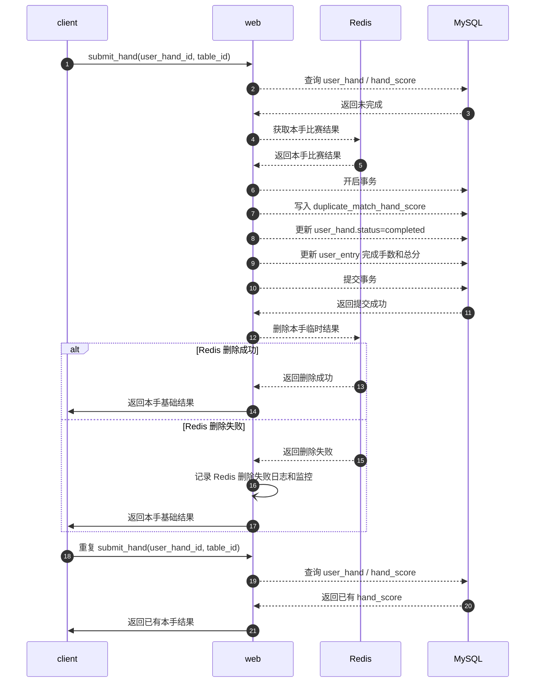
```mermaid
sequenceDiagram
    autonumber
    participant client
    participant web
    participant Redis
    participant MySQL

    client->>web: submit_hand(user_hand_id, table_id)
    web-->>MySQL: 查询 user_hand / hand_score
    MySQL-->>web: 返回未完成

    web-->>Redis: 获取本手比赛结果
    Redis-->>web: 返回本手比赛结果

    web-->>MySQL: 开启事务
    web-->>MySQL: 写入 duplicate_match_hand_score
    web-->>MySQL: 更新 user_hand.status=completed
    web-->>MySQL: 更新 user_entry 完成手数和总分
    web-->>MySQL: 提交事务
    MySQL-->>web: 返回提交成功

    web-->>Redis: 删除本手临时结果

    alt Redis 删除成功
        Redis-->>web: 返回删除成功
        web->>client: 返回本手基础结果
    else Redis 删除失败
        Redis-->>web: 返回删除失败
        web-)web: 记录 Redis 删除失败日志和监控
        web->>client: 返回本手基础结果
    end

    client->>web: 重复 submit_hand(user_hand_id, table_id)
    web-->>MySQL: 查询 user_hand / hand_score
    MySQL-->>web: 返回已有 hand_score
    web->>client: 返回已有本手结果
```

关键说明：

```text
MySQL 是事实源。

只要 hand_score 已写入，且 user_hand 已 completed，本手就已经完成。

Redis 临时结果删除失败不影响主流程。

后续重复 submit_hand 时，优先通过 MySQL hand_score 幂等返回已有结果。

Redis 临时结果依赖 TTL 自动过期。
```

---

#### 3.2.12.10 `start_hand` 重复请求 / 当前手状态已是 playing

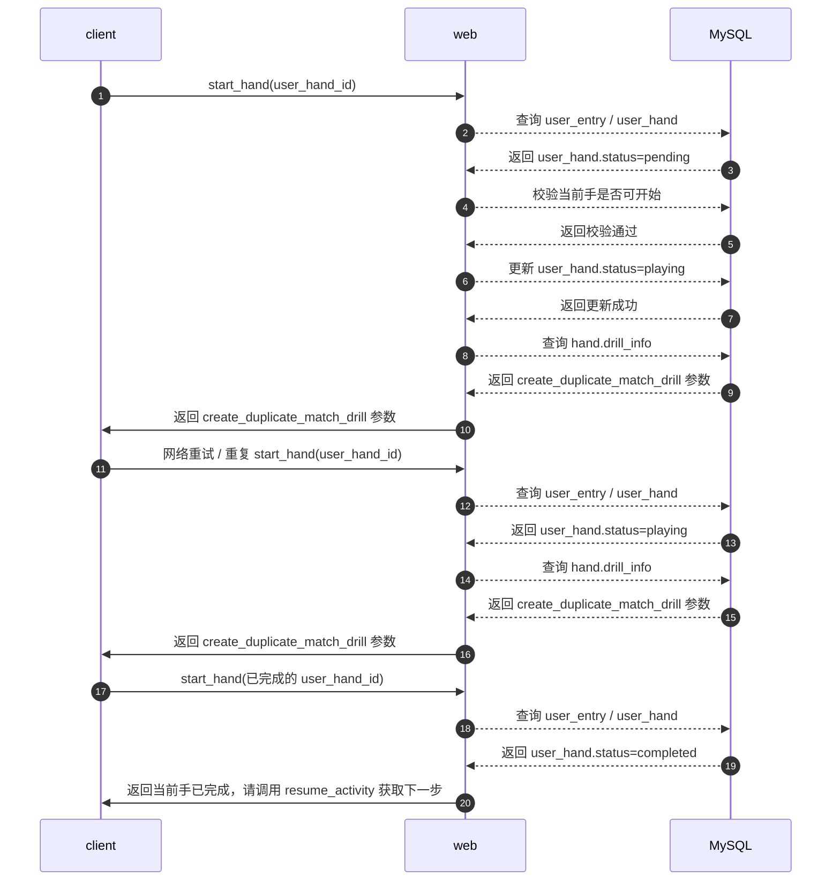
```mermaid
sequenceDiagram
    autonumber
    participant client
    participant web
    participant MySQL

    client->>web: start_hand(user_hand_id)
    web-->>MySQL: 查询 user_entry / user_hand
    MySQL-->>web: 返回 user_hand.status=pending

    web-->>MySQL: 校验当前手是否可开始
    MySQL-->>web: 返回校验通过

    web-->>MySQL: 更新 user_hand.status=playing
    MySQL-->>web: 返回更新成功

    web-->>MySQL: 查询 hand.drill_info
    MySQL-->>web: 返回 create_duplicate_match_drill 参数

    web->>client: 返回 create_duplicate_match_drill 参数

    client->>web: 网络重试 / 重复 start_hand(user_hand_id)
    web-->>MySQL: 查询 user_entry / user_hand
    MySQL-->>web: 返回 user_hand.status=playing

    web-->>MySQL: 查询 hand.drill_info
    MySQL-->>web: 返回 create_duplicate_match_drill 参数

    web->>client: 返回 create_duplicate_match_drill 参数

    client->>web: start_hand(已完成的 user_hand_id)
    web-->>MySQL: 查询 user_entry / user_hand
    MySQL-->>web: 返回 user_hand.status=completed

    web->>client: 返回当前手已完成，请调用 resume_activity 获取下一步
```

关键说明：

```text
start_hand 只做活动进度校验，不创建牌桌。

如果 user_hand.status=pending，则更新为 playing，并返回 create_duplicate_match_drill 参数。

如果 user_hand.status=playing，说明当前手已经开始，重复请求直接返回 create_duplicate_match_drill 参数。

如果 user_hand.status=completed，说明当前手已经完成，不允许重新开始，前端应调用 resume_activity 获取下一步。

start_hand 不负责处理牌桌重复创建问题。
```


#### 3.2.12.11 断线 / 刷新 / 服务重启后继续活动

场景：用户打牌过程中断线、刷新页面、换设备重新进入，或 web 服务重启后，用户重新进入活动页。

```mermaid
sequenceDiagram
    autonumber
    participant client
    participant web
    participant MySQL
    participant Redis

    client->>web: resume_activity(activity_id)
    web-->>MySQL: 查询 activity
    web-->>MySQL: 查询 user_entry
    web-->>MySQL: 查询 user_hand
    web-->>MySQL: 查询 hand_score
    web-->>MySQL: 查询 leaderboard_result
    MySQL-->>web: 返回活动进度数据

    alt 未参赛
        web->>client: 返回 not_joined，展示开始挑战
    else 已完成 N 手
        web->>client: 返回 completed / finalized，展示榜单入口
    else 当前手 status=pending
        web->>client: 返回当前应开始的 user_hand
    else 当前手 status=playing 且 hand_score 不存在
        web->>client: 返回当前 user_hand，提示从本手开头重新开始
    else 当前手 status=completed 或 hand_score 已存在
        web-->>MySQL: 查询下一手 user_hand
        MySQL-->>web: 返回下一手或榜单入口
        web->>client: 返回下一步动作
    end

    opt 前端继续当前手
        client->>web: start_hand(user_hand_id)
        web-->>MySQL: 校验进度，读取 hand.drill_info
        MySQL-->>web: 返回 create_duplicate_match_drill 参数
        web->>client: 返回 create_duplicate_match_drill 参数
    end

    opt 如果前一次牌局已结束但 client 未 submit_hand
        client->>web: submit_hand(user_hand_id, table_id)
        web-->>Redis: 获取本手比赛结果
        alt Redis 仍存在本手结果
            Redis-->>web: 返回本手比赛结果
            web-->>MySQL: 写入 hand_score，更新 user_hand / user_entry
            MySQL-->>web: 返回落库结果
            web->>client: 返回本手基础结果
        else Redis 结果不存在
            Redis-->>web: 返回 miss
            web->>client: 返回结果未就绪，请重新开始本手或稍后重试
        end
    end
```

关键说明：

```text
resume_activity 是断线 / 刷新 / 换设备后的统一恢复入口。

web 是无状态服务，web 重启不影响活动恢复；恢复数据以 MySQL 为准。

恢复的是活动进度，不恢复单手中途牌局状态。

如果 user_hand.status=playing，但 hand_score 不存在，表示当前手未正式完成，重新进入时从这一手开头重新打。

如果 hand_score 已存在，说明本手已经完成，resume_activity 返回下一手或榜单入口。

如果前一次牌局已经结束，但 client 断线导致没有 submit_hand，可以再次 submit_hand 尝试从 Redis 获取本手结果。

如果 Redis 本手结果已经过期或缺失，submit_hand 不推进进度，前端需要重新开始本手或稍后重试。

最终是否完成、是否入榜，只以 MySQL 中的 user_hand、hand_score、leaderboard_result 为准。
```

### 3.2.13 排行榜专项实现时序图

本节专门说明排行榜的写入、查询、缓存和最终结算流程。

排行榜设计原则：

```text
MySQL 的 duplicate_match_leaderboard_result 是排行榜事实源。
Redis Sorted Set 只用于加速当前榜查询，不作为最终榜事实源。
当前榜精确排序以 MySQL leaderboard_result 的 total_score DESC、complete_time ASC 为准。
Redis Sorted Set 的复合排序编码或分页缓存实现细节，后续在排行榜实现细节章节单独展开。
最终榜由 Worker 从 MySQL 重新读取并排序冻结。
```

---

#### 3.2.13.1 当前榜入榜与 Redis Sorted Set 更新

场景：用户完成最后一手后，进入当前榜。

```mermaid
sequenceDiagram
    autonumber
    participant client
    participant web
    participant Redis
    participant MySQL

    client->>web: submit_hand(最后一手 user_hand_id, table_id)

    web-->>MySQL: 查询 user_hand / hand_score
    MySQL-->>web: 返回未完成

    web-->>Redis: 根据 user_hand_id + table_id 获取本手比赛结果
    Redis-->>web: 返回本手比赛结果

    web-->>MySQL: 开启事务
    web-->>MySQL: 写入 duplicate_match_hand_score
    web-->>MySQL: 更新 user_hand.status=completed
    web-->>MySQL: 更新 user_entry.completed_hand_count=N
    web-->>MySQL: 更新 user_entry.total_score
    web-->>MySQL: 写入 duplicate_match_leaderboard_result
    web-->>MySQL: 提交事务
    MySQL-->>web: 返回提交成功

    web-->>Redis: 删除本手临时结果
    Redis-->>web: 返回删除结果

    web-->>Redis: 写入当前榜 Sorted Set 或失效当前榜缓存

    alt Redis 更新成功
        Redis-->>web: 返回处理成功
        web->>client: 返回本手基础结果
    else Redis 更新失败
        Redis-->>web: 返回处理失败
        web-)web: 记录日志和监控
        web->>client: 返回本手基础结果
    end
```

关键说明：

```text
完成 N 手后，用户才允许进入当前榜。

hand_score、user_hand、user_entry、leaderboard_result 建议放在同一个 MySQL 事务中。

只有 MySQL 事务提交成功，才认为用户正式入榜。

Redis Sorted Set 更新必须发生在 MySQL 事务提交之后。

Redis 更新失败不影响用户入榜事实，只影响当前榜查询加速。

后续查询当前榜时，如果 Redis miss 或异常，回源 MySQL 查询 leaderboard_result。
```

---

#### 3.2.13.2 当前榜查询与缓存击穿处理

场景：用户查看当前榜，优先走 Redis Sorted Set / 页面缓存；Redis miss 时回源 MySQL，并通过短锁 / singleflight 避免大量请求同时回源。

```mermaid
sequenceDiagram
    autonumber
    participant clientA
    participant clientB
    participant web
    participant Redis
    participant MySQL

    clientA->>web: get_current_leaderboard(activity_id, page)
    clientB->>web: get_current_leaderboard(activity_id, page)

    web-->>Redis: clientA 查询当前榜 Sorted Set / 页面缓存
    Redis-->>web: 返回 miss

    web-->>Redis: clientA 获取当前榜重建短锁
    Redis-->>web: 获取锁成功

    web-->>Redis: clientB 查询当前榜 Sorted Set / 页面缓存
    Redis-->>web: 返回 miss

    web-->>Redis: clientB 获取当前榜重建短锁
    Redis-->>web: 获取锁失败

    web-->>MySQL: clientA 回源查询 leaderboard_result
    MySQL-->>web: 返回当前榜数据

    web-->>Redis: clientA 重建当前榜 Sorted Set / 页面缓存
    Redis-->>web: 返回重建成功

    web->>clientA: 返回当前榜数据

    web-)web: clientB 短暂等待或快速重试
    web-->>Redis: clientB 再次查询当前榜缓存
    Redis-->>web: 返回当前榜数据

    web->>clientB: 返回当前榜数据
```

关键说明：

```text
当前榜属于高频查询，优先使用 Redis Sorted Set / 页面缓存加速。

Redis miss 时，不允许大量请求同时回源 MySQL。

同一个 activity_id / page 的缓存重建使用短锁或 singleflight 控制。

获取锁成功的请求负责回源 MySQL 并重建缓存。

获取锁失败的请求可以短暂等待后重新读 Redis。

如果等待后仍未命中，可以降级回源 MySQL，但需要限制并发。

当前榜排序规则：
total_score DESC
complete_time ASC

MySQL 始终是事实源，Redis 只是查询加速层。
```

---

#### 3.2.13.3 最终榜结算与冻结

场景：活动截止后，Worker 生成最终榜。最终榜不使用 Redis 当前榜排名作为事实源，而是从 MySQL 重新读取 `leaderboard_result` 并排序冻结。

```mermaid
sequenceDiagram
    autonumber
    participant WorkerA
    participant WorkerB
    participant Redis
    participant MySQL

    WorkerA-->>MySQL: 扫描已截止且未 finalized 的活动
    MySQL-->>WorkerA: 返回 activity_id

    WorkerB-->>MySQL: 扫描已截止且未 finalized 的活动
    MySQL-->>WorkerB: 返回同一个 activity_id

    WorkerA-->>Redis: 获取 activity_id 结算锁
    Redis-->>WorkerA: 获取锁成功

    WorkerB-->>Redis: 获取 activity_id 结算锁
    Redis-->>WorkerB: 获取锁失败
    WorkerB-)WorkerB: 跳过本次结算

    WorkerA-->>MySQL: 再次查询 activity.status
    MySQL-->>WorkerA: 返回未 finalized

    WorkerA-->>MySQL: 查询完成 N 手的 leaderboard_result
    MySQL-->>WorkerA: 返回待排名数据

    WorkerA-->>MySQL: 按 total_score DESC, complete_time ASC 生成并写入 rank_no
    WorkerA-->>MySQL: 写入 is_final=1、finalized_at

    alt rank_no 全部写入成功
        MySQL-->>WorkerA: 返回写入成功
        WorkerA-->>MySQL: 更新 activity.status=finalized
        MySQL-->>WorkerA: 返回 finalized 成功
        WorkerA-->>Redis: 删除当前榜缓存 / 重建最终榜缓存
        Redis-->>WorkerA: 返回处理结果
        WorkerA-->>Redis: 释放结算锁
        Redis-->>WorkerA: 返回释放结果
    else 中途失败
        MySQL-->>WorkerA: 返回失败
        WorkerA-)WorkerA: 记录错误日志和监控
        WorkerA-->>Redis: 释放结算锁或等待锁 TTL 过期
        Redis-->>WorkerA: 返回处理结果
    end
```

关键说明：

```text
最终榜结算是低频操作，7.15 阶段优先保证正确性和可追溯性。

最终榜不直接使用 Redis 当前榜排名。

Worker 从 MySQL duplicate_match_leaderboard_result 重新读取完成 N 手的用户，并按固定排序规则生成 rank_no。

最终榜排序规则：
total_score DESC
complete_time ASC

Worker 通过 activity_id 维度的 Redis 结算锁避免并发结算。

获取锁成功后，还需要再次检查 activity.status，防止重复结算。

activity.status=finalized 只在全部 rank_no、is_final、finalized_at 写入完成后更新。

如果中途失败，activity 不进入 finalized，下次 Worker 可以重新执行结算。

结算完成后，可以删除当前榜缓存，并基于 MySQL 最终榜结果重建最终榜缓存。
```

# 四、协议设计

## 4.1 CS 协议定义

## 4.2 SS 协议定义

## 4.3 DB 协议定义

# 五、内存、流量分析

## 5.1 内存分析

## 5.2 流量分析

# 六、实现细节

本章只展开和排行榜实现强相关的细节。

第 3 章已经通过时序图说明了整体链路，本章重点补充排行榜相关的实现判断：

```text
完成 N 手后如何入榜
当前榜如何查询
Redis 如何加速但不作为事实源
Redis Sorted Set / 页面缓存如何处理排序问题
最终榜如何结算和冻结
Redis 与 MySQL 的提交顺序如何保证一致性
```

---

### 6.1 后台配置活动实现

本节不展开具体实现细节。

与排行榜相关的约束只有一个：

```text
activity.play_hand_count 是用户完成挑战、进入榜单、最终结算的统一判断依据。
```

不能在代码里写死固定手数。

---

### 6.2 用户参赛与手牌分配实现

本节不展开具体实现细节。

与排行榜相关的约束：

```text
用户参加活动后生成 user_entry。
后续完成 N 手后，leaderboard_result 通过 entry_id 关联该用户本次活动成绩。
```

---

### 6.3 开始当前手实现

本节不展开具体实现细节。

与排行榜相关的约束：

```text
start_hand 不入榜。
start_hand 不更新排行榜。
start_hand 只负责当前手进度校验和返回 create_duplicate_match_drill 参数。
```

---

### 6.4 每手计分与进度推进实现

本节不展开完整计分细节。

与排行榜相关的约束：

```text
submit_hand 是排行榜入榜的前置入口。
只有每手计分成功落库后，才允许推进 completed_hand_count。
只有 completed_hand_count 达到 activity.play_hand_count，才允许写入 leaderboard_result。
```

每手计分结果写入：

```text
duplicate_match_hand_score
```

用户活动进度更新：

```text
duplicate_match_user_entry.completed_hand_count
duplicate_match_user_entry.total_score
```

幂等约束：

```text
duplicate_match_hand_score.uk_user_hand(user_hand_id)
```

作用：

```text
防止同一手重复计分。
防止重复 submit_hand 导致 total_score 重复累加。
```

---

### 6.5 完成 N 手入榜实现

完成 N 手入榜是排行榜的写入入口。

#### 6.5.1 入榜判断

N 来自活动配置：

```text
duplicate_match_activity.play_hand_count
```

判断方式：

```text
本次 submit_hand 成功后，计算新的 completed_hand_count。
如果 completed_hand_count == activity.play_hand_count，则认为用户完成全部挑战。
```

不能写死：

```text
10 手
固定手数
固定关卡数
```

#### 6.5.2 入榜写入表

完成 N 手后写入：

```text
duplicate_match_leaderboard_result
```

写入字段：

```text
activity_id
entry_id
user_id
total_score
complete_time
rank_no = NULL
is_final = 0
finalized_at = NULL
```

说明：

```text
当前榜阶段不需要提前写最终 rank_no。
当前榜展示排名可以查询时动态计算。
最终 rank_no 只在活动截止结算后写入。
```

#### 6.5.3 入榜唯一约束

排行榜结果表必须有唯一约束：

```text
uk_entry(entry_id)
uk_activity_user(activity_id, user_id)
```

作用：

```text
防止同一个 entry 重复入榜。
防止同一个用户同一个活动重复入榜。
支持重复 submit_hand 时的幂等兜底。
```

如果重复 submit_hand 导致再次写入 leaderboard_result：

```text
1. 触发唯一约束冲突。
2. 回查已有 leaderboard_result。
3. 返回已有结果或继续走 resume_activity。
4. 不重复入榜。
```

#### 6.5.4 排序字段

当前榜和最终榜统一使用同一套排序规则：

```text
total_score DESC
complete_time ASC
```

含义：

```text
总分越高排名越靠前。
总分相同，完成时间更早的排名靠前。
```

#### 6.5.5 MySQL 事务边界

最后一手 submit_hand 时，以下操作建议放在同一个 MySQL 事务中：

```text
1. 写入 duplicate_match_hand_score。
2. 更新 duplicate_match_user_hand.status=completed。
3. 更新 duplicate_match_user_entry.completed_hand_count。
4. 更新 duplicate_match_user_entry.total_score。
5. 更新 duplicate_match_user_entry.complete_time。
6. 写入 duplicate_match_leaderboard_result。
```

如果 `leaderboard_result` 写入失败：

```text
整个事务回滚。
```

避免出现：

```text
手牌已完成，但没有入榜。
entry 已完成，但 leaderboard_result 不存在。
total_score 已更新，但榜单查不到该用户。
```

#### 6.5.6 Redis 当前榜更新时机

Redis 当前榜更新必须发生在 MySQL 事务提交成功之后。

正确顺序：

```text
1. MySQL 事务写 hand_score / user_hand / user_entry / leaderboard_result。
2. MySQL 事务提交成功。
3. 删除 Redis 本手临时结果。
4. 更新 Redis 当前榜缓存，或失效当前榜缓存。
5. 返回 submit_hand 结果。
```

禁止顺序：

```text
1. MySQL 事务未提交。
2. 先写 Redis 当前榜。
3. MySQL 后续回滚。
```

原因：

```text
MySQL 是事实源。
Redis 不能早于 MySQL 展示用户入榜结果。
否则可能出现 Redis 显示用户已入榜，但 MySQL 实际没有入榜。
```

#### 6.5.7 Redis 当前榜更新失败

如果 MySQL 已提交成功，但 Redis 更新失败：

```text
1. 不回滚 MySQL。
2. 用户仍然视为已入榜。
3. 记录 Redis 更新失败日志。
4. 后续查询当前榜时，Redis miss 或异常则回源 MySQL。
```

原因：

```text
Redis 只是排行榜查询加速层，不是事实源。
```

---

### 6.6 当前榜查询实现

当前榜用于活动期间展示已经完成 N 手的用户排名。

#### 6.6.1 当前榜事实源

当前榜事实源是：

```text
duplicate_match_leaderboard_result
```

当前榜只展示：

```text
已经完成 activity.play_hand_count 手的用户
```

由于只有完成 N 手才会写入 `leaderboard_result`，所以当前榜查询直接基于该表。

#### 6.6.2 当前榜排序规则

当前榜排序规则：

```text
total_score DESC
complete_time ASC
```

说明：

```text
total_score 越高排名越靠前。
total_score 相同，complete_time 越早排名越靠前。
```

#### 6.6.3 Redis 的定位

Redis 不作为排行榜事实源。

Redis 用于：

```text
1. 当前榜查询加速。
2. 当前榜分页缓存。
3. 热门活动榜单缓存。
4. Redis miss 时减少重复回源 MySQL。
```

核心原则：

```text
MySQL 决定正确性。
Redis 提升查询性能。
Redis miss 或异常时，必须可以回源 MySQL。
```

#### 6.6.4 Redis Sorted Set 排序问题

Redis Sorted Set 原生只有一个 score 字段。

但当前榜需要双字段排序：

```text
total_score DESC
complete_time ASC
```

所以不能简单地只用 `total_score` 作为 Redis ZSET score 后，就认为 Redis 排名完全等价于 MySQL 排名。

7.15 阶段建议采用保守方案：

```text
MySQL leaderboard_result 负责精确排序。
Redis 缓存当前榜分页结果或缓存加速数据。
当前榜精确排序以 MySQL 查询结果为准。
```

#### 6.6.5 当前榜缓存推荐方案

推荐采用：

```text
Redis 页面缓存 + MySQL 精确排序
```

流程：

```text
1. get_current_leaderboard 请求进入 web。
2. web 先查 Redis 当前榜页面缓存。
3. Redis 命中，直接返回。
4. Redis miss，回源 MySQL。
5. MySQL 按 total_score DESC, complete_time ASC 查询。
6. web 生成当前页展示排名。
7. web 写入 Redis 页面缓存。
8. web 返回当前榜结果。
```

这样可以保证：

```text
排序正确性由 MySQL 保证。
Redis 只缓存查询结果。
实现复杂度低。
不需要在 7.15 阶段处理 Redis 复合 score 编码问题。
```

#### 6.6.6 当前榜缓存 key

当前榜分页缓存 key 示例：

```text
duplicate_match:leaderboard:current:{activity_id}:page:{page_no}:size:{page_size}:v:{version}
```

缓存内容：

```text
rank_no
user_id
entry_id
total_score
complete_time
display_info
```

说明：

```text
当前榜 rank_no 是展示排名，可以查询时动态计算。
最终榜 rank_no 才写入 duplicate_match_leaderboard_result.rank_no。
```

#### 6.6.7 当前榜 version

为了避免旧页面缓存长期存在，可以维护活动维度当前榜版本号：

```text
duplicate_match:leaderboard:current:{activity_id}:version
```

版本变化时机：

```text
1. 用户完成 N 手并成功写入 leaderboard_result 后。
2. 后台修复榜单数据后。
3. 主动失效当前榜缓存时。
```

处理方式：

```text
MySQL 入榜事务提交成功后，再递增 Redis version。
查询当前榜时，使用最新 version 组成缓存 key。
旧 version 缓存自然过期即可。
```

如果 Redis version 丢失：

```text
1. 回源 MySQL 查询。
2. 使用默认 version 或重新初始化 version。
3. 查询成功后重建页面缓存。
```

#### 6.6.8 当前榜 MySQL 查询

当前榜 MySQL 查询示例：

```sql
SELECT
  entry_id,
  user_id,
  total_score,
  complete_time
FROM duplicate_match_leaderboard_result
WHERE activity_id = ?
ORDER BY total_score DESC, complete_time ASC
LIMIT ? OFFSET ?;
```

建议索引：

```text
idx_activity_score(activity_id, total_score, complete_time)
```

如果查询中使用 `is_final` 区分当前榜和最终榜，则索引可调整为：

```text
idx_activity_score(activity_id, is_final, total_score, complete_time)
```

#### 6.6.9 Redis miss 回源 MySQL

Redis miss 时：

```text
1. web 回源 MySQL。
2. MySQL 返回精确排序结果。
3. web 写入 Redis 页面缓存。
4. web 返回当前榜。
```

如果 Redis 异常：

```text
1. 记录 Redis 异常日志。
2. 直接回源 MySQL。
3. 不影响榜单正确性。
```

#### 6.6.10 当前榜缓存击穿处理

热门活动当前榜缓存 miss 时，需要防止大量请求同时回源 MySQL。

推荐方式：

```text
短锁 或 singleflight
```

短锁 key 示例：

```text
duplicate_match:leaderboard:current:{activity_id}:page:{page_no}:rebuild_lock
```

处理流程：

```text
1. 第一个请求 Redis miss。
2. 尝试获取页面重建短锁。
3. 获取锁成功，请求回源 MySQL 并重建页面缓存。
4. 其他请求获取锁失败，短暂等待。
5. 等待后再次读取 Redis。
6. 如果仍未命中，可以降级回源 MySQL，但需要限制并发。
```

短锁要求：

```text
TTL 必须短。
异常情况下不能长期阻塞榜单查询。
```

#### 6.6.11 当前榜深分页风险

当前榜如果使用：

```sql
LIMIT ? OFFSET ?
```

深分页会有性能风险。

7.15 阶段建议：

```text
1. 限制最大可查看页数。
2. 优先保证前几页性能。
3. 深分页可以降级或限制。
4. 后续如有十万级完赛用户，再评估游标分页、临时表或离线榜单方案。
```

---

### 6.7 最终榜结算实现

最终榜在活动截止后由 Worker 结算并冻结。

#### 6.7.1 最终榜事实源

最终榜事实源仍然是：

```text
duplicate_match_leaderboard_result
```

最终榜不使用：

```text
Redis 当前榜 Sorted Set
Redis 当前榜页面缓存
客户端上报排名
```

原因：

```text
Redis 只是查询加速层，可能过期、miss 或重建中。
最终榜需要可追溯、可重算、可修复。
```

#### 6.7.2 Worker 扫描活动

Worker 扫描：

```text
duplicate_match_activity
```

扫描条件：

```text
status = published
end_time <= 当前时间
finalized_at IS NULL
```

依赖索引：

```text
idx_status_end_time(status, end_time)
```

#### 6.7.3 Redis 结算锁

Worker 按 `activity_id` 获取 Redis 结算锁。

锁 key 示例：

```text
duplicate_match:finalize_lock:{activity_id}
```

处理规则：

```text
1. 获取锁成功，继续结算。
2. 获取锁失败，跳过本次活动。
3. 锁必须设置 TTL。
4. Worker 正常结束时主动释放锁。
5. Worker 异常退出时依赖 TTL 自动释放。
```

#### 6.7.4 activity 状态二次检查

获取锁后，必须再次查询：

```text
duplicate_match_activity.status
duplicate_match_activity.finalized_at
```

如果已经 finalized：

```text
直接跳过。
```

原因：

```text
防止多个 Worker 或重试任务重复结算。
```

#### 6.7.5 最终榜排序

Worker 从 MySQL 查询当前活动所有已入榜用户：

```text
duplicate_match_leaderboard_result
```

排序规则：

```text
total_score DESC
complete_time ASC
```

生成：

```text
rank_no
is_final = 1
finalized_at = 当前时间
```

#### 6.7.6 最终榜写入流程

7.15 阶段推荐流程：

```text
1. Worker 从 MySQL 查询 activity 下所有 leaderboard_result。
2. 按 total_score DESC, complete_time ASC 排序。
3. 生成 rank_no。
4. 批量更新 rank_no、is_final、finalized_at。
5. 全部写入成功后，更新 activity.status=finalized。
6. 删除当前榜缓存。
7. 按需重建最终榜缓存，或等待首次查询最终榜时懒加载。
```

关键要求：

```text
activity.status=finalized 只能在全部 rank_no 写入成功后更新。
```

#### 6.7.7 中途失败处理

如果 Worker 中途失败：

```text
1. 记录错误日志和监控。
2. 不更新 activity.status=finalized。
3. 释放 Redis 锁，或等待锁 TTL 过期。
4. 下次 Worker 可以重新执行。
```

重新执行时：

```text
1. 重新从 MySQL leaderboard_result 读取数据。
2. 重新按排序规则生成 rank_no。
3. 覆盖或重写 rank_no、is_final、finalized_at。
```

#### 6.7.8 最终榜缓存

最终榜缓存 key 示例：

```text
duplicate_match:leaderboard:final:{activity_id}:page:{page_no}:size:{page_size}
```

最终榜查询必须以 MySQL 为准：

```text
activity.status=finalized
leaderboard_result.rank_no
leaderboard_result.is_final=1
```

如果最终榜 Redis miss：

```text
1. 回源 MySQL。
2. 按 rank_no 查询最终榜。
3. 写入最终榜缓存。
4. 返回最终榜。
```

#### 6.7.9 最终榜 MySQL 查询

最终榜查询示例：

```sql
SELECT
  rank_no,
  entry_id,
  user_id,
  total_score,
  complete_time,
  finalized_at
FROM duplicate_match_leaderboard_result
WHERE activity_id = ?
  AND is_final = 1
ORDER BY rank_no ASC
LIMIT ? OFFSET ?;
```

建议索引：

```text
idx_activity_rank(activity_id, is_final, rank_no)
```

---

### 6.8 断线 / 刷新 / 换设备恢复实现

本节不展开具体实现细节。

与排行榜相关的约束：

```text
恢复后如果用户已经完成 N 手，则 resume_activity 返回当前榜入口。
如果活动已经 finalized，则 resume_activity 返回最终榜入口。
是否完成、是否入榜，以 MySQL 中 user_entry、hand_score、leaderboard_result 为准。
```

---

### 6.9 重复 join 幂等处理

本节不展开具体实现细节。

与排行榜相关的约束：

```text
重复 join 不能生成多个 entry。
否则会导致同一用户同一活动出现多条 leaderboard_result 风险。
```

依赖约束：

```text
duplicate_match_user_entry.uk_activity_user(activity_id, user_id)
```

---

### 6.10 重复 start hand 幂等处理

本节不展开具体实现细节。

与排行榜相关的约束：

```text
重复 start_hand 不能影响排行榜。
start_hand 不写 hand_score。
start_hand 不写 leaderboard_result。
```

---

### 6.11 重复 submit hand 幂等处理

本节只说明和排行榜有关的幂等。

重复 submit_hand 可能导致：

```text
重复计分
重复累加 total_score
重复写 leaderboard_result
重复更新当前榜缓存
```

必须依赖唯一约束兜底：

```text
duplicate_match_hand_score.uk_user_hand(user_hand_id)
duplicate_match_leaderboard_result.uk_entry(entry_id)
duplicate_match_leaderboard_result.uk_activity_user(activity_id, user_id)
```

处理规则：

```text
1. submit_hand 先查 hand_score。
2. 如果 hand_score 已存在，直接返回已有本手结果。
3. 如果 leaderboard_result 已存在，不重复写入。
4. 如果唯一约束冲突，回查已有数据并返回。
5. 不重复累加 total_score。
6. 不重复推进 completed_hand_count。
```

---

### 6.12 多设备并发提交处理

本节只说明和排行榜有关的并发。

多设备并发提交时：

```text
只有一个请求能成功写 hand_score。
只有一个请求能成功写 leaderboard_result。
其他请求通过唯一约束冲突后回查已有结果。
```

关键约束：

```text
hand_score.uk_user_hand(user_hand_id)
leaderboard_result.uk_entry(entry_id)
leaderboard_result.uk_activity_user(activity_id, user_id)
```

并发提交不能导致：

```text
重复入榜
重复加分
重复完成手数
当前榜出现两条同一用户记录
```

---

### 6.13 活动截止后提交处理

本节只说明和排行榜有关的边界。

需要明确规则：

```text
活动截止后是否允许未完成用户继续 submit_hand。
```

7.15 建议保守处理：

```text
活动截止后，不允许新的 submit_hand 推进入榜。
```

如果活动已截止且用户未完成 N 手：

```text
不写 hand_score。
不推进 completed_hand_count。
不写 leaderboard_result。
不进入当前榜。
```

如果业务允许“截止前已经开始的手牌可以提交”：

```text
需要单独定义 started_at 与 end_time 的判断规则。
```

该规则如果不明确，排行榜结算会出现争议。

---

### 6.14 Redis 与 MySQL 提交顺序

本节是排行榜正确性的关键边界。

#### 6.14.1 统一原则

```text
MySQL 是事实源。
Redis 是加速层。
Redis 可以丢，可以重建。
Redis 失败不能影响已经提交成功的 MySQL 事实。
```

#### 6.14.2 submit_hand 入榜顺序

最后一手 submit_hand 的正确顺序：

```text
1. 从 Redis 读取本手临时结果。
2. 开启 MySQL 事务。
3. 写 hand_score。
4. 更新 user_hand。
5. 更新 user_entry。
6. 写 leaderboard_result。
7. 提交 MySQL 事务。
8. MySQL 提交成功后，删除 Redis 本手临时结果。
9. MySQL 提交成功后，更新当前榜 Redis 缓存或失效当前榜缓存。
10. 返回 submit_hand 结果。
```

禁止顺序：

```text
MySQL 事务提交前更新当前榜 Redis。
```

原因：

```text
如果 MySQL 后续回滚，Redis 会提前暴露错误榜单。
```

#### 6.14.3 当前榜查询顺序

当前榜查询顺序：

```text
1. 查 Redis 当前榜页面缓存。
2. 命中则返回。
3. miss 则尝试获取重建短锁。
4. 获取锁成功，回源 MySQL。
5. MySQL 按 total_score DESC, complete_time ASC 查询。
6. 写 Redis 页面缓存。
7. 返回当前榜。
```

#### 6.14.4 当前榜缓存失效顺序

用户入榜成功后：

```text
1. MySQL leaderboard_result 写入成功。
2. 递增当前榜 version 或删除当前榜页面缓存。
3. 后续查询使用新 version 缓存 key。
```

如果 Redis 失败：

```text
1. 不回滚 MySQL。
2. 记录日志。
3. 查询时回源 MySQL。
```

#### 6.14.5 最终榜结算顺序

最终榜结算顺序：

```text
1. Worker 获取 Redis 结算锁。
2. Worker 二次检查 activity.status。
3. Worker 从 MySQL leaderboard_result 读取待排名数据。
4. Worker 生成 rank_no。
5. Worker 写 rank_no、is_final、finalized_at。
6. 全部写入成功后，更新 activity.status=finalized。
7. 删除当前榜缓存。
8. 重建最终榜缓存，或等待查询时懒加载。
9. 释放 Redis 结算锁。
```

---

### 6.15 异常兜底与数据修复边界

本节只说明排行榜相关异常兜底。

#### 6.15.1 自动兜底范围

可以自动兜底：

```text
重复 submit_hand
重复写 leaderboard_result
Redis 当前榜缓存 miss
Redis 当前榜更新失败
Redis 当前榜缓存击穿
Worker 重复结算
Worker 结算中途失败后重试
```

#### 6.15.2 不自动推进的情况

以下情况不自动推进排行榜状态：

```text
Redis 本手比赛结果缺失
MySQL 写 hand_score 失败
MySQL 写 leaderboard_result 失败
活动截止后不允许提交
user_entry completed 但 leaderboard_result 缺失
```

处理原则：

```text
不错误计分。
不错误入榜。
不错误冻结最终榜。
```

#### 6.15.3 需要监控的排行榜异常

需要记录日志和监控：

```text
leaderboard_result 写入失败
leaderboard_result 唯一约束冲突
Redis 当前榜更新失败
Redis 当前榜 miss 次数
当前榜回源 MySQL 次数
当前榜重建锁获取失败次数
Worker 获取结算锁失败次数
Worker 结算失败次数
activity 未 finalized 但部分 rank_no 已写入
```

#### 6.15.4 数据修复边界

7.15 阶段不做复杂自动修复系统。

可接受的修复方式：

```text
1. 管理脚本重算某个用户 total_score。
2. 管理脚本补写 leaderboard_result。
3. 管理脚本重跑某个 activity 的最终榜结算。
4. 修复后清理或刷新 Redis 榜单缓存。
```

修复原则：

```text
MySQL 数据为准。
Redis 缓存可删除后重建。
最终榜 finalized 后修复需要谨慎处理。
```


# 七、运营能力

## 7.1 软隔离开关（DivideScheme.xml）

## 7.2 运营开关（FeatureToggle.xml）

# 八、监控告警

## 8.1 监控告警的链接

## 8.2 监控告警的核心指标

# 九、经分需求

# 十、可测试性

## 10.1 CMD 命令

## 10.2 场景测试单链接

## 10.3 边界测试单链接

## 10.4 单元测试文件链接

# 十一、排期


