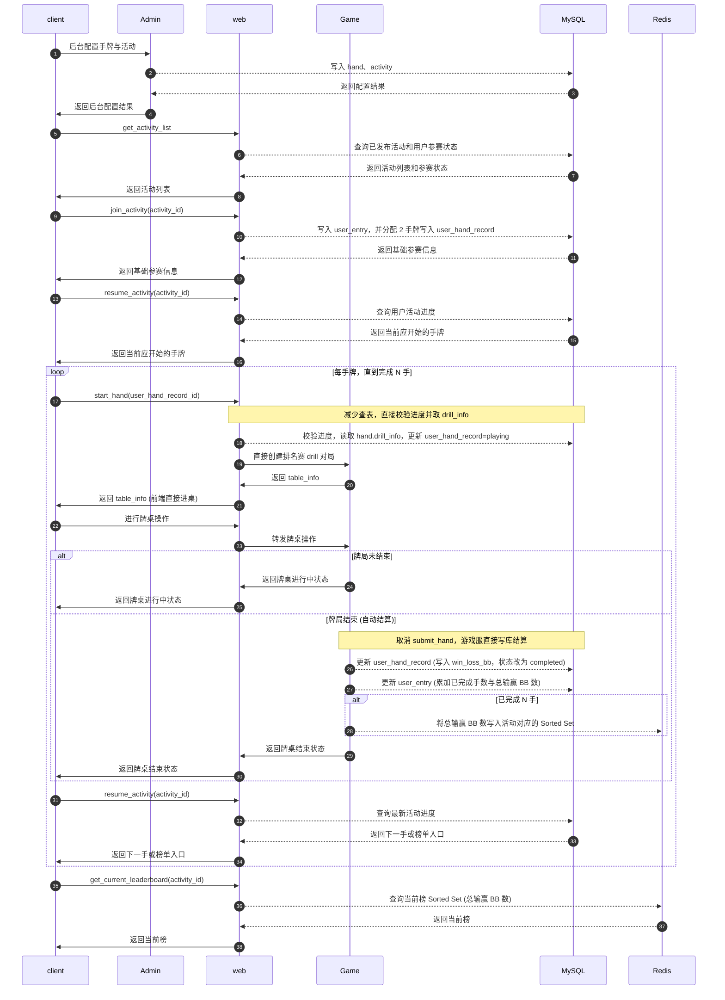
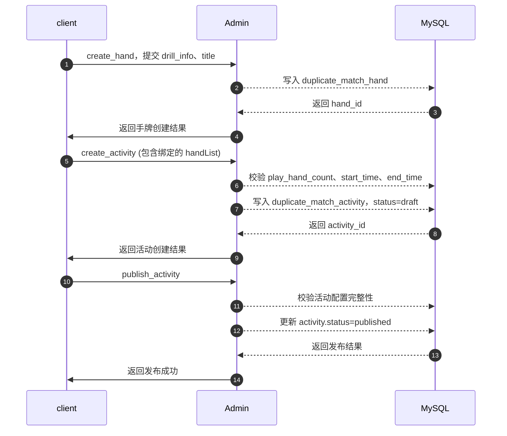
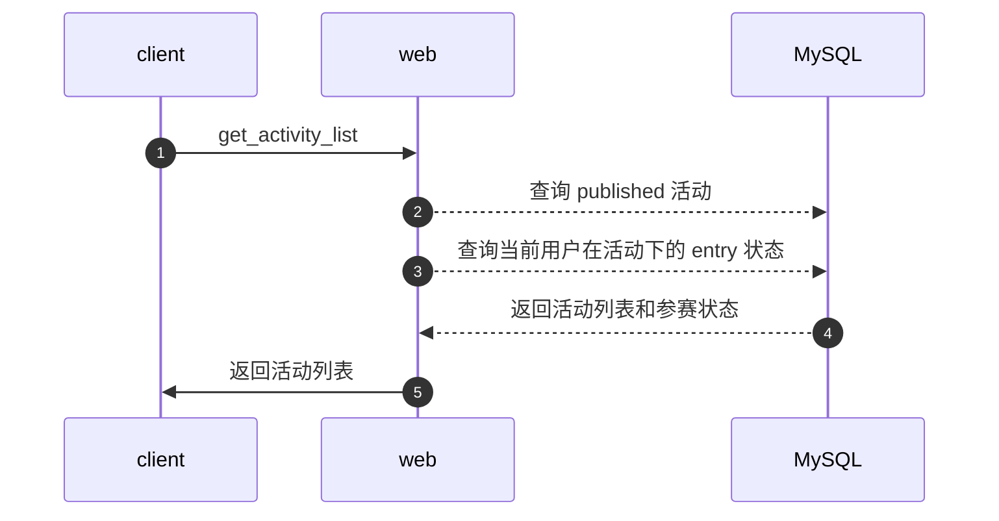
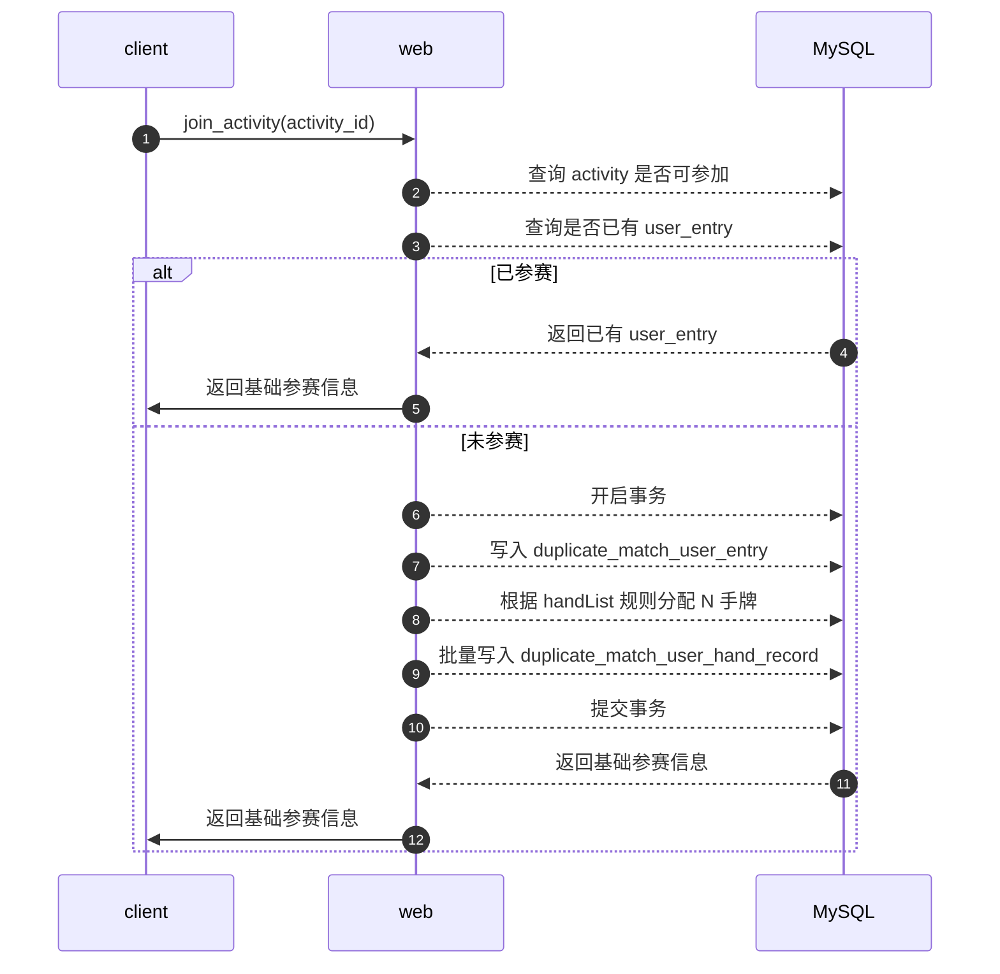
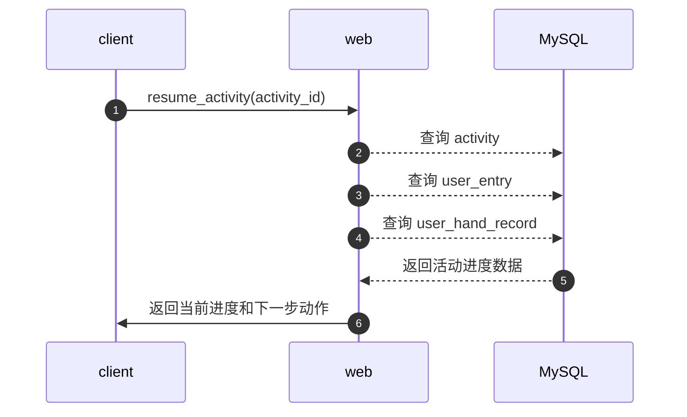
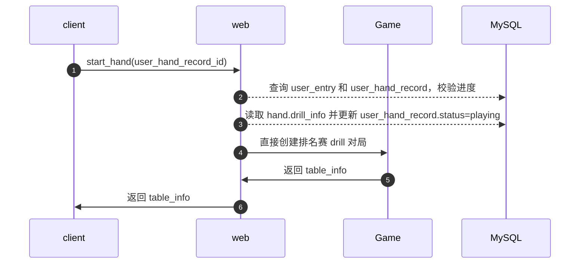
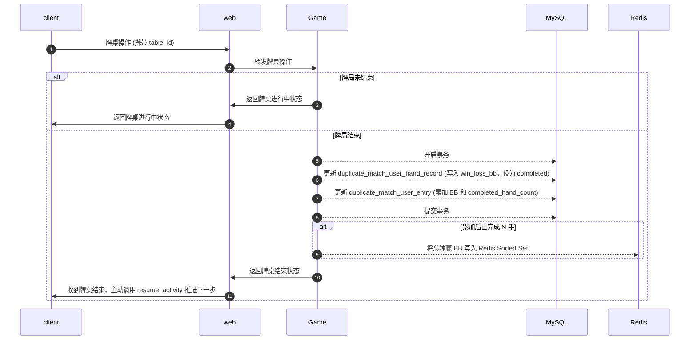
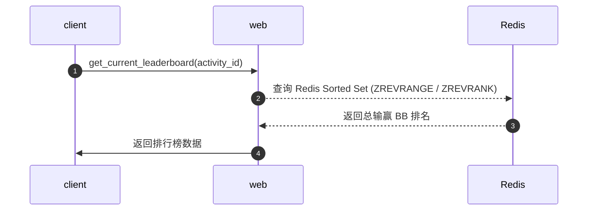

# 一、背景介绍

## 1.1 需求介绍

本文档用于说明 **复式扑克 PvE 排名赛 7.15** 的研发设计方案。

本需求基于已有 **drill 能力** 实现，新增一个后台可配置的 PvE 排名赛活动。核心闭环如下：

```text
后台配置活动
-> 用户参加活动
-> 系统分配 N 手牌
-> 用户逐手完成 PvE 对局
-> 每手完成后计输赢bb数
-> 完成 N 手后进入当前榜(redis)
-> 活动截止后结算最终榜(redis)
```

## 1.1.1 需求点整理

7.15 本期聚焦 6 个核心模块。

| 模块        | 说明                      |
| --------- | ----------------------- |
| 活动配置      | 后台配置活动、牌局包、挑战手数、活动时间    |
| 用户参赛与手牌分配 | 用户参加活动后生成参赛记录和固定 N 手牌   |
| PvE 对局与恢复 | 用户按顺序完成 PvE 对局，支持活动进度恢复 |
| 每手计分      | 每手完成后生成计分结果             |
| 当前榜 / 最终榜 | 完成 N 手进入当前榜(redis)，活动截止后生成最终榜(redis)  |
| 截止结算      | Worker 扫描到期活动并冻结最终排名(redis),本期暂不实现    |

## 1.1.2 需求点细节

| 角色 / 模块 | 影响范围                                        |
| ------- | ------------------------------------------- |
| 用户端     | 活动入口、活动详情、开始挑战、继续挑战、进度展示、榜单展示               |
| 管理后台    | 手牌配置、牌局包配置、活动配置、活动发布                        |
| 服务端     | 用户参赛、手牌分配、drill 对局接入、记录输赢bb数、进度推进、入榜、结算、恢复       |
| 数据库     | 新增 duplicate_match 相关表，支撑活动、参赛、手牌、记录输赢bb数、榜单闭环   |
| Redis   | 保存N手完成临时结果、Redis Sorted Set 加速当前榜、排行榜缓存、活动结算锁 |

## 1.2 周边文档链接（包括策划案、UI交互等资料）

无。

## 1.3 需求的 TAPD 单链接

待补充。

## 1.4 需求变更记录

| 日期  | 变更内容 | 影响范围 |
| --- | ---- | ---- |
| 待补充 | 待补充  | 待补充  |

# 二、参考方案介绍

## 2.1 设计原则

| 原则          | 说明                                                |
| ----------- | ------------------------------------------------- |
| MySQL 事实源   | 活动、参赛、手牌、对局结果都以 MySQL 为准，排行榜全量走 Redis            |
| 纯 BB 榜单    | 取消打分机制，仅以总输赢 BB 数作为排行依据，全量使用 Redis Sorted Set 实现 |
| 完成 N 手才入榜   | 用户必须完成 `activity.play_hand_count` 才能进入榜单          |
| 简化查询      | 合并后台牌局包与活动表，合并用户手牌分配与记录表，极大减少联表查询和数据写入次数  |
| 只恢复活动进度     | 不恢复单手中途牌局状态                                       |
| 幂等兜底        | join、start hand 需要支持重复请求                           |
| 不影响普通 drill | 排名赛基于 drill 能力实现，但活动数据闭环独立                        |

## 2.2 数据结构

### 2.2.1 `duplicate_match_hand`：手牌基础表

用途：保存排名赛可引用的手牌配置。

| 字段           | 类型           | 说明                  |
| ------------ | ------------ | ------------------- |
| `id`         | BIGINT       | 主键 ID               |
| `drill_info` | JSON         | 创建排名赛 drill 所需的手牌配置 |
| `title`      | VARCHAR(255) | 手牌名称                |
| `status`     | TINYINT      | 状态：启用 / 禁用          |
| `created_at` | DATETIME     | 创建时间                |
| `updated_at` | DATETIME     | 更新时间                |

关键索引：

| 索引           | 字段       | 说明       |
| ------------ | -------- | -------- |
| `idx_status` | `status` | 后台筛选可用手牌 |

### 2.2.2 `duplicate_match_activity`：活动配置表

用途：保存 PvE 排名赛活动配置及包含的手牌集合（取代原有的手牌包设计，直接在活动内维护 JSON）。

| 字段                    | 类型           | 说明                                   |
| --------------------- | ------------ | ------------------------------------ |
| `id`                  | BIGINT       | 主键 ID                                |
| `title`               | VARCHAR(255) | 活动名称                                 |
| `handList`            | JSON         | 活动包含的手牌配置列表（JSON数组）                   |
| `total_hand_count`    | INT          | 总手数（冗余统计，用于后台列表展示）                   |
| `required_hand_count` | INT          | 必选手数（冗余统计，用于后台列表展示）                  |
| `play_hand_count`     | INT          | 用户需要完成的手数 N                          |
| `start_time`          | DATETIME     | 活动开始时间                               |
| `end_time`            | DATETIME     | 活动截止时间                               |
| `status`              | VARCHAR(32)  | 活动状态：draft / published / finalized / disabled 等 |
| `created_at`          | DATETIME     | 创建时间                                 |
| `updated_at`          | DATETIME     | 更新时间                                 |

**`handList` 字段 JSON 结构说明：**

用于存储该活动下绑定的所有手牌及属性，格式为 JSON 数组。示例：
```json
[
  {
    "hand_id": 1001,
    "item_type": "required", // 类型：required(必选) / random(随机候选)
    "sort_no": 1             // 排序值
  }
]
```

关键索引：

| 索引                    | 字段                             | 说明            |
| --------------------- | ------------------------------ | ------------- |
| `idx_status_time`     | `status, start_time, end_time` | 活动列表和活动状态判断   |
| `idx_status_end_time` | `status, end_time`             | Worker 扫描到期活动 |

关键规则：

```text
play_hand_count 不能写死为 10。
完成判断、入榜判断、结算判断都必须基于 activity.play_hand_count。
```

### 2.2.3 `duplicate_match_user_entry`：用户参赛记录表

用途：记录用户在某个活动下的一次有效参赛记录。

| 字段                     | 类型            | 说明                                          |
| ---------------------- | ------------- | ------------------------------------------- |
| `id`                   | BIGINT        | 主键 ID                                       |
| `activity_id`          | BIGINT        | 活动 ID                                       |
| `user_id`              | BIGINT        | 用户 ID                                       |
| `status`               | VARCHAR(32)   | 参赛状态：joined / playing / completed / expired |
| `completed_hand_count` | INT           | 已完成手数                                       |
| `total_win_loss_bb`    | DECIMAL(10,2) | 当前总输赢 BB 数                                  |
| `current_order_no`     | INT           | 当前进行到第几手                                    |
| `joined_at`            | DATETIME      | 参赛时间                                        |
| `complete_time`        | DATETIME      | 完成全部 N 手时间                                  |
| `created_at`           | DATETIME      | 创建时间                                        |
| `updated_at`           | DATETIME      | 更新时间                                        |

关键索引：

| 索引                    | 字段                     | 说明          |
| --------------------- | ---------------------- | ----------- |
| `uk_activity_user`    | `activity_id, user_id` | 防止同一用户重复参赛  |
| `idx_activity_status` | `activity_id, status`  | 查询活动下不同状态用户 |
| `idx_user_activity`   | `user_id, activity_id` | 用户恢复进度      |

### 2.2.4 `duplicate_match_user_hand_record`：用户手牌对局记录表

用途：记录用户参加活动后实际分配到的手牌，以及该手牌的输赢结果。
合并了原来的进度分配与结果逻辑，当手牌结束时，直接更新此表的 BB 输赢信息。

| 字段             | 类型            | 说明                               |
| -------------- | ------------- | -------------------------------- |
| `id`           | BIGINT        | 主键 ID                            |
| `entry_id`     | BIGINT        | 用户参赛记录 ID                        |
| `activity_id`  | BIGINT        | 活动 ID                            |
| `user_id`      | BIGINT        | 用户 ID                            |
| `hand_id`      | BIGINT        | 手牌 ID                            |
| `order_no`     | INT           | 用户本次挑战中的顺序                       |
| `source_type`  | VARCHAR(32)   | 来源类型：必选 / 随机                     |
| `status`       | VARCHAR(32)   | 状态：pending / playing / completed |
| `win_loss_bb`  | DECIMAL(10,2) | BB 输赢结果                          |
| `started_at`   | DATETIME      | 开始时间                             |
| `completed_at` | DATETIME      | 结束时间                             |
| `created_at`   | DATETIME      | 创建时间                             |
| `updated_at`   | DATETIME      | 更新时间                             |

关键索引：

| 索引                  | 字段                     | 说明               |
| ------------------- | ---------------------- | ---------------- |
| `uk_entry_order`    | `entry_id, order_no`   | 防止同一参赛记录下顺序重复    |
| `uk_entry_hand`     | `entry_id, hand_id`    | 防止同一参赛记录重复分配同一手牌 |
| `idx_entry_status`  | `entry_id, status`     | 查询当前进度及用户输赢结果    |
| `idx_activity_user` | `activity_id, user_id` | 查询用户恢复进度         |

### 2.2.5 排行榜设计说明（基于 Redis）

为追求极致性能并降低关系型数据库的读写压力，**本方案排行榜不再使用 MySQL 数据表，全面拥抱 Redis。**

**具体存储数据内容与结构：**

1. **排行榜主结构 (Sorted Set)**
   * **Key**: `duplicate_match:leaderboard:bb_win_loss:{activity_id}`
   * **Score**: 用户的排名依据。通常由 **总输赢 BB 数** 决定。
     *(为解决同分先到先得问题，推荐采用拼接算法，如 `Score = 总 BB 数 + (MAX_TIMESTAMP - 完成N手时间戳) / 10^15`，确保时间衰减部分小于 0.01，不影响 BB 的正常两位小数精度)*。
     
     **算法举例验证**：
     假设 `MAX_TIMESTAMP = 9999999999999`（毫秒），衰减分母为 `10^15`。
     - **用户A**：赢 5.50 BB，完成时间 `1710000000000`。
       衰减分 = `(9999999999999 - 1710000000000) / 10^15 = 0.008289999999`
       最终 Score = `5.508289999999`
     - **用户B**：赢 5.50 BB，完成时间 `1710000010000`（比 A 晚 10 秒）。
       衰减分 = `(9999999999999 - 1710000010000) / 10^15 = 0.008289999989`
       最终 Score = `5.508289999989`
     - **用户C**：赢 5.51 BB，完成时间 `1710000020000`（最晚打完，但 BB 数高）。
       衰减分 = `(9999999999999 - 1710000020000) / 10^15 = 0.008289999979`
       最终 Score = `5.518289999979`
     
     **Redis降序(`ZREVRANGE`)结果**：
     C (`5.518...`) > A (`5.508289999999`) > B (`5.508289999989`)。
     **结论**：优先比较 BB 数；BB 数相同时，完成越早 Score 越大，完美实现同分先到先得。

   * **Member**: `user_id`（仅存用户 ID，保持 ZSET 精简极速）。

2. **排行榜附加信息 (Hash) - 推荐搭配**
   * **用途**: 前端渲染排行榜需要用户的昵称、头像以及实际的 BB 数等。为避免每次查榜都回源 MySQL 查用户信息，将上榜用户的信息缓存在 Hash 中。
   * **Key**: `duplicate_match:leaderboard_info:bb_win_loss:{activity_id}`
   * **Field**: `user_id`
   * **Value**: JSON 字符串，例如 `{"user_id": 123, "nickname": "张三", "avatar": "xxx.png", "total_win_loss_bb": "5.5", "complete_time": "2024-07-15 12:00:00"}`。

**数据流转与入榜时机：**
1. **入榜写入**：当用户在 `duplicate_match_user_entry` 中的 `completed_hand_count` 达到 `play_hand_count`（完成 N 手）时，将用户 `user_id` 和 Score 写入 Sorted Set，同时将用户信息写入 Hash。
2. **查榜读取**：通过 `ZREVRANGE` 查出前 N 名的 `user_id`，再通过 `HMGET` 批量获取这些用户的附属信息 JSON，拼装后返回前端。通过 `ZREVRANK` 极速查询当前用户的排名。
3. **最终榜冻结**：活动到达 `end_time` 结束后，服务端拦截该活动的入榜请求，Redis 中的 Sorted Set 和 Hash 自然固化为最终榜单。

# 三、系统交互

## 3.1 是否有新增服务器

无。

本需求不新增独立服务器，复用当前已有链路，在现有系统上新增复式扑克 PvE 排名赛相关能力。

| 模块       | 说明                                          |
| -------- | ------------------------------------------- |
| `client` | 用户端 / 管理后台前端，负责活动查看、参赛、打牌、查榜，以及后台配置入口       |
| `Admin`  | 管理后台服务，负责活动及手牌配置，直接操作 MySQL               |
| `web`    | 无状态 Web 层，负责用户活动业务编排、进度查询、榜单查询             |
| `Game`   | 有状态游戏服务，负责具体 drill 对局运行及单局结束后的输赢落库         |
| `MySQL`  | 比赛事实源，保存活动、参赛、手牌分配记录数据                      |
| `Redis`  | 保存N手完成临时结果、实现以输赢BB数为准的排行榜、活动结算锁             |

## 3.2 是否有 CS 交互，SS 交互

有。

| 类型            | 说明                                             |
| ------------- | ---------------------------------------------- |
| 管理后台交互        | `client -> Admin -> MySQL`                     |
| 用户端 CS 交互     | `client -> web`                                |
| web 与 Game 交互 | `web -> Game`，用于创建排名赛 drill 对局、转发牌桌操作、获取牌桌状态   |
| DB 交互         | `Admin / web / Game -> MySQL / Redis`          |

时序图标记说明：

```text
->>  尖角实线：异步请求 / 异步返回
-->> 虚线：同步请求 / 同步返回
-)   圆角实线：快速跳过步骤，用于表示本图不展开的简化流程
```

---

### 3.2.1 系统交互总览：以 N=2 为例



关键说明：

```text
单局结束后，由 Game 服务器直接更新 MySQL 中的对局记录 (user_hand_record) 和参赛总表 (user_entry)。
排行榜无 MySQL 表，达到完成条件时直接写 Redis Sorted Set。
Worker 结算本期暂不实现。
resume_activity 恢复进度，当前手打完切换到下一手也是通过这个接口获取最新进度
```

---

### 3.2.2 后台角度接口时序图：配置活动



关键说明：

```text
取消了 pack 牌局包概念，活动创建时直接在 handList(JSON) 中配置手牌集合。
duplicate_match_hand 保存 drill_info，开始牌局时直接通过配置启动 drill。
```

---

### 3.2.3 用户角度接口时序图：获取活动列表



---

### 3.2.4 用户角度接口时序图：参加活动



---

### 3.2.5 用户角度接口时序图：恢复活动进度



---

### 3.2.6 用户角度接口时序图：开始并创建当前手



关键说明：

```text
取消了 `create_duplicate_match_drill` 暴露给前端。
内部直接将 `start_hand` 与 `建桌` 合二为一，前端拿到 table_info 即可直接进桌，减少查表。
```

---

### 3.2.7 用户角度接口时序图：进行牌局与自动结算



关键说明：

```text
牌局结束，会抛事件出去，不在table状态机里面处理
```

---

### 3.2.8 用户角度接口时序图：查询排行榜



关键说明：

```text
完全脱离 MySQL 排行榜表，仅由 Redis 提供榜单支持。
```

# 四、协议设计

## 4.1 CS 协议定义

## 4.2 SS 协议定义

## 4.3 DB 协议定义

# 五、内存、流量分析

## 5.1 内存分析

## 5.2 流量分析

# 六、实现细节

# 七、运营能力

## 7.1 软隔离开关（DivideScheme.xml）

## 7.2 运营开关（FeatureToggle.xml）

# 八、监控告警

## 8.1 监控告警的链接

## 8.2 监控告警的核心指标

# 九、经分需求

# 十、可测试性

## 10.1 CMD 命令

## 10.2 场景测试单链接

## 10.3 边界测试单链接

## 10.4 单元测试文件链接

# 十一、排期
