### 3.2.1 系统交互总览：以 N=2 为例

```mermaid
sequenceDiagram
    autonumber
    participant Admin
    participant client
    participant web
    participant Game
    participant MySQL
    participant Redis
    participant Worker

    Admin->>web: create_hand，提交 drill_info、title
    web->>MySQL: 写入 duplicate_match_hand
    MySQL-->>web: 返回 hand_id
    web-->>Admin: 返回手牌创建结果

    Admin->>web: create_hand_pack
    web->>MySQL: 写入 duplicate_match_hand_pack
    MySQL-->>web: 返回 hand_pack_id
    web-->>Admin: 返回牌局包创建结果

    Admin->>web: add_hand_pack_item
    web->>MySQL: 写入 duplicate_match_hand_pack_item
    MySQL-->>web: 返回配置结果
    web-->>Admin: 返回配置结果

    Admin->>web: create_activity
    web->>MySQL: 校验 hand_pack_id、play_hand_count、start_time、end_time
    web->>MySQL: 写入 duplicate_match_activity，status=draft
    MySQL-->>web: 返回 activity_id
    web-->>Admin: 返回活动创建结果

    Admin->>web: publish_activity
    web->>MySQL: 校验活动配置完整性
    web->>MySQL: 更新 activity.status=published
    MySQL-->>web: 返回发布结果
    web-->>Admin: 返回发布成功

    client->>web: get_activity_list
    web->>MySQL: 查询已发布活动和用户参赛状态
    MySQL-->>web: 返回活动列表
    web-->>client: 返回活动列表

    client->>web: join_activity(activity_id)
    web->>MySQL: 查询或创建 user_entry
    web->>MySQL: 首次参赛时分配 2 手牌，写入 user_hand
    MySQL-->>web: 返回基础参赛信息
    web-->>client: 返回 entry_id、activity_id、join_status

    client->>web: resume_activity(activity_id)
    web->>MySQL: 查询 activity、user_entry、user_hand、leaderboard_result
    MySQL-->>web: 返回当前进度：第 1 手未完成
    web-->>client: 返回当前应开始第 1 手

    client->>web: start_hand(user_hand_id_1)
    web->>MySQL: 校验第 1 手是否可开始
    web->>MySQL: 查询第 1 手对应 duplicate_match_hand.drill_info
    web->>MySQL: 更新第 1 手 status=playing
    web-->>client: 返回 create_duplicate_match_drill 所需参数

    client->>web: create_duplicate_match_drill，携带第 1 手 drill 参数
    web->>Game: 转发创建排名赛 drill 对局请求
    Game-->>web: 返回 table_id_1
    web-->>client: 返回 table_id_1

    client->>web: 正常进行第 1 手牌桌操作
    web->>Game: 转发牌桌操作
    Game-->>web: 返回牌桌状态
    web-->>client: 返回牌桌状态

    Game->>Redis: 第 1 手牌局结束，缓存本手比赛结果

    client->>web: submit_hand(user_hand_id_1, table_id_1)
    web->>Redis: 获取第 1 手牌局结果
    Redis-->>web: 返回第 1 手结果
    web->>MySQL: 写入 hand_score，更新第 1 手 completed
    web->>MySQL: 更新 entry.completed_hand_count=1、total_score
    web->>Redis: 删除第 1 手临时结果
    web-->>client: 返回第 1 手基础结果

    client->>web: resume_activity(activity_id)
    web->>MySQL: 查询当前活动进度
    MySQL-->>web: 返回当前进度：已完成 1/2，第 2 手未完成
    web-->>client: 返回当前应开始第 2 手

    client->>web: start_hand(user_hand_id_2)
    web->>MySQL: 校验第 2 手是否可开始
    web->>MySQL: 查询第 2 手对应 duplicate_match_hand.drill_info
    web->>MySQL: 更新第 2 手 status=playing
    web-->>client: 返回 create_duplicate_match_drill 所需参数

    client->>web: create_duplicate_match_drill，携带第 2 手 drill 参数
    web->>Game: 转发创建排名赛 drill 对局请求
    Game-->>web: 返回 table_id_2
    web-->>client: 返回 table_id_2

    client->>web: 正常进行第 2 手牌桌操作
    web->>Game: 转发牌桌操作
    Game-->>web: 返回牌桌状态
    web-->>client: 返回牌桌状态

    Game->>Redis: 第 2 手牌局结束，缓存本手比赛结果

    client->>web: submit_hand(user_hand_id_2, table_id_2)
    web->>Redis: 获取第 2 手牌局结果
    Redis-->>web: 返回第 2 手结果
    web->>MySQL: 写入 hand_score，更新第 2 手 completed
    web->>MySQL: 更新 entry.completed_hand_count=2、total_score
    web->>MySQL: 完成 2/2，写入 leaderboard_result
    web->>Redis: 删除第 2 手临时结果
    web->>Redis: 写入当前榜 Sorted Set 或失效当前榜缓存
    web-->>client: 返回第 2 手基础结果

    client->>web: resume_activity(activity_id)
    web->>MySQL: 查询当前活动进度
    MySQL-->>web: 返回当前进度：已完成 2/2，已进入当前榜
    web-->>client: 返回当前榜入口和用户完成状态

    client->>web: get_current_leaderboard(activity_id)
    web->>Redis: 查询当前榜 Sorted Set / 当前榜缓存
    alt Redis 命中
        Redis-->>web: 返回当前榜数据
    else Redis 未命中
        web->>MySQL: 回源查询 leaderboard_result
        web->>Redis: 重建当前榜 Sorted Set / 当前榜缓存
    end
    web-->>client: 返回当前榜数据

    Worker->>MySQL: 活动时间过期后，扫描待结算活动
    Worker->>Redis: 获取活动结算锁
    Worker->>MySQL: 查询 leaderboard_result
    Worker->>MySQL: 按 total_score DESC, complete_time ASC 生成 rank_no
    Worker->>MySQL: 更新 is_final=1、finalized_at、activity.status=finalized
    Worker->>Redis: 删除或刷新榜单缓存
```



关键说明：

```text
后台配置流程由 Admin 发起，经过 web 写入 MySQL，不需要 Game 参与。

后台先创建 hand，再创建 hand_pack，再绑定 hand_pack_item，最后创建并发布 activity。

duplicate_match_hand 保存 drill_info，用户开始手牌时基于 drill_info 创建排名赛专用 drill 对局。

本例中 N=2，用户必须完成 2 手牌才算完赛。

join_activity 只返回基础参赛信息，不返回完整进度。

resume_activity 是统一恢复活动进度的接口，前端页面跳转优先以 resume_activity 返回结果为准。

start_hand 不创建牌桌，只做活动进度校验，并返回 create_duplicate_match_drill 所需参数。

create_duplicate_match_drill 基于 duplicate_match_hand.drill_info 创建排名赛专用 drill 对局。

client 根据 start_hand 返回参数继续走 create_duplicate_match_drill 和已有牌桌操作流程。

Game 负责具体 table / drill 对局运行，牌局结束后把本手比赛结果临时写入 Redis。

submit_hand 根据 user_hand_id + table_id 从 Redis 获取本手结果，并落库到 duplicate_match_hand_score。

submit_hand 每次只返回本手基础结果，不负责返回完整下一步页面状态。

每次 submit_hand 后，client 都再次调用 resume_activity 获取最新活动进度。

第 1 手 submit_hand 后，resume_activity 判断未完成 2/2，继续第 2 手。

第 2 手 submit_hand 后，web 在 MySQL 写入 leaderboard_result，并更新 Redis Sorted Set 或失效当前榜缓存。

当前榜以 MySQL 的 leaderboard_result 为事实源，Redis Sorted Set 只用于加速查询。

活动时间过期后，由 Worker 触发最终榜结算，最终榜以 MySQL 冻结后的 rank_no 为准。
```
