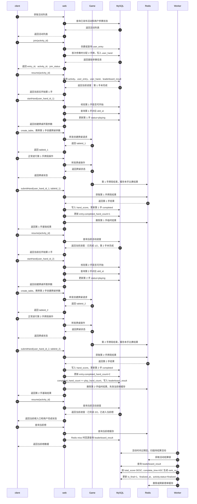

### 3.2.1 系统交互总览：以 N=2 为例



关键说明：

```text
本例中 N=2，用户必须完成 2 手牌才算完赛。
join 只返回基础参赛信息，不直接返回完整进度。
resume 是统一恢复活动进度的接口。
submitHand 每次只返回本手基础结果，不直接决定前端完整跳转。
每次 submitHand 后，client 都再次调用 resume 获取最新进度。
第 1 手 submitHand 后，resume 判断未完成 N=2，继续第 2 手 startHand。
第 2 手 submitHand 后，resume 判断已完成 N=2，进入当前榜。
活动时间过期后，由 Worker 触发最终榜结算。
```
